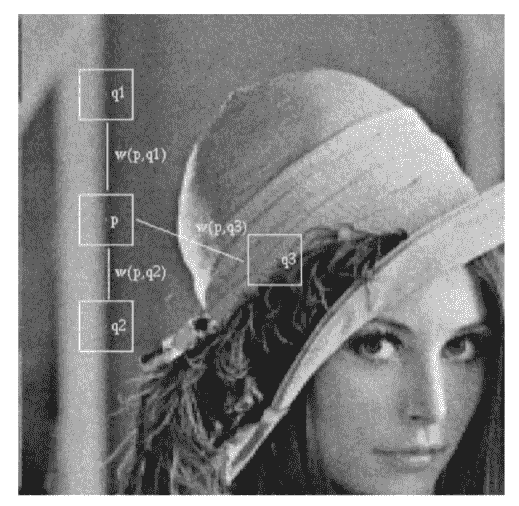
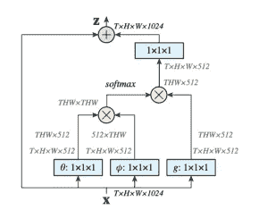
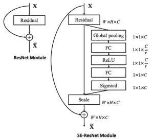
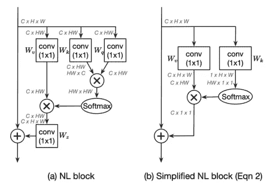
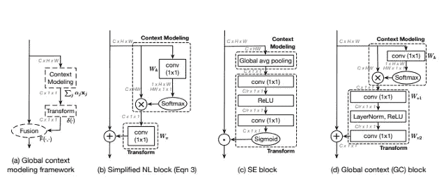
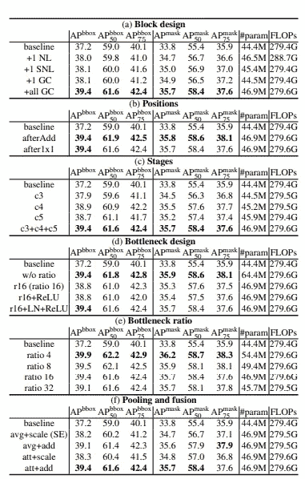

# GCNet:非局域网络与压缩激励网络相遇及超越综述

> 原文：<https://towardsdatascience.com/gcnet-non-local-network-meets-squeeze-excitation-network-and-beyond-review-f3f3e4035e4d?source=collection_archive---------29----------------------->

在进入 GCNet 之前，我们首先需要了解两个网络:**非局域网络**和**压缩-激发网络**。我们不会得到太多关于这些网络的细节。一旦我们有了基本的概念，我们就可以进入主要的话题，GCNet。

# 非局部神经网络

该网络受非局部均值滤波器的启发。该滤波器用于随机降噪任务。图像中的这些噪声可以通过取具有随机噪声的其他多幅图像的像素平均值来减少。然而，在真实世界场景中，获取具有随机噪声的多个图像是困难的。我们通常得到的是带有随机噪声的单幅图像。

为了解决这个问题，采用了非局部均值滤波。代替具有随机噪声的多个图像，可以使用位于不同区域的类似补片来计算平均值。如上图所示，图像补丁 *p* 与其他图像补丁( *q1* 和 *q2)* 类似。这些补丁可以用来去除补丁 *p* 中的噪声。

受这个想法的启发，NLNet 的作者提出了一个非本地块。该块计算像素之间的所有相互作用，为此，网络执行多次权重整形和乘法以产生嵌入的特征表示。

如图所示，如果块获得 T x H x W x 1024 作为输入(T 代表时间戳，因为原始论文的目标是视频分类)，它会产生相同大小的特征图。执行矩阵整形、乘法和逐元素加法来捕捉像素之间的全局依赖性。

要了解更多关于这篇论文的信息，请阅读原文[这里](https://arxiv.org/abs/1711.07971)。

# 挤压激励网络

与 NLNet 相比，压缩激励网络解决了一个不同的问题。NLNet 试图捕获像素之间的全局相关性，而 SENet 试图捕获通道间的相关性。SENet 背后的主要思想是在每个特征映射通道中添加参数。通过这样做，网络自适应地学习特征图中通道的权重。

挤压激励模块将特征图作为输入。首先减少特征图的空间维度(W x H x C ),以应用两个完全连接的层。与输入要素通道大小相同的最终矢量被转换为 s 形图层，以根据其重要性缩放每个通道。

要了解更多关于这篇论文的信息，请阅读原文[这里](https://arxiv.org/abs/1709.01507)。

# GCNet

全球背景网络有三个主要想法。

**简化的非局部块:**作者提出了非局部块的简化版本。简化版本计算全局(独立于查询的)注意力图，并共享所有查询位置的注意力图。这种变化是在观察不同查询位置产生的相似注意力图后做出的。

此外，块中的 W_v 被移出注意池以减少计算成本。在遵循[关系网络论文](https://arxiv.org/abs/1711.11575)中的结果之后，权重 W_z 也被移除。

**全局上下文建模框架:**全局上下文网络中使用的主块(上图中的 a)可以分为三个过程:首先，全局注意力池，采用 1x1 卷积和 softmax 函数来获得注意力权重。然后应用注意力池来获取全局上下文特征。一旦应用了注意力集中，输出特征通过 1x1 卷积被转换，并且它们被聚集以将全局上下文特征添加到每个位置的特征。

**全局上下文块:**如上图所示，全局上下文块与挤压激励块一起使用了一个简化的非局部块。对模型进行了一些调整，以减少参数的数量。例如，在图中所示的挤压激励块中，1x1 卷积被瓶颈变换模块代替。而不是有 CxC 参数，数量减少到 2CC/ *r* ，其中 r 是瓶颈比，C/ *r* 是瓶颈的隐藏表示维度。

# 结果

实验在目标检测和分割任务中进行。上表比较了不同的架构设计。作者观察到，添加全局上下文块明显提高了模型的性能。

此外，需要注意的一点是，参数/触发器的数量不会急剧增加。这可能是因为 NL 数据块和 SE 数据块都设计了轻量级体系结构。

# 结论

该论文成功地结合了两种思想，并提出了一个优于现有基线网络的模型。作者通过提出 NL/SE 块的简化版本来解决长程相关性问题。通过仅添加少量参数，该模型在对象检测和识别任务上优于现有模型。

# 参考

 [## GCNet:非局域网络与压缩激励网络相遇及超越

### 非本地网络(NLNet)提出了一种开创性的方法，通过聚集…

arxiv.org](https://arxiv.org/abs/1904.11492)  [## 非局部神经网络

### 卷积运算和递归运算都是一次处理一个局部邻域的构建块。在这个…

arxiv.org](https://arxiv.org/abs/1711.07971)  [## 压缩和激励网络

### 卷积神经网络(CNN)的核心构件是卷积算子，它使网络能够…

arxiv.org](https://arxiv.org/abs/1709.01507)  [## 非局部神经网络

### 이번포스트에서는한동안·arxiv-sanity.com·에서상위권에머물었던·明凯·he의2017년11월에공개된논문，“非本地神经 Networks'를 소개 드리도록 하겠습니다…”

博客. lunit.io](https://blog.lunit.io/2018/01/19/non-local-neural-networks/)  [## 用于对象检测的关系网络

### 尽管多年来人们普遍认为对物体之间的关系进行建模有助于物体识别，但目前仍存在一些问题

arxiv.org](https://arxiv.org/abs/1711.11575)