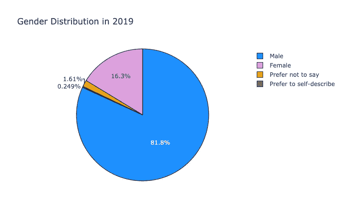

# 极客女孩崛起:神话还是现实

> 原文：<https://towardsdatascience.com/geek-girls-rising-myth-or-reality-81e1897433c8?source=collection_archive---------16----------------------->

## 2019 年 Kaggle ML 和 DS 关于机器学习和数据科学领域女性代表性的调查分析

Designed by rawpixel.com / Freepik

> 巴拉克·奥巴马:在女性充分参与国家政治或经济的地方，社会更有可能成功

最近参加了 [**2019 Kaggle ML & DS 调查**](https://www.kaggle.com/c/kaggle-survey-2019) **挑战赛。**这是第三年的调查，旨在提供数据科学和机器学习状况的全面视图。这项挑战面向所有人，讲述数据科学社区独特而有创意的故事的笔记本电脑将获得奖励。挑战描述说-: " *挑战是(通过数据)深入探索数据科学和机器学习实践者的特定群体的影响、优先事项或关注点*。

这对我来说是一个绝佳的机会，让我可以参与挑战，探索 w.r.t 全球女性参与调查的情况。笔记本的目的是分析调查数据以回答一个重要问题: ***女性参与 STEM 的情况真的有所改善，还是只是一种炒作？我运用我的分析技巧来调查事情是否有所改善，或者是否还有很多事情要做。***

我还获得了 2019 年 11 月 19 日之前发布的所有笔记本的[最佳笔记本奖。](https://www.kaggle.com/c/kaggle-survey-2019/discussion/118594#latest-690856)

这篇文章是我在分析数据集时获得的结果和见解的总结。点击可以查看 [Kaggle 笔记本原文。](https://www.kaggle.com/parulpandey/geek-girls-rising-myth-or-reality)

## 方法学

我在六个不同类别下分析了女性参与调查的情况，即:

分析这些不同类别下的妇女代表情况，让我对妇女代表在 ML 和 DS 领域的性质有了一个公平的想法。

我首先分析了 2019 年调查的数据集，以了解整体情况。

## 2019 年受访者最多的国家

*   大多数受访者(男性和女性)来自印度，事实上紧随其后的是美国；这些国家加起来占总人口的 50%以上。

> 请注意，如果某个国家或地区收到的调查对象少于 50 人，[他们将被分组到](https://www.kaggle.com/c/kaggle-survey-2019/data)名为“其他”的匿名组中。

## 历年答卷人数比较

*   尽管 2018 年的回复数量远高于 2017 年，但 2019 年有所下降。

现在让我们看看从六个关键领域的分析中获得的见解——性别、国家、年龄、教育、职业经验和工资。

# 1.性别

PC: [rudall30](https://www.vectorstock.com/royalty-free-vectors/vectors-by_rudall30)

## 巨大的性别差异

*   在调查中，男性和女性受访者之间有着惊人的差异。大约 82%的受访者是男性，只有 16%是女性。

## 历年性别分布情况

与过去两年相比，2019 年的性别分布情况。

*   嗯，模式差不多。多年来，女性受访者的参与率一直很低。

# 2.国家

*PC:* [*Freepic.com*](https://www.kaggleusercontent.com/kf/24381515/eyJhbGciOiJkaXIiLCJlbmMiOiJBMTI4Q0JDLUhTMjU2In0..UdKc9YEY9LaA5g6ng3n9eQ.2xTo3WH2jq167pLmzrt54fhaxmRiGeUGduaR53VL0npcT_Yuy8XG8m3GJ3otGNUe6G4jIAgl8viChIuELnsXaXYspSApPdq0fEolJWWqGLDBLXI6HObvSPaugntVtktdjXSNNFGD6H23qMEuceUKFBeRZsQQUN8j_xfalzBV0Ylkn0fjfJiz79cRcyfr0gCI.Mm6a0WMZBUIgLnF_XjX5LQ/www.freepik.com)

现在让我们看看女性受访者来自哪些国家。这些数据将有助于我们了解反应最大和最小的国家。

## 女性受访者所在国家

*   2019 年大多数女性受访者来自印度和美国。
*   来自中非的参与比例令人震惊，尽管像尼日利亚这样的国家确实在世界地图上显示了它们的存在。
*   来自土耳其、尼日利亚和巴基斯坦的女性也对调查做出了回应，尽管她们所占的比例很小。

## 这些年来印度和美国的女性受访者

由于印度和美国的受访者比例最高，我也分析了这些数据，看看过去几年是否也观察到了类似的趋势。

*   2017 年和 2018 年，美国女性受访者的数量远高于印度。然而，2019 年印度女性受访者有所增长，其比例超过了美国女性。

## 非洲仍然存在巨大的障碍

*   与前几年相比，2019 年回答调查的非洲女性人数有所增加。2019 年，约有 150 名女性回答了调查，而在此前几年，这一数字甚至不到 100 人。
*   探究 2019 年非洲次大陆参与度增加的原因很有意思。首先，很少有阿尔及利亚女性在 2019 年首次参加调查。其次，与前两年相比，2019 年观察到尼日利亚女性受访者人数激增。这两个因素都促使非洲女性在 2019 年的调查中表现更好。

# 3.年龄分布

PC: [www.freepik.com](http://www.freepik.com)

年龄是任何人口统计分析的一个重要属性，在分析年龄变量时获得了一些有趣的结果。

## 年轻的旅在 2019 年占据主导地位

2019 年女性受访者的年龄分布。

*   大多数女性受访者属于 **(25 -29)** 年龄组，紧随其后的是**(22-24)**年龄组。因此，大多数女性处于**(20-30)**年龄段。
*   **(20–30)**年龄组可以包括学生(本科生和研究生)和专业人士。
*   有趣的是，60 岁和 70 岁以上的女性也对调查做出了回应。嗯，正如人们所说——年龄只是一个数字。

## 历年的年龄分布模式

*   没有观察到模式的显著变化。总的来说，20-30 岁的群体在调查中占主导地位。

## 国别年龄分布

*   印度大多数女性受访者是 20 多岁的女性，这一比例也高于其他任何国家。因此，来自印度的女性受访者主要是年轻人。
*   此外，印度有相当数量的 18 至 21 岁的女性受访者。这个年龄组通常由学生组成，看到他们参与调查令人振奋。
*   对于美国女性来说，学生受访者的比例相对较低。至于其他国家，各年龄组的分布几乎相同。

# 4.教育

PC: [www.freepik.com](http://www.freepik.com)

有人说得对，受过教育的女性是社会的支柱。以下是对女性受访者资格状况的分析。

## 2019 年女性受访者的学历

*   女性的教育状况令人印象深刻，大多数人(~46%)拥有硕士学位，紧随其后的是学士学位(27%)。16%的博士回答了调查。
*   分析还显示，有一定比例的人高中毕业后没有接受过正规教育。尽管如此，他们还是参加了调查，这本身就是一件值得称赞的事情。

## 按国家分列的女性受访者的教育资格

*   美国 T1 拥有最多的 T2 硕士学位，T4 T3 和 T5 拥有博士学位，紧随其后。然而，应该记住的是，印度和其他国家的许多女性一般都是为了获得硕士和博士学位而移民到美国的。
*   印度拥有最多的学士学位。这一点非常明显，因为大多数女性受访者都是 20 多岁的学生。
*   除了专业学位出现率较高的日本之外，所有国家的硕士学位普遍高于其他学位。

# 5.专业经验

PC: [www.freepik.com](http://www.freepik.com)

让我们看看女性在行业中所扮演的各种职业角色。

## 多年来女性受访者的角色

*   自 2017 年以来，数据科学家似乎是女性受访者的主要角色，其次是数据分析师。开发人员、研究人员和项目经理等其他角色也可以在人群中看到。

## 2019 年女性受访者的 20 大角色

*   如果我们从结果中排除学生，数据科学家(约 19.5%)构成了参加调查的大部分人口。紧随其后的是从事数据分析师工作的女性(约 11%)。
*   有趣的是，一些妇女没有工作，但对调查做出了回应。这些妇女不可能选择工作，也不可能寻找工作。我们可以联系这些女性，了解她们是否愿意工作，并帮助她们。

## 女性受访者目前的角色

我结合了一些角色来创建更广泛的群体。例如，数据工程师和 DBA/数据库工程师与数据分析师和业务分析师混在一起。

*   同样，排除学生，美国参与调查的数据科学家和数据分析师人数最多，其次是印度。
*   印度参与调查的软件工程师人数最多。有趣的是，失业女性受访者的比例(~<2%) was also the highest in India.

## Female Data Scientists distribution over the years

*   Even though the percentage of female respondents had decreased in 2019, the percentage of Data Scientists who took the survey was more significant than in 2018.

# 6\. Salary

Even though some[research](http://www.timothy-judge.com/Judge,%20Piccolo,%20Podsakoff,%20et%20al.%20(JVB%202010).pdf)相反，薪酬是留住和获得新人才的一个重要激励因素。让我们看看我们的女士在数据科学领域的薪酬有多高。我分析了 2019 年女性受访者工资的大致趋势，然后将趋势与 2018 年的工资进行了对比。

## 2019 年女性受访者薪资范围

*   大多数女性受访者不愿意透露自己的年薪。剩下的人中，有 10%的人年薪不到 1000 美元。这是有道理的，因为其中很大一部分人是目前可能没有固定工作的学生。
*   也有一小部分女性年收入超过 20 万到 30 万美元。

## 2018 年和 2019 年女性受访者薪资对比。

为了了解这种工资模式是 2019 年独有的，还是一种反复出现的现象，我将它与 2018 年的工资范围进行了比较。我没有包括 2017 年的工资数据，因为它有十多种不同的货币。

*   2018 年和 2019 年，薪酬分布的总体模式似乎相同。2019 年的年度薪酬比 2018 年略有改善，这很好。
*   另一个关键点是，与 2018 年不同，2019 年确实有一些女性收入超过 50 万美元。

## 2019 年男女薪酬对比。

*   男女工资的总体趋势保持不变。大多数人收入低于 1000 美元。然而，收入低于 1000 美元的女性比例高于男性。此外，与男性不同，没有女性受访者的收入高于 **50 万美元**。

## 2019 年男女数据科学家薪酬对比

*   与男性同行相比，收入低于 1000 美元的女性数据科学家的比例要高得多。女性数据科学家在高工资范围内的薪酬似乎也较低。收入超过 20 万美元的女性数据科学家的比例非常低。

## 全球女性数据科学家的薪水一览

*   美国数据科学家的薪酬相对高于其他国家。

# 关键要点和建议

从整个练习中获得的一些重要收获可以总结为六个要点:

*   妇女在这项调查中的参与率很低，而且这些年来没有显示出多大的改善。我们需要了解参与率如此之低背后的原因，以及我们如何才能鼓励女性变得更加积极参与。
*   美国和印度女性的反应令人振奋，尽管与男性相比仍然很低。随着尼日利亚和阿尔及利亚等国家加快步伐，非洲显示出一线希望。组织应该与非洲政府和非政府组织合作，为这些妇女提供更好的学习和研究机会。
*   数据科学领域的年轻女性人数正在上升，其中大多数来自印度。这并不奇怪，因为印度拥有世界上最年轻的军队之一。应该通过改革现有的印度教育模式并在当前课程中引入高质量的数据科学课程来有效利用这一人口红利。
*   科学领域的女性素质很高，大多数拥有硕士学位。
*   大多数女性数据科学家位于美国和印度。一些没有工作的妇女也对调查做出了回应。这可能有多种原因。他们可能是学生或女性，希望在休息后重新开始他们的职业生涯。后者可以通过参加聚会或社区活动得到帮助。对于学生来说，导师是一个很好的选择。
*   薪酬分配多年来保持不变，但与美国同行相比，印度女性数据科学家的薪酬相对较低

# 结论

所以让我们回到最初的问题——极客女孩崛起了吗？真是百感交集。一些领域有所改善，但其他领域仍有大量工作要做。总的来说，事情似乎很有希望。

数据科学本身是不同科学学科的结合。让不同性别、背景和种族的人加入进来更有意义，他们可以带来更多的创造力，让知识、发现和创新蓬勃发展。

这需要社会的共同努力，使多样性和包容性成为生态系统的重要组成部分。作为女性，我们应该确保创建一个积极的支持小组来帮助数据科学领域的其他女性。毕竟，被赋予权力的女性赋予了女性权力。