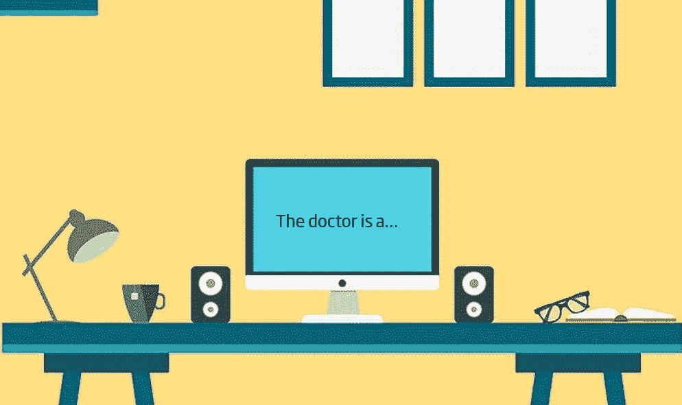

# GPT 的性别偏见-2

> 原文：<https://towardsdatascience.com/gender-bias-in-gpt-2-acf65dc84bd8?source=collection_archive---------32----------------------->

一名男子和他的儿子遭遇了一场严重的事故，被紧急送往医院抢救。医生看着这个男孩，大声说道:“我不能给这个男孩做手术，他是我的儿子！”。这怎么可能？

**答案？医生是男孩的母亲**

我的回答…在为此纠结了一分钟后，我得出结论，这个男孩有两个爸爸。虽然我并不完全不喜欢我的答案(我们对异性关系有偏见)，但我得出这个结论只是因为我的大脑无法计算医生是女性的想法。更糟糕的是，我研究算法偏差……这个问题是在“[像我这样的女人](https://www.meetup.com/AI-Ethics-London/events/264189589/)”活动中提出的。

在社会中，偏见无处不在，存在于我们每一个人身上。当我们构建人工智能时，我们冒着做出反映这些偏见的东西的风险，并根据我们与技术互动的方式，加强或放大这些偏见。

OpenAI 在二月份发布了 GPT-2，这是一个生成语言模型，在互联网上掀起了风暴，部分是因为它创造了令人信服的合成文本，但也因为这种模型的安全性令人担忧。一个问题是偏见。

> “我们预计安全和安保问题将在未来减少我们的传统出版，同时增加共享安全、政策和标准研究的重要性，” **OpenAI Charter**

九个月过去了，OpenAI 稳步遵循分阶段发布策略，仔细监控模型的使用，在他们的 6 个月更新中发布关于模型偏差的初步结果，现在(仅仅一周前！)[发布完整型号](https://openai.com/blog/gpt-2-1-5b-release/)。

在这篇博客中，我们将深入探讨 GPT 新协议中的偏见。具体来说，我们将着眼于职业性别偏见，如何与社会中预先存在的偏见进行比较，并讨论为什么语言模型中的偏见很重要。

这不是我第一次写 GPT-2。我写这篇博客是关于我用 GPT-2 写小说的经历。我觉得挺好的，但我可能有偏见。

# **结果**

我们实验的目的是测量 GPT-2 中的职业性别偏见，观察这种偏见如何随着不同规模的模型而变化，并将这种偏见与我们社会中的偏见进行比较。我们的实验从[“单词嵌入事实关联测试”](https://arxiv.org/pdf/1608.07187.pdf) (Caliskan 等人)中获得了一些灵感，这是一种类似于“[隐含关联测试](https://implicit.harvard.edu/implicit/uk/background/index.jsp)”的测试，但针对事实数据进行测量，即“事实关联”。我们的事实数据来自“国家统计局”(ONS)和他们的[英国职业数据](https://www.ons.gov.uk/employmentandlabourmarket/peopleinwork/earningsandworkinghours/datasets/allemployeesashetable1):一个大约 500 个工作类别的列表，每个列出了该职业的男女雇员人数和平均工资。

我们通过各种 GPT-2 模型(124 米、355 米、774 米和 15 亿个参数)运行了一系列提示，以衡量每个模型给国家统计局职业数据中各种职位的性别关联。

为了帮助你理解我们的实验，我想让你想象你在一个学校集市上。在集市上，其中一个摊位有一个装满软糖的罐子。上百个！几千，也许？无论如何都数不过来。你猜一猜，写在一张纸上，放在一个小盒子里，然后祈祷好运。

一天结束时，负责摊位的两个学生浏览了所有的猜测，他们注意到一些奇怪的事情。虽然这些人都不知道罐子里软糖的确切数量，而且每个猜出来的人对罐子里有多少颗软糖都有自己的偏见，但是如果你把所有的猜测加在一起并取平均值，你会得到一个非常接近罐子里软糖数量的数字。

就像果冻豆游戏的参与者一样，GPT-2 无法获得果冻豆的确切数量(或者说，它没有从国家统计局的数据中了解到社会偏见)。相反，我们正在观察 GPT-2 是否通过从很多人那里学习语言来反映社会偏见。

这是我们发现的！

图表中的 X 轴显示了英国不同工作的薪水。在 Y 轴上，我们测量性别偏见，大于 0 的数字表示男性偏见，小于 0 的数字表示女性偏见。就国家统计局的数据而言，它描绘了从事各种职业的实际人数及其工资。对于 GPT-2，我们正在研究 GPT-2 与同样的工作相关的性别偏见的强度。

GPT-2 的所有 4 个模型和社会数据显示，随着工作薪水的增加，男性倾向越来越大，这意味着职位越高，薪水越多，GPT-2 就越有可能表明男人在那个位置工作。国家统计局的数据还显示，在英国就业市场，这种对从事高薪工作的男性的职业性别偏见甚至比 GPT-2 更强烈。

随着我们给 GPT-2 增加更多的参数，这个趋势真的很有希望。我们在 GPT-2 中加入的参数越多，模型就越接近中性零线。该模型的 15 亿参数版本既最接近零，也具有最弱的梯度，表明随着工作薪水的增加，偏向男性的趋势最小。根据国家统计局的数据，在所有趋势线中，我们可以看到英国社会最偏向男性，并且随着工资的增加，表现出最明显的偏向男性的趋势。

通常，我们会期望一种算法通过输入更多数据或训练更长时间来更接近事实，但 GPT-2 似乎正相反。那么，这是为什么呢？

记得糖豆！GPT-2 从来没有得到国家统计局的数据来训练。相反，它已经从数百万在线用户的语言中学习。虽然每个人都有自己的偏见，这可能与社会真相有一定的距离，但总的来说，GPT-2 发现自己接近社会偏见是令人惊讶的。

GPT-2 不仅从个人偏见的平均值中学习，而且还从他们的语言偏见中学习。理解了这一点，我们可能会认为性别陈规定型的工作表现出不同的趋势。所以让我们试试…

在这张图表中，我们可以看到全部结果的一个子集，从中挑选出一些典型的与女性相关的工作。社会偏见的趋势比我们在上图中看到的更加接近。我们发现 776m 模型惊人地接近社会偏见，在模型中，像“护理助理”这样的角色与女性代词的联系比男性代词多 77.4%，在社会中多 77.3%。即使有这些老套的例子，15 亿参数模型仍然显示出性别中立的趋势。

一个公平的批评是，我们挑选了刻板的女性工作来支持一个假设。为“性别刻板印象工作”找到一个标准的分类器并不容易，网上的清单大体上是由其他人的判断组成的。为了尽可能公平起见，我们的选择是基于论文中的一个列表:男人对于电脑程序员就像女人对于家庭主妇一样？去偏置词嵌入' T1 '。我们从他们的“极端 she 职业”列表中选取了职位，排除了那些缺乏完整的 ons 统计数据的职位。基于我们团队的判断和我们所经历的刻板印象，我们还增加了一些职位名称(例如助产士和幼儿园老师)。

我们对男性刻板印象的工作重复了这一过程，再次发现 15 亿参数模型最接近中性。然而，在所有型号的模特中，这些角色几乎普遍存在男性偏见。

# 我们学到了什么？

**你在提示中使用的词语真的很重要！**

我们的第一课受到了我们在为模型创建可访问的职位时所面临的挑战的启发。为了帮助解释这一点，请和我一起快速玩一轮“单词联想游戏”。当你听到这些英国国家统计局的工作类别时，你首先想到的是什么？

> 学校午间过马路警卫？
> 
> 邮政工人？
> 
> 货车司机？

如果你和我一样，你会发现“学校午间交警”变成了“棒棒糖女士”，“邮政工人”变成了“邮递员”，“货车司机”变成了“开货车的人”。我们修改了许多英国国家统计局的职位名称，从那些明确但极不寻常的职位名称，改为我们期望在社会上听到的对等名称。国家统计局的分类太不寻常了，不能在新 GPT 协议中发挥作用，我们必须非常小心，不要在修改它们的过程中添加不必要的性别偏见。在我描述的三个“真实世界”的标题中，每一个都包含了对性别的明确提及，并将 GPT-2 推向了性别偏见。

有些情况下，每个职位都有男性/女性相关的工作，比如服务员和女服务员。国家统计局包含“服务员”类别的统计数据，女性比男性多 55.8%。当我们通过模型的 774m 参数版本运行时，我们发现服务员有 15%的男性偏见，而女服务员有 83.6%的女性偏见。总的来说，我们得到平均 34.3%的女性偏见，非常接近社会偏见。

**解决办法？**

考虑每个工作类别的中性词。我们不应该在招聘广告上登“场地管理员”，而应该登“场地人员”的广告。与其称某人为“绘图员”，不如称他们为“绘图员”或“制图员”。这同样适用于我们使用 GPT-2 的方式和我们自己写的东西。下面你可以看到“穿越守卫”的结果，它最清楚地证明了这一点。[点击此处](https://plot.ly/~remaininlight/29/)查看更多示例。

# **展望未来**

虽然新 GPT 协议通常反映了现有的社会偏见，但我们对该技术的应用有可能加剧社会偏见。虽然随着模型尺寸的增加，性别中立的趋势是有希望的，但所有模型尺寸都继续显示出一定程度的性别偏见，这很重要，因为 GPT-2 可以以前所未有的速度生成可信的文本，可能没有人的监督。这不一定会增加社会偏见，反而会增加惰性，减缓朝着减少偏见社会的积极进展。在最坏的情况下，它可能会放大我们的偏见，使其对社会的影响更加极端。GPT-2 的偏见对我们社会的影响将取决于谁能获得这项技术以及如何应用它。这使得 OpenAI 分阶段发布并在公开发布之前分析其效果的决定尤其有价值。

自 2011 年 Siri 发布以来，数字助理大受欢迎，这为科技领域的性别偏见提供了一个严酷的教训。在联合国教科文组织的报告《如果我能，我会脸红》中，我们经历了数字助理性别偏见的现实。在 Siri、Alexa、Cortana 和谷歌助手中，我们看到数字助手被描绘成女性，她们屈从于用户对她们咆哮的命令，甚至把性挑逗当作笑话不予理睬。在数字助理表现不佳的地方(他们经常表现不佳)，我们会在心理上将这种不佳表现与这些数字助理模仿的声音和角色的女性联系起来。我们现在刚刚开始看到数字助理中男性/女性选项的趋势，远离默认的女性，并逐渐增加性别中立选项的可用性。

联合国教科文组织的报告建议开发者和其他利益相关者监控数字助理对用户行为的影响，特别关注[“儿童和年轻人的社会化”](https://chatbotsmagazine.com/alexa-will-you-change-the-way-i-speak-acfea3e6918a)。正如我们可能希望限制儿童与女性数字助理的接触，以避免他们在女性和从属关系之间建立不健康的联系，我们也可能希望更加关注 GPT-2 和其他生成性语言模型的使用。GPT-2 本身没有角色，也不认同性别，但这只是微调模型并将其作为网站上的对话代理来实现的一小步，例如，以达到相同的结果。即使 GPT-2 没有表明性别，使用带有性别偏见的语言仍然会对我们的行为和年轻人的思想产生同样的影响。相反，联合国教科文组织的报告建议我们建立人工智能，以性别中立的方式回应查询。

在某些特殊情况下，我们应该限制 GPT 新协议的使用，例如在写招聘广告时，性别语言会影响申请者的多样性。带有性别偏见的语言模式可能会减缓缩小性别薪酬差距的进程，并放大我们在国家统计局数据中看到的男性在高薪工作中的主导地位。

在他们 6 个月的更新中，OpenAI 分享了一个积极的信息:自发布以来，他们几乎没有看到恶意使用他们技术的证据。虽然这肯定是一件好事，但我们仍然需要小心这项技术的善意使用。体验负面影响不需要有任何恶意，但只要小心，GPT-2 可以对我们的社会产生积极影响。

**感谢让这一切成为可能的人们**

没有一些伟人的贡献，这个实验是不可能的。我的 Sopra Steria 同事 [Mark Claydon](https://github.com/remaininlight) 提出了实验方法，管理所有后端集成并帮助处理数据。还要感谢[艾莉森·加德纳](https://twitter.com/allisoncgardner?lang=en)和[索克拉蒂斯·卡卡拉斯](https://www.linkedin.com/in/sokratis-karkalas-86a99818/?originalSubdomain=gr)帮助构思实验并回顾我们的结果。

如果您想了解更多关于我们方法的信息，[请点击此处](https://docs.google.com/document/d/1vcZ8zbYAmg9oGopdM-qEiZmMzsgqariQUt3iwUg_rX0/edit?usp=sharing)。

I spent about 30 seconds making this because I figure some cover photo is better than nothing. Sorry!