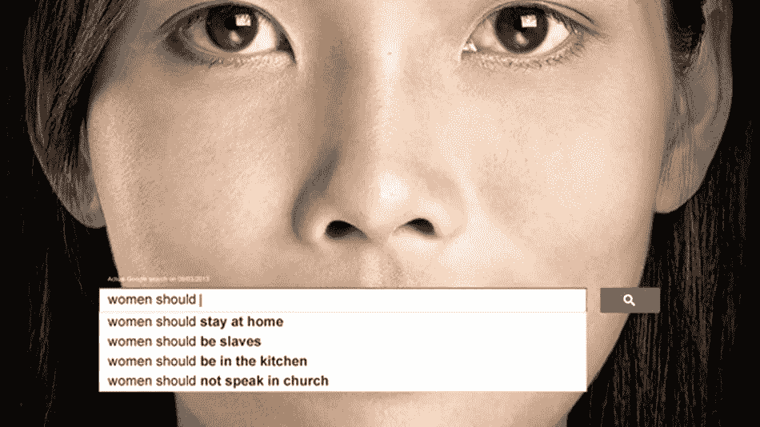
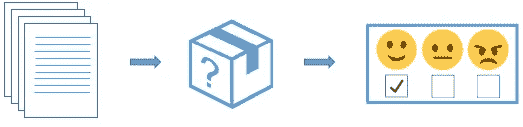
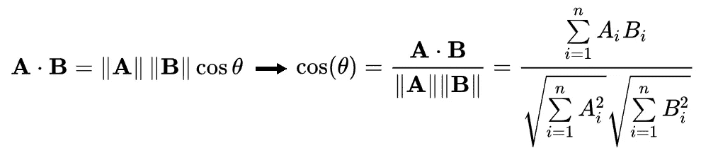
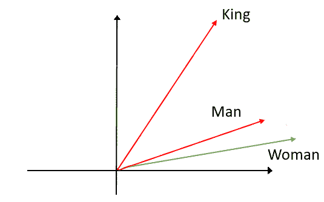
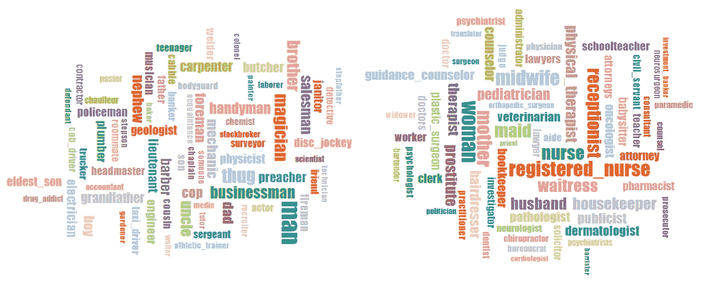
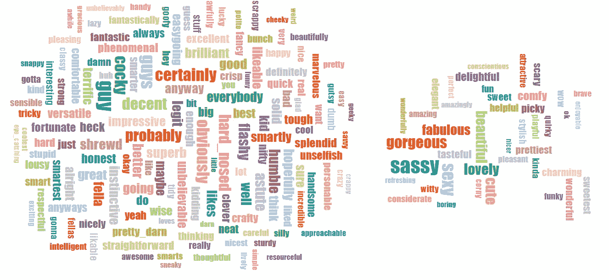
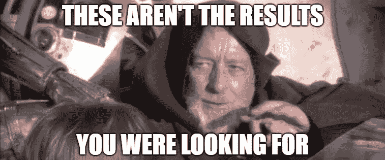

# 男人之于医生，如同女人之于护士:词语嵌入的性别偏见

> 原文：<https://towardsdatascience.com/gender-bias-word-embeddings-76d9806a0e17?source=collection_archive---------5----------------------->

## 为什么我们应该担心自然语言处理技术中的性别不平等


[© [CalArts](https://youtu.be/b34RK6Gadq4)]

# 文化和语言，语言和机器

## 电梯里的性别

我想象你正和两个人一起走进医院的电梯:一男一女。他们穿着同样的白大褂，但他们的徽章被遮住了，所以你看不出他们在医院里是什么角色。在某个时刻，电梯门打开了，一位年轻女士跳出来说:“早上好，史密斯医生！”。你觉得哪个会去迎接她回来？

常识告诉我们两人都有可能成为史密斯医生，但是几项实验表明**个人更有可能将女性与护理联系在一起，将男性与医生联系在一起**。也就是说，你可能最终会把头转向那个穿白大褂的人，期待他说点什么。


If you are a sci-fi lover, you probably know that doctor Smith’s gender can’t be established without knowing which version of Lost in Space you’re referring to. [© Netflix, CBS]

## 语言反映了(不良)文化

性别陈规定型观念在我们的社会中仍然根深蒂固，由于有意识和无意识的性别偏见，女性在成长和生活中受到与男性截然不同的对待。

语言是性别歧视和性别歧视得以实施和复制的最强有力的手段之一。词汇选择和日常交流不断反映出这种长期存在的偏见，以至于语言本身被设计成反映社会不对称。例如，语法和句法规则是以这样一种方式构建的，即阴性术语通常源自其对应的阳性形式(例如 princ- *ess* ，god- *dess* 等)。)【[梅内加蒂等人，2017](http://oxfordre.com/communication/view/10.1093/acrefore/9780190228613.001.0001/acrefore-9780190228613-e-470#acrefore-9780190228613-e-470-bibItem-0028) 。同样，阳性名词和代词也经常与一个通用功能一起使用，既指男人也指女人(如 *man-* kind，states- *men* 等)。)，经常被人认为是歧视女性。这些问题对大多数语言来说都是常见的，凸显了性别歧视是如何在全世界蔓延的，涉及到整个社会。

由于**语言和文化是如此紧密地联系在一起**，很容易理解**对基于理解和处理人类语言的自动任务的危险暗示**，从[网络浏览器的自动补全](https://www.wired.com/story/google-autocomplete-vile-suggestions/)到[人工智能机器人](https://www.theguardian.com/technology/2016/sep/08/artificial-intelligence-beauty-contest-doesnt-like-black-people)(还记得微软的人工智能聊天机器人[完全纳粹化](https://www.cbsnews.com/news/microsoft-shuts-down-ai-chatbot-after-it-turned-into-racist-nazi/)的时候吗？)和[查询结果排名](https://www.wired.com/2015/05/google-maps-racist/)。

让我们用一些技术性的细节来更深入一点(不涉及数学！).



Surprisingly (?) biased Google Search’s autocomplete suggestions from a 2013 query [© [*UN Women*](https://www.unwomen.org/en/news/stories/2013/10/women-should-ads)*]*

# 自然语言处理中的性别偏见:垃圾进，垃圾出

## 什么是自然语言处理？

自然语言处理(NLP)是人工智能(AI)的一个分支，它帮助计算机理解、解释和处理自然语言。
将 NLP 驱动的机器想象成能够理解和评估输入文档(即单词集合)的上下文的黑盒，输出有意义的结果，这些结果取决于机器被设计用于的任务。



Documents are fed into magic NLP model capable to get, for instance, the sentiment of the original content

就像任何其他机器学习算法一样，**有偏见的数据导致有偏见的结果**。就像任何其他算法一样，结果去偏置是非常恼人的，以至于去偏置社会本身可能更简单。

> 亲爱的人类:请停止性别歧视。
> 真诚的，你友好的邻居数据科学家。

现在，让我们看看性别偏见是如何通过 NLP 模型传播的。

## 大事:单词嵌入

W ords 必须表示为**数值向量**才能馈入机器学习算法。最强大(也是最流行)的方法之一是通过**单词嵌入**。在单词嵌入模型中，给定语言中的每个单词被分配给一个高维向量，使得向量的几何形状捕获单词之间的关系。例如，单词 *king* 的向量表示之间的余弦相似度将更接近单词 *queen* 而不是 *potato。*记住，余弦相似度就是两个向量之间角度的余弦，可以定义为:



因此，余弦相似度越高，向量方向越接近。让我们试着把它变成一个简单的 R 脚本，使用一个预训练的手套单词嵌入(你可以在这里找到它)。

```
> word_vec = read.csv('./glove.6B.300d.csv')> cosine_sim = function(v1,v2){
+    return(dot(v1, v2) / (sqrt(sum(v1^2)) * sqrt(sum(v1^2)))
+}> cosine_sim(word_vec["**king**",],word_vec["**queen**",])
[1] **0.67**> cosine_sim(word_vec["**king**",],word_vec["**potato**",])
[1] **0.23**
```

这些惊人的结果可以通过学习单词嵌入的方式来实现:遵循[分布假设](https://en.wikipedia.org/wiki/Distributional_semantics#Distributional_hypothesis)，**嵌入以无监督的方式评估每个目标单词及其上下文**(即出现在目标单词之前和之后的一组单词)，建立和处理共现矩阵([手套](https://nlp.stanford.edu/pubs/glove.pdf))或输入巧妙设计的神经网络来解决单词预测任务( [Word2Vec](https://www.tensorflow.org/tutorials/representation/word2vec) 和 [FastText](https://fasttext.cc/) )。

为了完整地保留自然语言的语义，**单词嵌入通常在大规模文本数据库**上进行训练，如[维基百科转储](https://dumps.wikimedia.org/)(600 万个英文页面)或谷歌新闻(约 1000 亿个单词)，**继承了我们之前指出的所有偏见**。当然，特定于上下文的嵌入总是可以使用较小的数据集来学习。

## 国王和王后:单词嵌入实际上发挥了魔力

L et 的贴有*国王*和*王后*字样。作为人类，我们知道国王是统治国家的皇家男性人物，而我们用单词 *queen* 来描述一个嫁给国王或独自领导一个王国的女人(queens 统治 king-doms…你能看到吗？).围绕国王和王后的语义关系**对我们来说相当直接，但是对于一台不能理解字里行间含义的机器来说**可能很难理解。单词嵌入允许机器捕捉(部分)这些类比和关系，包括**性别**。****

既然我们在谈论数字向量，我们可以简单地通过取 *king* 和 *man 的向量表示之间的差来**估计语义关系**的*方向*。*如果我们试图将*女人*向量投射到同一个方向，会发生什么？惊喜:我们得到了单词 *queen* 。
**关于*女王*是*国王*的女性的信息从未被直接输入到模型中，但模型无论如何都能捕捉到这种关系**。



2D representation of the semantic analogies between king, queen, man and woman

此时，你大概会猜到这件事会在哪里结束:**如果我们试着对**——比如说——**职业**——做同样的事情会怎么样？不出所料，这就是性别刻板印象真正出现的地方。

```
> get_analogy = function(v1,v2,v3){
+   x = v2-v1+v3
+   return(names(get_closest(x,word_vec))[1])
+}> get_analogy(word_vec["man",],
+              word_vec["doctor",],
+              word_vec["woman",])
[1] **"nurse"**
```


该死的。显然，我们的算法也经历了医院电梯的情况。

许多不同的职业都可以得到类似的结果。举个例子，如果我们试图得到男人*:*程序员* = *女人* : X 的类比，我们会不可思议地以 X = *家庭主妇*告终。当然，单词*程序员*(以及单词*家庭主妇*)根据其定义是中性的，但是**在新闻语料库上训练的嵌入模型倾向于认为*程序员*与*男*比*女*更接近，因为我们对这份工作的社会认知，这反映在我们使用的语言**中。[ [Bolukbasi 等人，2016 年](https://arxiv.org/abs/1607.06520) ]*

## *通过词云的性别偏见*

*当我们观察*男人*和*女人*的**K-最近嵌入邻居**时，更容易发现 S 存在。即使不看描述也能猜出两朵云的目标性别。*

**

*Word clouds for the nearest neighbours of “man” (L) and “woman” (R). Topic observed: “occupations”*

*在*人*子群中，我们可以找到像*暴徒*、*商人*、*机械师、中尉*、*屠夫*、*警察*这样的词。在*女性*子群中最相关的词中，我们看到的是*助产士、护士、接待员、女服务员*和……*妓女*这样的词。可怕。*

*甚至更可怕的结果可以被检索到**将感兴趣的领域**从职业切换到**形容词**。按照嵌入方式，男人有*趾高气扬*、*正派*、*奸诈*、*聪明绝顶*和*谦逊。不出所料，女性反而被描述为*时髦的*、*性感的*、*有品味的*、*迷人的*和*华丽的*。**

*我们真的只能用这个来形容一个女人吗？*

**

*Considering the first 200 closest adjectives to man or woman, 76% of them are referred to “man”. Within the remaining 14%, more than 50% are beauty-related terms.*

*你可以用[这个令人难以置信的可视化工具](http://wordbias.umiacs.umd.edu/)亲自尝试一下，这个工具是在 2017 年微软新英格兰研究&开发中心举办的黑客歧视黑客马拉松上制作的。*

## *性别偏见的人工智能在现实生活中的影响*

*鉴于自然语言处理中的性别偏见确实存在，即使只是出于伦理原因也应该避免，那么受刻板印象影响的人工智能对人类日常生活的影响是什么？换句话说，我们为什么要在乎呢？*

*在自动化系统的所有优点中，廉洁、敬业和尽职尽责的工作狂可能是最重要的优点之一。机器学习系统可以**确定贷款资格**而不受申请人种族的影响，它们可以**提供信息** **和服务**而没有性别歧视，它们可以**为公司招聘最佳候选人**而不受他/她的性取向等的影响。
然而，当机器学习系统开始在预测中变得更像人类时，它们也可能开始**延续人类行为**，失去它们对人类的**主要优势之一:不是人类**。*

*让我们考虑工作招聘的例子。我们希望**设计一个 NLP 驱动的自动系统，根据候选人的动机信**生成工作适合度分数。假设公司 HR 的数据库不够大，不足以训练自己的嵌入，我们决定使用维基百科上预先训练的 300 维手套词嵌入。
在激励函中找到积极形容词的几率很高，如*狡猾的*、*聪明的*和*聪明的*，但是我们观察到，在预训练的嵌入空间中，这些术语更接近于*男人*而不是*女人*。此外，假设我们正在评估初级程序员职位的候选人，我们知道我们的嵌入不会被认为是性别中立的。
在这种情况下，如果模型成功检索到候选人的性别，它将在候选人选择过程中受到很大影响。*

**

## *结论*

*G 安德不等式在我们的社会中仍然根深蒂固，机器学习算法的盲目应用有传播和放大原始上下文中存在的所有偏见的风险。**实施这种令人不快的人类行为不仅非常不道德，而且可能在许多不同的决策场景中产生令人担忧的后果**。*

*如今，数据科学家正在努力解决这个问题，最终找到了非常聪明的**去偏置策略** [ [Bolukbasi 等人，2016](https://papers.nips.cc/paper/6228-man-is-to-computer-programmer-as-woman-is-to-homemaker-debiasing-word-embeddings.pdf) ][ [Chakraborty 等人，2016](https://pdfs.semanticscholar.org/b3a1/8280f63844e2178d8f82bc369fcf3ae6d161.pdf?_ga=2.262516940.1594476167.1551791224-728904386.1551791224) ]，在保留嵌入的有用属性的同时，减少了性别极化。然而，我们应该非常小心地在每一个社会偏见不应该造成差异的环境中应用 NLP 技术。这样做将提高我们模型的效率，最终提高我们作为人类的自身。*

## *参考资料和进一步讲座*

*在这里你可以找到我的主要资料，以及一些非常有趣的读物，如果你有兴趣深入研究单词嵌入和偏差消除，我建议你看一看。*

*   *[学习中性词嵌入](http://aclweb.org/anthology/D18-1521)*
*   *[单词嵌入量化了 100 年来的性别和种族刻板印象](https://www.pnas.org/content/115/16/E3635)*
*   *[检查两百个情感分析系统中的性别和种族偏见](https://arxiv.org/pdf/1805.04508.pdf)*
*   *[男人对于电脑程序员就像女人对于家庭主妇一样？去偏置词嵌入](https://arxiv.org/abs/1607.06520)*
*   *[男医生、女护士:潜意识成见难改](https://www.livescience.com/55134-subconscious-stereotypes-hard-to-budge.html)*
*   *哦，你是护士吗？医师性别偏见*
*   *[神经自然语言处理中的性别偏见](https://arxiv.org/pdf/1807.11714.pdf)*
*   *[语言中的性别偏见和性别歧视](http://oxfordre.com/communication/view/10.1093/acrefore/9780190228613.001.0001/acrefore-9780190228613-e-470#acrefore-9780190228613-e-470-bibItem-0028)*
*   *[自然语言处理的简单介绍](/an-easy-introduction-to-natural-language-processing-b1e2801291c1)*
*   *[为什么你的 AI 可能是种族主义者](https://www.washingtonpost.com/opinions/2018/12/17/why-your-ai-might-be-racist/?noredirect=on&utm_term=.b57d589b38a1)*

*希望这篇博文能够强调李颖社会中的性别不平等，以及为什么我们应该担心 NLP 中的性别陈规定型观念。如果你觉得有帮助，请在评论区留下你的想法并分享！*

 *[## Tommaso Buonocore - Scrittore -走向数据科学| LinkedIn

### 查看世界上最大的职业社区 LinkedIn 上 Tommaso Buonocore 的个人资料。托马索有 3 份工作列在…

www.linkedin.com](https://www.linkedin.com/in/tbuonocore/)*