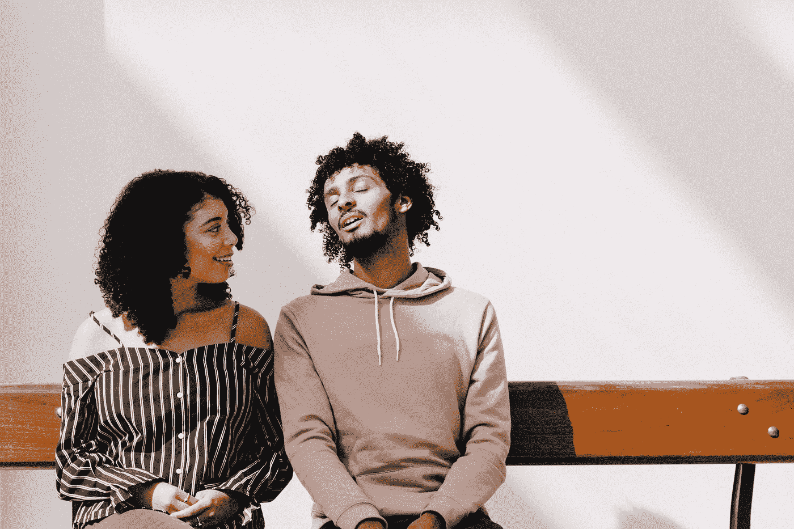
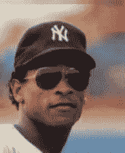
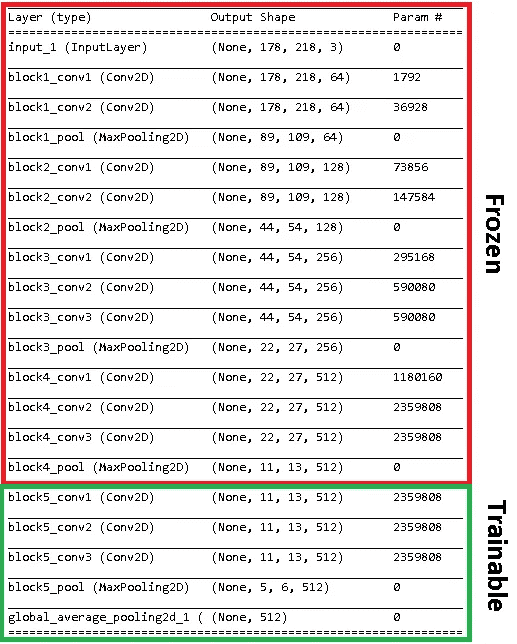
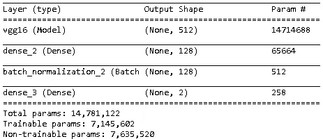
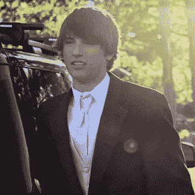

# 深度学习的性别推断

> 原文：<https://towardsdatascience.com/gender-identification-with-deep-learning-ac379f85a790?source=collection_archive---------19----------------------->

## 名人的微调预训练卷积神经网络



Photo by [Alex Holyoake](https://unsplash.com/photos/0lLoXbAZ31o?utm_source=unsplash&utm_medium=referral&utm_content=creditCopyText) on [Unsplash](https://unsplash.com/search/photos/couple?utm_source=unsplash&utm_medium=referral&utm_content=creditCopyText)

# *总结*

我想建立一个从图像中推断性别的模型。通过微调预训练的卷积神经网络 VGG16，并在名人图像上训练它，我能够在测试集上获得超过 98%的准确性。该练习展示了设计预训练模型的架构以补充数据集特征的效用。

# **任务**

通常情况下，人类可以很容易地分辨出上面照片中的男人和女人，但很难准确描述我们为什么会做出这样的决定。没有定义的特征，这种区分对于传统的机器学习方法来说变得非常困难。此外，与任务相关的特征并不是每次都以完全相同的方式表达，每个人看起来都有点不同。深度学习算法提供了一种在没有预定义特征的情况下处理信息的方法，并且尽管特征表达方式存在差异，但仍能做出准确的预测。在本文中，我们将把卷积神经网络应用于名人的图像，目的是预测性别。*(免责声明:作者理解外貌与性别没有因果关系)*

# 工具

卷积神经网络(ConvNets)提供了一种从原始图像进行预测的方法。该算法的一个特点是能够通过使用识别区别特征的过滤器序列来降低图像的维度。模型中的附加层帮助我们强调由过滤器识别的特征和分配给图像的标签之间的非线性关系的强度。我们可以调整与过滤器和附加层相关联的权重，以最小化预测分类和观察分类之间的误差。Sumit Saha 提供了一个更深入的解释:[https://towardsdatascience . com/a-comprehensive-guide-to-convolutionary-neural-networks-the-Eli 5-way-3bd2b 1164 a53](/a-comprehensive-guide-to-convolutional-neural-networks-the-eli5-way-3bd2b1164a53)

有许多预训练的神经网络已经被训练来对从飞机到柯基犬的一系列图像进行分类。通过使用预训练模型的权重并根据我们的目的对它们进行微调，我们可以节省计算时间并克服一些采样不足。

# 资料组

CelebA 数据集包含超过 200，000 张名人的照片，这些照片标有包括性别在内的 20 个属性。图像是从肩膀以上开始的，所以大部分信息都在面部特征和发型上。



Example image available from CelebA

# 建模

## 特征抽出

我们将使用 VGG16 预训练模型，并对其进行微调，以最好地从名人图像中识别性别。

```
vgg=VGG16(include_top=False, pooling=’avg’, weights=’imagenet’,
input_shape=(178, 218, 3))
```

我们使用“include_top=False”来移除为识别 VGG16 被训练识别的一系列对象(例如，苹果、柯基犬、剪刀)而设计的全连接层，并且我们下载与 ImageNet 竞赛相关联的权重。

下表 1 显示了 VGG16 的卷积架构；对于所有的卷积，有数百万个权重，我们可以选择训练或保持冻结在预训练值。通过冻结模型的所有权重，我们有欠拟合的风险，因为预训练的权重不是为我们的特定任务专门估计的。相比之下，通过训练所有的权重，我们冒着过度拟合的风险，因为模型将开始“记忆”训练图像，这是由于高参数化的灵活性。我们将通过训练最后一个卷积块来尝试折衷:

```
# Freeze the layers except the last 5
for layer in vgg.layers[:-5]:
 layer.trainable = False# Check the trainable status of the individual layers
for layer in vgg.layers:
 print(layer, layer.trainable)
```



Table 1: Architecture of VGG16 model after turning final layers on

VGG16 模型中的第一个卷积块识别更一般的特征，如线条或斑点，因此我们希望保留相关的权重。最后的块识别更精细的尺度特征(例如，与飞机翼尖相关的角度)，所以我们将训练那些给定名人图像的权重。

## 模型编译

在卷积提取特征之后，我们将在模型中添加两个密集层，使我们能够根据识别的特征对图像进行预测。您可以使用单个密集图层，但是附加的隐藏图层允许在对要素进行更复杂的解释的情况下做出预测。过多的密集层可能会导致过度拟合。

```
# Create the model
model = models.Sequential()# Add the VGG16 convolutional base model
model.add(vgg)

# Add new layers
model.add(layers.Dense(128, activation=’relu’))
model.add(layers.BatchNormalization())
model.add(layers.Dense(2, activation=’sigmoid’))
```

我们添加了一个批处理规范化层，它将缩放我们的隐藏层激活值，以减少过度拟合和计算时间。最后一个密集层对性别进行预测(表 2)。



Table 2: Custom Model Architecture

因为我们允许模型训练卷积层和密集层，所以我们将估计数百万个权重(表 3)。给定我们构建的网络的深度，为像随机梯度下降这样的优化器选择最佳的恒定学习速率将是棘手的；相反，我们将使用 ADAM 优化器，它可以调整学习速度，在训练中迈出更小的步伐。

```
model.compile(optimizer=’adam’, loss=’binary_crossentropy’, metrics=[‘accuracy’])
```

使用 Keras，我们将设置我们的数据生成器来支持我们的模型，并使网络适合我们的训练集。

```
data_generator = ImageDataGenerator(preprocessing_function=preprocess_input)train_generator = data_generator.flow_from_directory(
 ‘C:/Users/w10007346/Pictures/Celeb_sets/train’,
 target_size=(178, 218),
 batch_size=12,
 class_mode=’categorical’)validation_generator = data_generator.flow_from_directory(
 ‘C:/Users/w10007346/Pictures/Celeb_sets/valid’,
 target_size=(178, 218),
 batch_size=12,
 class_mode=’categorical’)model.fit_generator(
 train_generator,
 epochs=20,
 steps_per_epoch=2667,
 validation_data=validation_generator,
 validation_steps=667, callbacks=cb_list)
```

经过 6 个时期后，模型达到了 98% 的**最大验证精度。现在应用于测试集。**

## 测试

我们有一个每个性别 500 张图片的测试集。该模型将通过网络为我们提供每张图像的预测概率，我们可以简单地将这些概率的最大值作为预测的性别。

```
# obtain predicted activation values for the last dense layer
pred = saved_model.predict_generator(test_generator, verbose=1, steps=1000)# determine the maximum activation value for each sample
predicted_class_indices=np.argmax(pred,axis=1)
```

**我们的模型预测名人性别的准确率高达 98.2%！**这相当于人类的能力。

这个模型适用于非名人吗？让我们试试作者。这个模型在作者的近照上表现很好。


上面这张图片的预测概率是 99.8%是男性。



这位模特在作者年轻、头发蓬乱的过去也做得很好；它预测 98.6%是男性。

# 结论

这个练习展示了微调预训练 ConvNets 的强大功能。每个应用程序都需要不同的方法来优化建模过程。具体来说，模型的架构需要以补充数据集特征的方式进行设计。佩德罗·马塞利诺对调整微调过程以适应任何数据集的一般规则做了很好的解释:[https://towardsdatascience . com/transfer-learning-from-pre-trained-models-f 2393 f 124751](/transfer-learning-from-pre-trained-models-f2393f124751)

我感谢对这项工作的任何反馈和建设性的批评。与分析相关的代码可以在 github.com/njermain 的[找到](https://github.com/njermain)