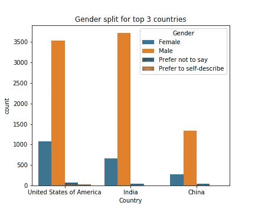
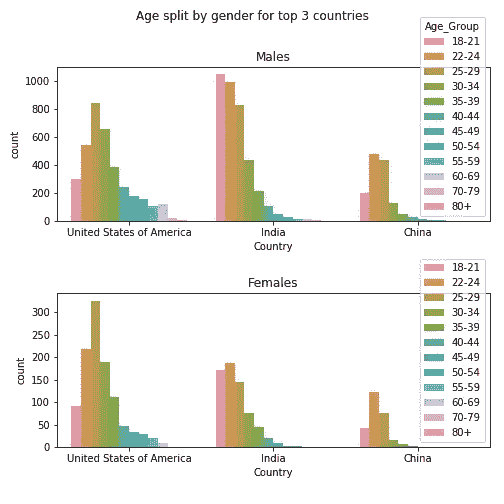
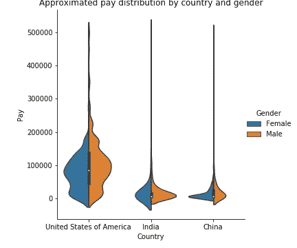
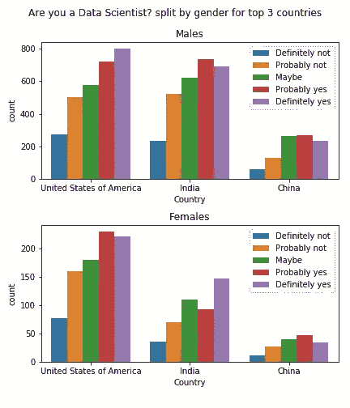
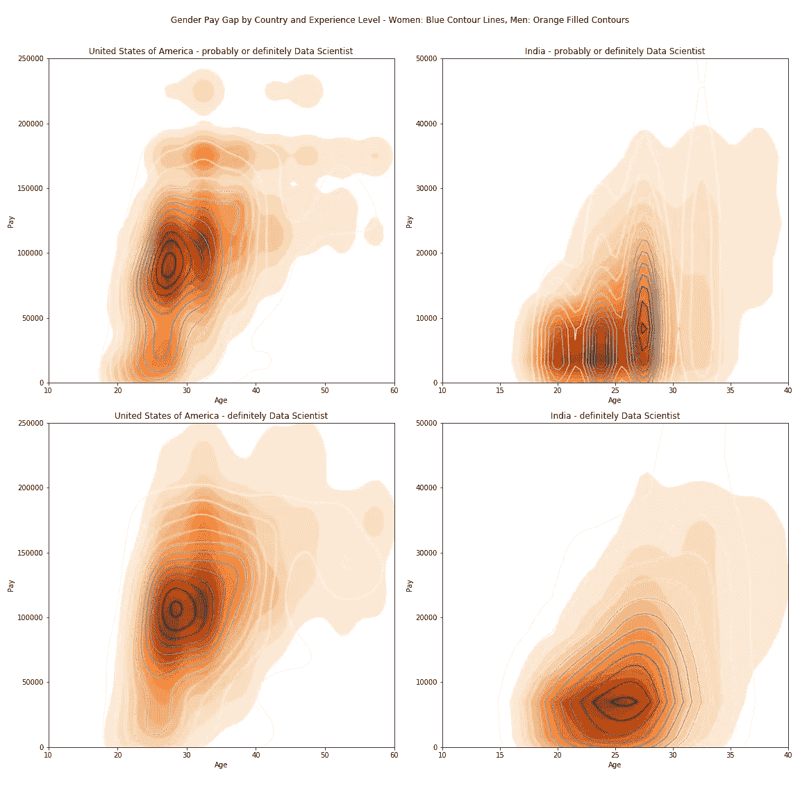

# Kaggle 上数据科学家的性别薪酬差距

> 原文：<https://towardsdatascience.com/gender-pay-gap-among-data-scientists-on-kaggle-87b393aa21fe?source=collection_archive---------14----------------------->

## 美国和印度的性别薪酬差距一样吗？

[Pixabay.com](https://pixabay.com/photos/mind-the-gap-london-underground-1876790/)

2012 年，数据科学家被《哈佛商业评论》评为 21 世纪最性感的工作。从那以后，数据科学领域发展了很多，也发生了很多变化。但是，这份如此现代的工作避免了困扰许多传统工作的性别薪酬不平等吗？

数据科学平台 Kaggle 最近在 [2018 年机器学习和数据科学调查](https://www.kaggle.com/kaggle/kaggle-survey-2018/home)中对其全球用户群进行了调查。近 24，000 个回复让我们对这个问题有了深入的了解。

# 谁是调查对象？

调查答复主要来自美国和印度，中国远远排在第三位:

这三个国家的大多数受访者都是男性。大约 23%的美国受访者是女性，而印度和中国的女性受访者比例分别为 15%和 16%。

进一步研究不同国家男性和女性受访者的年龄差异显示:

*   在美国，25-29 岁是男性和女性最常见的年龄范围，平均年龄为 33 岁。
*   50 岁及以上的受访者大多是美国男性——这一年龄范围在美国女性中的代表性不足。
*   中国受访者的平均年龄为 26.4 岁，略低于印度 26.6 岁的平均年龄。
*   印度男性受访者的年龄分布显示，最年轻的年龄组(18-21 岁)比任何其他年龄组都更常见，而对于印度女性来说，22-24 岁的年龄范围更普遍。

# 按国家和性别划分的收入水平如何？

调查参与者报告了他们的收入，用美元表示了一个范围。

一些受访者报告的年薪超过 20 万美元，但特别是在印度和中国，年薪大多低于 5 万美元。美国的平均年收入为 10 万美元，印度和中国的平均年收入约为 2.2 万美元(由于括号中的数据为工资，因此每个受访者的括号中均为中间值)。如果将非常高的工资从样本中剔除，那么中国和印度的平均工资将比美国还要低。

Note that the amounts below zero are an artifact from trying to plot a smooth curve. The lowest reported salary range was 0–10,000 USD and that range was encoded as 5,000 USD.

将每个国家的数据按性别分类显示:

*   中国女性的薪酬分布比男性更窄，平均水平似乎也更低。
*   印度男性受访者的收入分布范围比女性受访者窄。
*   美国男性调查者的薪酬分布显示了一个较高的中心点，约为 10 万美元，范围超过 20 万美元，而美国女性的薪酬分布在 10 万美元以上急剧下降。

> 按国家和性别划分的工资分布似乎表明，男性收入高于女性。这种性别薪酬差距与其他地方的研究结果一致。

# 女性数据科学家的工资比男性低吗？

到目前为止，我们已经查看了所有对调查的回复。调查受访者报告了各种各样的职称、教育程度、工作经验年限和使用的工具。我们需要更仔细地剖析这些数据，这样我们就不会将一位 50 多岁的印度男性首席执行官与一位印度女数学系学生进行比较，然后得出他比她挣得多的结论(他很可能会这么做)。

Kaggle 调查中有一个问题可以帮助我们关注数据科学家。Kaggle 问每个参与者“*你认为自己是数据科学家吗？”。*

印度女性在*“可能是”*群体中有所下降，但除此之外，我们还有数百人认为自己在*“是”*群体中属于美国和印度。每一组中中国女性的数量都要少得多，因此我们未来将专注于美国和印度。

现在，我们有了尝试回答男女之间是否存在薪酬差距这一问题的所有要素——我们将研究将自己列为数据科学家的个人，并比较他们的薪酬、年龄、性别和国家。在一个可视化中包含了很多维度:

*   下面您会看到四个图表(左栏是美国，右栏是印度，最上面一行是将自己列为“可能”**或**“肯定”是数据科学家的个人，底部显示**只是**是“肯定”数据科学家的个人)。
*   每张图表都以等高线图的形式显示了年龄与收入分布的关系——“峰值”是大部分值所在的位置。
*   为了便于比较，男性和女性的回答重叠在一起，女性的回答用蓝色轮廓线表示，而男性的回答用橙色实线表示。
*   要比较男性和女性，只需比较每个图中橙色和蓝色的“峰值”,并注意分布如何不同。

请注意，平滑的线条给人以极其详细和丰富的数据的印象，但我们已经进入了数据集的一些相当稀疏的区域(例如，在 45-50 岁的年龄组中，只有三名印度女性认为自己“绝对”是数据科学家)。尽管如此，等高线图的总体形状应能让我们对数据有所了解:

Each chart is showing the most relevant ranges on Age and Pay — ie some of the highest incomes are not shown but they were included in the analysis. Number of respondents in each chart quadrant: upper left: 1,242 men and 352 women, lower left: 669 men and 172 women, upper right: 908 men and 117 women, lower right: 435 men and 79 women.

很难估计受访者在将自己归类为“可能”或“肯定”数据科学家时的自信程度。性别之间和国家之间也可能存在文化差异。在本次分析中，我们将重点关注那些有信心认为自己“绝对”是数据科学家的人，因此，让我们试着理解我们可能从最下面一行的图表中推断出什么:

> 来自美国的 20 多岁的女性数据科学家回应了 Kaggle 的调查，似乎比他们的男性同行挣得多一点。**但是对于年龄较大的男性来说，工资似乎高于女性**(30-35 岁年龄组的工资范围更高，扩展到 15 万美元以上)。
> 
> **来自印度的男性和女性自我分类数据科学家之间的薪酬差距似乎很小**(分布的总体形状相当相似)。在相同的薪酬范围内，大多数男性印度数据科学家似乎比女性年轻几岁(男性和女性的高峰期相差 2-3 岁)。

# 包装它

我们研究了一个包含近 24，000 份调查反馈的丰富数据集。一旦我们将数据按国家、作为数据科学家的自我分类和性别进行了划分，我们就能够按年龄对男性和女性的自我报告的薪酬数据进行比较。

对数据的分析表明，回答 Kaggle 调查的美国老年男性数据科学家比他们的女性同行挣得更多，收入范围更广。印度男性和女性数据科学家之间的薪酬差距似乎不那么明显。

我们能从这里去哪里？关于美国和印度之间更大的社会经济趋势和差异，这告诉了我们什么？薪酬差距在成熟经济体或行业更明显吗？

查看这些文章了解更多:[https://www . aauw . org/research/the-simple-truth-about-the-gender-pay-gap/](https://www.aauw.org/research/the-simple-truth-about-the-gender-pay-gap/)和[https://www.payscale.com/data/gender-pay-gap](https://www.payscale.com/data/gender-pay-gap)

如果你喜欢这个帖子，请鼓掌。这篇文章也发表在我的网站上:http://flo lytice . com/blog/gender-pay-gap-in-data-scientists-on-ka ggle。

*这篇文章的分析和图形是用 Python 制作的。*

*你可以在这里找到 Github 上的完整项目:*[*https://github.com/Lindstaedt/Kaggle-2018-Survey-Analysis*](https://github.com/Lindstaedt/Kaggle-2018-Survey-Analysis)*。*

*来自 Kaggle 的原始数据集在这里:*[*https://www.kaggle.com/kaggle/kaggle-survey-2018/*](https://www.kaggle.com/kaggle/kaggle-survey-2018/)