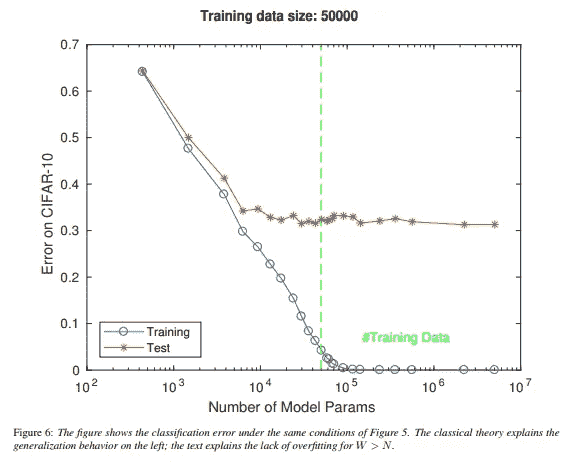
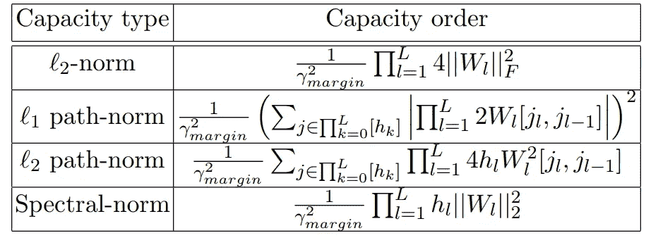
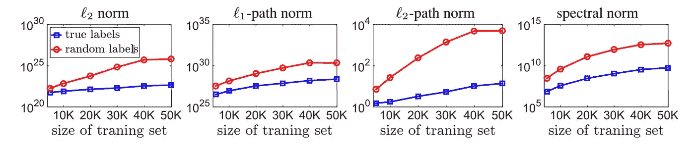
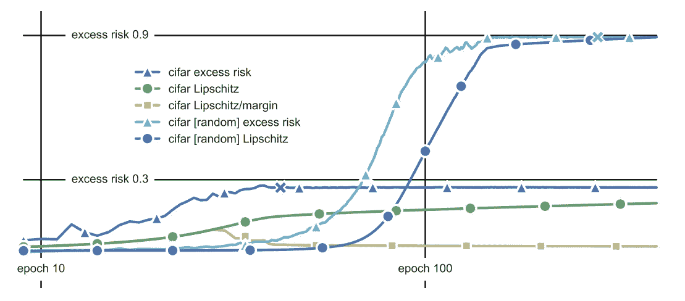

# 泛化界限:依赖你的深度学习模型

> 原文：<https://towardsdatascience.com/generalization-bounds-rely-on-your-deep-learning-models-4842ed4bcb2a?source=collection_archive---------12----------------------->

你的深度学习系统对新数据会有怎样的表现(泛化)？它的性能能差到什么程度？评估算法的概括能力是建立信任和依赖人工智能系统所必需的。

Can you trust your AI? Will your AI go binge drinking or try to destroy the world once it goes live? (image source: [https://unsplash.com/photos/0E_vhMVqL9g](https://unsplash.com/photos/0E_vhMVqL9g))

**TL；DR —传统方法(VC 维、Rademacher 复杂性)无法提供可靠、有用(足够紧密)的泛化界限。如果网络压缩与泛化边界的估计齐头并进会怎样？那是一张中奖彩票！**

# 为什么统计学习理论很重要？

确保一个算法一旦上线就能按预期执行是必要的:人工智能系统需要安全可靠。证明人工智能算法的性能对于推动采用和信任是必要的[5]

此外，理解算法的泛化属性是政策制定者的要求，正如欧盟委员会发布的可信人工智能(AI)道德准则所强调的[0]。

尽管如此，不幸的是，模型的泛化特性(泛化理论)的研究仍然是一个投资不足的研究领域。在训练、验证和测试集中拆分数据已经成为进行的标准方式，并且通常被认为是进行的唯一方式。然而，对于我们无法量化算法的泛化能力来说，在测试(保留)集上估计算法的泛化属性的想法可能只是一个聪明的变通办法；这是一个棘手的过程，使我们暴露在泄漏的风险中，并需要*额外的独立性假设(参数从维持集独立选择)，这已被 p-hacking [20]* 等实践所混淆

# 什么是泛化？

我们的主要工作假设是，数据是由一个潜在的、未知的分布 **D** 产生的。统计学习不是直接访问分布，而是假设给我们一个训练样本 **S** ，其中 S 的每个元素都是 i.i.d .并根据 **D** 生成。学习算法从函数空间(假设类) **H 中选择一个函数(假设 H)，其中 H** = {f(x，α)}其中α是参数向量。

然后，我们可以将假设的泛化误差定义为从分布 **D** 中选取的样本 **x** 的误差期望值与经验损失(给定样本 **S** 的损失)【4，11】之差

我们的工作是给泛化误差上界:它能有多坏？

# **传统方法:模型容量**

在一般化理论的传统方法中，一般化的能力由假设类 h 的复杂性(容量)来建模。粗略地说，类的“容量”是它可以(似乎)很好地适合多少不同的数据集。高容量模型类更灵活，但也更容易过度拟合。[..产能控制是一门艺术，它使用足够灵活的模型以获得良好的适应性，而不使用过于灵活以至于过度适应的模型

我们如何定义一个假设类的复杂性 **H** ？传统的泛化理论概念包括 VC 维、Rademacher 复杂度和 PAC-Bayes 界。

## **VC 维与死亡神经元**

VAP Nik–Chervonenkis(VC)维度是一种通过评估其成员的波动程度来衡量一类函数的复杂性的方法:类 **H** 的 VC 维度被定义为可以被 **H** 的成员分解的最大点数。如果一组点被一类函数分解，不管我们如何给每个点分配一个二元标号，这个类中的一个成员可以完美地分离它们。[5]

Figure 1 — Ballooning number of parameters — yet the test error does not explode [1]

*张等人*【7】*的实验表明，20 多年前 Bartlett 的 VC 计算(节点数* #层数)*【2】对基于现实数据训练的深度网络的真实“参数复杂性”(当然现在没人知道)。

这可能并不令人惊讶，例如，根据 ***死神经元*** : *当网络的规模足够大并且非线性被选择为 ReLU 时，许多权重为零*【13】。

那么，我们如何估算一个模型的风险值呢？

## PAC 可学习性和 Rademacher 复杂性

大概近似正确(PAC)可学习性的定义很简单:有一个算法，对于每个分布 d 和є，δ > 0，找到一个概率为 1-δ的“є-optimal”假设。每个分布都有一个算法是一个很强的要求:Rademacher 复杂度是为一个特定的未知分布定义的 **D** 。

A sketched derivation of the Rademacher complexity based on [23]

简而言之，Rademacher 复杂度测量假设类 **H** 适合随机 1 二进制标签的能力。如果与 VC 维相比，Rademacher 复杂度是分布相关的，并且是为任何一类实值函数(不仅仅是离散值函数)定义的。

正如 Bartlett 的 VC 计算*，*的情况一样，Rademacher 复杂性没有为深度学习提供有用的泛化界限。实证测试表明，事实上，*许多神经网络与随机标签的训练集完美匹配，我们期望对应的模型类 h 具有几乎完美的 Rademacher 复杂性。当然，这是 Rademacher 复杂性的一个微不足道的上限，在现实设置中不会导致有用的泛化界限*【7】。

换句话说，事情在理论上并不可行，我们只剩下“炼金术”和一些最佳实践:*实际上降低如此复杂的学习架构的 Rademacher 复杂性的唯一方法是尝试训练一个分类器，并通过一个保留的集合来检测一般化的缺乏。世界上的每一个实践者都已经这样做了(没有意识到)，张等人(*【7】*)强调理论目前没有提供更好的东西*【2】值得称赞

# **走向新颖的方法**

一般化理论的经典方法*很难计算出今天复杂的 ML 模型，更不用说在设计学习系统时用作指南*【2】。一般化理论的经典方法只是描述性的:换句话说，如果一般化没有发生，我们可以通过利用复杂性的度量来证明这一经验发现(VC 维度，Rademacher)，但我们没有任何可以指导我们的规定性原则[2]。

此外，经验证据证明，假设类具有高，甚至无限的能力，可能在实践中工作得很好。这是真的，不仅对于深度学习模型如此，对于其他机器学习方法论也是如此:例如，具有某些核(例如:径向基函数)的 SVM 的特征在于无限的 VC 维。甚至更简单的线性模型也可以欺骗我们:*过参数化线性模型的假设空间可以记忆任何训练数据，并在参数范数任意大的情况下，将训练和测试误差降低到任意接近于零(包括零)，即使参数距离地面真实参数任意远*【12】

> *深度学习将泛化理论的传统方法强调到了极致:**深度网络的一个主要难题围绕着没有过拟合，尽管存在大的过参数化，尽管随机标记数据上的零训练误差证明了大容量*【1】。

复杂性的整体概念正在被重新审视。专注于深度学习，有许多新颖的概括方法。

## 基于规范的能力度量

一种方法是查看基于通过差值归一化的权重矩阵的范数度量的容量度量。数据样本的输出分类容限是模型分配给正确类别的值减去所有其他类别的最大值的差值。

Figure 2 — Note that path norms, sum over all possible paths going from the input to the output of the network, passing through one single neuron in each layer [14]

基于范数的度量*并不明确依赖于模型中的参数数量，因此更有可能代表其能力* [14]: *基于范数的度量可以解释深度神经网络(DNNs)的泛化，因为在随机标签上训练的模型的复杂性总是高于在真实标签上训练的模型的复杂性，对应于后者的良好泛化能力* [14]

Figure 3 — Different complexity measures of a VGG network (a Convolutional Neural Network architecture) on CIFAR10 data. In all experiments, the training error of the learned network is zero. The plots indicate that these measures can explain the generalization as the complexity of model learned with random labels is always higher than the one learned with true labels. Furthermore, the gap between the complexity of models learned with true and random labels increases as we increase the size of the training set [22]

与基于范数的方法相关的另一个有趣的容量度量是网络的 Lipschitz 常数。Lipschitz 常数是权重矩阵的谱范数的乘积。谱范数是矩阵的最大奇异值:一个矩阵可以拉伸一个向量多少[9]。

经验证据表明，李普希茨常数与超额风险(测试误差减去训练误差)相关。然而，*这一指标随着时间的推移而增长，尽管超额风险处于平稳状态*[4]；再一次，通过边缘的 Lipschitz 常数进行归一化，可以中和的增长(见图 4)

Figure 4 — AlexNet trained with SGD on cifar10 [4]

## **压缩方法**

一般化的基本定理陈述了*如果训练集具有* ***m 个*** *样本，则定义为训练数据和测试数据上的误差之差的一般化误差的顺序为 sqrt(****N’****/m)其中****N’****是*

*取一个矩阵* ***C*** *带* ***N*** *可训练参数并尽量压缩成另一个带较少参数的矩阵****【C’****(****【N】)****并且训练误差与*****大致相同)*确实概括得好。*【23，24】****

我发现压缩方法非常有吸引力。一方面，我们确定了 DNNs 的推广范围。另一方面，我们获得了广泛的实际和操作优势:

1.  将较小的(经过训练的)模型部署到生产中有很多好处:较小的模型速度更快，消耗的能量更少(这在移动和嵌入式应用中很重要)，占用的内存也更少。
2.  最近的研究提供了一些被称为“彩票假说”的经验证据:*随机初始化的密集神经网络包含一个子网络(中奖彩票)，该子网络被初始化为当被隔离训练时，它可以在最多相同次数的迭代训练后匹配原始网络的测试精度* [16]。采用能够识别中奖彩票的训练策略意味着 a)更快的学习 b)更高的测试准确度 c) …)

除了“彩票方法”，还有许多其他有趣的网络压缩方法。我发现一个特别吸引人的想法是受张量网络的启发:这个想法“张量训练”DNN 的全连接层的权重矩阵已经显示了有希望的实证结果[17]。

[25]提供了网络压缩方法的调查，尽管这种压缩通常涉及*重新训练*压缩的网络，这是基于基本定理和[23，24]提供的压缩的一般化理论的方法没有考虑的。

# 结论

为了能够确保深度学习算法的可靠性，我们需要能够估计有用的(紧密的)泛化边界。这是一个开放的问题，传统的方法(VC dimension，Rademacher)无法提供答案，而新的方法正在开发中。

# **免责声明**

这篇博文中所表达的观点是我的，并且仅是我的。错误和不准确也是如此。

# 参考

[0][https://EC . Europa . eu/futurium/en/ai-alliance-consultation/guidelines/1 # Robustness](https://ec.europa.eu/futurium/en/ai-alliance-consultation/guidelines/1#Robustness)

[1] Poggio，Tomaso，等，“深度学习理论 III:解释非过度拟合难题。”arXiv 预印本 arXiv:1801.00173 (2017)。[ [链接](https://arxiv.org/pdf/1801.00173.pdf) ]

[2]桑吉夫·阿罗拉(Sanjeev Arora)，《一般化理论与深度网络导论》(2017) [ [链接](https://www.offconvex.org/2017/12/08/generalization1/) ]

[3] Desh Raj，学习理论导论—第 1 部分[ [链接](https://desh2608.github.io/post/deep-learning-theory-2/) ]

[4]巴特利特、彼得·l、迪伦·j·福斯特和马图斯·j·特尔加斯基。"神经网络的光谱标准化边界界限."神经信息处理系统进展。2017.

[5]成长的烦恼——2018 年全球 CEO 展望[ [链接](https://assets.kpmg/content/dam/kpmg/be/pdf/2018/05/SPT-CEOOutlook-brochure-uk-LR.pdf)

[6] Jordan Boyd-Graber，分类:Rademacher 复杂性，机器学习，第 6 讲，[ [链接](http://users.umiacs.umd.edu/~jbg/teaching/CSCI_5622/06a.pdf) ]

[7]张、等，“理解深度学习需要反思概括。”arXiv 预印本 arXiv:1611.03530 (2016)。

[8]科斯马·罗希拉·沙莉兹，本科生能力控制，2012，[ [链接](http://bactra.org/weblog/926.html)

[9]吉田、雄一和宫藤健。"谱范数正则化用于提高深度学习的泛化能力."arXiv 预印本 arXiv:1705.10941 (2017)。

[10] Boyd，s .，EE263 讲义(2015)，奇异值分解[ [链接](http://ee263.stanford.edu/lectures/svd-v2.pdf) ]

[11] Shawe-Taylor，j .和 Rivasplata，o .，“统计学习理论:搭便车指南”，2012 年，[ [链接](https://media.neurips.cc/Conferences/NIPS2018/Slides/stastical_learning_theory.pdf) ]

[12] Kawaguchi，Kenji，Leslie Pack Kaelbling 和 Yoshua Bengio。“深度学习中的泛化。”arXiv 预印本 arXiv:1710.05468 (2017)。[ [链接](https://arxiv.org/pdf/1710.05468.pdf)

[13]维达尔、雷内等，《深度学习的数学》arXiv 预印本 arXiv:1712.04741 (2017)。[ [链接](https://arxiv.org/pdf/1712.04741.pdf)

[14] Jakubovitz，Daniel，Raja Giryes 和 Miguel RD Rodrigues。“深度学习中的泛化错误。”arXiv 预印本 arXiv:1808.01174 (2018)。[ [链接](https://arxiv.org/pdf/1808.01174.pdf)

[15] Rob Schapire，COS 511:理论机器学习讲义，第 09 讲，[ [链接](https://www.cs.princeton.edu/courses/archive/spring13/cos511/scribe_notes/0305.pdf) ]

[16]弗兰克、乔纳森和迈克尔·卡宾。"彩票假说:寻找稀疏的、可训练的神经网络."arXiv 预印本 arXiv:1803.03635 (2018)。

[17]诺维科夫，亚历山大等，“张量化神经网络”神经信息处理系统进展。2015.

[18]周、哈蒂等:“解构彩票:零、符号与超级市场”。优步工程博客帖子。2019.[ [链接](https://eng.uber.com/deconstructing-lottery-tickets/?fbclid=IwAR1iHma-iaGJz9HPT0u_KVtHasFMpaLVsM2ByOmDsxZYG8Y30VbdanYCu60)

[20]巴格纳尔、亚历山大和戈登·斯图尔特。"证明真正的错误:Coq 中的机器学习与验证的泛化保证."(2019).【[链接](https://pdfs.semanticscholar.org/7454/9e68cca4d929fd008c259a2dc18667e0efe7.pdf)

[21] Neyshabur，Behnam，Ryota Tomioka 和 Nathan Srebro。"神经网络中基于规范的容量控制."*学习理论会议*。2015.[ [链接](http://www.jmlr.org/proceedings/papers/v40/Neyshabur15.pdf)

[22] Neyshabur，Behnam 等人，“探索深度学习中的泛化”*神经信息处理系统的进展*。2017.

[23] Belkin，Mikhail 等人，“调和现代机器学习和偏差-方差权衡” *arXiv 预印本 arXiv:1812.11118* (2018)。[ [链接](https://arxiv.org/pdf/1812.11118.pdf)

[23]巴斯卡拉，CS 5966/6966:机器学习理论，第 6 讲[ [链接](http://www.cs.utah.edu/~bhaskara/courses/theoryml/scribes/lecture6.pdf) ]

[23] Arora，Sanjeev 等人，“通过压缩方法对深度网络进行更强的推广” *arXiv 预印本 arXiv:1802.05296* (2018)。[ [链接](https://arxiv.org/pdf/1802.05296.pdf)

[24] Arora，Sanjeev，通过压缩证明深度网络的一般化(2018) [ [链接](http://www.offconvex.org/2018/02/17/generalization2/)

[25]程，于等.深度神经网络模型压缩与加速综述 *arXiv 预印本 arXiv:1710.09282* (2017)。[ [链接](https://arxiv.org/pdf/1710.09282.pdf)