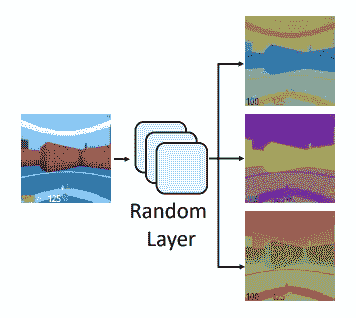

# 深度强化学习中的泛化

> 原文：<https://towardsdatascience.com/generalization-in-deep-reinforcement-learning-a14a240b155b?source=collection_archive---------9----------------------->

[source](https://s3.amazonaws.com/media.eremedia.com/wp-content/uploads/2018/08/14101953/ai1.jpg)

**监督学习中的过拟合**

机器学习是一门学科，在这门学科中，给定一些训练数据\环境，我们希望找到一个优化某些目标的模型，**，但目的是在训练期间模型从未见过的数据上表现良好**。这通常被称为**概括**，或者学习超出培训环境细节的有用知识的能力。

为了做到这一点，我们通常要求训练数据分布能够代表真实的数据分布，我们确实希望在这些数据分布上表现良好。我们将数据分为训练集和测试集，并尝试确保这两个集代表相同的分布。这在监督学习环境中很容易看到:

[source](https://scipy-lectures.org/_images/sphx_glr_plot_bias_variance_002.png)

我们可以看到，虽然训练样本和测试样本不同，但它们是由相同的底层过程生成的。如果不是这样，监督学习中泛化的标准概念就不成立，并且很难证明我们的期望，即在训练集上的学习也应该在测试集上产生良好的结果。

机器学习中的一个常见挑战是避免**过度拟合**，这是一种我们的模型“太好”适应训练数据的细节和细微差别的情况，这种方式对它在测试数据上的性能是有害的。

在上面的例子中，我们可以看到一个正弦曲线(黑色曲线)给出了一个体面的近似数据。当我们将数据分为训练集(蓝色)和测试集(红色)时，我们看到试图“太好地”拟合训练集会导致橙色曲线，该曲线显然与黑色曲线非常不同，并且在测试集上表现不佳。

**RL 中的过拟合**

在强化学习中，事情有些不同。当考虑尽可能最好地玩一个 Atari 游戏的任务时，我们似乎不清楚如何区分一些训练环境和一个测试环境。如果我训练我的代理玩“突破”并且表现良好，这不就是我的目标吗？直到最近，RL 研究中一直是这种情况，大多数研究论文报告的结果都是在相同的环境下进行的。

第一个登上头版的 RL 作品是关于使用 ALE 环境学习玩 Atari 游戏的原始 DeepMind 论文。ALE 是确定性的，2015 年一篇名为*[*的论文《街机学习环境:总代理评估平台*](https://www.ijcai.org/Proceedings/15/Papers/585.pdf)*表明，使用一种名为“Brute”的天真的轨迹优化算法，可以在一些游戏上产生最先进的结果。该算法甚至不知道在任何给定时刻的当前状态，但是它利用环境中的确定性来记忆成功的动作序列。这引起了人们的关注，一些习得的智能体可能在某种意义上“记忆”动作序列，并利用状态的细微差别来记住要采取的动作。**

**神经网络策略记忆动作意味着什么？当学习玩一些游戏时，我们可能喜欢我们的策略来学习避开敌人，跳过障碍和抓住宝藏。具体来说，我们希望我们的策略跳过一个敌人**，因为附近有一个敌人**，并且爬上梯子到平台**，因为它看到了平台**上的宝藏。在完全确定的环境中，情况可能不是这样。我们的策略可能会了解到，由于背景墙上的某些视觉特征(如独特的瓷砖纹理或绘画)，它需要在某个点跳跃，并且当它在某个遥远的平台上的某个位置看到敌人时，它会学习爬梯子。**

**这些特征与期望的特征同时出现完全是巧合，但是因为环境是决定性的，它们可能提供比我们希望我们的政策基于其决策的那些特征更强的学习信号。**

****

**[source](https://www.mobilegamer.com.br/wp-content/uploads/2012/07/Pitfall-Atari-2600.jpeg)**

**随后的论文开始探索将随机性引入游戏的方法，以阻止代理记住动作序列，而是学习更有意义的行为。其他几篇论文表明，RL 策略对于它们学习的环境和它们预期部署的环境之间非常小的不匹配可能是脆弱的，这使得在现实世界中采用 RL 非常困难。我们希望我们的策略能够像在监督学习中一样**一般化**，但是这在 RL 环境中意味着什么呢？**

****RL 中的概括****

**RL 的目标通常被描述为学习马尔可夫决策过程(MDP)的策略，该策略使一些目标函数最大化，例如期望的奖励的折扣和。MDP 由一组状态 S、一组动作 A、一个转移函数 P 和一个奖励函数 r 来表征。当我们讨论一般化时，我们可以提出不同的表述，其中我们希望我们的策略在 MDP 的分布上表现良好。使用这样的设置，我们现在可以让代理在一组 MDP 上训练，并保留一些其他 MDP 作为测试集。**

**这些 MDP 在哪些方面有所不同？我认为有三个关键的不同点:**

**1.MDP 之间的状态在某些方面有所不同，但转换函数是相同的。例如，玩不同版本的视频游戏，游戏中的颜色和纹理可能会改变，但策略的行为不应因此而改变。**

**2.即使状态看起来相似，MDP 之间的基本转换函数也是不同的。这方面的一个例子是一些机器人操纵任务，其中各种物理参数(如摩擦系数和质量)可能会发生变化，但我们希望我们的策略能够适应这些变化，或者在可能的情况下保持稳健。**

**3.MDP 在大小和表面复杂性上各不相同，但是有一些基本的原则可以推广到不同大小的问题。这方面的例子可能是某些类型的组合优化问题，如旅行推销员问题，我们希望有一个策略可以解决不同大小的实例。([我之前写过关于组合优化的 RL](/reinforcement-learning-for-combinatorial-optimization-d1402e396e91)**

**在我看来，这些代表了一般化挑战的主要来源，但是当然也有可能产生结合多个这样的来源的问题。接下来，我将集中讨论第一种类型。**

**最近，研究人员已经开始通过开发新的模拟环境来系统地探索 RL 中的泛化，这些模拟环境能够创建 MDP 的分布并拆分独特的训练和测试实例。这种环境的一个例子就是 **CoinRun** ，OpenAI 在论文*[*中介绍了强化学习*](https://arxiv.org/pdf/1812.02341.pdf)*。这种环境可以产生大量具有不同布局和视觉外观的关卡，因此可以作为通用化的良好基准。****

******

***[source](https://openai.com/content/images/2018/12/Screen-Shot-2018-12-06-at-8.13.05-AM.png)***

***在本文中，作者检查了几个变量对学习策略的泛化能力的影响:***

*****训练集的规模**:作者已经证明，增加训练 MDP 的数量可以提高泛化能力，这可以从以下方面看出:***

******

***[source](https://arxiv.org/pdf/1812.02341.pdf)***

***正如监督学习中的情况一样，我们可以看到，增加训练“数据”的数量会使策略更难在训练集上成功，但会增加其推广到看不见的实例的能力。***

*****神经网络的规模**:这篇论文的另一个与监督学习的当前实践相呼应的发现是，较大的神经网络通常比较小的神经网络获得更好的泛化性能。作者使用了 DeepMind DQN 论文(他们将其命名为“自然-CNN”)中的“标准”卷积架构，并将其与 DeepMind 的 IMPALA 论文中提出的架构进行了比较。使用更大的模型结果明显更好。***

******

***[source](https://arxiv.org/pdf/1812.02341.pdf)***

*****正则化**:监督学习中用来提高泛化能力的最常见的一套技术是 L2 正则化、剔除和批量归一化。这些技术通过添加噪声和减小权重的大小来限制神经网络的过拟合能力，并且已经成为监督学习中的标准。有趣的是，它们在深度 RL 文献中并不常见，因为它们的帮助并不总是显而易见。然而，在本文中，作者证明了这些技术确实有助于提高泛化性能。***

***总的来说，本文展示了一个很好的基准环境，并考察了监督学习的常见实践。但是我们能进一步提高泛化能力吗？***

*****随机网络泛化*****

***一篇名为[深度强化学习中泛化的简单随机化技术](https://arxiv.org/pdf/1910.05396.pdf)的非常有趣的论文提出了一种比之前显示的标准正则化改进泛化的好方法。他们建议在输入图像和神经网络策略之间添加一个卷积层，以转换输入图像。这个卷积层在每集被**随机初始化，并且它的权重被归一化，使得它不会过多地改变图像。这有点像数据扩充技术，自动生成更多种类的训练数据。*****

******

***[source](https://arxiv.org/pdf/1910.05396.pdf)***

***神经网络策略被馈入该增强图像，并输出动作的概率，这在 RL 中是常见的。拥有各种视觉上不同的输入应该有助于模型学习更通用的特征，并且不太可能过度适应环境的视觉细微差别。这通常被称为**域随机化**，经常被用来帮助在 RL 的机器人应用中弥合模拟和现实之间的差距([我在另一篇文章](/reinforcement-learning-for-real-world-robotics-148c81dbdcff)中写过)。不幸的是，众所周知，域随机化会遭受高样本复杂性和策略性能的高变化。***

***为了减轻这些影响，作者增加了另一项损失；**特征匹配**。这意味着我们给我们的模型一个原始图像和一个增强图像(使用随机层)，并通过将它们之间的均方误差添加到损失中来鼓励它具有相似的特征。***

***作为概念的证明，作者首先在一个玩具监督学习问题上尝试他们的方法；给猫和狗分类。为了使问题在泛化方面具有挑战性，他们用白狗和黑猫创建了一个训练数据集，并用黑猫和白猫创建了一个测试集。他们针对上一节提到的常见正则化方法以及图像处理文献中的一些其他数据增强技术测试了他们的方法。结果相当有趣:***

******

***[source](https://arxiv.org/pdf/1910.05396.pdf)***

***在 RL 设置中，他们在几个问题中针对这些基线测试了他们的方法，包括 CoinRun，并在泛化方面取得了优异的结果。***

***他们进行了一项有趣的实验，以检查他们的技术是否确实创造了对视觉外观差异不变的特征，方法是在几个视觉上不同的变化中取一个样本轨迹，并将其馈送给未经他们的方法训练的模型和用他们的方法训练的模型。然后，他们使用维度缩减来可视化这些轨迹在不同模型中的嵌入:***

******

***[source](https://arxiv.org/pdf/1910.05396.pdf)***

***数字代表轨迹中的阶段，颜色代表状态的视觉变化。很明显，使用新技术，状态在嵌入空间中更好地聚集在一起，这表明该模型确实已经学习了对这些令人分心的视觉变化更加不变的特征。***

***我认为这是一个非常有趣的研究方向，对于深度强化学习在工业中的广泛应用至关重要。希望看到更多这方面的研究。***