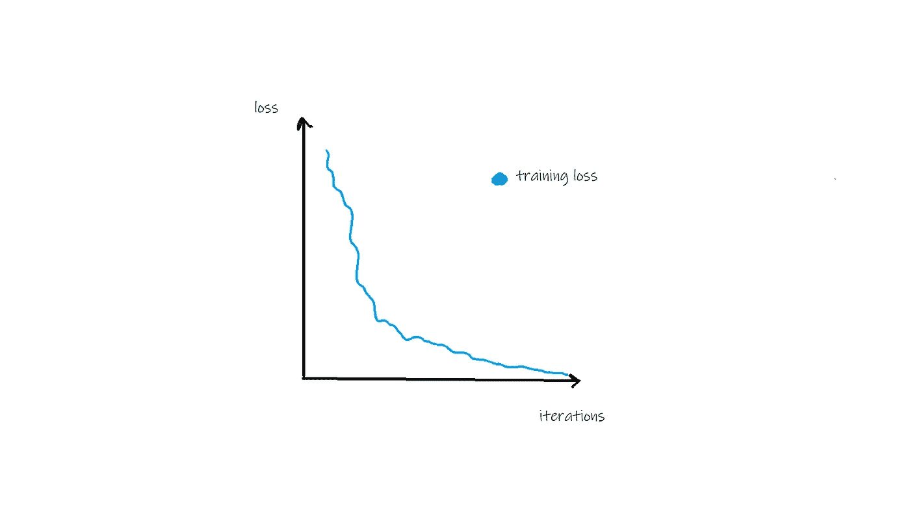
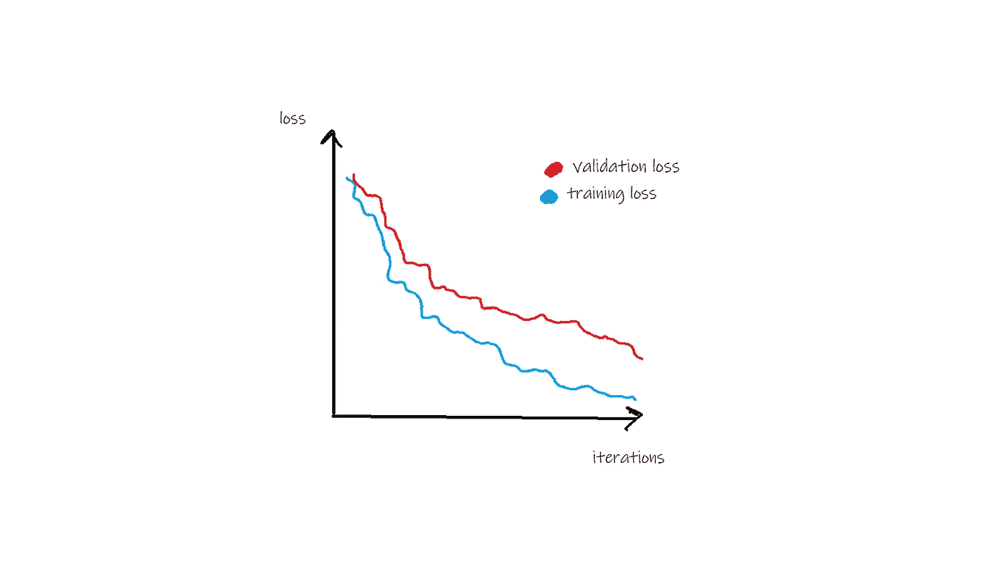
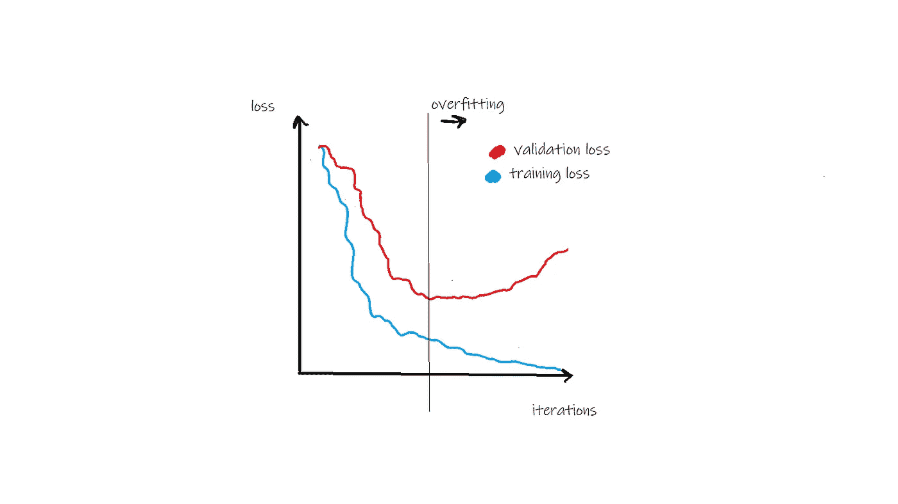
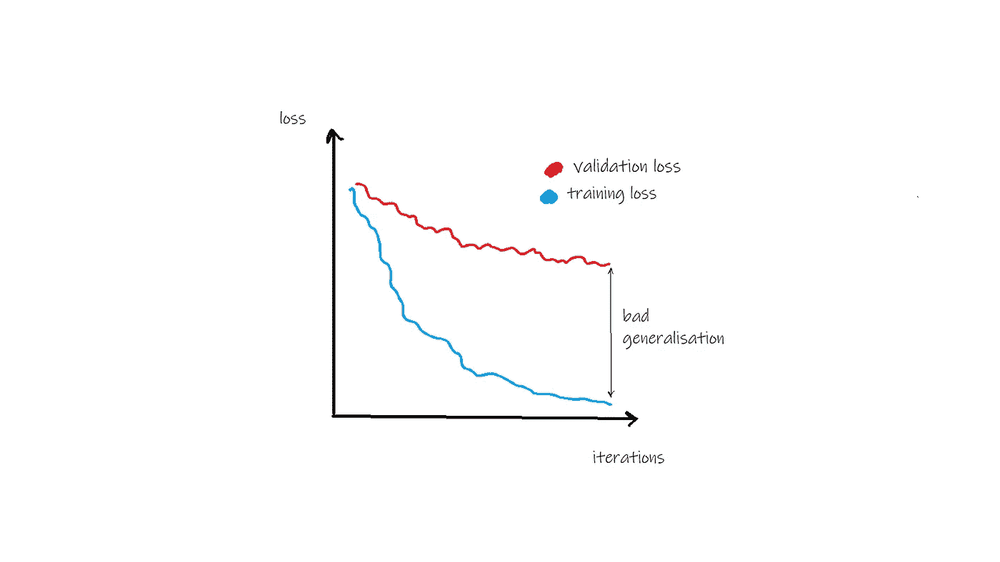
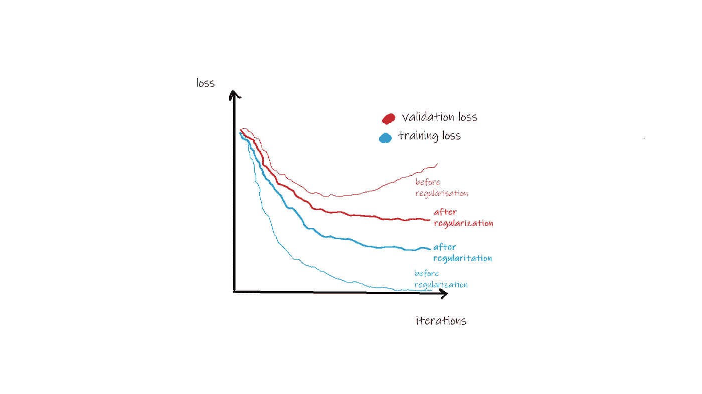

# 理解机器学习中的泛化、正则化、过拟合、偏差和方差

> 原文：<https://towardsdatascience.com/generalization-regularization-overfitting-bias-and-variance-in-machine-learning-aa942886b870?source=collection_archive---------6----------------------->

## 这五个术语如何定义机器学习中的“学习”

Photo by [Scott Webb](https://unsplash.com/@scottwebb?utm_source=medium&utm_medium=referral) on [Unsplash](https://unsplash.com?utm_source=medium&utm_medium=referral)

如何知道机器学习模型是否真的在学习有用的东西？它不像看起来那么简单，绝对值得仔细研究。首先，这篇文章是关于机器学习的，例如，在经典书籍【T2 统计学习元素】中有解释。这些模型通常通过计算损失函数的导数并逐步向正确的方向移动其参数来学习，或一些类似的统计学习的想法。在这种情况下，“学习”实际上与人类的学习毫无关系。即使一些算法是受人脑的启发，它们的工作方式也非常不同。做出这一区分非常重要，因为“学习”一词可能会错误地暗示这种模型真的可以像人类一样“学习理解”它正在处理的数据——但事实并非如此。它唯一可以学习的是统计模式，不多也不少。

> 一般化

机器学习的最终目标是在训练集中找到统计模式，这些模式可以推广到训练集之外的数据。以下面这个简单的 NLP 问题为例:假设你想要预测一个序列中的一个单词，给定它前面的单词。

例如，序列“猫 __”之后可能是*睡觉*、*享受、*或*想要*。你的训练序列大概包括很多这样的名动组合，其他的可能是“她*有*”、“一个专家*说*”、“它*好像*”等等。注意，所有这些动词都有第三人称- *s* ，因为它们指的是序列的主语。一个好的语言模型确实可以获得这种模式，甚至可以对未经训练的序列做出正确的预测。例如，给定输入“飞机 __ ”,我们会期望模型预测*离开*的概率比*离开*的概率高，并且*离开*的概率比*离开*的概率高。在这种情况下，模型已经学习了一种更普遍适用的模式。竖起大拇指。然而这个模型不理解单词的意思，更不用说一般的语言了。例如，如果我们提供“theee plaaaane __”作为模型的输入，它将完全出错。

## 到底是学习吗？

规划学习过程通常是个好主意。首先，看一下培训损失。它应该接近零，或者至少是一个合理的低值(见下图)。如果不是，您的模型可能不是很合适，不够灵活，或者——这一点经常被忘记——输出不是输入数据的函数，因此没有要学习的关系。例如，想想一个句子是否真的是单词的函数。它可能不是无条件成立的，但在某些方面仍然是有用的。

Training loss should decrease with the number of training iterations (but not necessarily to 0)

## **什么是泛化** n？

如果训练损失确实如预期的那样减少了，这并不自动意味着无论模型学到了什么都是有用的。这就是验证损失发挥作用的地方。如果验证损失随着训练损失一起减少，情况看起来会好一些。在这种情况下，学习到的模式似乎会推广到看不见的验证数据。但是，验证损失通常会高于训练损失，因为并非所有模式都会泛化，如下图所示。

If validation loss decreases as well, the learned patterns seem to generalize.

> 偏见

偏差被定义为预测值和真实值之间的均方差。这是衡量模型与数据吻合程度的标准。零偏差意味着模型完美地捕捉了真实的数据生成过程。您的培训和验证损失都将为零。然而，这是不现实的，因为数据在现实中几乎总是有噪音的，所以一些偏差是不可避免的——称为*不可约误差*。

无论如何，如果损失没有像预期的那样减少，这可能表明该模型不太适合数据。例如，如果您试图用线性模型来拟合指数关系，就会出现这种情况——它根本无法充分捕捉这种关系。在这种情况下，尝试不同的、更灵活的模型。

你也可以称之为*不合身*，尽管内涵略有不同。与偏差不同，拟合不足意味着模型仍有学习能力，因此您只需为更多迭代进行训练或收集更多数据。

重要的是，偏见也可能隐藏在训练数据中——这很容易被忽略。在那种情况下，你的训练损失可能会像往常一样减少。只有对真实数据的测试才能揭示这种偏差。

> 差异

如果一个模型的预测对输入的微小变化很敏感，则称该模型具有高方差。换句话说，你可以把它想象成数据点之间的曲面不是平滑的，而是非常起伏的。这通常不是你想要的。高方差通常意味着*过度拟合*，因为模型似乎捕捉到了随机噪声或异常值。

像高偏差和拟合不足一样，高方差和过度拟合也是相关的，但在意义上仍然不完全等同。见下文。

> 过度拟合

在模型训练期间的某个时间点，验证损失通常趋于平稳(有时甚至开始再次增加)，而训练损失继续减少。这是过度拟合的信号。换句话说，模型仍在学习模式，但它们不会泛化到训练集之外(见下图)。过度拟合对于具有大量参数的模型尤其典型，例如深度神经网络。

Overfitting can happen after a certain number of training iterations.

训练和验证损失之间的巨大差距暗示模型不能很好地概括，您可能想要尝试缩小差距(下图)。解决过度拟合的最简单方法是提前停止，也就是说，一旦验证损失开始趋于平稳，就停止训练循环。或者，正规化可能会有所帮助(见下文)。另一方面，如果你过早停止，可能会出现不适应。

Generalization is low if there is large gap between training and validation loss.

> 正规化

正则化是一种避免高方差和过拟合以及提高泛化能力的方法。不涉及细节，正则化旨在保持系数接近于零。直观地说，模型所代表的函数更简单，不太不稳定。因此预测更加平滑，过度拟合的可能性更小(下图)。正则化可以简单到缩小或惩罚大系数——通常称为*权重衰减*。L1 和 L2 正则化是两种广泛使用的方法。但是你也可能遇到不同的形式，比如神经网络中的辍学正则化。

Regularization can help avoid high variance and overfitting.

综上所述，学习固然很好，但泛化才是我们真正想要的。就此而言，一个好的模型应该同时具有低偏差和低方差。过度拟合和欠拟合都应该避免。正规化可能是解决所有这些问题的一部分。

如果真实的情节与这里呈现的非常不同，不要感到惊讶。他们只是应该将概念形象化，并帮助理解它们。真实的损失曲线有时会以某种方式偏离。然而，知道在训练机器学习模型时要注意什么是很好的。