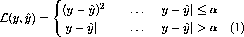
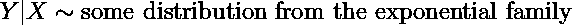
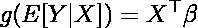
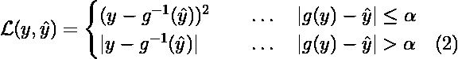
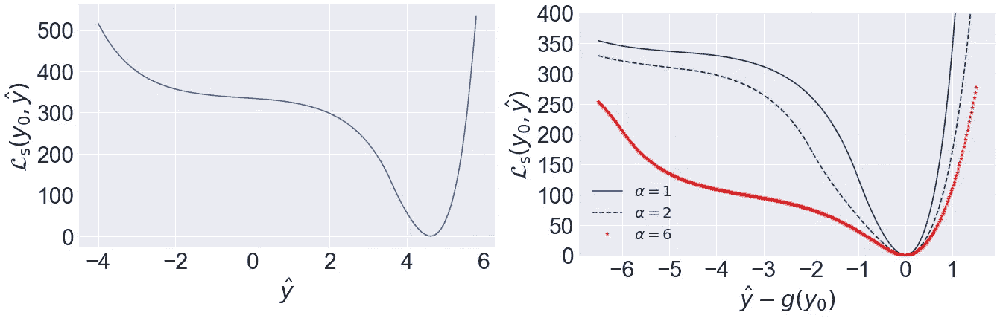
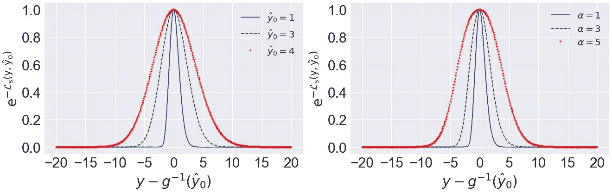
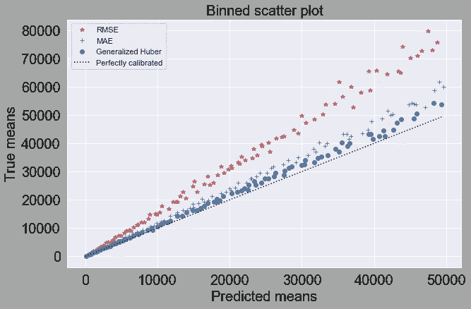
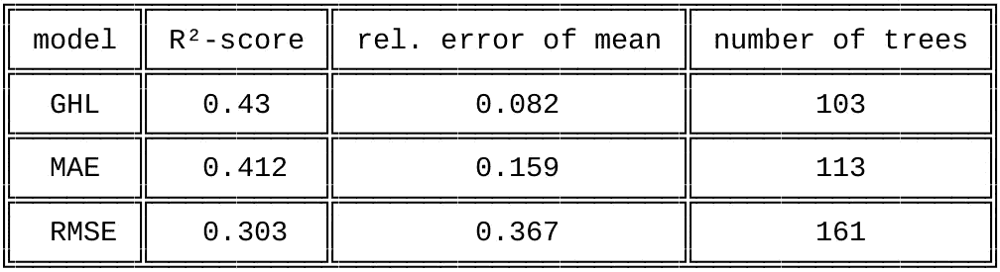
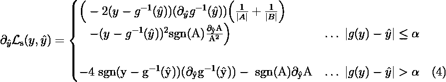
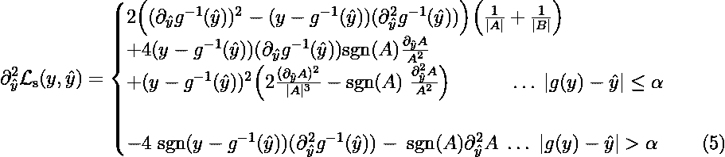

# 广义 Huber 回归

> 原文：<https://towardsdatascience.com/generalized-huber-regression-505afaff24c?source=collection_archive---------13----------------------->

在这篇文章中，我们提出了一个广义的 Huber 损失函数，它可以与广义线性模型(GLM)结合，非常适合异方差回归问题。我们将讨论如何使用梯度提升树优化损失函数，并在人工数据集上将结果与经典损失函数进行比较。

让我们首先简要回顾一下休伯损失函数和广义线性模型(GLM)的基础知识。

## Huber 损失和广义线性模型

Huber 损失[ [Huber](https://projecteuclid.org/euclid.aoms/1177703732) ]是回归问题的稳健损失函数，定义为

其中 *y* 是目标变量， *ŷ* 是相应的预测值， *α* ∈ ℝ⁺是超参数。人们很容易将这种损失视为潜在重尾误差分布的对数似然函数。事实上，对于小于 *α* 的绝对误差，相应的分布类似于正态分布，在该区域之外，它与更重尾的拉普拉斯分布一致。这正是这种损失对异常值稳健的原因。

这就是我们现在需要知道的关于 Huber 损失的全部情况。因此，让我们直接跳到 GLMs，通过首先记住线性回归的假设，可以最好地理解 GLMs。在线性回归中，人们通常假设因变量 *Y* 和某个特征向量 *X* 之间的线性关系中的误差项正态分布，均值为零，方差为常数σ，即*y*|*x*~*x^*⊤β+ε，ε ∈ 𝓝(0,σ)和β是一组变分参数。人们感兴趣的是找到最小化二次成本函数(对应于ε分布的对数似然)的最佳估计 *β^hat* 。对于给定的 *X* 的估计 *ŷ* 就是简单的*ŷ*(*x*)= e[*y*|*x*]=*x^*⊤*β*^*帽子*。请注意(在最大似然解释中), Huber 回归用一个更重尾的分布代替了正态分布，但仍然假设方差不变。

另一方面，GLM 方法以下列方式放松了线性回归的假设:

1.  随机分量的非正态性:

2.由链接功能 *g* 引入的非线性:

指数族包含各种分布，尤其是方差是平均值的函数的分布，如泊松或伽马分布。这一特性特别适用于异方差问题，在这种情况下，误差项的恒定方差假设不再成立，例如，目标变量的范围跨越几个数量级的情况就很常见。链接功能通过贡献非线性效果额外地增强了模型的复杂性。还要注意的是，链接函数永远不会应用于 y。这与将模型拟合到转换后的目标变量的常见做法形成对比，后者通常会导致在预测被反向转换后低估平均值。这可以从詹森不等式中看出，该不等式陈述对于任何凹函数 *g* ，E[*g*(*Y*)|*X*≤*g*(E[*Y*|*X*),对于对数或 Box-Cox 函数也是如此。还可以导出 GLM 似然函数的封闭形式的表达式，这导致了一大类损失函数，例如参见 P. Rigollet 对 GLMs 的精彩介绍[ [MIT](https://ocw.mit.edu/courses/mathematics/18-650-statistics-for-applications-fall-2016/lecture-videos/lecture-21-video/) 。但是，在指数族内似乎不存在负支持度且方差非常数的连续分布。

因此，是否有可能将连接函数的概念与 Huber 损失结合起来，同时仍然具有非常数方差？下一节试图回答这个问题。

## 广义 Huber 损失函数

对于任何可逆函数 *g* : ℝ ↦ ℝ，我们将广义 Huber 损失(GHL)函数定义为

用 *α* ∈ ℝ⁺， *y* 目标变量和 *ŷ* 一些预测模型的连续输出。这里最重要的观察是，大小写的区分是在由 *g* (y)定义的“链接标度”上进行的，而范围是在原始标度上进行的。该损失函数不能转化为单变量问题[如等式(1)的情况]。然而，在固定的 *ŷ_* 0 处，人们可能会将𝓛( *y* ， *ŷ_* 0)视为误差分布的对数似然函数𝓟( *y* ，*ŷ_*0)~ exp(-𝓛(*y*， *ŷ_* 0)。下面我们将进一步说明𝓟( *y* 、 *ŷ_* 0)的方差是 *ŷ_* 0 的(单调)增函数。

现在让我们讨论如果我们在等式(2)的右边取 *g* ( *y* )而不是 *g* ⁻ ( *ŷ* )会发生什么。这将简单地对应于首先转换目标变量，从而估计 E[*g*(*Y*)|*X*]。然而，由于 E[*g*(*Y*)|*X*≤*g*(E[*Y*|*X*)对于任何凹函数 *g* ( *y* )，我们最终会低估均值。

第二种选择是在等式(2)的右边取 *g* ⁻ ( *ŷ* )，从而在原始标度上应用案例区分，这也不会有多大帮助。请记住，我们希望解决的问题是 *y* 的范围可以在几个数量级内变化。在这种情况下，我们通常无法找到合适的 *α* 值来保证对于 *y* 的所有范围，两种情况都适用。换句话说，只有通过等式(2)中的选择，我们才能得到非常数方差的分布。

然而，等式(2)中的损失函数在线|*g*(*y*)-*ŷ*| =*α*处具有跳跃不连续性，这可以用一种或另一种方法消除。等式(2)的以下平滑版本在实践中证明工作良好

其中∓= SGN(*g*(*y*)-*ŷ*)。
如图[1]所示，对于固定的 *y* _0，函数𝓛_s( *y* _0， *ŷ* )没有局部最小值，但也不是凸的。此外，𝓛_s( *y* _0， *ŷ* )展示了一个小斜率区域，这可能导致基于梯度的优化例程中的收敛问题。然而，这些问题通常可以通过选择一个好的起始向量来克服。我们将在下面用一个例子进一步讨论这个问题。

Figure 1: Left: Smoothed generalized Huber function with y_0 = 100 and *α* =1\. Right: Smoothed generalized Huber function for different values of *α* at y_0 = 100\. Both with link function *g*(*x*) = sgn(*x*) log(1+|*x*|).

在图[2]中，我们说明了前面提到的𝓟( *y* 、 *ŷ_* 0)的比例随着 *ŷ_* 0 的增加而增加。正是这一特点使得 GHL 函数稳健并适用于异方差问题。注意，𝓟( *y* 、 *ŷ_* 0)的比例也随着 *α* 的增加而增加，如图【2】右侧所示。*注意，我们没有将* 𝓟( *y* 、 *ŷ_* 0)规格化。相应的归一化因子将取决于 *ŷ_* 0，研究是否可以导出封闭形式的表达式将是有趣的。

Figure 2: Left: (Unnormalized) Error distribution for different values of *ŷ_*0 at *α* = 1\. Right: (Unnormalized) Error distribution at *ŷ_*0 = 1 for different values of *α*. Both with link function *g*(*x*) = sgn(*x*) log(1+|*x*|).

为了用梯度法优化𝓛_s( *y* ， *ŷ* ，我们需要这个函数的梯度和海森。然而，这些表述相当冗长，因此可以在下文的附录中找到。相反，现在让我们来看最后一个例子。

## 例子

让我们考虑一个简单的一维问题，具有非常数方差的偏斜正态误差分布，即*y*=*x*+ε_ skew normal。我们使用了具有偏斜度参数 *a* =100， *loc* = 0 和 *scale* = 1 + | *x* |的 SciPy skewnorm 对象，并从区间[-500，500]创建了一个线性间隔的网格，网格中有 *N* = 10⁶个示例。此外，我们训练了三个 [LightGBM](https://papers.nips.cc/paper/6907-lightgbm-a-highly-efficient-gradient-boosting-decision-tree.pdf) 模型。一个在 *g* ( *y* )上的均方根误差(RMSE)模型，一个在 g( *y* )上的平均绝对误差(MAE)模型，还有一个 GHL 模型，都带有链接函数*g*(*x*)= SGN(*x*log(1+|*x*|)。通过使用三重交叉验证方法，基于 R -score 度量，通过早期停止来训练模型。GHL 函数中的自由参数也被交叉验证并被选择为 *α* = 0.67。LightGBM 中的所有采样参数都设置为 1，num_leaves = 31，而所有其他参数都保留为默认值。

一般来说，为了收敛到 GHL 损失函数的最小值，需要一个好的起始向量。这里我们首先用经典的 Huber 目标函数(Huber 参数 *α* = 2)在 *g* ( *y* )上训练了一个只有 20 棵树的小型 LightGBM 模型。该模型的输出然后被用作 GHL 模型的起始向量(init_score)。

图[3]显示了所有三个模型的测试集(0.7/0.3 分流比)预测的散点图，其中预测最接近来自 GHL 模型的趋势线。下表还总结了一些指标，并举例说明了 GHL 模型在测试集上取得了明显更好的结果，同时比其他两个模型需要更少的树。

这个例子的 Jupyter 笔记本以及线性估计器包可以在这里找到[【GIT】](https://github.com/damiandraxler/)。线性估计器也可以与 pip 一起安装:

> *pip 安装 ghlestimator*

Comparison of RMSE, MAE and (smoothed) Generalized Huber. Predictions are partitioned into 150 equally sized bins and within each bin the mean is plotted against the true mean of that partition. Black dots show a trend line of 45 degrees.

最后，我要感谢我的同事塞巴斯蒂安·霍弗就这个话题进行了富有成效的讨论。

**附录**

𝓛_s( *y* 、 *ŷ* 的梯度由下式给出

黑森被发现

这里我们定义了*a*=(*g*⁻(*ŷ**α*)-*g*⁻(*ŷ*))和*b*=(y-*g*⁻(*g*(*y)*∓*α*)用∓ = sgn()