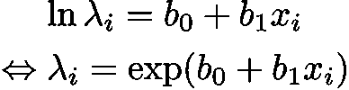

# 广义线性模型

> 原文：<https://towardsdatascience.com/generalized-linear-models-9cbf848bb8ab?source=collection_archive---------0----------------------->

## 高级统计建模简介

在本文中，我想解释广义线性模型(GLM)，这是学习更高级的统计建模的一个很好的起点。学习 GLM 让你了解我们如何使用概率分布作为建模的基础。我假设你熟悉线性回归和正态分布。


Image by Semevent from Pixabay

# 线性回归再探

线性回归是通过解释变量 *X* 的线性组合来预测连续变量 *y* 的值。

在单变量情况下，线性回归可以表示如下:


Linear regression

这里， *i* 表示每个样本的指数。请注意，该模型假设噪声项呈正态分布。该模型可以说明如下:


Linear regression illustrated

通过三个正态 PDF(概率密度函数)图，我试图说明数据遵循具有固定方差的正态分布。

# 泊松回归

所以你只需要知道线性回归？肯定不是。如果你想在实际问题中应用统计建模，你必须知道更多。

例如，假设您需要用传感器值( *x* )作为解释变量来预测缺陷产品的数量( *Y* )。散点图看起来像这样。


Do you use linear regression for this data?

如果你试图对这类数据应用线性回归，会有几个问题。

1.  X 和 Y 之间的关系**看起来不是线性的**。更有可能是指数级的。
2.  **相对于 X，Y 的方差看起来不恒定**。这里，当 X 增加时，Y 的方差似乎也增加。
3.  因为 Y 代表产品的数量，所以它必须是正整数。换句话说，Y 是一个**离散变量**。然而，用于线性回归的正态分布假定变量是连续的。这也意味着通过线性回归的预测可能是负的。它不适合这种计数数据。

在这里，你能想到的更合适的模型是**泊松回归**模型。泊松回归是**广义线性模型(GLM)** 的一个例子。

广义线性模型有三个组成部分。

1.  **线性预测器**
2.  **链接功能**
3.  **概率分布**

在泊松回归的情况下，公式是这样的。


Poisson regression

**线性预测器**只是参数( *b* )和解释变量( *x* )的线性组合。

**链接功能**字面上“链接”线性预测值和概率分布参数。在泊松回归的情况下，典型的连接函数是对数连接函数。这是因为泊松回归的参数必须是正的(稍后解释)。

最后一个部分是**概率分布**，它产生观察变量 *y* 。当我们在这里使用泊松分布时，该模型被称为泊松回归。

泊松分布用于模拟计数数据。它只有一个代表分布的均值和标准差的参数。这意味着平均值越大，标准差越大。见下文。


Poisson distribution with mean=1, 5, 10

现在，让我们将泊松回归应用于我们的数据。结果应该是这样的。


Poisson regression illustrated

品红色曲线是通过泊松回归的预测。我添加了泊松分布的概率质量函数的条形图，以明确与线性回归的区别。

预测曲线是指数曲线，因为对数连接函数的倒数是指数函数。由此也可以清楚地看出，由线性预测器计算的泊松回归参数保证为正。



Inverse of log link function

如果使用 Python， [statsmodels](https://www.statsmodels.org/stable/glm.html) 库可以用于 GLM。泊松回归的代码非常简单。

```
# Poisson regression code
import statsmodels.api as sm
exog, endog = sm.add_constant(x), y
mod = sm.GLM(endog, exog,
             family=sm.families.Poisson(link=sm.families.links.log))
res = mod.fit()
```

endog(内生)和 exog(外生)就是你在 statsmodels 中怎么称呼 *y* 和 *X* 。请注意，您需要将常数项添加到 *X* 中。没有这个，你的线性预测器就只是 *b_1*x_i* 。

实际上，您不需要在这里提供 link 参数，因为 log link 是 Poisson 系列的缺省值。

我用来创建所有图形的完整代码在我的 [Github 库](https://github.com/kidaufo/StatisticalModeling/blob/master/GLM.ipynb)中。

# 其他典型的 GLM

线性回归也是 GLM 的一个例子。它只是使用**恒等连接函数**(线性预测器和概率分布的参数是相同的)和**正态分布**作为概率分布。


Linear regression

如果用 **logit 函数**作为连接函数，用**二项式/伯努利分布**作为概率分布，那么这个模型就叫做 **logistic 回归**。


logistic regression

如果用 *z* 表示线性预测器，上面的等式等价于下面的。


Logistic function

第二个方程的右边称为逻辑函数。因此，这个模型被称为逻辑回归。

由于逻辑函数对任意输入返回值介于 0 和 1 之间，因此它是二项式分布的合适链接函数。

逻辑回归主要用于二元分类问题。下面是一个用逻辑回归拟合一些数据的例子。


Logistic regression illustrated

# 自定义 GLM

到目前为止，我解释的模型使用了概率分布和链接函数的典型组合。换句话说，上面所有的模型都使用了**规范链接函数。**

这是概率分布及其规范链接函数的列表。

*   正态分布:身份函数
*   泊松分布:对数函数
*   二项式分布:logit 函数

但是，您不一定要使用规范链接函数。更确切地说，统计建模的优势在于，您可以创建任何类型的模型来很好地适应您的数据。

例如，让我们考虑以下数据。


这看起来类似于我为泊松回归准备的数据。然而，如果你仔细观察数据，似乎 *y* 相对于 *X* 的方差是恒定的。况且 *y* 是连续的，不是离散的。

因此，这里使用正态分布是合适的。由于 *X* 和 *y* 之间的关系看起来是指数关系，你最好选择对数链接函数。


GLM with non-canonical link function

使用 statsmodels，您可以像这样编码。

```
mod = sm.GLM(endog, exog,
             family=sm.families.Gaussian(sm.families.links.log))
res = mod.fit()
```

请注意，您需要在这里指定链接函数，因为高斯分布的默认链接是身份链接函数。模型的预测结果是这样的。


statsmodels 中实现了各种链接功能。但是，如果您需要使用更复杂的链接函数，您必须自己编写模型。

为此，Stan、PyMC3 和 TensorFlow Probability 等概率编程框架将是一个不错的选择。这可能是我未来工作的主题。