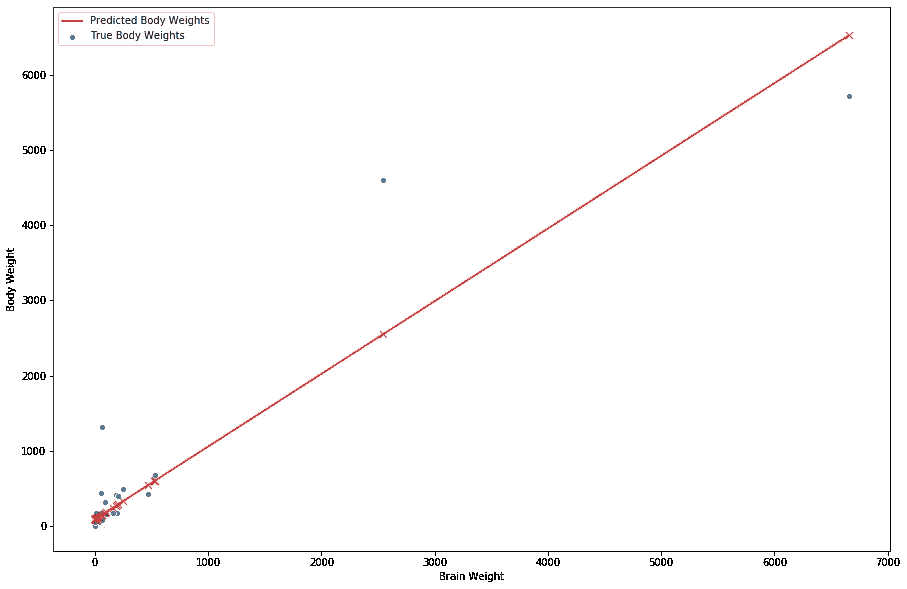
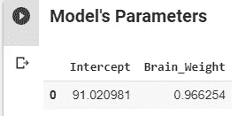
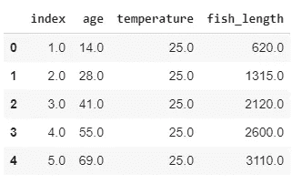
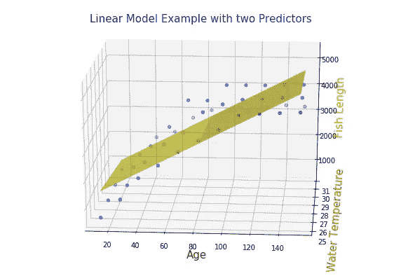
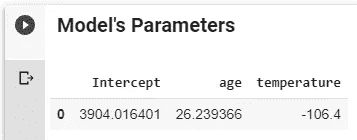
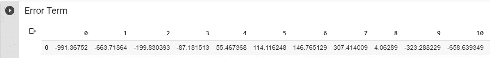
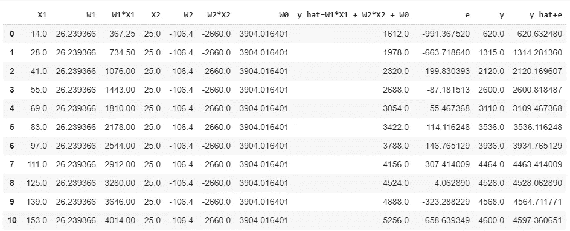
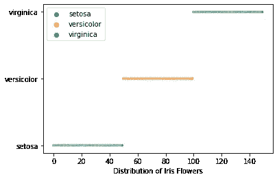
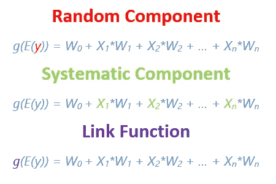
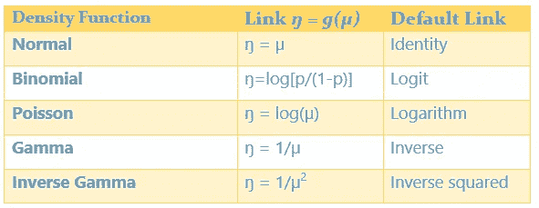

# 广义线性模型—简介

> 原文：<https://towardsdatascience.com/generalized-linear-models-introduction-1b4af2a11759?source=collection_archive---------23----------------------->

## 本文探讨了线性模型的背景，它们的局限性和广义线性模型背后的思想，以及是什么使它们广义化。


Photo by [Markus Spiske](https://unsplash.com/@markusspiske?utm_source=medium&utm_medium=referral) on [Unsplash](https://unsplash.com?utm_source=medium&utm_medium=referral)

> **什么是机器学习中的线性模型？**

为了举例说明这个主题，我采用了这个数据集的[，它有一个预测器/特征/自变量/解释变量，即`Brain Weight`和一个响应/目标/因变量，即`Body Weight`。](https://people.sc.fsu.edu/~jburkardt/datasets/regression/x01.txt)

```
Index Brain Weight Body Weight
 1          3.385     44.500
 2          0.480     15.500
 3          1.350      8.100
 4        465.000    423.000
 5         36.330    119.500
 6         27.660    115.000
...
```

响应变量`Body Wight` 具有连续分布。我们可以将该分布建模为预测值的线性组合— `Brain Weight,`(在该数据集中仅有一个)和截距项。这里，模型本质上是试图学习与每个特征相关联的权重/参数。在数学上，我们必须建立以下线性方程的模型—

```
y = Body Weight [Response]
X = Brain Weight [Predictor]
We are interested to model the following equation ***y_hat***
 **y_hat = W1*X1 + W0
     y = y_hat + e**
```

上式中，`**W1**`**`**W0**`**统称为模型参数。在线性模型的上下文中，`**W1**`和`**W0**` 分别称为系数和截距。`**W0**` 代表所有`**X1**`预测值为零的情况，`**W0**`是我们的模型将预测的值。****

****`**e**`称为误差项。这是不能从预测者的知识中预测的误差。这是观察到的结果(即`**y**`)与我们的模型预测的结果(即`**W1*X1 + W0**`)之间的差异。****

****回归函数告诉我们，对于`X1`值的单位变化(增加或减少),响应变量`y`平均变化*多少。*****

****下面的图是符合数据的超平面(在这种情况下是直线)。****

********

******Figure 1: Linear Regression Example******

********

******Figure 2: Learned Parameter of the Linear Model******

****我们将再举一个例子来更具体地说明线性模型的思想。
在这个例子中，我们有[这个数据集](https://people.sc.fsu.edu/~jburkardt/datasets/regression/x06.txt)，它包含两个预测值和一个连续响应变量。在这种情况下，我们有以下情况—****

********

******Figure 3: Fish Length Data******

```
**y = Fish Length [Response]
X1 = Age [Predictor]
X2 = Water Temperature[Predictor]We are interested to model the following equation ***y_hat***
 **y_hat = W1*X1 + W2*X2 + W0**     **y = y_hat + e****
```

****下面的超平面(在这种情况下是平面)是使用模型学习的参数，即`W1, W2, W0`绘制的。虽然它不是数据的最佳拟合，但我们的重点是线性模型的基本概念，而不是模型的预测能力。****

********

******Figure 5: Linear Model with two Predictors******

********

******Figure 5: Learned Parameter of the Linear Model******

****我们可以通过将学习到的参数放入方程`y_hat = W1*X1 + W2*X2 + W0`来比较和交叉检查方程`y = y_hat + e`。为了简洁起见，我取了数据集的前十行。****

********

******Figure 6: Error which cannot be predicted by the model******

********

******Figure 7: Comparison between y and y_hat******

****我们可以清楚地看到，`y`非常接近等于`y_hat`和误差项`e`的总和。****

****根据上述讨论，我们可以得出结论，线性模型意味着随机变量的分布被建模为特征/预测值的*线性*组合。****

> ******线性模型中的‘线性’是什么？******

****当我们说“特征的线性组合”时，意思是模型参数`Wi`是线性的，阶数为 1，而不是特征。我们估计线性参数，而不是在线性模型中估计类似于`W1², W1*W2`的东西。此外，特性可以有不同种类的术语，如— `X1, X1*X2, X2²`等。****

****现在我们可以为线性模型写一个通用方程如下—****

```
**y = W0 + W1*X1 + W2*X2 + W3*X3 + ... + Wn*Xn + e**
```

****但是，当我们进行线性回归时，我们做出某些假设，例如:1。响应变量的**分布**为正态分布，即`*Y_i ~ N(*` *μ_i，σ* `*)*` 2。**预测因子/解释变量`Xi`的功能**是`W0 + Wi*Xi`3。**解释变量和`Yi` 分布之间的连接/联系**是响应变量的平均值。
每个数据点的预测值将以方差 *σ分布在平均值周围。*****

```
*****μ_i = E(Y_i) = W0 + Wi*Xi*****
```

****线性模型的局限性-
1。常态假设并不总是成立的，我们可能有自己的分类特征，如性别、职业类型等。或者我们可能有非正态分布的时间序列数据。
2。线性模型无法拟合具有分类响应变量的数据，如鸢尾花数据集、MNIST 数据集等。****

********

******Figure 8: Distribution of Categorical Target Variable******

****3.即使响应变量是连续的随机变量，但是其取值在诸如 0 和 1 之间的概率的范围内。
传统的线性模型将无法预测 0 到 1 之间的值，因为我们的特征可以取范围(-∞，∞)内的任何值。****

****现在我们已经知道，线性模型并不总是正确的选择，因为它与连续响应数据不同，可能会提供相当奇怪的结果。现在我们要做的是推广这个模型来克服这样的问题。这就产生了 GLMs，它提供了一个统一的框架，用于对源自概率分布指数族(如正态分布、二项式分布、泊松分布等)的数据进行建模。****

****GLM 有三个组成部分。****

1.  ******随机分量—** 定义响应变量 y 及其概率分布。一个重要的假设是从`y1` 到`yn`的响应是相互独立的。****
2.  ******系统组件—** 定义我们希望在模型中包含哪些解释变量。它还允许解释变量之间的相互作用，例如— `X1*X2`、`X1² etc.`这是我们建模的部分。它也被称为协变量的线性预测器，即`X1, X2, … , Xn`和系数的线性预测器，即`W1, W2, … , Wn.`****
3.  ******链接组件—** 连接随机组件和系统组件。响应变量期望值的函数，即`E(Y)`，使参数呈线性，并允许`E(Y)`与解释变量呈非线性关系。**链接函数概括了线性模型。******

********

******Figure 9: Components of GLM******

****注意，连接函数的选择与随机分量的选择是分开的。****

****现在我们可以说，简单线性回归模型是 GLM 的一个特例，其中随机分量具有正态分布，并且取范围(-∞，∞)内的连续值。系统组件是`X.`链接功能是标识功能。****

```
 ***Y ~ N(**μ, σ²**)
                        E(Y) = μ
                        g(E(Y)) = μ = W1*X1 + e***
```

> ******我们在 GLMs 中概括了什么？******

1.  ****我们推广了响应变量的**分布**，即`y`，可以取。****
2.  ****我们在解释变量`Xi`和响应变量`Yi`之间推广了**链接函数**。****

****下表包含了常用的链接功能。****

********

******Figure 10: Types of Link Functions******

****让我们总结一下到目前为止我们所讨论的内容——T4。线性模型适合于模拟连续响应变量，但它们有一定的局限性。
2。广义线性模型统一了许多不同类型的属于指数密度族的响应变量分布。
3。链接函数是 GLM 中实现参数线性的关键组件，并且是概括线性模型的组件。****

******参考文献:**
【1】b . Caffo， [03 01 第 1 部分共 1 部分广义线性模型](https://www.youtube.com/watch?v=xEwM1nzQckY)(2015)
【2】r . Cooksey，[一般线性模型的逻辑(GLM)](https://www.youtube.com/watch?v=HXTeJfIQXUc)(2013)
【3】精算教育， [CT6 广义线性模型导论(GLMs)](https://www.youtube.com/watch?v=vpKpFMUMaVw) (2012)****