# 使用 DCGAN 生成动漫风格人脸并探索其潜在特征表示

> 原文：<https://towardsdatascience.com/generate-anime-style-face-using-dcgan-and-explore-its-latent-feature-representation-ae0e905f3974?source=collection_archive---------1----------------------->

## 逐步试验 DCGAN 并可视化其结果

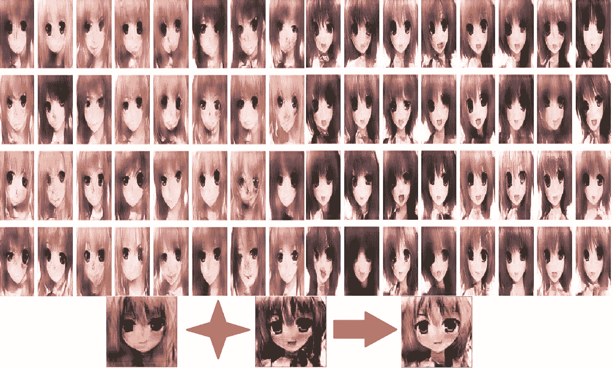

各位，好久不见了！今天，我想写一下我学习和实验另一种深度学习技术的结果，这种技术是生成对抗网络(GAN)。最近研究了解了一下。我想如果把我的实验分享给每个人会很好。


Photo by [Hitesh Choudhary](https://unsplash.com/@hiteshchoudhary?utm_source=medium&utm_medium=referral) on [Unsplash](https://unsplash.com?utm_source=medium&utm_medium=referral)

“干”主要是指产生某种东西。在这篇文章中，我想分享关于生成动漫人物面部的实验。不仅仅是生成，我还实验了图像可以通过潜在变量(一个用于生成人脸的向量)的线性代数运算来操作。我还看到生成的人脸遵循统计分布，这真的很棒。

这篇文章将集中在教程如何做 GAN 的每个步骤解释(与源代码)。它将针对任何对人工智能感兴趣的人，特别是想练习使用深度学习的人。它也针对每个人谁想学习如何做甘第一次。我会尽可能简单易懂地写这篇文章。我希望读者通过阅读这篇文章，了解甘将军是如何工作的。

如果你想在阅读这篇文章时有更好的理解，我建议你至少了解神经网络和卷积神经网络(CNN)。

如果您想了解完整的源代码，本文末尾有一个 GitHub 链接。现在，我将给出存储库中的 python 笔记本和协作链接。

**图片 0** 是生成的动漫人物脸之一，我们将使用模型形成的图片来创建。左起第一张和第二张图由 GAN 生成。第三是第一面和第二面的相加(你可以称之为第一面和第二面的融合)。

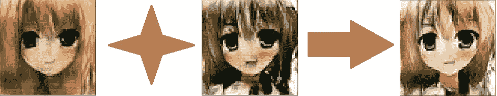

Images 0 : Example of generated faces and the fusion of their face. G + D = GAN

# 概述

1.  技术
2.  介绍
3.  甘简介
4.  履行
5.  结果
6.  吸取的教训
7.  结论
8.  编后记
9.  贮藏室ˌ仓库
10.  来源

# 技术和数据

1.  Python 3.7
2.  合作实验室:免费的 Jupyter 笔记本环境，无需设置，完全在云中运行。有 GPU 特斯拉 K80 甚至 TPU！遗憾的是，在撰写本文时，Tensorflow v2.0 alpha 仍不支持 TPU。遗憾的是，DCGAN 不能通过 TPU 训练。
3.  Keras:用于深度学习的 Python 库。
4.  数据取自[这里](https://github.com/Mckinsey666/Anime-Face-Dataset)

# 介绍

深度学习领域的研究热点之一是生成对抗网络。由 [Ian Goodfellow 等人](https://papers.nips.cc/paper/5423-generative-adversarial-nets.pdf)介绍。，它可以在无人监督的情况下从零开始生成东西。在计算机视觉领域。有许多研究人员在研究和改进它。例如，NVIDIA 通过使用 GAN 创建了[逼真的人脸生成器。音乐领域也有一些关于](https://medium.com/syncedreview/gan-2-0-nvidias-hyperrealistic-face-generator-e3439d33ebaf)[使用甘](https://magenta.tensorflow.org/research)的研究。我之前的一篇文章展示了如何使用 GAN 来生成音乐。

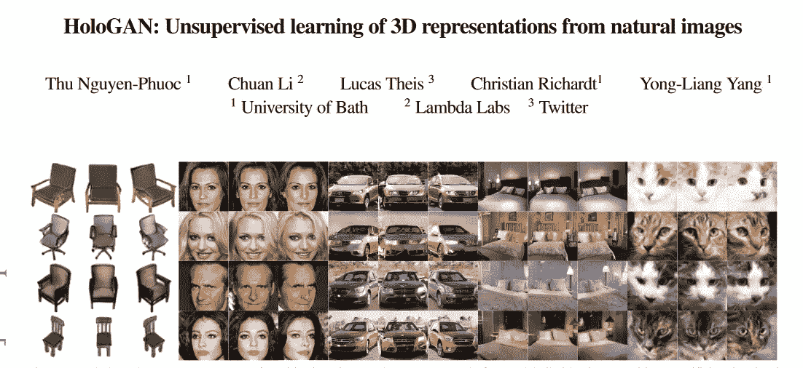

Image 1 : HoloGAN paper

研究人员开发了许多不同类型的氮化镓。最新的一个(在我写这篇文章的时候)是可以从自然图像生成 3D 表示的 [HoloGAN](https://arxiv.org/pdf/1904.01326v1.pdf) 。如果你看看它是如何做到的，它真的很神奇。实际上，这些高级 GAN 遵循 GAN 工作的基本原理。每个 GAN 都有两个代理作为它的学习器、鉴别器和生成器(我们将在后面深入讨论这些术语)。要了解更多高级 GAN 技术，必须了解基本 GAN 的工作原理。

本文将重点介绍深度卷积 GAN (DCGAN)的实现，它是拉德福德等人提出的 GAN 的变体之一。基本上就是一个有很多卷积层的 GAN。它是流行的 GAN 神经网络之一。我们将构建一个与他们论文中提出的架构不同的架构。尽管有所不同，但它仍然产生了一些好结果。

关于 GAN 的一个有趣的事情是，它将建立它的潜在变量(一个长度为任何长度的一维向量),可以用线性代数运算。**图像 0** 上的例子就是其中之一。第一个面的向量(从左边开始)被添加到第二个面的向量。然后，它产生了第三张脸。

它还产生了一些有趣数据分布。分布中的每一点都有不同的面。例如，以平均值-0.7 为中心的数据将具有黄色头发的脸。

我们将从了解一个关于甘的简要描述开始。

# **简介**甘

## 那么，甘是什么呢？

更简单地说，这是一种用于从头生成一些新数据的深度学习技术。它以无人监管的方式运行，这意味着它可以在没有人为标记的情况下运行。它会根据学习到的模式生成数据。

甘是一个生成性的模型，他有以下几个方面的特点:

*   学习联合概率 **P(x，y)** 其中 **x** 是输入， **y** 是输出。它将基于 **P(x|y)** 进行推断，给定输出 **y，**它将推断出 **x.** 你可以说 **y** 是 GAN 中的真实数据。
*   当模型被给予训练真实数据 **y** 时，它将学习真实数据的特征。它将通过识别真实数据**潜在特征表示变量**来学习。更简单地说，它学习真实数据中图像的基本构造函数特性。例如，模型可以学习由眼睛和头发的颜色构成的脸。这两个将是产生面的基础之一。通过调整它的变量，它也可以改变生成的面。比如提高眼睛的变量，眼睛会更黑。降低它将产生相反的结果。
*   它可以建立概率分布，例如正态分布，其可以用于避免异常值**。由于**异常值**通常在分布中非常罕见，所以生成它的几率将非常小。因此，GAN 在有异常值的真实数据上运行良好。**

## **那么，它是如何工作的呢？**

**GAN 组成两个神经网络，**鉴别器**和**发生器**。甘将使这两个网络在一个零和博弈框架(博弈论)上相互争斗。这是这些代理(网络)之间的游戏。《甘》中的**反**名就来源于这个概念。**

**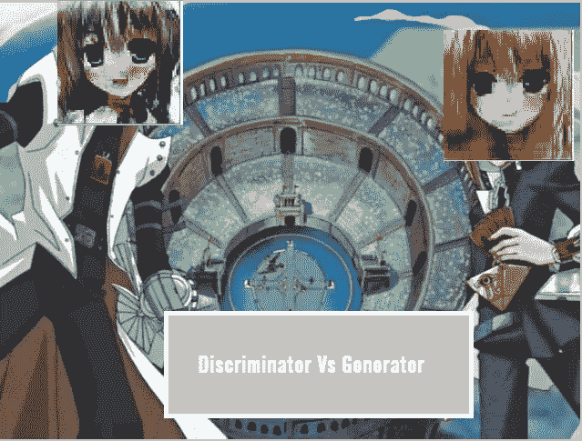**

**Image 2 : Illustration of Discriminator vs Generator . Image modified and taken from [here](https://yugioh.fandom.com/wiki/Yu-Gi-Oh!_-_Episode_129)**

****发生器**将产生一些假数据，而**鉴别器**将识别出几个数据，这些数据包含由**发生器**产生的假数据和从真实数据中采样的数据。**发生器**的目的主要是产生一些与真实数据相似的虚假数据，并欺骗**鉴别器**识别哪些数据是真实的，哪些是虚假的。**鉴别器**的目的是让它更智能地识别真假数据。每个代理将交替移动。通过与这些代理决斗，我们希望这些代理会变得更强，尤其是**发电机。****

> **你可以说他们是命中注定的对手。主角是**发电机，它通过从对手的战斗中学习，力求更好地实现我们的目标。****

**好的，换句话说，**发生器**将通过对学习到的分布进行采样来模拟真实数据，并打算与真实数据相同的分布。它会训练自己的神经网络来生成它。鉴于此，**鉴别器**将在监督技术中训练其神经网络来检测虚假和真实数据。每个网络将交替训练其网络。**

**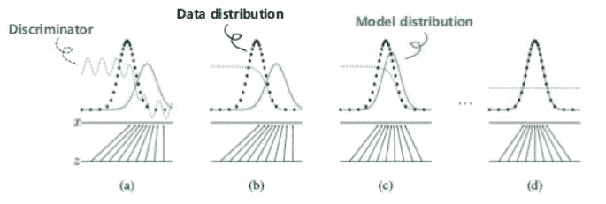**

**Image 3 : Illustration GAN on learning data distribution. Picture taken from [here](https://www.slideshare.net/thinkingfactory/variants-of-gans-jaejun-yoo).**

**以下是 GAN 工作原理的大致步骤:**

1.  **以概率分布如正态分布产生随机噪声。**
2.  **将其作为发电机神经网络的输入。它将输出生成的 ***假数据*** 。这些步骤也意味着我们从生成器学习的分布中抽取一些数据。我们将噪声记为`**z_n**`，生成的数据记为`**G(z_n**)`。`**G(z_n)**`指发电机 **G** 处理噪声的结果。**
3.  **我们将生成的假数据与从数据集采样的数据(真实数据)结合起来。使它们成为我们的**鉴别器的输入。我们将其记为 D.** 鉴别器将通过预测数据是否为假来尝试学习。通过前向传递和后向传播来训练神经网络。更新 **D** 权重。**
4.  **然后，我们需要训练**发电机**。我们需要将`**G(z_n)**`或者随机噪声产生的伪数据作为 **D 的输入**注意，这个步骤只是将伪数据输入到**鉴别器**中。正向传递**【d】**中的`**G(z_n)**` 通过使用鉴别器神经网络，在做正向传递时，预测假数据是否为假数据`**(D(G(z_n)))**`。然后进行反向传播，我们将只更新 **G** 权重。**
5.  **重复这些步骤，直到我们可以看到生成器提供良好的伪数据或者已经达到最大迭代。**

**图示如下:**

**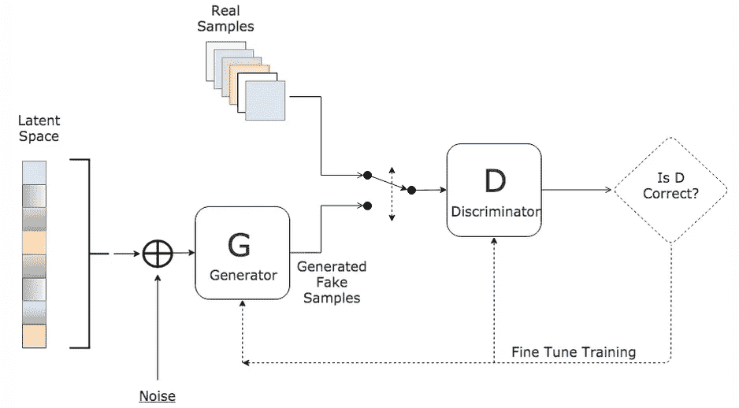**

**Image 4 : How GAN Works. Picture taken from [here](http://Image 3 : Illustration GAN on learning data distribution. Picture taken from here.).**

**通过更新生成器的分布来匹配鉴别器。这和最小化 JS 散度是一样的。要了解更多信息，您可以阅读[这篇](https://lilianweng.github.io/lil-log/2017/08/20/from-GAN-to-WGAN.html)文章。**

**为了让我们的代理学习，一定要让**鉴别器**和**发生器**互相支配。使它们尽可能平衡，并使**鉴别器**和**发生器**同时学习。当**鉴别器**太强(能 100%区分真假)时，**发生器**变得什么也学不会。如果在训练过程中我们达到这一点，最好结束它。在**发生器**比鉴别器强的情况下，相反的情况也有影响。它会导致模式崩溃，我们的模型对任何随机噪声都会预测相同的结果。这是 GAN 中最难和最难的部分之一，它会让人感到沮丧。**

**如果你想了解更多，我建议看一看这篇很棒的[文章](https://medium.com/@jonathan_hui/gan-dcgan-deep-convolutional-generative-adversarial-networks-df855c438f)。**

# **履行**

## **那么，鉴别器和生成器的架构如何呢？**

**这取决于我们将开发的 GAN 的变体。由于我们将使用 DCGAN，我们将使用一系列的 CNN 层。**

**我们将使用不同于原始论文的自定义架构。我沿用了《用 Python 进行深度学习》一书中使用的架构**。****

***我们用于构建 DCGAN 的配置如下:***

```
*latent_dim = 64
height = 64
width = 64
channels = 3*
```

***这意味着我们将有一个 64 维的潜在变量。我们的图像的高度和宽度是 64。每个图像有 3 个通道(R，G，B)***

***以下是导入的库以及如何准备数据:***

***这里是架构:***

## *****发电机*****

******

***它由卷积层组成，其中一层是卷积转置层。为了增加图像`(32 -> 62)`的大小，我们将在卷积层中使用步长参数。这样做是为了避免 GAN 的不稳定训练。***

*****代码*****

## *****鉴别器*****

***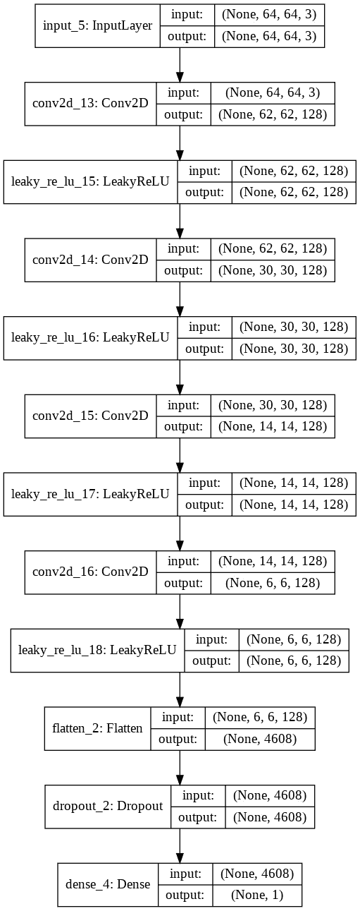***

***它还由卷积层组成，我们使用步长进行缩减采样。***

*****代码*****

## ***开始***

***为了使生成器的反向传播成为可能，我们在 Keras 中创建新的网络，它是**生成器**后跟**鉴别器。在这个网络中，我们冻结了所有的权重，这样它的权重就不会改变。*****

*****这是网络:*****

***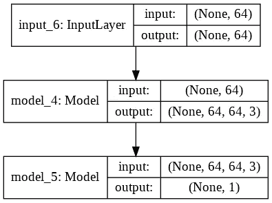***

# ***培养***

***培训的配置如下:***

```
*iterations = 15000 
batch_size = 32*
```

***该配置意味着我们将进行 15000 次迭代。每次迭代我们处理 32 批真实数据和虚假数据(总共 64 批用于训练鉴别器)。***

***按照我上面解释的粗略步骤，下面是我们如何一步一步地训练 DCGAN:***

1.  *****重复以下步骤直到最大迭代次数*****

```
*for step in tqdm_notebook(range(iterations)):*
```

*****2。以概率分布如正态分布产生随机噪声。*****

```
*random_latent_vectors = np.random.normal(size = (batch_size, latent_dim))
generated_images = generator.predict(random_latent_vectors)*
```

*****3。将生成的假数据与从数据集中采样的数据结合起来。*****

```
*stop = start + batch_size
real_images = x_train[start: stop]
combined_images = np.concatenate([generated_images, real_images])
labels = np.concatenate([np.ones((batch_size,1)), 
                                    np.zeros((batch_size, 1))])*
```

***请注意，我们使用顺序采样器，每个数据将被顺序采样，直到数据结束。将被抽样的数量等于批量大小。***

*****4。向输入标签添加噪声*****

```
*labels += 0.05 * np.random.random(labels.shape)*
```

***这是训练甘的重要一招。***

*****5。训练鉴别器*****

```
*d_loss = discriminator.train_on_batch(combined_images, labels)*
```

*****6。训练发电机*****

```
*random_latent_vectors = np.random.normal(size=(batch_size, 
                                                 latent_dim))
misleading_targets = np.zeros((batch_size, 1))
a_loss = gan.train_on_batch(random_latent_vectors, 
                              misleading_targets)*
```

***注意，我们创建了一个新的潜在向量。别忘了我们需要交换标签。请记住，我们要尽量减少因鉴别者未能预测到假货而造成的损失。`misleading_targets`的标签应该是 1。***

*****7。更新真实数据集的起始索引*****

```
*start += batch_size

  if start > len(x_train) - batch_size:
    start = 0*
```

***就这样，下面是训练 DCGAN 的完整代码:***

# ***结果***

***好了，好戏开始了！我们将开始在不同的平均点上可视化生成的图像。在我们这样做之前，让我告诉你，这是上述模型的结果，该模型训练了 20000 步(迭代)和 30000 步。该模型被训练大约 7 小时(大约每小时 4300 步)。我将较少步骤的模型命名为**模型-A** ，另一个命名为**模型-B** 。***

***开始了。***

> *****如何阅读*****
> 
> *****N ~ (x，y)** :遵循正态分布随机生成的潜在向量，具有均值 **x** 和标准差 **y*****

*****模型-A** 上 **N ~ (0，0.4)** 的潜在向量结果:***

***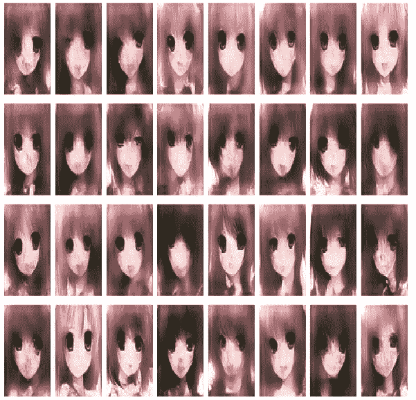***

***Image 5 : Generated Face Model-A N ~ (0, 0.4)***

***不错吧，虽然有一些照片中的人有不对称的脸。***

*****模型-A** 上 **N ~ (0，1)** 的潜在向量结果:***

***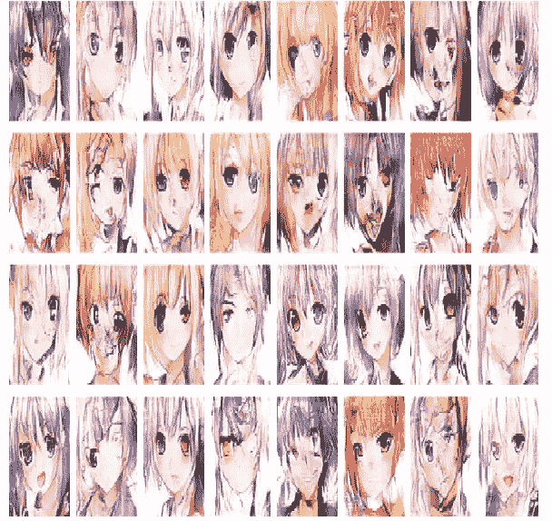***

***Image 6 : Generated Face Model-A N ~ (0, 1)***

***看看它..这个模型产生了一些令人厌恶的面孔。事实证明，这个模型并没有真正掌握真实数据的分布。当标准差较低时，它可以做得更好。我训练的 DCGAN 还没有掌握如何表示不太接近均值点的数据点。我认为，它需要更多的训练或更强大的架构。***

***让我们将架构更改为**模型-B*****

*****模型 B:** 上 **N ~ (0，0.4)** 的潜在向量结果***

***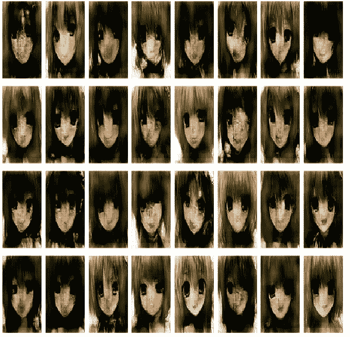***

***Image 7 : Generated Face Model-B N ~ (0, 0.4)***

***还好，但是脸变得更黑了。我想知道发电机怎么了。***

***在**模型-B** 上的 **N ~ (0，1)** 上的潜在向量结果:***

***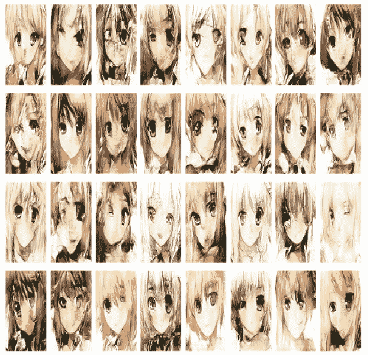***

***Image 8 : Generated Face Model-A N ~ (0, 1)***

***嗯，好吧..其中大部分仍然包含着**可憎的**面孔。他们中的一些人表情很好。质量还是和 a 型差不多。好的..对于下一批图像，让我们尽可能地改变标准偏差。0.4 最好。***

***让我们检查一下，我们的潜在向量是否是使用相同的标准偏差，以-0.3 和 0.3 为中心平均值生成的。***

*****模型-A** 上 **N ~ (-0.3，0.4)** 的潜在向量结果:***

***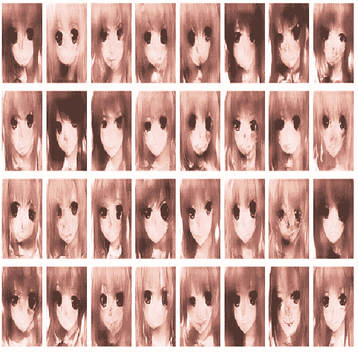***

***Image 9 : Generated Face Model-A N ~ (0.3, 0.4)***

*****模型-A** 上 **N ~ (0.3，0.4)** 的潜在向量结果:***

***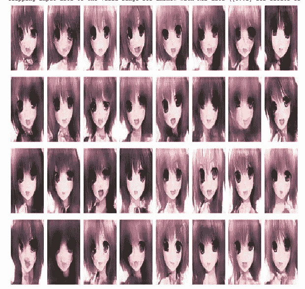***

***Image 10: Generated Face Model-A N ~ (-0.3, 0.4)***

*****B 型**上 **N ~ (-0.3，0.4)** 的潜在向量结果:***

***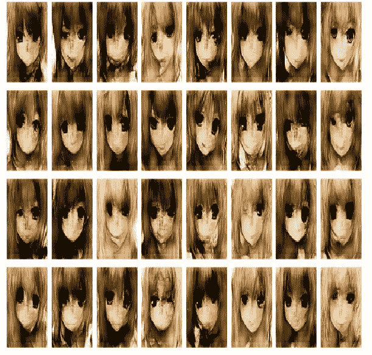***

***Image 11: Generated Face Model-B N ~ (-0.3, 0.4)***

***在 **Model-B** 上 **N ~ (0.3，0.4)** 上的潜在向量结果:***

***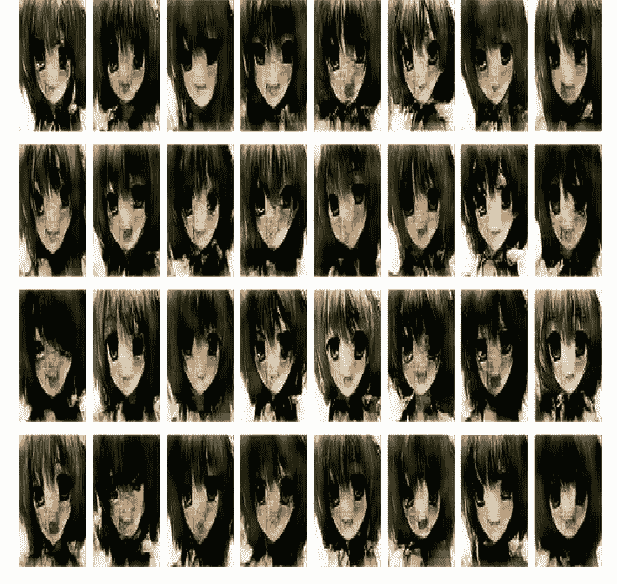***

***Image 12: Generated Face Model-B N ~ (0.3, 0.4)***

*****看出区别了吗？*****

***是的，看他们的头发。平均值为 0.3 时，头发大部分是黑色的(其中一些是棕色的)。相反，在平均值为-0.3 时，毛发大多是黄色的。是的，我们的模型可以把脸放在相应的点上。模型 B 也生成比 a 更暗的面。***

***从上面我们所做的，我们可以直观地了解我们的模型是如何学习数据分布的。***

***让我们绘制它:***

***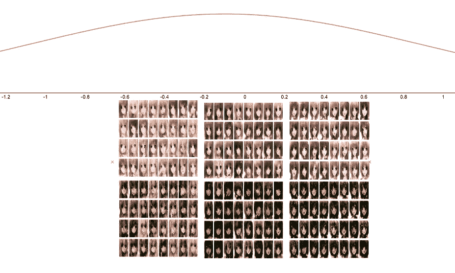***

***Image 13: Data distribution of the generator***

***从上面显示的结果来看，我认为潜在向量越小，脸的头发越亮，潜在向量越大，脸的头发越红。***

***为了确定这一点，让我们来看看每个平均点中的平均面:***

***我们画出这些潜在向量，它们的平均值是:***

```
*[-1, -0.8, -0.6, -0.4, -0.2, 0, 0.2 0.4, 0.6, 0.8 ]*
```

***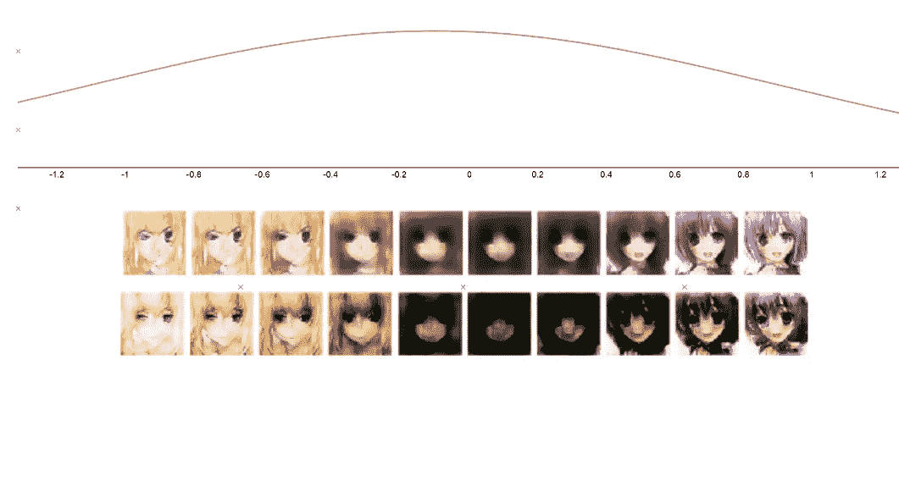***

***Image 14: Average faces from different mean points***

***第一行是模型 A，第二行是模型 b。通过处理潜在向量的平均值，我们可以看到它在该点生成的脸。我们可以看到:***

*   ***向量的点越低，头发越黄。***
*   ***它的脸中间比较黑。这意味着数据集中的平均人脸具有这些风格。***
*   ***向量的点越正，头发越蓝。正面潜在向量在微笑上也有更多的开口。***

## ***基本线性代数运算***

***很神奇吧？***

***还没有，我们可以对潜向量做线性代数运算。方程的结果也可以生成，并有有趣的结果。在介绍部分之前，从我们的第一张面孔中提取一个结果:***

*****G + D*****

******

***Images 15 : G + D = GAN***

***甘脸是 G 和 d 相加的结果。你可以看到头发变得有点棕色。右边的头发是 D 型，左边的是 G 型。***

***以下是其他人操作的结果:***

*****G — D(绝对)*****

******

***Images 16 : G-D***

*****按分量相乘(G，D)*****

***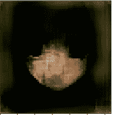***

***Images 17 :Component-Wise multiplied (G, D)***

## ***操纵潜在向量***

***如果我们在潜向量中操作一个维度，我们将会看到生成的图像是怎样的。正如我前面所说，模型将学习潜在的特征表示。所以，潜在向量中的每一个元素都有生成图像的目的。***

***为了进行可视化，我们将冻结 vectors 中的所有元素，并更改要检查的所选维度。***

***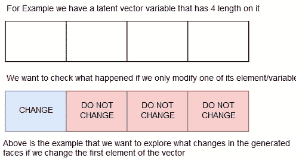***

***Images 18 : Illustration on what we do in this section***

***例如，我们想要检查潜在向量中的第一个元素，我们改变该维度并保持其他维度不变。***

***我们将生成一些具有以下意义的面:***

```
*[-0.6, -0.3, 0.1, 0.3, 0.6]*
```

***对于每个平均点，我们将生成其潜在向量中的维度随着这些值迭代地改变的面:***

```
*[-1.08031934, -0.69714143, -0.39691713, -0.12927146,  0.12927146, 0.39691713,  0.69714143,  1.08031934]*
```

***让我们在选择的维度上可视化: (本节将只使用模型-A)***

*****第 28 次元**:***

***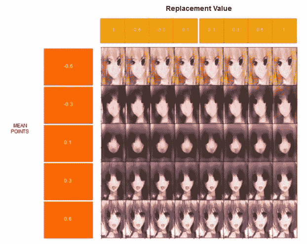***

***Image 19 : Result on Changing 28th latent variable in different mean points.***

***第 28 个潜变量的目的是什么？***

***我认为，它使头发变得更亮，改变左眼的形状，也改变右眼的小变化。由于它将特征压缩成 64 长度的潜在向量，一个维度可以有多种用途。***

***让我们看另一个！***

*****第五维度*****

***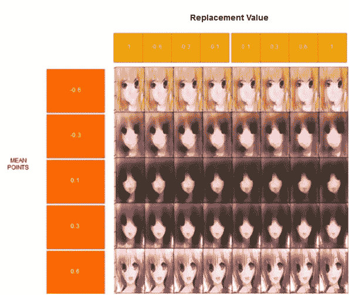***

***Image 20 : Result on changing 5th latent variables in different means***

***这个潜在变量的目的是什么？***

***我认为这与左眼有关，尽管每个穴位对左眼的治疗不同。它也使头发颜色变深。你怎么想呢?***

*****第 11 维*****

******

***Image 21 : Result on changing the 11th latent variables in different means***

***我想，这个维度关心的是嘴巴和右眼。***

***另一个例子是通过调整一个潜在变量从一个平均点生成的面:***

***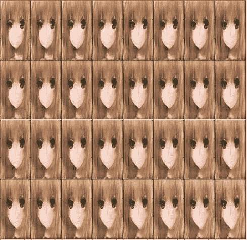***

***Image 22 : Result on faces by changing a latent variable***

***就是这样。我们可以画出潜在向量的任何维度，看看它的目的是什么。尽管有时很难看出潜在变量的目的是什么。***

## ***与真实数据比较***

***让我们从数据集中抽取 8 个真实的人脸样本:***

******

***Image 22 : Real Faces from dataset***

***型号 A 和 B 的发电机 `N ~ (0,1)`的样本 8:***

***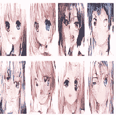******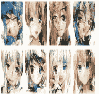***

***Image 23 : Fake faces generated by generator***

***那么，如果我们充当鉴别者，我们能区分真脸和假脸吗？***

***毫无疑问，我们仍然可以区分哪些面孔是假的，哪些是真的。这种模式需要更多训练或强大的架构来实现。即便如此，我们的模型仍然可以生成动漫风格的人脸形状，这很棒。***

# ***吸取的教训***

***以下是我研究 DCGAN 后学到的经验:***

*   ***训练甘很难。如果没有经验者的提示和技巧，很难做出一个稳定的架构。尤其是在平衡鉴频器和发生器的功率方面。使 GAN 不崩溃也是一个挑战。***

***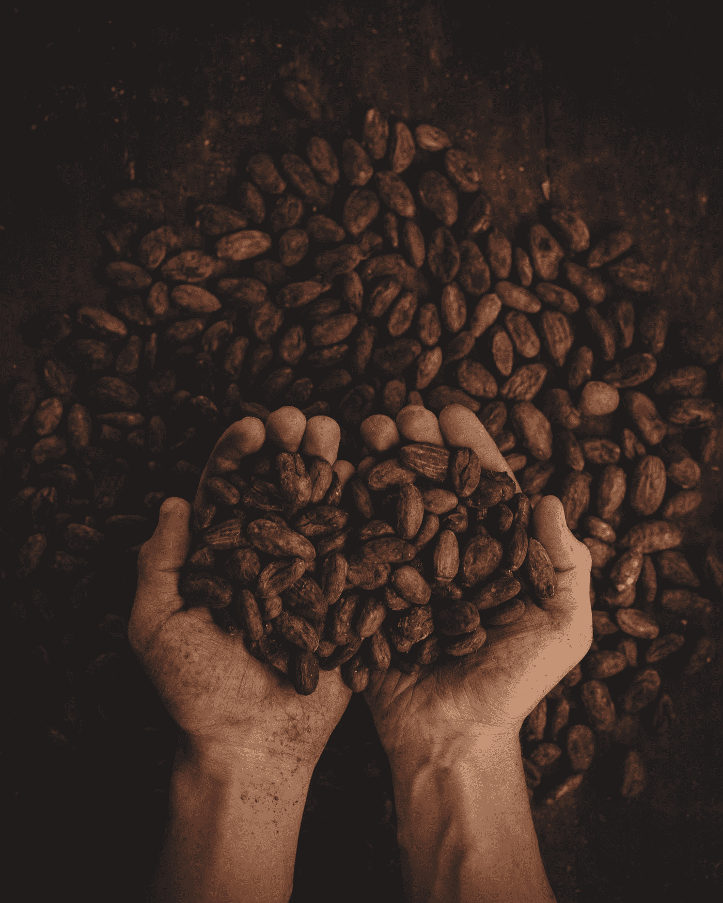***

***Photo by [Pablo Merchán Montes](https://unsplash.com/@pablomerchanm?utm_source=medium&utm_medium=referral) on [Unsplash](https://unsplash.com?utm_source=medium&utm_medium=referral)***

*   ***实际上，这些模型仍然不擅长生成假图像。然而，它可以建立一些好的面孔，虽然没有真正的好。我们仍然可以区分假图像和真实图像。这是因为模型还没有掌握真实数据的数据分布。***
*   ***该模型在 26000 步左右降低其质量。在我的实验中，这是发电机变弱的地方。这是 GAN 中的不稳定性。我需要寻找一个更好的架构来做这件事。我们可以看到模型 B 上的结果变得更暗。***
*   ***因此，我开发了另一个具有批处理规范化甚至是丢弃层的架构。你猜怎么着？在调整架构的过程中，我有两个结果。模型崩溃和鉴别器优势。我猜开发 GAN 架构并不容易。***
*   ***然而，有许多关于开发一个好的 GAN 的提示和技巧我还没有实现。也许遵循这些提示可以减少模型的不稳定性。***
*   ***有许多更稳定 GAN 变体，例如 WGAN-DC 和 DRAGAN，以及 SAGAN。我需要使用可能比 DCGAN 做得更好的不同架构。***

# ***结论***

***这篇文章告诉了我们甘在做什么，并一步一步地告诉我们如何去做。之后，它告诉我们一个有趣的特征，它的潜在向量显示了数据分布的发电机学习。它向我们展示了它可以形成一个数据分布。***

***潜在向量可以进行线性代数运算。它可以向我们展示一些有趣的事情，例如两个潜在向量的相加将组合这些面孔中每一个的特征。它还可以被操纵以基于潜在向量中的改变的元素来改变面部。***

***即便如此，我们的模型仍然无法做出一张能让我们怀疑那张脸是不是假的脸。它仍然可以形成一个动漫风格的面孔。***

# ***编后记***

***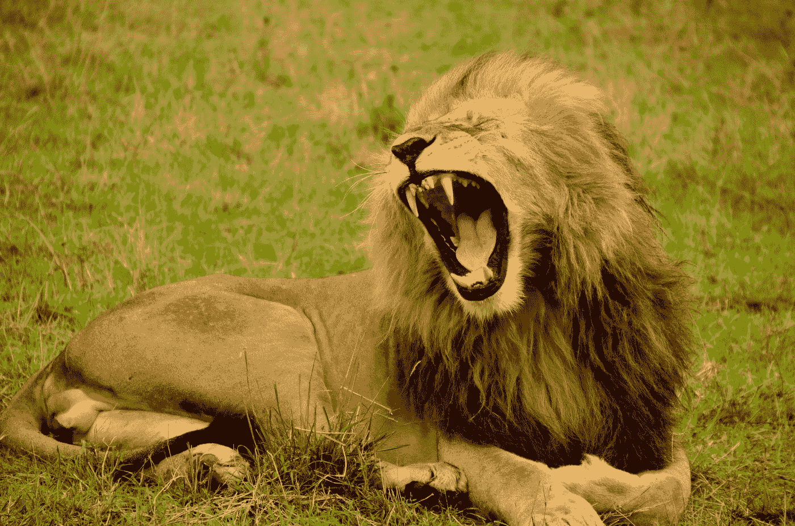***

***Photo by [Lemuel Butler](https://unsplash.com/@lemuelbutler?utm_source=medium&utm_medium=referral) on [Unsplash](https://unsplash.com?utm_source=medium&utm_medium=referral)***

***就是这样，我第一次做 GAN 的经验。我越来越了解甘在做什么。我也想探究一下我对甘到底学到了什么的好奇心。它们就在那里，它实际上做的事情真的很神奇。生成器可以将正常随机噪声生成的随机向量映射到数据分布中。它将人脸聚集成指定的数据点。***

***在做甘，我实际上运行几个模型，我手工制作的。好吧，他们悲惨地失败了。有一次，我认为模型可以成功，但它进入模式崩溃(预测的脸将是相同的，不管潜在向量)。我找到了关于 DCGAN 的 *fchollet* 存储库，并遵循了它的架构。***

***由于这是我第一次设计 GAN，我希望每个人都对此有很多反馈。请指出我犯的错误，因为这是我第一次做。如果结果没那么好请见谅。我只想分享我做甘的兴奋。并分享如何做到。***

***即便如此，这真的很有趣，我想尝试另一种 GAN 变体，如 WGAN-GP、DRAGAN 或 SAGAN。我只是略读了一点，并想尝试一下。期待一篇做这些实验的文章😃。***

***这个迷因实际上描绘了这个实验😆。***

***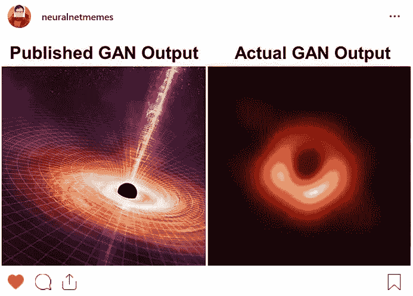***

***Images 24 : Image taken from [neuralnetmemes](https://www.instagram.com/neuralnetmemes/) Instagram***

> ***我欢迎任何可以提高我自己和这篇文章的反馈。我正在学习写作和深度学习。我感谢能让我变得更好的反馈。确保以适当的方式给出反馈😄。***

***在我的下一篇文章中再见！***

******

***Source : [https://cdn.pixabay.com/photo/2017/07/10/16/07/thank-you-2490552_1280.png](https://cdn.pixabay.com/photo/2017/07/10/16/07/thank-you-2490552_1280.png)***

# ***贮藏室ˌ仓库***

***查看这个 GitHub 资源库:***

***[](https://github.com/haryoa/DCGAN-Anime) [## haryoa/DCGAN-Anime

### 使用 DCGAN 制作动漫脸的个人项目。通过在…上创建一个帐户，为哈里亚海/DCGAN-Anime 的发展做出贡献

github.com](https://github.com/haryoa/DCGAN-Anime) 

目前，我只提供 IPython 笔记本来从头开始训练 GAN。请注意，如果模型在大约 200 次迭代后没有输出人脸形状的图像，请重新开始训练(从“**创建模型**部分开始运行)。

稍后，我将创建一个操场笔记本来实验操纵潜在变量。

# 来源

[](https://medium.com/datadriveninvestor/deep-learning-generative-adversarial-network-gan-34abb43c0644) [## 深度学习——生成对抗网络

### 在这篇文章中，我们将了解生成性敌对网络(GAN)。我们将比较生成性和辨别力…

medium.com](https://medium.com/datadriveninvestor/deep-learning-generative-adversarial-network-gan-34abb43c0644) 

感谢[雷努·汉德尔瓦尔](https://medium.com/u/31b07253bc35?source=post_page-----ae0e905f3974--------------------------------)的精彩文章。

[https://www . cs . Toronto . edu/~ duvenaud/courses/CSC 2541/slides/gan-foundations . pdf](https://www.cs.toronto.edu/~duvenaud/courses/csc2541/slides/gan-foundations.pdf)

[https://github . com/fchollet/用 python 深度学习笔记本](https://github.com/fchollet/deep-learning-with-python-notebooks)

[](https://lilianweng.github.io/lil-log/2017/08/20/from-GAN-to-WGAN.html) [## 从 GAN 到 WGAN

### 这篇文章解释了生成性对抗网络(GAN)模型背后的数学原理，以及为什么它很难被训练…

lilianweng.github.io](https://lilianweng.github.io/lil-log/2017/08/20/from-GAN-to-WGAN.html) 

[https://arxiv.org/pdf/1511.06434.pdf](https://arxiv.org/pdf/1511.06434.pdf)

[](https://medium.com/@jonathan_hui/gan-why-it-is-so-hard-to-train-generative-advisory-networks-819a86b3750b) [## 甘——为什么生成性对抗网络这么难训练！

### 认出莫奈的画比画一幅容易。生成模型(创建数据)被认为是非常…

medium.com](https://medium.com/@jonathan_hui/gan-why-it-is-so-hard-to-train-generative-advisory-networks-819a86b3750b) 

感谢 Jonathan Hui 的精彩文章。***