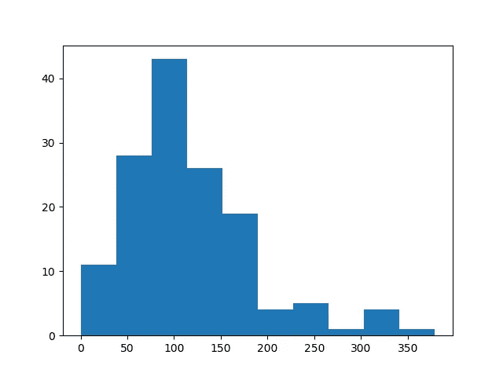

# 使用 python 成为视频分析专家

> 原文：<https://towardsdatascience.com/generate-any-sport-highlights-using-python-3695c98baead?source=collection_archive---------17----------------------->


Courtesy[: pixabay](https://pixabay.com/photos/children-splash-asia-sunset-1822688/)

# 如果告诉你这不是用机器学习或者深度学习生成的呢！

为任何运动生成精彩场面的任务都是相当乏味和困难的。它涉及许多技术和其他软件、硬件需求。你也需要投入大量的时间去做。如果你对这样的视频公司或部门感兴趣，那就没问题，但如果你是像我一样的普通用户，你就不会想这么做。我将使用 python 在几个步骤中完成这项工作。不会涉及任何外部软件。只是纯粹的 python，而且，我们不必依赖机器学习或深度学习技术来做到这一点。我们将使用**语音分析**来完成这项任务。

当比赛中发生令人兴奋的事情时，解说员的声音就会提高。让我们以板球为例。每当击球手击球或投球手击球时，解说员的声音就会提高。在那场比赛中，观众和解说员的音调都很高。我们可以利用音频的这些变化从视频中捕捉有趣的瞬间。

我们将遵循的流程补充如下:

*   输入视频文件
*   提取音频
*   将音频分成几块
*   计算每个块的短时能量
*   将每个块分类为兴奋或不兴奋(基于阈值)
*   合并所有精彩片段，形成视频集锦
*   生成最终的视频集锦

**记住，我们不会在这里使用任何外部软件。**

**1。下载视频输入**:[https://bit.ly/2lKfVa6](https://bit.ly/2lKfVa6)

你也可以选择你最喜欢的运动的任何其他视频。

***2。提取音频:***

为了提取音频和对视频文件进行其他操作，我们将使用一个名为 **moviepy 的包。**

a.安装软件包。

```
pip install moviepy
```

b.在此代码中输入文件路径。

```
# AudioExtract.pyimport moviepy.editor as mpclip = mp.VideoFileClip("filepath//videoplayback.mp4").subclip(1, 1380)
clip.audio.write_audiofile("filepath//audio.wav")
```

> *在上面的代码中，* mp 视频文件剪辑*是我们输入视频文件的地方。*
> 
> 子剪辑*，我们指定我们需要音频的时间限制。*如果您想要完整的剪辑音频，则不需要**
> 
> audio.write_audiofile *，我们在这里指定输出路径和文件名。*

就这样，我们通过两个简单的步骤提取了音频。

**3。将音频分成几块:**

我们将使用刚刚在**步骤 2 中提取的音频。**

librosa 是一个用于音乐和音频分析的 python 包。

```
import librosa
import IPython.display as ipdfilename = "filepath\\audio.wav"# loading the file with a sampling rate
x, sr = librosa.load(filename, sr=16000)# To get duration of the audio clip in minutes
int(librosa.get_duration(x, sr) / 60)# Dividing into chunks of 5 seconds 
max_slice = 10
window_length = max_slice * sr# Playing the audio chunk
a = x[21 * window_length:22 * window_length]
ipd.Audio(a, rate=sr)
```

在这里，我将采样率设置为 16000，您可以根据自己的方便和需要进行设置。现在，我已经将音频分成每个 10 秒的块，因为我们想要找出特定的音频块是否包含音频声音的上升。您可以根据自己的选择设置时间限制，对不同的输出尝试不同的时间限制。此外，我们将播放音频块只是为了检查。

**4。计算每个组块的短时能量:**

```
import numpy as np
s_energy = np.array([sum(abs(x[i:i + window_length] ** 2)) for i in range(0, len(x), window_length)])
```

音频信号的能量或功率是指声音的响度。它是通过时域中音频信号幅度的平方和来计算的。当对整个音频信号的块计算能量时，它被称为**短时能量**。

让我们画出来:

```
import matplotlib.pyplot as plt
plt.hist(s_energy)
plt.show()
```



**5。将每个组块分类为兴奋与否(基于阈值):**

```
import pandas as pd
df = pd.DataFrame(columns=['energy', 'start', 'end'])
thresh = 180
row_index = 0
for i in range(len(s_energy)):
    value = energy[i]
    if value >= thresh:
        i = np.where(s_energy == value)[0]
        df.loc[row_index, 'energy'] = value
        df.loc[row_index, 'start'] = i[0] * 10
        df.loc[row_index, 'end'] = (i[0] + 1) * 10
        row_index = row_index + 1
```

我正在根据能源数据创建一个数据框架。我选择的阈值是 180，你可以根据自己的选择来选择，也可以看上面的图表。然后将音频剪辑的连续时间间隔合并成一个:

```
temp = []
i = 0
j = 0
n = len(df) - 2
m = len(df) - 1
while (i <= n):
    j = i + 1
    while (j <= m):
        if (df['end'][i] == df['start'][j]):
            df.loc[i, 'end'] = df.loc[j, 'end']
            temp.append(j)
            j = j + 1
        else:
            i = j
            break
df.drop(temp, axis=0, inplace=True)
print(df)
```

**6。合并所有精彩片段，形成视频集锦**

```
start = np.array(df['start'])
end = np.array(df['end'])
for i in range(len(df)):
    if i != 0:
        start_lim = start[i] - 10
    else:
        start_lim = start[i]
    end_lim = end[i]
    filename = "highlight" + str(i + 1) + ".mp4"
    ffmpeg_extract_subclip("filepath//videofile.mp4", start_lim, end_lim, targetname=filename)
```

这段代码将根据振幅从每个块中生成突出显示，然后将这些文件保存到您的系统中。你还没有完成，你必须将所有的 **14** 文件合并成一个文件来创建高光。

**7。生成最终的视频集锦**

```
# Final_joined.pyfrom moviepy.editor import VideoFileClip, concatenate_videoclipsclip1 = VideoFileClip("filename\\highlight1.mp4")
clip2 = VideoFileClip("filename\\highlight2.mp4")
clip3 = VideoFileClip("filename\\highlight3.mp4")
clip4 = VideoFileClip("filename\\highlight5.mp4")
clip5 = VideoFileClip("filename\\highlight6.mp4")
clip6 = VideoFileClip("filename\\highlight7.mp4")
clip7 = VideoFileClip("filename\\highlight8.mp4")
clip8 = VideoFileClip("filename\\highlight9.mp4")
clip9 = VideoFileClip("filename\\highlight10.mp4")
clip10 = VideoFileClip("filename\\highlight11.mp4")
clip11= VideoFileClip("filename\\highlight12.mp4")
clip12 = VideoFileClip("filename\\highlight13.mp4")
clip13= VideoFileClip("filename\\highlight14.mp4")
clip14= VideoFileClip("filename\\highlight4.mp4")final_clip = concatenate_videoclips([clip1,clip2,clip3,clip4,clip5,clip6,clip7,clip8,clip9,clip9,clip10,clip11,clip12,clip13,clip14])
final_clip.write_videofile("filepath\\Final_Highlights.mp4")
```

我们使用 concatenate 将所有文件合并成一个文件。在此之后，将生成最终文件。

> ***完整代码:***[*https://bit.ly/2lE55mi*](https://bit.ly/2lE55mi)
> 
> *你可以在这里获得【https://bit.ly/2lDEd5V】***视频演示****:*[](https://bit.ly/2lDEd5V)*
> 
> **如果您遇到任何错误或需要任何帮助，您可以随时在 LinkedIn 上评论或 ping 我。**
> 
> ****LinkedIn****:*[*https://bit.ly/2u4YPoF*](https://bit.ly/2u4YPoF)*
> 
> **参考:*[*https://bit.ly/2kry0tB*](https://bit.ly/2kry0tB)*

> **我希望这有助于增强你的知识基础:】**
> 
> **关注我了解更多！**
> 
> *感谢您的阅读和宝贵时间！*