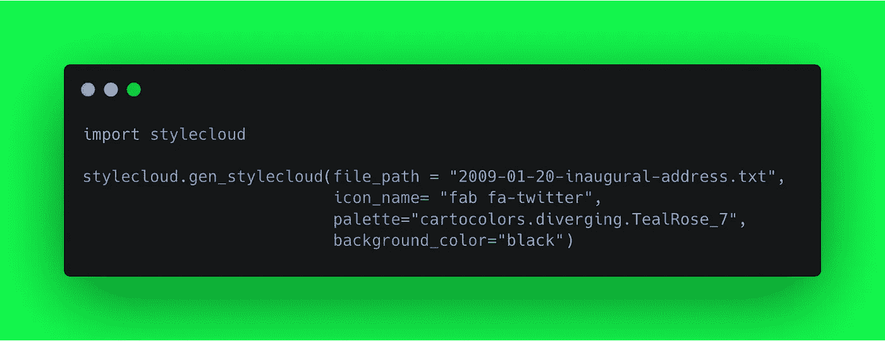
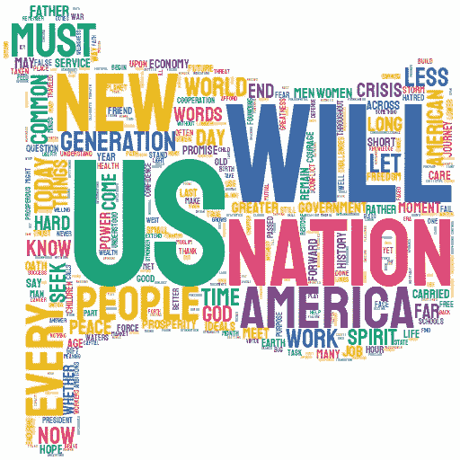

# 使用 stylecloud 生成现代时尚的 Wordcloud

> 原文：<https://towardsdatascience.com/generate-modern-stylish-wordcloud-with-stylecloud-9cbb059696d2?source=collection_archive---------17----------------------->


几乎每个需要从文本语料库中寻找见解的文本分析项目都会包含一个词云。但正如你们中的许多人所记得的，在数据科学家的脑海中，单词云有一个非常无聊的图像和感知，我们总是试图美化它们——最终在这个过程中放弃——除了少数人会选择一些掩蔽图像，然后试图让单词云变成那个形状。这是我们大多数人使用单词云的最高水平。

但在内心深处，我们所有人都一直希望有现代时尚美丽的文字云。这个愿望在 Max Woolf(以`[minimaxir](https://github.com/minimaxir/)`闻名)的新 python 包`[stylecloud](https://github.com/minimaxir/stylecloud)`中实现了

# [78%的数据营折扣](https://datacamp.pxf.io/c/2888696/1240322/13294?u=https%3A%2F%2Fpromo.datacamp.com)


## 关于 styelcloud

`stylecloud`是一个 Python 包，它利用了流行的 [word_cloud](https://github.com/amueller/word_cloud) 包，添加了有用的功能来创建真正独特的单词云，包括渐变和图标形状。



## stylecloud 安装

`stylecloud`仅一个`pip`之遥

```
pip3 install stylecloud
```

## 样式云—基础知识

`stylecloud`提供了两种方式来生成 style-wordcloud:

*   作为一个 CLI 命令，可以从您的终端/Shell/Cmd 提示符调用来生成 wordcloud(快速而时尚)
*   导入`stylecloud`包并在代码中使用`stylecloud()`创建 wordcloud 的典型 pythonic 方式

## 示例文本文件

对于本文，我们将考虑美国前总统巴拉克·奥巴马在 2008 年当选为总统时的标志性就职演说。

从[这里](https://github.com/kfogel/presidential-speeches/blob/master/data/2009-01-20-inaugural-address.txt)下载文件`2009–01–20-inaugural-address.txt`

## 样式云— CLI

简单地说，打开你的`Terminal`或`Command Prompt`并尝试下面的命令`stylecloud`指向我们上面下载的文件

```
stylecloud --file_path 2009-01-20-inaugural-address.txt
```


来自`stylecloud`的这个简单命令产生了这个美丽的图(自动保存在与`stylecloud.png`相同的当前目录中)



这是简单，快速和美丽的不是吗？⚑

## 样式云-在 Python 脚本中

CLI 中的 stylecloud 是针对普通人类的，而我们是喜欢用`Python`编码的`coders`。所以让我们用下面两行代码在 Python 中构建同样的东西。

```
import stylecloudstylecloud.gen_stylecloud(file_path = "2009-01-20-inaugural-address.txt")
```

## 样式云—定制

现在，假设我们不希望它是国旗的形状，而是 twitter 标志的形式。毕竟这是互联网时代，不是吗？代码中的一点点变化——只需一个新的参数来给特定的字体图标命名，就能让我们得到奥巴马演讲的 twitter 形状的风格云。

```
stylecloud.gen_stylecloud(file_path = "2009-01-20-inaugural-address.txt", icon_name= "fab fa-twitter")
```


现在，让我们改变一点调色板，也是一个黑暗的主题(这是每个人都喜欢这些天)

```
stylecloud.gen_stylecloud(file_path = "2009-01-20-inaugural-address.txt", icon_name= "fab fa-twitter", palette="cartocolors.diverging.TealRose_7", background_color="black")
```


**那是真正的黑暗！**如果你是 Linkedin(而不是 Twitter)的粉丝，不要离开你——这是你的 Linkedin 图标形状的风格——word cloud


# 摘要

感谢 [Max Woolf](https://medium.com/u/2dbae985e6b8?source=post_page-----9cbb059696d2--------------------------------) ，我们被赋予了这个神奇的库 [**stylecloud**](https://github.com/minimaxir/stylecloud) 。我们很快就学会了如何使用这个时髦的 wordcloud 生成器，既可以作为 CLI 工具，也可以使用 Python 脚本。PNG 文件和笔记本可以在[这里](https://github.com/amrrs/stylecloud-demo)找到。