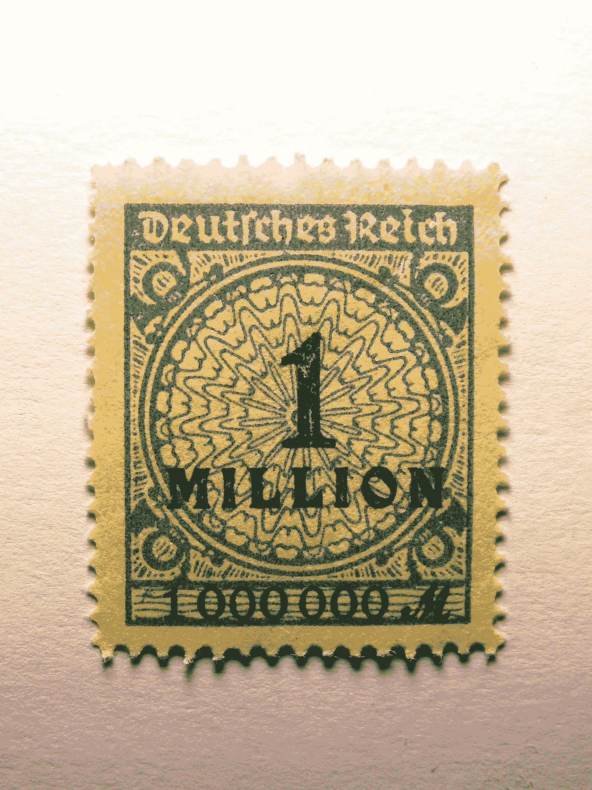
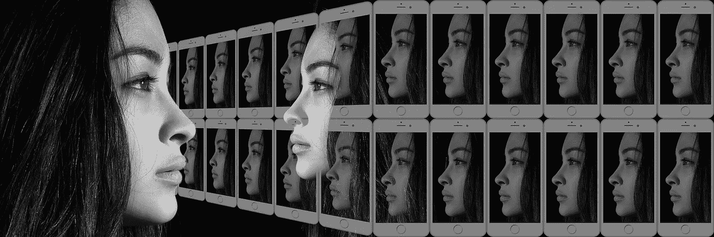
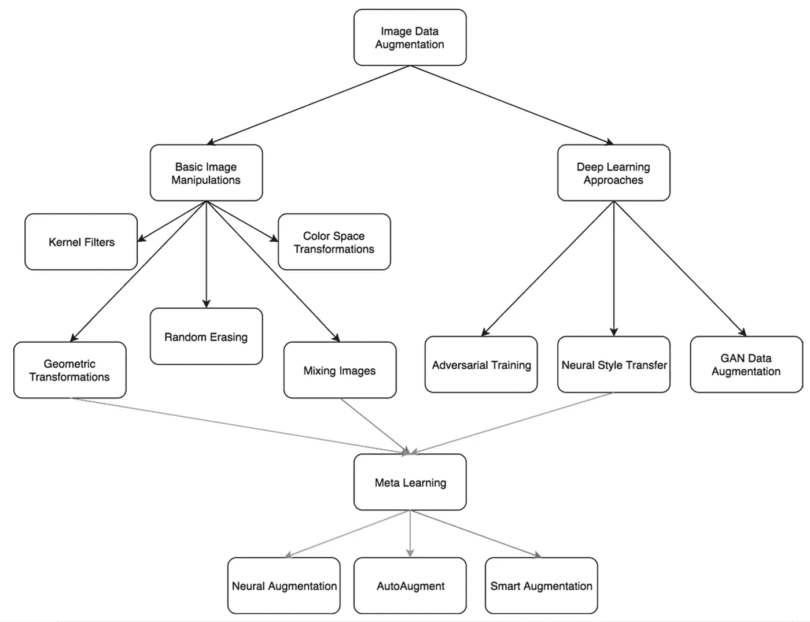
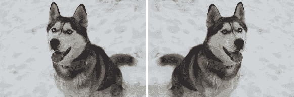
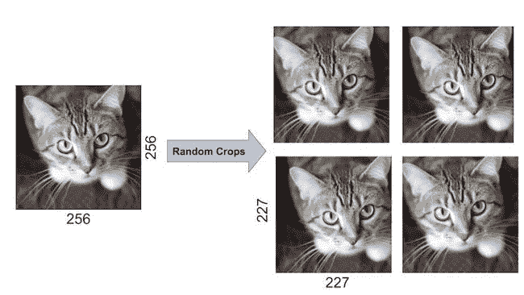
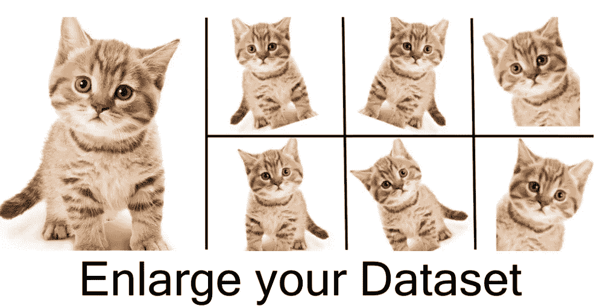
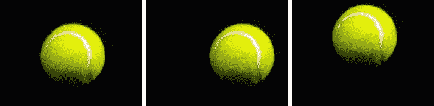
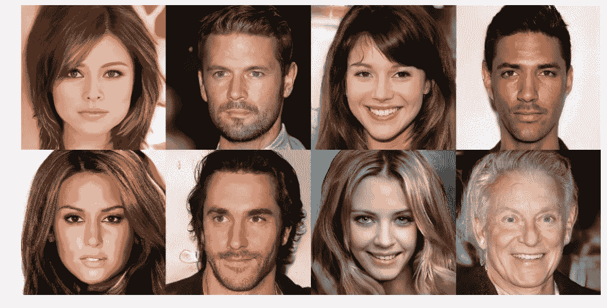

# 当您没有足够的数据时，生成更多的训练数据

> 原文：<https://towardsdatascience.com/generate-more-training-data-when-you-dont-have-enough-db7d8dcde90e?source=collection_archive---------11----------------------->

## 找出可以用来增加你的训练数据的技巧。

Photo album (Photo by [True Agency](https://unsplash.com/@trueagency?utm_source=unsplash&utm_medium=referral&utm_content=creditCopyText) on [Unsplash](https://unsplash.com/?utm_source=unsplash&utm_medium=referral&utm_content=creditCopyText))

> 计算机在图像和物体识别方面胜过人类。

像谷歌和微软这样的大公司已经在图像识别方面击败了人类基准[1，2]。平均而言，人类在图像识别任务中犯错误的概率约为 5%。截至 2015 年，微软的图像识别软件达到了 4.94%的错误率，而大约在同一时间，谷歌宣布其软件实现了 4.8%的降低错误率[3]。

# 这怎么可能呢？

这是通过在包含数百个对象类别的 ImageNet 数据集的数百万个训练样本上训练深度卷积神经网络而实现的[1]。

**一百万训练数据！**

German 1 million mark stamp (Image by [Hebi B.](https://pixabay.com/users/422737-422737/?utm_source=link-attribution&utm_medium=referral&utm_campaign=image&utm_content=607164) from [Pixabay](https://pixabay.com/?utm_source=link-attribution&utm_medium=referral&utm_campaign=image&utm_content=607164))

> “例如，要教会一台计算机从多个角度识别一只猫，可能需要覆盖各种视角的数千张照片。”- [汤姆·西蒙尼特](https://www.wired.com/contributor/tom-simonite)

Image of a cat (Photo by [Mikhail Vasilyev](https://unsplash.com/@miklevasilyev?utm_source=unsplash&utm_medium=referral&utm_content=creditCopyText) on [Unsplash](https://unsplash.com/?utm_source=unsplash&utm_medium=referral&utm_content=creditCopyText))

为了成功地训练用于计算机视觉任务的深度卷积神经网络，需要大量的数据。这是因为这些神经网络有多个隐藏的处理层，随着层数的增加，它需要学习的样本数量也增加。如果没有足够的训练数据可用，模型往往会学习训练数据太好。这叫做过度拟合。如果一个模型过拟合，它的概括能力就很差，因此它对看不见的数据的表现就很差。

# 但是如果没有庞大的训练数据呢？

对于我们手头的所有图像识别任务来说，没有必要有数百万个训练样本。对于某些任务，收集成千上万的示例图像甚至是一个挑战。这通常是医学图像的情况，例如用于乳腺癌检测和定位的乳房 x 线照相术、用于肺癌检测的胸部 x 射线或用于定位脑瘤的 MRI 扫描。

归结为一个问题。

> 当我们只有有限的数据时，我们如何训练一个模型来很好地执行这些任务？

# 通过使用增强生成更多的训练数据

当我们只有少量的图像数据来训练深度卷积神经网络时，我们可以使用数据增强技术从我们已经拥有的数据中生成更多的训练数据。

Multiple images of a person

数据扩充是一种为原始图像生成多个图像的技术。有几种不同的数据增强技术，Mikolajczyk 和 Grochowski 在他们的论文[4]中将这些技术分为两个子类别:使用基本图像处理的数据增强和使用深度学习方法的数据增强。

Data augmentation techniques [4]

# 几何变换

诸如翻转、裁剪、旋转和平移等几何变换是一些常用的数据扩充技术。我们将在本帖中简要讨论它们。

## 轻弹

Original image of a dog on the left, horizontally flipped image about centre on the right [6]

翻转是拍摄任何给定图像的镜像。这是最简单的增强技术之一。图像可以水平或垂直翻转。然而，水平翻转在两者中更为常见。

## 种植

Orignal and random cropped image of a cat [7]

裁剪是一种数据扩充技术，通过裁剪边界像素来减小原始图像的大小。裁剪时不会保留空间维度。在这种类型的数据扩充中，不能保证转换后的图像与原始图像属于相同的输出标签。

在上面的图像中，通过从左和右裁剪像素，从原始图像生成了四个图像。裁剪后的图像尺寸从 256x256 缩小到 227x277。

## 旋转

Orignal and rotated image of a cat [8]

图像可以在 1 到 359 度之间的轴上向左或向右旋转。1 到 20 度之间的旋转被称为轻微旋转，并且可以是用于扩充原始图像的有用技术。随着旋转角度的增加，转换后的数据可能无法保留其原始标签。

## 翻译

Original and translated images of a tennis ball [8]

翻译是一种将图像向左、向右、向上或向下移动的技术。这是一种非常有用的转换技术，可以避免数据中的位置偏差。当图像被移动时，剩余的空间或者被 0、255 填充，或者被随机噪声填充，从而保持图像的原始大小。

# 基于 GAN 的数据增强

生成性对抗网络(GAN)也称为 GAN，是一种生成性建模技术，其中从数据集创建人工实例，其方式是保留原始集的相似特征[9]。

> GAN 由两个相互竞争的人工神经网络(ann)组成，即生成器和鉴别器。第一个创建新的数据实例，而第二个评估它们的真实性[10]。

这是由 GAN 生成的人脸图像，它是在人脸上训练的。请注意，这些是合成的脸，而不是真人。

Synthetic faces generated by GAN trained on human images [10]

这些是为了从有限的数据集中生成更多的数据，从而可以训练更有效的卷积神经网络而通常使用的一些数据扩充技术。

Olaf 和他的团队使用显微图像上的移位、旋转和随机弹性变形等数据增强技术来训练 U-net 架构模型，同时只有有限的训练数据，并在这些类别中以较大优势赢得了 2015 年 ISBI 细胞追踪挑战赛[11]。

因此，下次你在训练卷积神经网络时对数据进行排序时，使用这些技术来创建更多的数据。

*您使用过哪些数据增强技术？在下面的评论中分享你的想法。*

**来源:**

[1]https://www.eetimes.com/document.asp?doc_id=1325712

[2][https://venturebeat . com/2017/12/08/6-人工神经网络胜过人类的领域/](https://venturebeat.com/2017/12/08/6-areas-where-artificial-neural-networks-outperform-humans/)

[3][https://www . the guardian . com/global/2015/may/13/Baidu-minwa-super computer-better-human-recogning-images](https://www.theguardian.com/global/2015/may/13/baidu-minwa-supercomputer-better-than-humans-recognising-images)

[4] Mikolajczyk，a .，& Grochowski，M. (2018 年)。图像分类问题中改进深度学习的数据增强。 *2018 国际跨学科博士研讨会(Iiphdw)* 。doi:10.1109/iiphdw。56686.88868888666

[5]佩雷斯，l .，&王，J. (2017)。使用深度学习的图像分类中数据扩充的有效性。*斯坦福大学研究报告*。

[https://snow.dog/blog/data-augmentation-for-small-datasets](https://snow.dog/blog/data-augmentation-for-small-datasets)

[https://www.learnopencv.com/understanding-alexnet/](https://www.learnopencv.com/understanding-alexnet/)

[8][https://nano nets . com/blog/data-augmentation-how-to-use-deep-learning-when-you-have-limited-data-part-2/](https://nanonets.com/blog/data-augmentation-how-to-use-deep-learning-when-you-have-limited-data-part-2/)

[9]肖滕，c .，& Khoshgoftaar，T. (2019 年)。面向深度学习的图像数据增强综述。*大数据期刊*、 *6* (1)。doi:10.1186/s 40537–019–0197–0

[10]亨里克，f .，&阿拉尼亚，C. (2019 年)。使用 GANs 的数据扩充。*机器学习研究论文集*。

[11] Ronneberger，o .，Fischer，p .，& Brox，T. (2015 年)。生物医学图像分割的卷积网络。