# 利用深度学习生成钢琴器乐

> 原文：<https://towardsdatascience.com/generate-piano-instrumental-music-by-using-deep-learning-80ac35cdbd2e?source=collection_archive---------1----------------------->

## 通过试验 Tensorflow v2.0 Alpha 逐步生成钢琴音乐


Photo by [Marius Masalar](https://unsplash.com/@marius?utm_source=medium&utm_medium=referral) on [Unsplash](https://unsplash.com?utm_source=medium&utm_medium=referral)

大家好！终于可以在我的介质上再次写作，有空闲时间做一些人工智能(AI)的实验了。这一次，我将写下并分享如何利用深度学习生成音符。与我的[上一篇关于生成歌词的文章](/generating-indonesian-lyric-using-deep-learning-first-part-2c7634237475)不同，这次我们将生成音乐的音符并生成文件(MIDI 格式)。


Photo by [Malte Wingen](https://unsplash.com/@maltewingen?utm_source=medium&utm_medium=referral) on [Unsplash](https://unsplash.com?utm_source=medium&utm_medium=referral)

音乐的主题是钢琴。本文将使用递归神经网络(RNN)、门控递归单元(GRU)的变体，在自我注意的帮助下生成钢琴音符。这篇文章不仅将告诉如何生成音符，这篇文章还将告诉如何生成一个适当的 MIDI 文件，也可以在电脑上播放。

这篇文章的目标读者是对人工智能感兴趣的人，尤其是想练习使用深度学习的人。我希望通过发表这篇文章来提高我的写作技巧，并且内容对你有益😃。

如果您想了解完整的源代码，本文末尾有一个 Github 链接。现在，我将给出 python 笔记本和资源库中的协作链接。

**下面是开场音乐**

Sound 1 : Opening Piano 😃

**(音乐是由我们将在本文中创建的模型生成的)**

# 概述

1.  介绍
2.  技术和数据
3.  管道
4.  预处理 MIDI 文件
5.  火车模型
6.  推理并生成 MIDI 文件
7.  结果
8.  结论
9.  编后记

# 介绍

当前人工智能领域的一个热门话题是如何仅使用数据(无监督的)来生成东西。在计算机视觉领域，有许多研究人员正在研究利用生成式 Advesarial Network (GAN)生成图像的先进技术。例如，NVIDIA 通过使用 GAN 创建了[逼真的人脸生成器。还有一些利用](https://medium.com/syncedreview/gan-2-0-nvidias-hyperrealistic-face-generator-e3439d33ebaf)[甘](https://magenta.tensorflow.org/research)生成音乐的研究。


Photo by [Akshar Dave](https://unsplash.com/@akshar_dave?utm_source=medium&utm_medium=referral) on [Unsplash](https://unsplash.com?utm_source=medium&utm_medium=referral)

如果我们谈论音乐生成器的*值*，它可以用来帮助音乐家创作他们的音乐。它能增强人的创造力。我认为在未来，如果在这个领域有很多高关注度，大多数音乐人将在人工智能的帮助下创作音乐。

这篇文章将集中在如何通过在音乐中生成连续的音符来生成音乐。我们将知道如何对数据进行预处理，并将其转换为神经网络的输入来生成音乐。

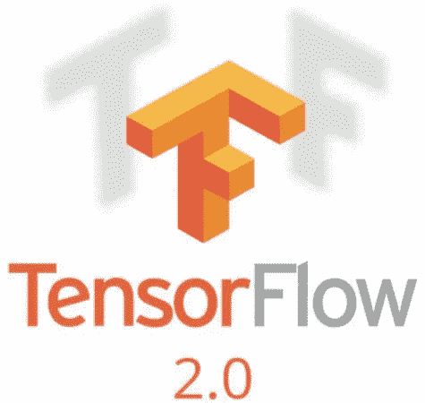

实验还将使用 **Tensorflow v2.0** (仍在 alpha 阶段)作为深度学习框架。我想展示的是通过遵循他们的一些[最佳实践](https://medium.com/tensorflow/effective-tensorflow-2-0-best-practices-and-whats-changed-a0ca48767aff)来测试和使用 Tensorflow v2.0。Tensorflow v2.0 中我喜欢的一个特性是，通过使用他们的亲笔签名，它确实加速了模型的训练。可以通过使用`@tf.function`定义我们的函数来使用。此外，不再有“tf.session ”,也没有全局初始化。这些特点是我从 Tensorflow 转到 PyTorch 的原因之一。Tensorflow 的可用性对我来说并不好。然而，在我看来 Tensorflow v2.0 改变了这一切，增加了它们的可用性，使做一些实验变得更舒适。

这个实验还使用了**自我关注层**。自我注意层会告诉我们，给定一个连续的实例(例如在音乐音符“C D E F G”中)，每个记号会学习到那个记号对其他记号的影响有多大。以下是一些示例(针对 NLP 任务):


Image 1 : Visualization of attention. Taken from : [http://jalammar.github.io/illustrated-transformer/](http://jalammar.github.io/illustrated-transformer/)

关于自我关注的进一步信息，尤其是关于变形金刚的，你可以看[这篇牛逼的文章](http://jalammar.github.io/illustrated-transformer/)。

事不宜迟，让我们继续创作音乐

# 技术和数据

本实验将使用:

1.  Tensorflow v2.0:深度学习框架，Tensorflow 的新版本，仍处于 alpha 开发阶段。
2.  Python 3.7
3.  合作实验室:免费的 Jupyter 笔记本环境，无需设置，完全在云中运行。有 GPU 特斯拉 K80 甚至 TPU！遗憾的是，在撰写本文时，Tensorflow v2.0 alpha 仍不支持 TPU。
4.  Python 库 *pretty_midi* :操作和创建 midi 文件的库

对于数据，我们使用 Magenta 的 **MAESTRO** (为同步轨道和组织编辑的 MIDI 和音频)作为[数据集](https://magenta.tensorflow.org/datasets/maestro)。该数据集仅包含钢琴乐器。我们将从大约 1000 首音乐中随机抽取 100 首，以加快我们的训练时间。

# 管道

下面是我们的音乐生成器将如何工作的管道:

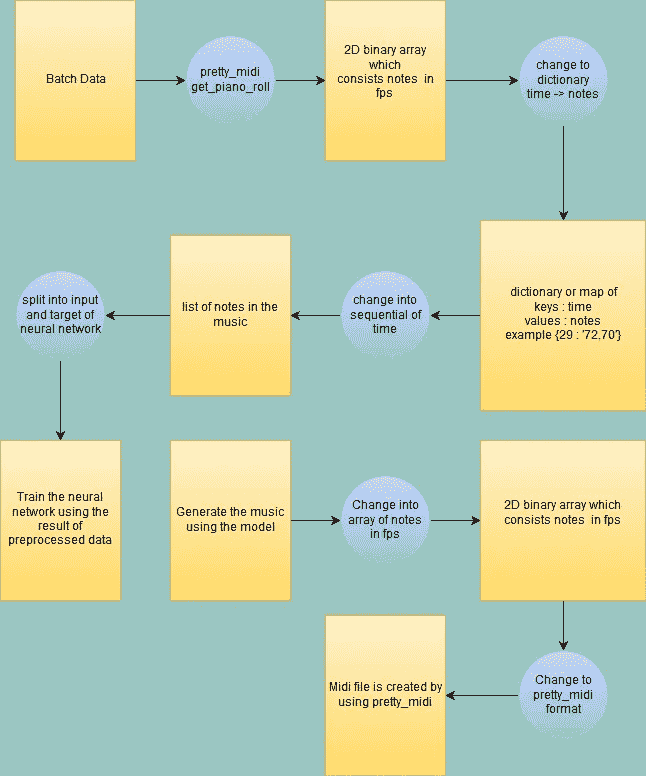

Image 2 : Pipeline

我们将看到每一个过程。为简单起见，我们将每个流程划分如下:

1.  预处理待输入神经网络的 MIDI 文件
2.  培训过程
3.  生成 MIDI 文件

# 预处理 MIDI 文件

在我们进入如何预处理 midi 文件之前，我们需要知道什么是 Midi 格式文件。

从[**pcmag**](https://www.pcmag.com/encyclopedia/term/47014/midi)**中，MIDI 的定义:**

> **乐器、合成器和计算机之间交换音乐信息的标准协议。开发 MIDI 是为了允许一个合成器的键盘演奏另一个合成器产生的音符。它定义了音符以及按钮、拨号盘和踏板调整的代码，MIDI 控制信息可以编排一系列合成器，每个合成器演奏乐谱的一部分。MIDI 版本 1.0 于 1983 年推出。**

**总之，MIDI 文件包含一系列带有音符的乐器。比如钢琴和吉他的结合。每种乐器通常有不同的音符来演奏。**

**对于 MIDI 文件的预处理，Python 中有一些库可以用来完成。其中一个就是`[*pretty_midi*](https://github.com/craffel/pretty-midi)`。它可以操作 MIDI 文件，也可以创建一个新的。在本文中，我们将使用这个库。**

**对于`pretty_midi`, midi 文件的格式如下:**

**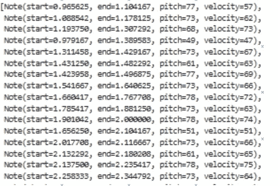**

**Image 3 : PrettyMidi format**

****开始**是以秒为单位弹奏的音符的开始。**结束**是一个音符在一秒钟内演奏完毕。一次可以有多个音符重叠。 **Pitch** 是弹奏的音符的 MIDI 编号。**力度**是弹奏音符的力度。**

**关于 MIDI 编号和音符名称之间的关系，可以参考下图:**

**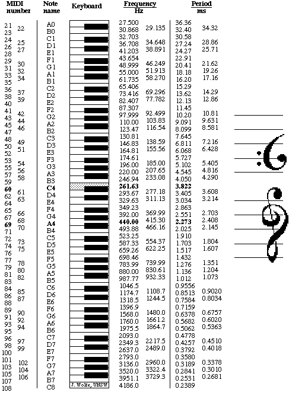**

**Image 4 : Midi Number with the Note Name. Taken from [https://newt.phys.unsw.edu.au/jw/notes.html](https://newt.phys.unsw.edu.au/jw/notes.html)**

## **读取 Midi 文件**

**我们将成批读取 midi 文件。这是我们如何使用 *pretty_midi* 读取它:**

```
midi_pretty_format = pretty_midi.PrettyMIDI('song.mid')
```

**我们会得到`PrettyMidi`的对象。**

## **钢琴卷帘窗阵列预处理**

**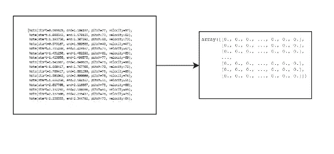**

**Image 5 : PrettyMidi to Piano Roll Array**

**对于本文，我们需要从乐器中提取音乐的所有音符。许多 MIDI 文件的音乐中有多种乐器。在我们的数据集中，MIDI 文件只包含一种乐器，即钢琴。我们将从钢琴乐器中提取音符。为了使它更容易，我们将提取每秒所需帧的笔记。`pretty_midi`有一个方便的函数`get_piano_roll`来获取`(notes, time)`维数组中二进制 2D numpy.array 的注释。`notes`长度为 128，`time`跟随音乐的持续时间除以 FPS。**

**源代码我们是如何做到的:**

```
midi_pretty_format = pretty_midi.PrettyMIDI(midi_file_name)
piano_midi = midi_pretty_format.instruments[0] # Get the piano channels
piano_roll = piano_midi.get_piano_roll(fs=fs)
```

## **对时间和笔记字典进行预处理**

**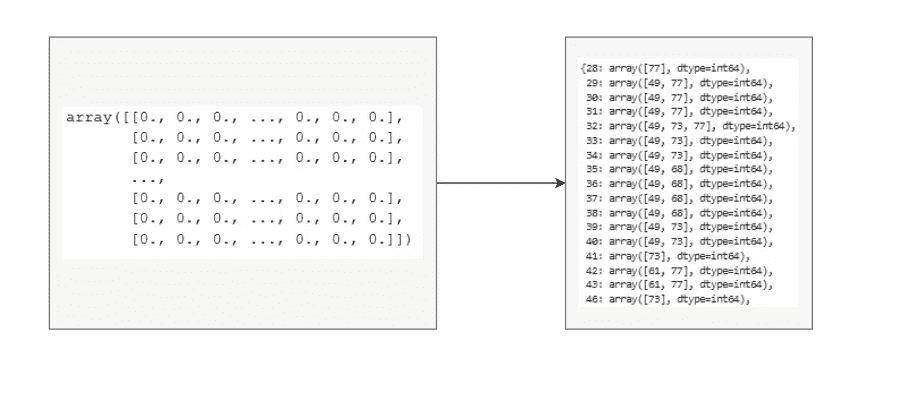**

**Image 6 : Piano Roll Array to Dictionary**

**当我们得到钢琴卷首的数组后，我们把它们转换成字典。字典将从弹奏音符的时间开始。例如，在上面的图片中，我们从 28 开始(如果我们转换到第二，假设我们以 5 fps 转换到 piano_roll，音乐在 5.6 秒开始播放它的音符，这可以通过 28 除以 5 得到)。**

**创建字典后，我们将把字典的值转换成字符串。例如:**

```
array([49,68]) => '49,68'
```

**为此，我们应该循环字典的所有键并更改其值:**

```
for key in dict_note:
    dict_note[key] = ','.join(dict_note[key])
```

## **对待输入音符列表和神经网络目标进行预处理**

**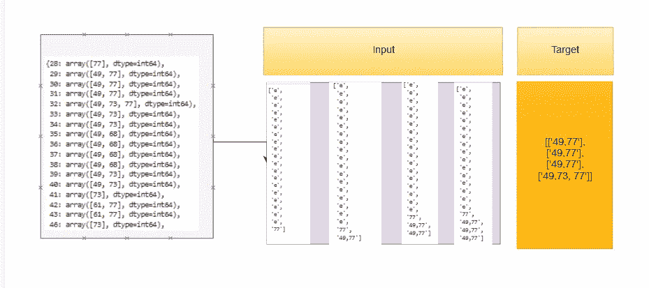**

**Image 7 : Dictionary to List of Sequences**

**在我们得到字典后，我们将把它转换成音符序列，作为神经网络的输入。然后我们得到下一个时间步长作为神经网络的输入目标。**

**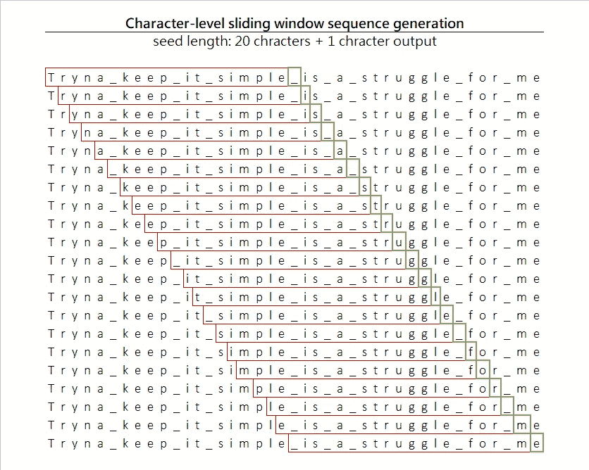**

**Image 8 : Sliding window, taken from : [https://towardsdatascience.com/generating-drake-rap-lyrics-using-language-models-and-lstms-8725d71b1b12](/generating-drake-rap-lyrics-using-language-models-and-lstms-8725d71b1b12)**

**在本文中，序列表的**长度为 50。这意味着如果我们的 fps 是 5，我们将得到一个包含 10 (50 / 5)秒播放时间的序列。****

**列表中的“e”表示在这段时间内没有音符被演奏。因为有时在每个弹奏音符之间会有跳跃或者没有弹奏音符。在**图 7** 的例子中，我们可以看到从 43 到 46 有一个跳跃。如果我们转换序列，序列列表将是:**

```
[ ... '61,77', '61,77', 'e', 'e', '73' , ...]
```

**我们怎么做？我们将在一批音乐中处理音符。**

**我们使用一个 **50** 长的推拉窗。对于音乐中的第一个音符，我们将在列表中添加“e”49 次。然后将开始时间设置为字典中的第一个时间步长。在**图 7** 中的例子中，是 **28** 。然后，我们添加音乐中的第一个音符(例如“77”)。**

**然后，对于下一个实例，我们将窗口滑动一次，将“e”追加到列表中 48 次，追加在时间步长 28 中播放的音符，在时间步长 29 中追加音符，并重复，直到音乐结束**。****

**对于下一首音乐，我们重复上述过程。**

**这是源代码:**

## **创建笔记标记器**

**在我们深入研究神经网络之前，我们必须创建标记化器，将顺序笔记转换为笔记的顺序索引。首先，我们应该将票据映射到一个表示票据 id 的索引中。**

**例如:**

```
{
'61,77' : 1, # 61,77 will be identified as 1
'e' : 2,
'73' : 3,
.
.
}
```

**因此，如果我们之前的输入如下:**

```
[ ... , '61,77', '61,77', 'e', 'e', '73' , ...]
```

**我们将其转换为:**

```
[ ... 1, 1, 2, 2, 3 , ...]
```

**这是我们的做法。**

**总结我们的预处理函数，下面是我们将使用的函数:**

# **火车模型**

**在我们了解如何使用 Tensorflow v2.0 的新功能进行训练之前，我们将看到如下架构:**

## **神经网络体系结构**

**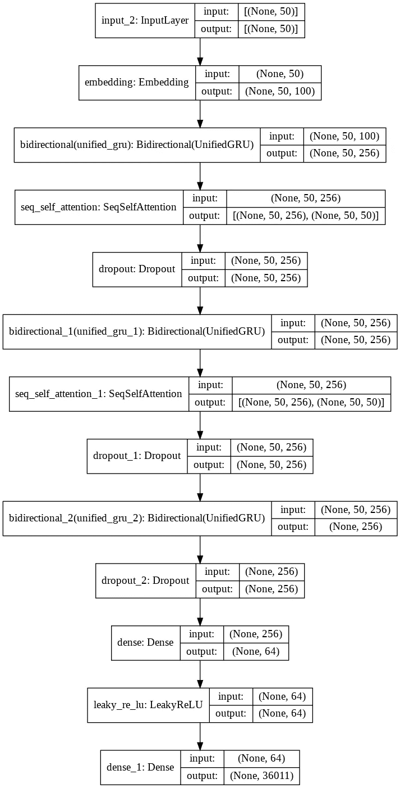**

**Image 9 : Our Neural Network Architecture**

**因此，深度学习架构将使用 3 层门控递归单元(GRU，递归神经网络的一种变体)和一些自我关注层。使用丢弃是为了使神经网络不会过拟合得太快。**

**对于自我关注层，我们将使用[这个](https://github.com/CyberZHG/keras-self-attention)存储库并稍加编辑，以便我们可以在 Tensorflow v2.0 上使用它。**

****代码:****

## **培养**

**我们将通过迭代数据集中的一些音乐来更新模型的权重，并如上所述对数据进行预处理。然后，我们将一批实例中的一些实例作为神经网络的输入和目标。**

**我们将使用`GradientTape`来更新神经网络的权重。首先，我们计算损耗，并使用`apply_gradients` 对其进行反向传播。如果你熟悉 PyTorch 的使用，这就是 Pytorch 训练神经网络模型的方法。**

**确保在功能上使用`@tf.function`。这样可以把功能转换成亲笔签名，让我们的训练更快。`tf.function`的一个缺点是不能使用不同大小的批次作为神经网络的输入。例如，我们的批量是 64。如果数据集的大小是 70，最后一批将包含 6 个实例。这将向程序抛出异常，因为图形将具有与初始图形不同大小的输入。也许它的工作原理是通过使用函数时看到第一个输入来创建占位符。**

**在本文中，我们将使用 16 个`BATCH_SONG` 和 96 个`BATCH_NNET_SIZE`。这意味着我们将从所有音乐列表中选取 16 首音乐，然后提取其序列。然后对于神经网络中的每一步，我们从提取的序列实例中取 96 个序列作为神经网络的输入和目标。**

**代码如下所示:**

# **推理并生成 MIDI 文件**

**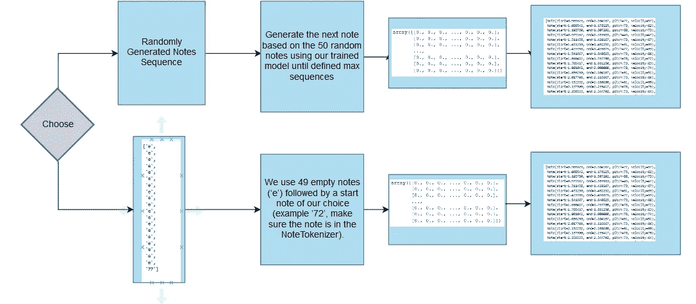**

**Image 10 : Inference and Generate MIDI files**

**使用我们训练过的神经网络模型，有两种方法生成 MIDI 文件:**

**我们需要从一开始就做出选择:**

1.  **我们随机生成 50 个音符作为音乐的开始。**
2.  **我们使用 49 个空注释(' e ')，后跟我们选择的开始注释(例如' 72 '，确保注释在 NoteTokenizer 中)。**

**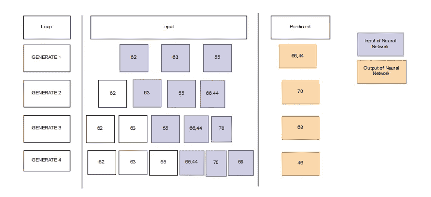**

**Image 11 : Visualization on how the generator works**

**在我们选择了音乐生成器的*种子*之后，我们使用训练好的模型根据 50 个随机音符预测下一个音符。我们用预测值作为随机选择音符的概率分布。我们这样做，直到指定我们想要的最大序列长度。然后我们放下前 50 个音符。**

**在我们生成一个音符序列列表后，我们将再次将其转换为钢琴卷帘窗数组。然后将其转换为 PrettyMidi 对象。**

**之后，我们调整音乐的速度和节奏，最终生成 MIDI 文件。**

**代码:**

**这是如何从生成的音符编写 midi 文件:**

# **结果**

**当我做的时候，训练花了 1 个小时 1 个纪元。当我这样做的时候，我决定运行 4 个纪元(4 小时)的训练。**

**根据经过 4 个时期训练的模型，以下是结果:**

****随机生成 50 张纸币****

**Sound 2**

**Sound 3**

****从一个音符生成****

**Sound 4**

**Sound 5**

**(注意，这些是从 MIDI 文件转换而来的 mp3 文件。我用在线转换器做到这一点。这份笔记似乎有点与原作*的*不符。如果你想听的话，我会上传原始的 MIDI。)**

**这些生成的音符之间存在明显的差异。如果我们从一个音符生成它，它将在演奏音符时有一个缓慢的速度开始。它不同于我们从 50 张随机纸币中产生的。它没有一个缓慢的开始。**

**这是选择从随机的 50 个音符开始的音乐的最后一个序列上的自我注意块的可视化:**

****首先关注****

**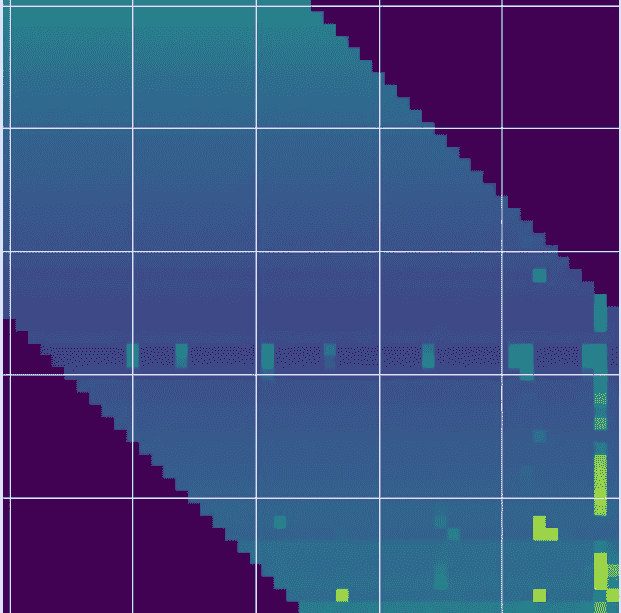**

**Image 12 : First Self Attention**

****第二注意****

**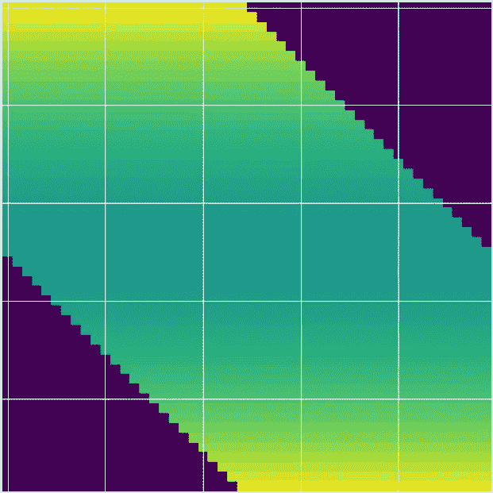**

**Image 13 : Second Self Attention**

**正如你所看到的，第一个自我注意块学习序列实例中的每个音符要关注什么音符。然而，对于第二个注意块应该关注什么还没有结果。我们还可以看出，如果其他音符的位置离当前音符很远，它将不会聚焦到当前音符(图像 12 和图像 13 中的黑色)。**

# **结论**

**我们已经建立了一个工具来生成包含钢琴音乐的 MAESTRO 数据集的音乐。我们对它进行预处理，训练我们的神经网络模型，然后用它生成音乐。这些音乐是 MIDI 格式的。我们用 Tensorflow v2.0 来做。我认为 Tensorflow v2.0)的用户体验比之前的版本更好。**

**我们的模型生成的音乐也很连贯，很好听。它可以调整如何弹奏音符。例如:当发生器从一个音符(意味着它是音乐的开始)开始时，它以慢节奏开始。**

**我们可以为音乐生成器尝试一些东西。在本文中，我们对生成单个乐器进行了实验。如果音乐有多种乐器会怎样？需要有一个更好的架构来做这件事。我们可以尝试多种方法来试验音乐数据。**

# **编后记**

****

**Photo by [Alan Chen](https://unsplash.com/@chzenan?utm_source=medium&utm_medium=referral) on [Unsplash](https://unsplash.com?utm_source=medium&utm_medium=referral)**

**这就是这篇关于生成钢琴音乐音符的文章。事实上，我写这篇文章的灵感来自于我的第一篇关于深度学习的文章，深度学习是生成音乐的歌词。"生成音乐笔记怎么样？"。我试验了一下，很好……它工作了。**

**对我来说，做这个实验有些困难。首先，我需要搜索什么样的文件格式便于预处理和作为神经网络的输入。我发现 MIDI 很简单，文件也很小。然后，我需要知道在 Python 中有没有可以预处理文件的库。我找到了两个，有`music21` 和`pretty_midi` ，它们的存储库没有过期。我选择`pretty_midi`。也许是因为它的名字里有“漂亮”😝。最后，我需要思考如何对笔记进行预处理。谢天谢地，`pretty_midi`有一个方便的功能`get_piano_roll`让它变得更容易。**

**我也没看过多少关于音乐的研究论文。也许有研究论文可以被复制，可以在实验室里看到。**

**我很抱歉缺乏对自我关注层的可视化。**

> **我欢迎任何可以提高我自己和这篇文章的反馈。我正在学习写作和深度学习。我感激能让我变得更好的反馈。确保以适当的方式给出反馈😄。**

**在我的下一篇文章中再见！**

****

**Source : [https://cdn.pixabay.com/photo/2017/07/10/16/07/thank-you-2490552_1280.png](https://cdn.pixabay.com/photo/2017/07/10/16/07/thank-you-2490552_1280.png)**

# **贮藏室ˌ仓库**

**[](https://github.com/haryoa/note_music_generator) [## haryoa/note_music_generator

### 在 GitHub 上创建一个帐户，为 haryoa/note_music_generator 的开发做出贡献。

github.com](https://github.com/haryoa/note_music_generator) 

# 来源

[](https://www.pcmag.com/encyclopedia/term/47014/midi) [## 百科全书

### (乐器数字接口)一种标准协议，用于在音乐…

www.pcmag.com](https://www.pcmag.com/encyclopedia/term/47014/midi) [](https://newt.phys.unsw.edu.au/jw/notes.html) [## 记下名称、MIDI 编号和频率

### 记下名称、MIDI 编号和频率

音符名称、MIDI 编号和频率 new . phys . UNSW . edu . au](https://newt.phys.unsw.edu.au/jw/notes.html) [](http://jalammar.github.io/illustrated-transformer/) [## 图示的变压器

### 在之前的帖子中，我们研究了注意力——现代深度学习模型中普遍存在的方法。注意力是一种…

jalammar.github.io](http://jalammar.github.io/illustrated-transformer/) [](https://github.com/Skuldur/Classical-Piano-Composer) [## 斯库尔杜尔/古典钢琴作曲家

### 在 GitHub 上创建一个帐户，为 Skuldur/古典钢琴作曲家的发展做出贡献。

github.com](https://github.com/Skuldur/Classical-Piano-Composer) [](https://magenta.tensorflow.org/) [## 品红

### 一个探索机器学习在艺术和音乐创作过程中的作用的研究项目。

magenta.tensorflow.org](https://magenta.tensorflow.org/) 

[https://cs224d.stanford.edu/reports/allenh.pdf](https://cs224d.stanford.edu/reports/allenh.pdf)

 [## 有效张量流 2.0 |张量流|张量流

### TensorFlow 1 中常见的使用模式。x 是“厨房水槽”策略，所有可能的计算…

www.tensorflow.org](https://www.tensorflow.org/alpha/guide/effective_tf2)**