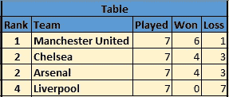
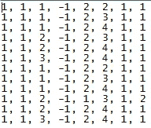

# 利用数据科学生成体育排名

> 原文：<https://towardsdatascience.com/generate-sports-rankings-with-data-science-4dd1979571da?source=collection_archive---------9----------------------->


在本教程中，我们将介绍一种非常流行的算法，用于为运动队生成排名。我们将要学习的方法叫做科利评级。

在深入研究之前，让我们先了解为什么需要这些排名系统。简单的输赢比会不会不够？要回答这个，我们先来看一个例子。假设有一个有 4 支球队参加的锦标赛，以下是结果，以及到目前为止锦标赛的最终排名。


正如你所看到的，曼联赢得了他们的所有 6 场比赛，轻松地坐在首位，利物浦输掉了他们所有的比赛，躺在积分榜的底部。阿森纳和切尔西分享战利品，两轮都被曼联击败，两轮都击败了利物浦，然后他们平分秋色，阿森纳在第一轮获胜，切尔西在反向比赛中回敬。

现在想象我们开始第三轮比赛，前几场比赛的结果如下。第一场:阿森纳击败曼联第二场:切尔西击败利物浦
更新后的表格如下。



等等，切尔西和阿森纳真的应该得到同样的排名吗？这不是很明显吗？阿森纳击败了曼联，他们是目前为止在锦标赛中占主导地位的球队，而切尔西击败了利物浦，反正他们输掉了所有的比赛。毫无疑问，阿森纳应该得到更多的信任，排名应该高于切尔西。但是我们怎么做呢？如果我们只是用一个简单的输赢比，就没有办法区分它们。更进一步，如果你考虑净胜球之类的问题，考虑到所有比赛都是以 2 比 1 的比分获胜，我们再次陷入僵局。那么我们应该如何考虑阿森纳击败了一支比切尔西强大得多的球队，因此应该得到更高的排名。这就是排名系统发挥作用的地方。正如我们将看到的，科利排名能够理解强队被击败的事件，并相应地调整他们的排名。所以不要再拖延了，让我们开始吧。

## **科利排名**

Wesley N. Colley 先生建议，不要像；收视率=[总胜场数]/[总游戏数]，收视率应根据以下公式计算

评级= [1 +总胜场数] / [2 +总游戏数]。如果你看看这个公式，在任何锦标赛开始之前，所有球队都将以 0.5 的评分开始，因为“总胜场数”和“总游戏数”都将为零。记住这一点(事实上所有的团队都是从 0.5 分开始的)，它以后会派上用场的。事实上，在所有时间内，所有团队的评分在科利算法中的平均值将始终保持在 0.5。
我们可以写出如下所示的总胜率。


仔细观察单个团队的* [总游戏数]项，我们可以说*[总游戏数] = * [1+1+1…1]，其中“1”代表与每个对手进行的游戏。这反过来可以写成*[总游戏数] = [1/2 + +..].如果你还记得，就像开始时所说的，所有团队的评分都在 0.5 左右，因此所有团队的平均评分加起来也是 0.5。考虑到这一点，我们可以说[1/2 + +..]~ =[对手评分总和]。以此改写总胜率的方程式。


重写评分公式，


扩展总胜率并写下单个团队的评分，我们可以写为。


其中，rᵢ、wᵢ、lᵢ和 ti 代表感兴趣的球队的评分、胜场、负场和总场次，而∑rj 是对手评分的总和。这可以进一步重新安排为


现在，正如我的大多数其他教程一样，让我们使用一个玩具示例来更好地理解数学方程。考虑两个团队的情况。如上所述，在开始之前，它们都将具有 0.5 的评级。现在让我们假设他们互相打了一场比赛。让 rW 和 rL 分别代表赢队和输队的新评级。如果您为两个团队输入 tᵢ(等于 1)，并考虑他们的 wᵢ和 lᵢ值，我们将从等式(a)获得以下结果


这代表一个简单的两变量线性系统，当求解时，我们得到新的额定值 rw = 5/8 和 rL = 3/8。对于 2 个团队，方程(A)导致两个变量的线性系统，对于 N 个团队，它将导致 N 个变量的线性系统。在编程世界中，每当我们想要解 N 个变量的线性方程时，我们总是把它们写成矩阵的形式。因此，将矩阵形式的等式(A)改写为


其中*向量 r* 表示所有评级 rᵢ的列向量，而*向量 b* 是等式(a)右侧的列向量。矩阵 C 被定义为**科利矩阵**，只是稍微复杂一些。想象一下，我们最喜欢的四支英超球队排成 4x4 的行列，如下图所示


科利矩阵中的对角线元素应由相应球队的数字= (2 +总游戏数)填充。因此，第一个蓝色单元格的值应该是 2 +曼联的比赛次数。同样的，切尔西、阿森纳和利物浦的比赛也将被填满。由绿色单元格表示的对角线外的元素应该具有由该单元格的行和列表示的团队之间进行的游戏次数的负值。因此，例如，与曼联行和切尔西列相交的单元格应该有一个等于曼联对切尔西比赛次数负值的数字。就这样，我们将填充科利矩阵中的剩余单元。一旦我们解了这个 N 变量线性方程 Cr = b，我们将得到' r '的向量值，它代表每个单独团队的评级。

有了对理论背景的清晰理解，让我们继续编写一个 Python 代码来计算本文开头介绍的 toy example 的 Colley 排名。Python 代码文件以及一些支持文件可以在我的 github repo [这里](https://github.com/PercyJaiswal/Colley_Rankings)找到。

在开始编码之前，让我解释一下两个支持文件的结构，即“分数”和“团队”，它们都是“逗号分隔值”格式。“团队”文件包含团队列表，旁边有一个“号码”。这个“号码”将用于在“分数”文件中代表该队。下面的截图显示了“团队”文件的内容。


所以从现在开始，无论何时我们想代表曼联，我们都会用 1 号代表他们。同样，对于切尔西、阿森纳和利物浦，我们将分别使用数字 2、3 和 4 来代表他们的分数。现在让我们在下面截图的帮助下看看分数的文件。



“分数”文件中的每一行对应一场比赛。我稍后会解释为什么这个文件有如此特殊的顺序。“分数”文件中的列表示= >列 1 =从 1/1/0000 开始玩这个特定游戏的天数。第 2 列=今天的日期。第 3 列=团队 1 号。第 4 列=球队 1‘主场’值(1 =主场，-1 =客场，0 =中立)。第 5 列=团队 1 得分。第 6 列=团队 2 号。第 7 列=球队 2‘主场’值(1 =主场，-1 =客场，0 =中立)。第 8 列=团队 2 得分。

因为在本练习中我们不会使用第 1、2、4 和 7 列的值，所以我为它们设置了虚拟数字。此外，为了方便起见，我将分数(第 5 列表示团队 1 的分数，第 8 列表示团队 2 的分数)分别记为 2 和 1，因为在本例中我们也不会查看分数。我们将用它来决定每场比赛的赢家。

让我们以第一排为例。表示比赛日期的列 1 和 2 分别具有虚拟值“1”。第 3 列的值为“1”。交叉检查我们的“团队”文件，我们可以看到值“1”是用来代表曼联。第 4 列有“-1”，表示这场比赛是曼联的客场比赛。第 5 列的值为“2 ”,表示曼联进了 2 个球。第 6 列数值代表第 2 队的号码，其中 2 号表示第 2 队是切尔西，这是一场曼联对切尔西的比赛。第 7 列的值为“1 ”,表示这是切尔西的主场比赛，最后一列的值为“1 ”,表示切尔西的进球数。

最后，让我们开始编码这个算法。编码 Colley 算法相对简单，并且相当容易理解。与任何 Python 文件一样，我们将导入所需的包，即本例中的 numpy 和 pandas。

```
# Importing packages
import numpy as np
import pandas as pd
```

然后我们去读“团队”和“分数”文件。

```
# Reading 'teams' and 'scores' data
teams = pd.read_csv('teams.txt', header = None)
num_of_teams = len(teams.index)data = pd.read_csv('scores.txt', header = None)
```

我们用所需维数中的所有 0 来初始化 Colley 矩阵和向量 b。

```
# Initializing Colley Matrix 'c'and vector 'b'
c = np.zeros([num_of_teams, num_of_teams])
b = np.zeros(num_of_teams)
```

然后，逐行迭代“分数”文件，我们根据哪个队在比赛以及每场比赛的获胜者来填充 Colley 矩阵和向量“b”。

```
# Iterating through rows and populating Colley matrix values
for index, row in data.iterrows():
    t1 = row[2]
    t2 = row[5]

    c[(t1-1)][(t1-1)] = c[(t1-1)][(t1-1)] + 1 # Updating diagonal element
    c[(t2-1)][(t2-1)] = c[(t2-1)][(t2-1)] + 1 # Updating diagonal element
    c[(t1-1)][(t2-1)] = c[(t1-1)][(t2-1)] - 1 # Updating off - diagonal element
    c[(t2-1)][(t1-1)] = c[(t2-1)][(t1-1)] - 1 # Updating off - diagonal element

    # Updating vecotr b based on result of each game
    if row[4] > row[7]:
        b[(t1-1)] += 1
        b[(t2-1)] -= 1
    elif row[4] < row[7]:
        b[(t1-1)] -= 1
        b[(t2-1)] += 1
```

一旦完成，我们按照等式(A)进行调整，将 2 加到 Colley 矩阵的对角元素，并将 1 除以向量 b 的每个元素。

```
# Adding 2 to diagonal elements (total number of games) of Colley matrix
diag = c.diagonal() + 2
np.fill_diagonal(c, diag)# Dividing by 2 and adding one to vector b
for i, value in enumerate(b):
    b[i] = b[i] / 2
    b[i] += 1
```

然后，我们使用 numpy 的 linalg.solve()求解这个 N 变量线性方程。

```
# Solving N variable linear equation
r = np.linalg.solve(c, b)
```

一旦我们在“r”中得到结果，我们通过使用 argsort()方法显示前 4 个团队。

```
# Displaying ranking for top 4 teams
top_teams = r.argsort()[-4:][::-1]
for i in top_teams:
    print (str(r[i]) + " " + str(teams.iloc[i][1]))
```

这样，如果您成功下载了 repo 并运行了这段代码，您应该会看到下面的输出。


现在，为了检查这个算法的真正实力，我们将通过插入下面几行来在我们的“分数”文件中增加两个游戏。
第一场:阿森纳击败曼联= > 1，1，1，-1，1，3，1，2
第二场:切尔西击败利物浦= > 1，1，2，-1，2，4，1，1
在‘scores’中做了上述修改后再次运行 Python 文件，会得到如下结果。


正如你所看到的，即使阿森纳和切尔西打了，赢了和输了同样多的比赛，科利算法也能够认识到这样一个事实，即阿森纳击败了比被切尔西击败的利物浦更强大的曼联队。

# **状态良好的团队**

回到“分数”文件的格式，让我们再看一个用例。假设锦标赛有 3 轮，结果如下图所示。


曼联在第一轮赢得所有比赛，切尔西在第二轮赢得所有比赛，阿森纳在第三轮。尽管三支球队在胜利数量上打成平手，但任何有见识的体育人士都会告诉你，在第一轮赢得所有比赛后，曼联已经失败了。另一方面，阿森纳在最近一轮的比赛中连胜，切尔西位于两者之间。考虑到这一点，即使曼联，阿森纳和切尔西的总积分相同，一个好的排名系统应该提供一个区分旧表现和最近表现的条款。

为了将这种“动量”或“形式”因素考虑在内，引入了一个称为“权重”的新变量。借助一个简单的“if else”条件语句，我们给不同的游戏赋予不同的权重。

```
# Iterating through rows and populating Colley matrix values
for index, row in data.iterrows():
    t1 = row[2]
    t2 = row[5]

    if row[0] <= 6: #For first round matches
        weight = 0.9
    elif row[0] > 6 and row[0] <=12: #For second round matches
        weight = 1.0
    else:
        weight = 1.1 #For third round matches

    c[(t1-1)][(t1-1)] = c[(t1-1)][(t1-1)] + 1 * weight # Updating diagonal element
    c[(t2-1)][(t2-1)] = c[(t2-1)][(t2-1)] + 1 * weight # Updating diagonal element
    c[(t1-1)][(t2-1)] = c[(t1-1)][(t2-1)] - 1 * weight # Updating off - diagonal element
    c[(t2-1)][(t1-1)] = c[(t2-1)][(t1-1)] - 1 * weight # Updating off - diagonal element

    # Updating vecotr b based on result of each game
    if row[4] > row[7]:
        b[(t1-1)] += 1 * weight
        b[(t2-1)] -= 1 * weight
    elif row[4] < row[7]:
        b[(t1-1)] -= 1 * weight
        b[(t2-1)] += 1 * weight
```

随着锦标赛的进行，旧游戏的比重越来越小。而与前两轮相比，最新一轮的装置被给予更高的权重。通过以上修改，如果我们再次运行我们的 Colley 算法，我们将得到以下结果。


不出所料，在最近的比赛中赢得所有比赛的阿森纳排名第一，而曼联排名第三，尽管他们与阿森纳和切尔西积分相同。

就这样，我将结束这篇文章。希望你这个体育迷和数据科学家能够欣赏科利方法的美丽和简单。

像往常一样，如果你喜欢这篇文章，在 Twitter 上关注，转发，或者鼓掌，媒体上的赞将鼓励我继续我的博客世界之旅。

直到下一次…干杯！！