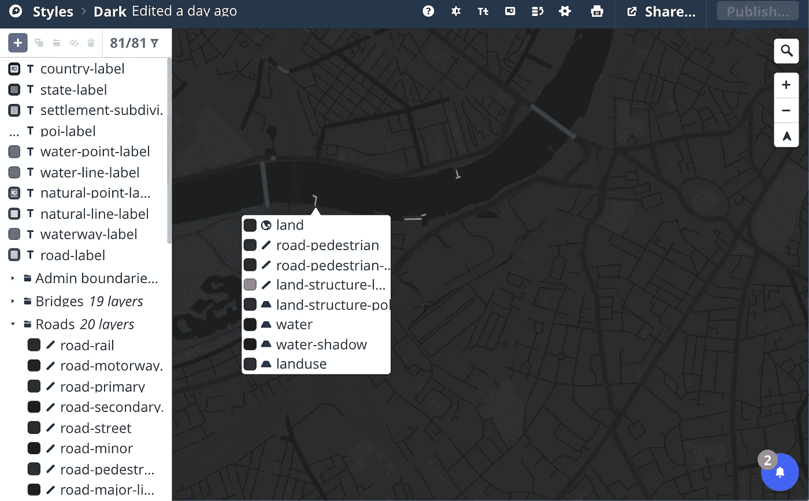

# 用 MapBox GL 和 Python 生成 logo。

> 原文：<https://towardsdatascience.com/generating-a-logo-with-mapbox-gl-and-python-2c44a357f462?source=collection_archive---------14----------------------->


建筑足迹总是有一种令人愉悦的美感。视觉设计通常源于自然和人造的隐喻——这两种事物都包含在制图领域中。拓扑特征和水路为我们呈现了柔和的曲线特征，与道路设计的线性和对称形状形成了直接对比。

在这里，我们将建筑物的占地面积绘制成类似 Tron 的图像，有点像印刷电路板(PCB)。

## 第一步:选择你的位置

就我个人而言，我发现河流与城市结合的地方效果最好。这就是为什么我选择使用[威斯敏斯特划船基地](https://www.westminsterboatingbase.co.uk)的位置，这是伦敦市中心的一个小型水上运动中心。

使用快速谷歌地图搜索，可以从 url 获得经度和纬度:

[****51 29 ' 06.6 " N+0 08 ' 04.9 " W****](http://www.google.com/maps/place/51°29'06.6"N+0°08'04.9"W/)

## *步骤 2:获取建筑造型文件*

*获取一个国家建筑物的形状文件有很多来源。美国的足迹可以在这里[找到](https://github.com/microsoft/USBuildingFootprints)，英国的足迹可以通过英国国家测绘局的开放地图项目(链接如下)找到。*

*[](http://ajrae.staff.shef.ac.uk/buildings/) [## 英国的所有建筑

### 此页面包含为整个英国构建 shapefile 数据的链接，以及指向单个地理包的链接…

ajrae.staff.shef.ac.uk](http://ajrae.staff.shef.ac.uk/buildings/) 

## 步骤 3:只提取你需要的数据

这个过程涉及到 Python 的使用，结合 [geopandas](http://geopandas.org) 库`pip install geopandas`。

我们用`geopandas.read_file`读取文件，然后过滤掉任何不想要的结果。因为我们希望绘制的区域包括三个不同的行政区，所以我们只在`NAME`列包含其中一个行政区名称的地方提取数据:

```
selection = all_data[ (all_data.NAME == 'Westminster') ^     
                      (all_data.NAME == 'Wandsworth' ) ^ 
                      (all_data.NAME == 'Lambeth'    )    ]
```

然后，我们确保我们的单位是经度和纬度的单位:

```
selection = selection.to_crs(epsg=4326).reset_index()
```

## 第四步:只获取我们位置一定半径范围内的建筑

现在我们有了所有的数据，我们希望过滤掉一定距离以外的所有建筑。

为此，我们可以使用 *shapley* **点**几何图形并定义我们的位置。然后，我们可以遍历 GeoPandas 数据框中的所有项目，并且只追加距离所选点一定距离的项目。

```
point = Point(lon,lat)
thresh = 0.01
keep=[]**for** r **in** selection.iterrows(): dst = point.distance(r[1].geometry) **if** abs(dst) < thresh:
        x,y = r[1].geometry.exterior.coords.xy
        keep.append([list(x),list(y)])
```

最后，我们将所有数据写入一个文本文件:

```
**import** **json**
json.dump( [[list(i) **for** i **in** zip(x,y)] **for** x,y **in** keep] , 
                                 open('keep_footprint.json','w') 
```

## 可选:在 python 中预先绘制

```
fig = plt.figure()
ax = fig.add_subplot(111)

**for** poly **in** keep:
    x,y = poly
    ax.plot(x, y, color='red', alpha=0.7,
        linewidth=1, solid_capstyle='round', zorder=2)

ax.set_title('test')
plt.show()
```

## 步骤 5:设计创建地图框样式

现在我们注册了一个免费的地图框账户，用提供的工作室应用【https://studio.mapbox.com 创建我们自己的定制风格

我个人是从“暗”布局开始的，把所有的街道都变暗，把所有的标签的不透明度设置为 0，去掉所有的标签。生产出来的款式可以在这里找到[。](https://studio.mapbox.com/styles/dp626/ck2nqoqic01wu1cs2vdle2hsc/edit/#13.39/51.48051/-0.13192)



Mapbox Studio

## 步骤 6:简单的地图框布局

最后，我们可以使用带有我们的 *lat* 和 *lon* 值的自定义样式的 Mapbox 示例脚本来生成我们位置的预览。(下面链接中的代码)

[](https://docs.mapbox.com/mapbox-gl-js/example/custom-style-id/) [## 以自定义样式显示地图

### 使用自定义地图框托管样式。

docs.mapbox.com](https://docs.mapbox.com/mapbox-gl-js/example/custom-style-id/) 

然后，我们通过添加一个椭圆形的剪辑路径来扩展它，样式为“map”元素:

```
<style>#map{
   width:600px;
   height:600px;
   clip-path:ellipse(300px 300px at 300px 300px);
}</style>
```

为我们的位置添加一个标记:

```
// marker
new mapboxgl.Marker({"color":'#33ff00'})
    .setLngLat([ -0.134605,51.484575])
    .addTo(map);
```


## 步骤 6:加载我们的足迹数据

最后，剩下的就是在文本文件中读取。我发现使用 GitHub 的 raw 格式，结合 d3 库最简单:[d3js.org](https://d3js.org)

```
d3.json(“[https://raw.githubusercontent.com/wolfiex/GeoLogo/master/polyfoot.txt](https://raw.githubusercontent.com/wolfiex/GeoLogo/master/polyfoot.txt)", run)
```

现在，我们需要做的就是在加载的数据集中绘制每个建筑物的轮廓:

```
data.forEach((polygon, i) => {map.addLayer({
        'id': 'poly' + i,
        'type': 'line',
        'source': {
            'type': 'geojson',
            'data': {
                'type': 'Feature',
                'geometry': {
                    'type': 'Polygon',
                    'coordinates': [polygon]
                }
            }
        },
        'layout': {},
        'paint': {
            'line-color': '#088',
            'line-opacity': 0.8
        }
    });
}
})
```

如果我们希望每个形状都被填充而不是描边，我们可以将“类型”设置为`fill`而不是`line`，并相应地更改`line-color`和`line-opacity`。

## 第七步:享受！

我们有了它，一个围绕我们感兴趣的区域的漂亮标志。

*注意:由于可能有许多多边形要绘制，此过程可能需要一段时间才能完成。明智地选择你的门槛距离！*

*