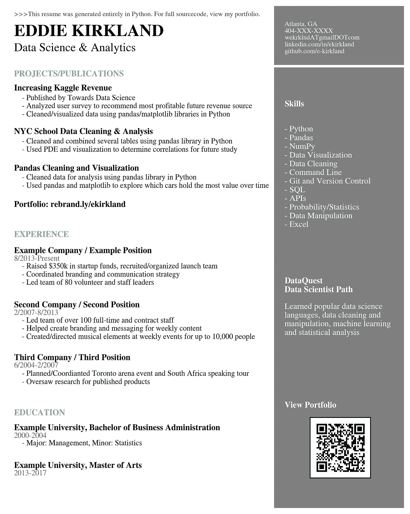

# 用 Python 生成简历

> 原文：<https://towardsdatascience.com/generating-a-resume-in-python-1480a4d6a399?source=collection_archive---------5----------------------->

我正沿着“自学”的道路向数据科学领域过渡。因此，当我坐下来开始写简历时，我努力思考如何在简历这种静态和传统的东西上表达我学到的新技能。老实说，我觉得写简历很吓人。

当我没有能让你眼前一亮的学历或经验时，我如何才能吸引招聘经理的目光呢？

在思考这个问题的时候，我想起了一件重要的事情。虽然数据科学对我来说是一个相对较新的尝试，但我非常精通通信和创造性故事的世界。因此，戴上我的创意帽子，我开始寻找一种新的方式来创建一份简历，它可以以一种自然而清晰的方式快速展示技术数据可视化技能。

而这就是结果…



这非常简单，但是我使用 Python 中的 matplotlib 库编译了整个简历。它基本上是一个 8.5 x 11 的图表，没有轴和信息，但有一些图形线条和许多注释。

它很容易编译，但是它展示了对 Python 的熟练程度和创造性交流的能力。或许更重要的是，它让写简历变得更有趣，也不那么令人生畏。

源代码在下面，或者你可以在[我的 GitHub 库](https://github.com/e-kirkland/datascience/tree/master/Resume)找到。希望你喜欢它，如果你有任何意见或建议让我知道！

```
# Text Variables
Header = '>>>This resume was generated entirely in Python. For full sourcecode, view my portfolio.'
Name = 'EDDIE KIRKLAND'
Title = 'Data Science & Analytics'
Contact = 'Atlanta, GA\n404-XXX-XXXX\nwekrklndATgmailDOTcom\nlinkedin.com/in/ekirkland\ngithub.com/e-kirkland'
ProjectsHeader = 'PROJECTS/PUBLICATIONS'
ProjectOneTitle = 'Increasing Kaggle Revenue'
ProjectOneDesc = '- Published by Towards Data Science\n- Analyzed user survey to recommend most profitable future revenue source\n- Cleaned/visualized data using pandas/matplotlib libraries in Python'
ProjectTwoTitle = 'NYC School Data Cleaning & Analysis'
ProjectTwoDesc = '- Cleaned and combined several tables using pandas library in Python\n- Used PDE and visualization to determine correlations for future study'
ProjectThreeTitle = 'Pandas Cleaning and Visualization'
ProjectThreeDesc = '- Cleaned data for analysis using pandas library in Python\n- Used pandas and matplotlib to explore which cars hold the most value over time'
Portfolio = 'Portfolio: rebrand.ly/ekirkland'
WorkHeader = 'EXPERIENCE'
WorkOneTitle = 'Example Company / Example Position'
WorkOneTime = '8/2013-Present'
WorkOneDesc = '- Raised $350k in startup funds, recruited/organized launch team\n- Coordinated branding and communication strategy\n- Led team of 80 volunteer and staff leaders'
WorkTwoTitle = 'Second Company / Second Position'
WorkTwoTime = '2/2007-8/2013'
WorkTwoDesc = '- Led team of over 100 full-time and contract staff\n- Helped create branding and messaging for weekly content\n- Created/directed musical elements at weekly events for up to 10,000 people'
WorkThreeTitle = 'Third Company / Third Position'
WorkThreeTime = '6/2004-2/2007'
WorkThreeDesc = '- Planned/Coordianted Toronto arena event and South Africa speaking tour\n- Oversaw research for published products'
EduHeader = 'EDUCATION'
EduOneTitle = 'Example University, Bachelor of Business Administration'
EduOneTime = '2000-2004'
EduOneDesc = '- Major: Management, Minor: Statistics'
EduTwoTitle = 'Example University, Master of Arts'
EduTwoTime = '2013-2017'
SkillsHeader = 'Skills'
SkillsDesc = '- Python\n- Pandas\n- NumPy\n- Data Visualization\n- Data Cleaning\n- Command Line\n- Git and Version Control\n- SQL\n- APIs\n- Probability/Statistics\n- Data Manipulation\n- Excel'
ExtrasTitle = 'DataQuest\nData Scientist Path'
ExtrasDesc = 'Learned popular data science\nlanguages, data cleaning and\nmanipulation, machine learning \nand statistical analysis'
CodeTitle = 'View Portfolio'# Setting style for bar graphs
import matplotlib.pyplot as plt
%matplotlib inline# set font
plt.rcParams['font.family'] = 'sans-serif'
plt.rcParams['font.sans-serif'] = 'STIXGeneral'fig, ax = plt.subplots(figsize=(8.5, 11))# Decorative Lines
ax.axvline(x=.5, ymin=0, ymax=1, color='#007ACC', alpha=0.0, linewidth=50)
plt.axvline(x=.99, color='#000000', alpha=0.5, linewidth=300)
plt.axhline(y=.88, xmin=0, xmax=1, color='#ffffff', linewidth=3)# set background color
ax.set_facecolor('white')# remove axes
plt.axis('off')# add text
plt.annotate(Header, (.02,.98), weight='regular', fontsize=8, alpha=.75)
plt.annotate(Name, (.02,.94), weight='bold', fontsize=20)
plt.annotate(Title, (.02,.91), weight='regular', fontsize=14)
plt.annotate(Contact, (.7,.906), weight='regular', fontsize=8, color='#ffffff')
plt.annotate(ProjectsHeader, (.02,.86), weight='bold', fontsize=10, color='#58C1B2')
plt.annotate(ProjectOneTitle, (.02,.832), weight='bold', fontsize=10)
plt.annotate(ProjectOneDesc, (.04,.78), weight='regular', fontsize=9)
plt.annotate(ProjectTwoTitle, (.02,.745), weight='bold', fontsize=10)
plt.annotate(ProjectTwoDesc, (.04,.71), weight='regular', fontsize=9)
plt.annotate(ProjectThreeTitle, (.02,.672), weight='bold', fontsize=10)
plt.annotate(ProjectThreeDesc, (.04,.638), weight='regular', fontsize=9)
plt.annotate(Portfolio, (.02,.6), weight='bold', fontsize=10)
plt.annotate(WorkHeader, (.02,.54), weight='bold', fontsize=10, color='#58C1B2')
plt.annotate(WorkOneTitle, (.02,.508), weight='bold', fontsize=10)
plt.annotate(WorkOneTime, (.02,.493), weight='regular', fontsize=9, alpha=.6)
plt.annotate(WorkOneDesc, (.04,.445), weight='regular', fontsize=9)
plt.annotate(WorkTwoTitle, (.02,.4), weight='bold', fontsize=10)
plt.annotate(WorkTwoTime, (.02,.385), weight='regular', fontsize=9, alpha=.6)
plt.annotate(WorkTwoDesc, (.04,.337), weight='regular', fontsize=9)
plt.annotate(WorkThreeTitle, (.02,.295), weight='bold', fontsize=10)
plt.annotate(WorkThreeTime, (.02,.28), weight='regular', fontsize=9, alpha=.6)
plt.annotate(WorkThreeDesc, (.04,.247), weight='regular', fontsize=9)
plt.annotate(EduHeader, (.02,.185), weight='bold', fontsize=10, color='#58C1B2')
plt.annotate(EduOneTitle, (.02,.155), weight='bold', fontsize=10)
plt.annotate(EduOneTime, (.02,.14), weight='regular', fontsize=9, alpha=.6)
plt.annotate(EduOneDesc, (.04,.125), weight='regular', fontsize=9)
plt.annotate(EduTwoTitle, (.02,.08), weight='bold', fontsize=10)
plt.annotate(EduTwoTime, (.02,.065), weight='regular', fontsize=9, alpha=.6)
plt.annotate(SkillsHeader, (.7,.8), weight='bold', fontsize=10, color='#ffffff')
plt.annotate(SkillsDesc, (.7,.56), weight='regular', fontsize=10, color='#ffffff')
plt.annotate(ExtrasTitle, (.7,.43), weight='bold', fontsize=10, color='#ffffff')
plt.annotate(ExtrasDesc, (.7,.345), weight='regular', fontsize=10, color='#ffffff')
plt.annotate(CodeTitle, (.7,.2), weight='bold', fontsize=10, color='#ffffff')#add qr code
from matplotlib.offsetbox import TextArea, DrawingArea, OffsetImage, AnnotationBbox
import matplotlib.image as mpimg
arr_code = mpimg.imread('ekresumecode.png')
imagebox = OffsetImage(arr_code, zoom=0.5)
ab = AnnotationBbox(imagebox, (0.84, 0.12))
ax.add_artist(ab)plt.savefig('resumeexample.png', dpi=300, bbox_inches='tight')
```