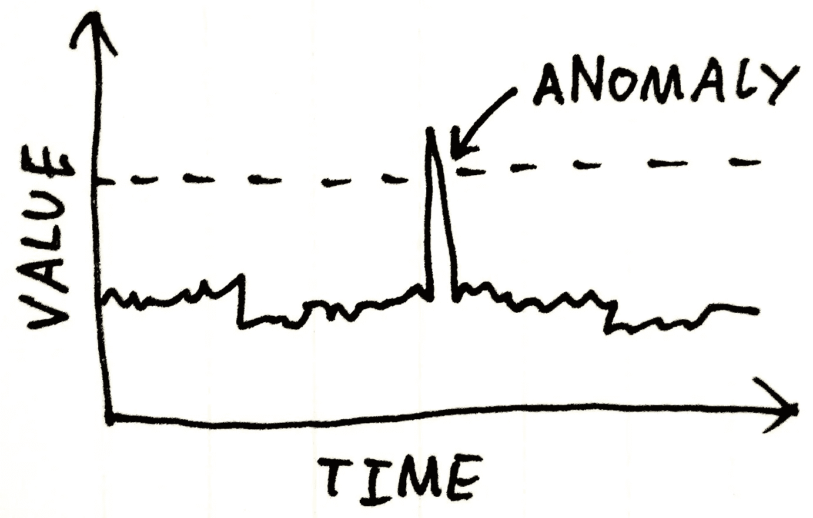
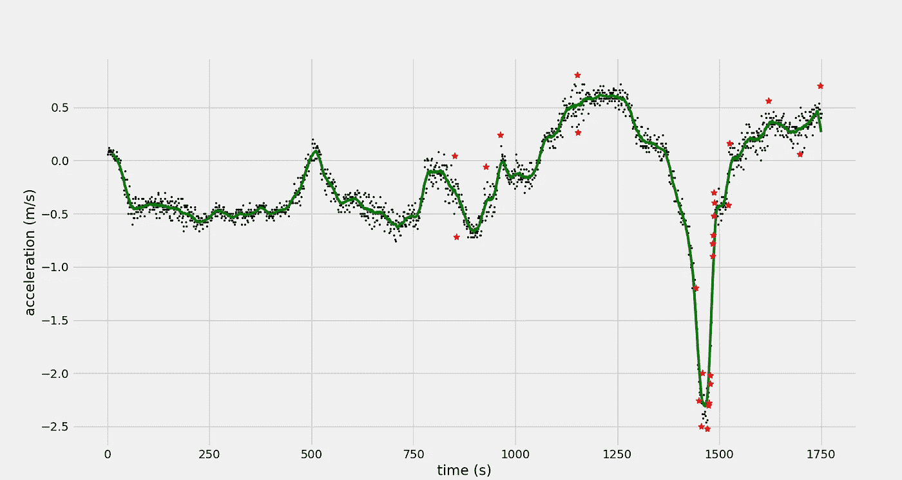

# 使用异常检测生成关键场景

> 原文：<https://towardsdatascience.com/generating-critical-scenarios-using-anomaly-detection-f25e67e0553b?source=collection_archive---------21----------------------->

# 概观

假设你正在开发一辆自动驾驶汽车或软件(我同意这是一个相当大的假设)，你的第一个原型已经准备好，你想彻底测试。一种方法是运行大量测试车，检查系统如何响应其环境，这就是所谓的系统验证。但这可能是非常资本密集型的，虽然你应该这样做，但有一种更容易或更便宜的方式来做，那就是通过模拟，可以非常快速地生成大量数据。在这两种情况下，你都有大量的场景可以测试你的系统，但让自动驾驶软件承受大量的常规条件有意义吗？我们需要在关键场景下测试软件，这是对自治系统的真正测试，但关键场景的生成率不到 1%。在这里，我提出了一种称为异常检测的技术，它可以用来从大量数据中过滤关键场景。

**Anomaly Detection**

首先，让我们从总体上讨论异常或异常值检测。根据维基百科的说法，**异常检测**(也称**异常检测**)是对罕见项目、事件或观察结果的识别，这些项目、事件或观察结果通过与大多数数据显著不同而引起怀疑。那么，如何在数据集上实现异常检测呢？有几种方法可以执行异常检测，例如基于密度的异常检测、基于聚类的异常检测和基于支持向量机的异常检测。这里，我们将讨论一种基于移动平均线的简单方法，该方法将超出移动平均线固定标准偏差的点检测为时间序列数据中的异常值。遍历时间序列数据的平均值并不简单，因为它不是静态的。您需要一个滚动窗口来计算数据点的平均值。从技术上来说，这被称为滚动平均线或移动平均线，它的目的是平滑短期波动，突出长期波动。数学上，n 周期简单移动平均线也可以定义为“低通滤波器”。这里你可以找到一个非常直观的解释[。让我们来看看算法:](http://www.bzarg.com/p/how-a-kalman-filter-works-in-pictures/)

1.  首先，我们定义一个函数，使用离散线性卷积计算固定窗口大小的时间序列数据的移动平均值。卷积是一种数学运算，可以描述为两个函数的乘积在一个函数反转和移位后的积分。在这种情况下，该操作计算每个滑动窗口的平均值。
2.  计算移动平均值后，我们计算 y 值和相应平均值之间的差值，我们称之为残差。接下来，我们计算这些残差的标准差。
3.  我们将异常值定义为相应残差大于移动平均值加三个标准差或小于移动平均值减三个标准差的点。我们将三个标准偏差作为任意选择，它可以根据数据的分布和我们的用例而变化。

让我们来看看 python 中的实现:

在这里，我试图在加速度与时间的样本数据中找到异常，这将给我们带来车辆加速度的异常行为。这可能意味着突然刹车或加速度增加，这可能是由于可能的障碍物、碰撞或急转弯等。以下结果是使用 20 的滚动窗口在样本数据集上获得的:

红点是异常值，绿线是移动窗口的平均值。现在，必须进一步分析这些异常值，以了解它们是否仅对应于我们感兴趣的噪声或关键事件。这种算法为我们提供了整个时间序列数据中的兴趣点，从而缩小了我们的搜索范围。我们可以从我们可能从客户/测试汽车中收集的大量数据中挖掘所有这些关键事件，并将它们输入到我们的自动驾驶汽车系统中，看看它们如何应对这些事件。这对于验证自动驾驶汽车非常有用，因为在我们收集的数据中，只有不到 1%的数据发生了关键事件。

干杯！