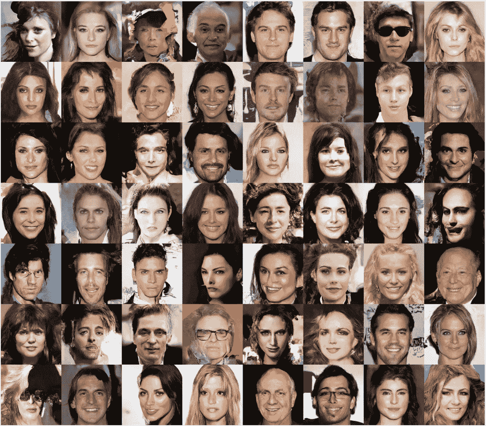
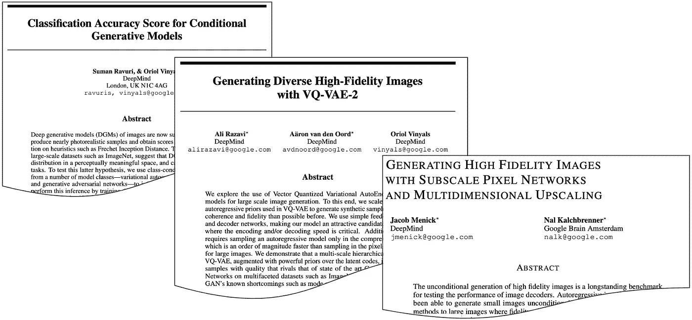
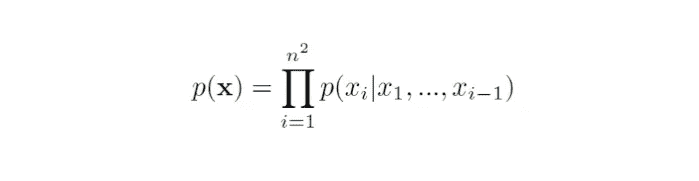
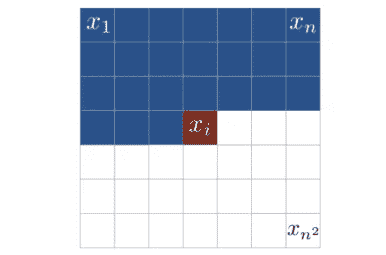
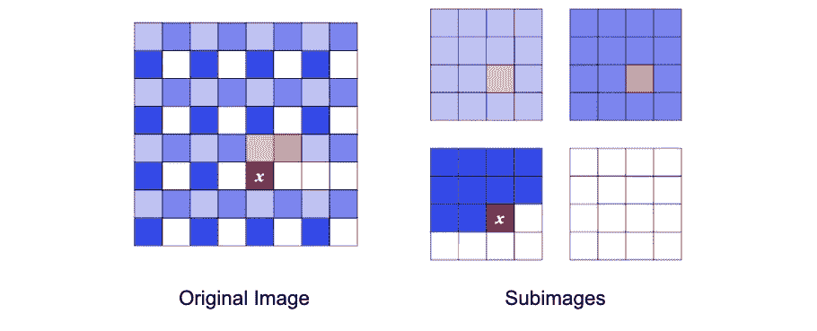
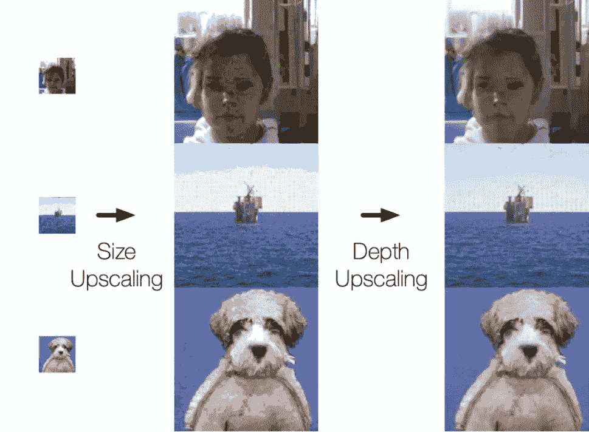
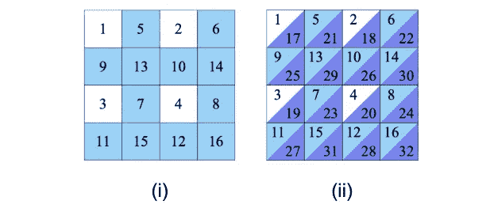
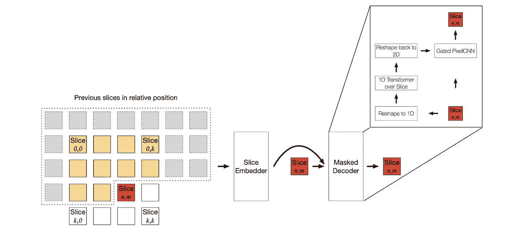
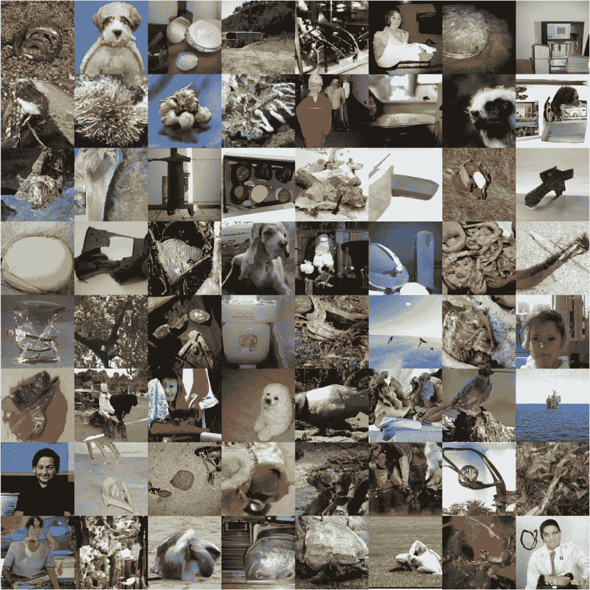

# 使用深度自回归模型生成高分辨率图像

> 原文：<https://towardsdatascience.com/generating-high-resolution-images-using-autoregressive-models-3683f9af0db4?source=collection_archive---------11----------------------->

## 超越 GANs，捕捉真实数据分布的多样性

Figure 1\. High-resolution (256x256 pixels) 8-bit celebrity images generated using a deep autoregressive model trained on the CelebA-HQ dataset.

# 介绍

图 1 中的名人面孔并不存在。它们是使用深度自回归模型生成的，该模型是由谷歌 Deepmind 和谷歌大脑的研究人员在一篇题为“[用亚尺度像素网络和多维尺度放大生成高保真图像](https://arxiv.org/abs/1812.01608)”的论文中引入的。这项工作特别重要，因为它朝着生成高分辨率、高保真度的自然图像迈出了一大步，同时支持整个数据分布并保证模型的概化能力。不用担心这里介绍的不熟悉的术语。在这篇文章中，我将带你浏览这篇文章，并解释所有的术语。最近我也在 [AISC](https://aisc.ai.science/) 展示并讨论了这项工作。你可以在 [YouTube](https://youtu.be/CCE5trqFanA) 上找到完整的演示。

在我们深入阅读本文之前，让我先概述一下我们的目标:

1.  文件概述:其目标和贡献；
2.  图像生成的深度生成模型与该领域最新趋势的比较:
3.  图像生成的深度自回归模型概述:它们是什么，为什么我们对它们感兴趣，以及以前方法的主要挑战；和
4.  深入探究子尺度像素网络和多尺度放大:它们是什么，它们为什么工作，以及它们如何与以前的深度自回归模型进行比较。

本文的目标是构建一个深度自回归(AR)解码器，它可以无条件地生成高保真图像。保真度是指模型生成真实图像的程度，这项工作能够使用深度 AR 模型在高分辨率下生成高度逼真的图像。我们将讨论与使用深度 AR 模型生成高分辨率、高保真度图像相关的主要挑战，并且我们将解释在这项工作中引入的用于解决这些问题的解决方案。

这里将简单介绍的 [pixelRNN、pixelCNN](https://arxiv.org/abs/1601.06759) 等深度 AR 模型就是成功利用深度 AR 模型进行图像生成的例子；但是，它们只能生成分辨率相对较低的图像(32x32 和 64x64 像素图像)。使用深度 AR 模型生成高分辨率图像具有挑战性，因为网络的大小随着图像大小线性增加，这是不可持续的。然而，该论文生成最大尺寸为 256x256 的图像，并且网络的尺寸不依赖于图像尺寸。他们使用在受欢迎的 [CelebA-HQ 数据集](http://mmlab.ie.cuhk.edu.hk/projects/CelebA.html)上训练的模型生成 256x256 张名人脸。他们还使用在著名的 [ImageNet 数据集](http://www.image-net.org/)上训练的模型，生成各种类别的 32x32 到 256x256 图像。

# 图像的深层生成模型

生成模型旨在学习训练数据的经验分布，并通过对学习的分布进行采样来生成图像，在样本质量和样本多样性之间进行权衡。图像的深度生成模型可以分为三个主要类别:

1.  可变自动编码器(VAEs)，
2.  生成对抗网络(GANs)，以及
3.  自回归(AR)模型。

变分推理模型(各种类型的变分自动编码器)逼近潜在空间，并通过对所学习的潜在空间进行采样来生成一组不同的图像；然而，生成的图像往往是模糊的。对抗图像生成模型(各种类型的生成对抗网络)生成清晰、高分辨率的图像；但是，不能保证这些模型以有意义的方式学习整个数据分布，并且生成的样本可能不会覆盖整个数据分布。最后，自回归模型捕捉整个数据分布，保证生成一组不同的样本；然而，AR 模型往往局限于低分辨率图像，因为内存和计算要求随着图像的大小而增长。这是本文试图解决的问题。

比较这些模式时要考虑的其他要点是它们的训练过程和有效采样，即快速生成新样本的能力。变分推理和对抗模型在采样时相对有效；然而，这是自回归模型研究的一个开放领域，因为它们在采样过程中往往效率低下。AR 方法是具有稳定训练过程的简单模型，而对抗性方法通常在训练期间不稳定并且难以训练。

# 图像深度生成建模的最新趋势

谷歌 Deepmind 的研究人员最近发表了许多突破性的研究论文，都专注于图像的深度生成模型(见图 2)。这些论文的中心主题是，可以生成高保真度和高分辨率的样本，而不会遭受 GAN 的缺点，如模式崩溃和缺乏多样性。这些结果非常重要，因为它们显示了在探索除 GANs 之外的方法中的价值，例如用于图像生成任务的变分推断方法和自回归方法。他们还引入了一个新的度量标准来衡量模型对数据分布的了解程度。这个想法是，如果一个模型已经学习了整个数据分布，那么它生成的样本可以成功地用于下游任务，如分类。他们表明，对抗方法比变分推断和自回归模型获得更低的分数，表明对抗方法不一定学习整个数据分布，尽管它们能够生成高保真图像。本文成功使用自回归模型生成高分辨率、高保真图像，同时保证学习整个数据分布。

Figure 2\. Recent papers published by researchers at Google Deepmind with a common theme.

# 自回归模型

AR 模型将图像视为一系列像素，并将其概率表示为所有像素的条件概率的乘积。如下式所示，每个像素强度的概率取决于所有先前生成的像素。

换句话说，为了生成图 3 中的像素 *xi* ，我们需要之前生成的所有蓝色像素的亮度值。

Figure 3\. Generating individual image pixels using an autoregressive model

对抗模型的挑战之一是没有内在的概括措施。在文献中已经提出了不同的度量，但是没有关于单个度量的共识，使得比较不同图像生成模型的性能具有挑战性。另一方面，AR 模型由于其目标函数而被迫捕捉整个数据分布。它们是基于似然的模型，通过最大似然估计来训练。这允许直接计算负对数似然(NLL)分数，这是对模型在保留数据上进行良好概括的能力的一种测量，并可用作测量生成样本的视觉保真度的代理。一个成功的生成模型能产生高保真的样本，并能很好地概括保留的数据。虽然对抗方法产生高保真图像，但不能保证捕捉到整个数据分布。

# 以前的尝试

在过去的几年中，人们已经做出了许多努力来使用深度 AR 模型来顺序预测图像中的像素。最著名的型号是 [PixelRNN 和 PixelCNN](https://arxiv.org/abs/1601.06759) 。PixelRNN 使用 LSTM 层从先前生成的像素中捕获信息，而 PixelCNN 对先前生成的像素使用掩蔽卷积。最近的[门控 PixelCNN](https://arxiv.org/abs/1606.05328) 架构通过对 LSTM 门使用掩蔽卷积，结合了 pixelRNN 和 PixelCNN 的思想，实现了与 PixelRNN 相当的性能，同时训练速度与 pixelCNN 一样快。最近， [PixelSNAIL](https://arxiv.org/abs/1712.09763) 架构结合了掩蔽卷积和自关注，利用卷积在有限上下文大小上的高带宽访问和自关注在无限大上下文上的访问来生成图像。本文中描述的基线解码器使用类似 PixelSNAIL 的架构。

尽管做出了这些努力，AR 模型仍然需要生成高分辨率的样本，并捕捉长程结构和语义一致性。此外，由于 AR 模型被迫支持整个数据分布，它们倾向于将容量用于与保真度无关的部分分布。

# 亚比例像素网络

本文中描述的论文旨在通过引入亚尺度像素网络(SPN)以及将大图像划分为一系列大小相等的切片的替代排序，来生成捕捉细节和全局一致性的高分辨率、高保真图像。如图 4 所示，从原始图像每隔 *n* 个像素对图像切片进行二次采样。这种架构将模型大小与图像分辨率/大小分离，从而保持内存和计算需求不变。它还可以轻松地对大图像中许多像素之间的长程相关性进行压缩编码。

Figure 4\. Subsampling 4 image slices from the original image

SPN 是一种条件解码器，它将图像生成为一系列大小相等的子图像。这些子图像随后在尺寸和深度上增长，以在称为多维放大的过程中生成全分辨率、全深度图像。这个过程如图 5 所示，可以描述为引导模型首先关注分布中视觉上更显著的位，然后关注视觉上不太显著的位。该文件确定了两个视觉突出的子集:大小和深度。尺寸是指生成初始切片(子图像),然后通过以编码丰富空间结构的方式基于先前生成的切片一次生成一个切片来对原始图像进行上采样。深度是指用于分别生成每个 RGB 通道的最高和最低有效位的不同网络。

Figure 5\. Three networks working together to generate the final full-size full-depth image

因此，训练了 3 个具有相似架构的独立网络:

(a)在小尺寸、低深度图像切片上训练的解码器；

(b)尺寸放大解码器，其生成以初始图像切片为条件的大尺寸、低深度图像，即小尺寸、低深度图像；和

(c)深度提升解码器，其以大尺寸、低深度图像为条件生成大尺寸、高深度图像。

图 6 (i)示出了网络(a)和(b)一起工作以生成全尺寸、低深度图像，而图 6 (ii)示出了用于生成大尺寸、高深度图像的所有三个网络。最初的小尺寸、低深度图像切片(白色像素)是使用网络(a)生成的。然后，网络(b)用于通过生成蓝色像素来生成大尺寸、低深度的图像。最后，网络(c)用于生成紫色像素，该紫色像素代表大尺寸图像的每个 RGB 通道的剩余位。

Figure 6\. Distinct colors correspond to distinct neural networks used to generates various pixels of an image

SPN 架构如图 7 所示。该网络具有编码器或切片嵌入器和屏蔽解码器。编码器将先前生成的沿深度维度连接的切片作为输入，并将先前切片的上下文编码在单个切片形状张量中。该嵌入被传递到解码器，该解码器使用掩蔽卷积和自关注层来生成图像切片。

Figure 7\. Subscale pixel network architecture

您可以在 [YouTube](https://youtu.be/CCE5trqFanA) 上观看完整的演示，了解 SPN 架构的详细解释以及围绕本文算法和结果的进一步讨论。

# 结论

在这篇文章中，我介绍了一种新颖的深度 AR 架构，它能够学习复杂域的分布，如名人图像，并从所得的学习分布中生成高保真样本。生成的样本显示了前所未有的语义一致性和细节的准确性，即使在高分辨率下也是如此，这令人印象深刻。

Figure 8\. High-resolution (128x128 pixels) 8-bit images generated using a deep autoregressive model trained on the ImageNet dataset.

本文表明，学习复杂自然图像的分布并获得高样本分辨率和保真度是可能的。获得捕捉整个数据分布的准确数据表示对于生成各种高分辨率样本至关重要，本文介绍的想法是朝着这个方向迈出的重要一步。这对我们 [Looka](https://looka.com/) 来说尤其重要，因为我们的目标是创造各种高质量的设计资产，这对创造伟大的设计至关重要。Looka 的使命是让每个人都可以获得伟大的设计，我们使用深度学习来创建与图形设计师在线合作的体验。特别是，我们正在使用深度生成模型，如本文中介绍的模型，来自动生成令人惊叹的设计资产，如独特的字体和符号。

我希望你喜欢这篇文章。如果您有进一步的问题或意见，请随时联系我们。

*我是* [*Looka*](https://looka.com/) *的一名数据科学家，在这里，我们利用深度学习让每个人都能接触到并喜欢伟大的设计。如果你有兴趣在 AI 和设计的交叉点工作，可以看看我们的* [*招聘页面*](https://looka.com/careers) *。*