# 自动编码器综合介绍

> 原文：<https://towardsdatascience.com/generating-images-with-autoencoders-77fd3a8dd368?source=collection_archive---------1----------------------->

在接下来的几周里，我将发布一系列教程，全面介绍使用神经网络进行无监督和自监督学习，以实现图像生成、图像增强和图像混合。这些主题包括:

*   可变自动编码器(VAEs)(本教程)
*   神经风格迁移学习
*   生成对抗网络

在本教程中，我们将重点关注一种特定类型的自动编码器，称为变分自动编码器。网上有几篇文章解释了如何使用自动编码器，但是没有一篇是特别全面的。在本文中，我计划提供为什么我们可能想要使用 VAEs 的动机，以及它们解决的问题的种类，给出这些神经架构如何工作的数学背景，以及一些使用 Keras 的真实世界实现。

这篇文章借用了哈佛大学 209b 讲座的内容，主要归功于哈佛大学 IACS 系的讲师 T2。

vae 可以说是最有用的自动编码器类型，但在我们尝试处理 vae 之前，有必要了解通常用于数据压缩或去噪的传统自动编码器。

不过，首先，我将通过查看几个示例来让您对 VAEs 可以做的事情感到兴奋。

# VAEs 的力量

假设你正在开发一个视频游戏，你有一个开放世界的游戏，有非常复杂的场景。你雇佣了一个图形设计师团队来制作一堆植物和树木来装饰你的世界，但是一旦把它们放到游戏中，你发现这看起来很不自然，因为同一物种的所有植物看起来都完全一样，你能做些什么呢？

首先，你可能会建议使用一些参数化来尝试随机扭曲图像，但是多少个特征就足够了呢？这个变化应该有多大？一个重要的问题是，实现它的计算强度有多大？

这是使用可变自动编码器的理想情况。我们可以训练一个神经网络来学习关于植物的潜在特征，然后每当一个植物出现在我们的世界中时，我们可以从我们“学习”的特征中随机抽取一个样本，并生成一个独特的植物。事实上，这是多少开放世界游戏已经开始在他们的世界中产生风景的方面。

让我们来看一个更形象的例子。假设我们是一名建筑师，想要为任意形状的建筑生成平面图。我们可以让自动编码器网络学习给定任意建筑形状的数据生成分布，它将从我们的数据生成分布中抽取样本，并生成平面图。下面的动画展示了这个想法。

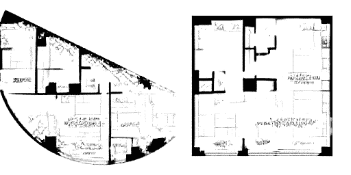

这些对于设计师的潜力可以说是最突出的。想象一下，我们为一家时尚公司工作，任务是创造新的服装风格，事实上，我们可以只训练一个关于“时尚”物品的自动编码器，并允许网络学习时尚服装的数据生成分布。随后，我们可以从这个低维的潜在分布中提取样本，并利用它来创造新的想法。

最后一个示例是我们将在本教程的最后一节学习时尚 MNIST 数据集时使用的示例。

# 自动编码器

**传统自动编码器**

自动编码器是非常简单的神经架构。它们基本上是一种压缩形式，类似于使用 MP3 压缩音频文件或使用 JPEG 压缩图像文件的方式。

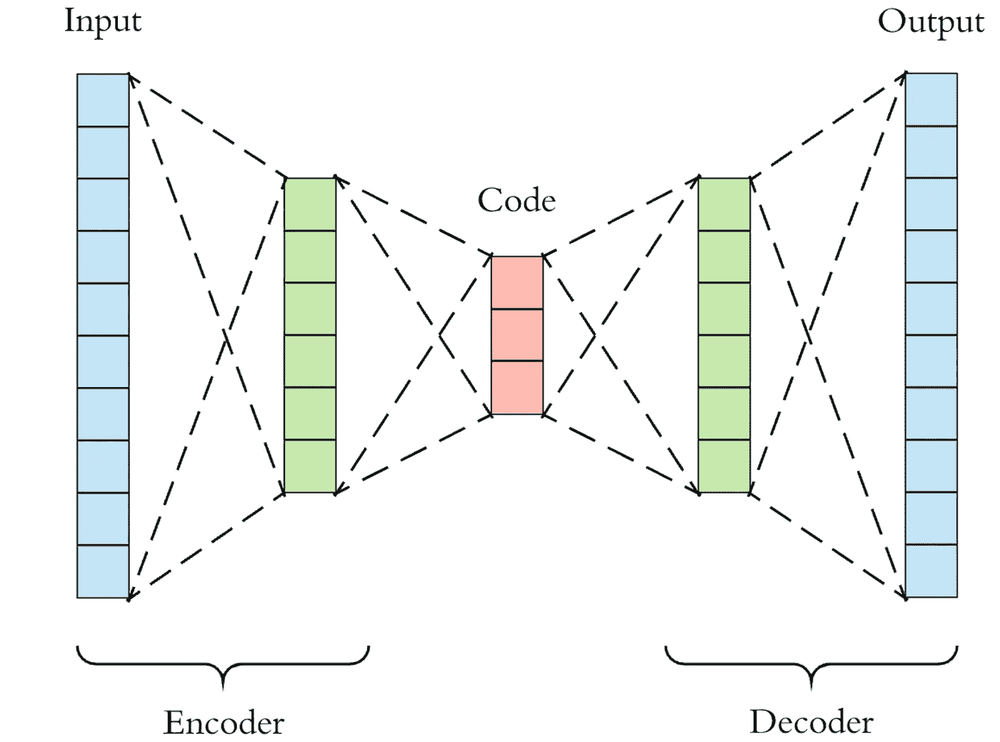

自动编码器与主成分分析(PCA)密切相关。事实上，如果自动编码器中使用的激活函数在每一层中是线性的，则潜在变量出现在瓶颈(网络中最小的层，aka。代码)直接对应于来自 PCA 的主分量。通常，自动编码器中使用的激活函数是非线性的，典型的激活函数是 ReLU(校正线性单元)和 sigmoid。

网络背后的数学原理相当容易理解，所以我将简要介绍一下。本质上，我们将网络分为两个部分，编码器和解码器。

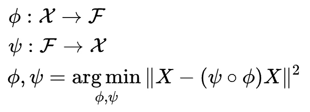

由*ϕ*表示的编码器功能将原始数据 x 映射到存在于瓶颈处的潜在空间 f。由ψ表示的解码器函数将瓶颈处的潜在空间 F 映射到输出。在这种情况下，输出与输入函数相同。因此，我们基本上是试图在一些广义的非线性压缩之后重建原始图像。

编码网络可以由通过激活函数的标准神经网络函数来表示，其中 **z** 是潜在维度。

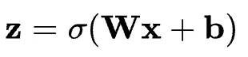

类似地，解码网络可以以相同的方式表示，但是使用不同的权重、偏置和潜在的激活函数。

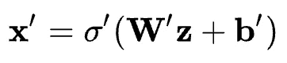

损失函数可以用这些网络函数来表示，我们将使用这个损失函数通过标准的反向传播过程来训练神经网络。

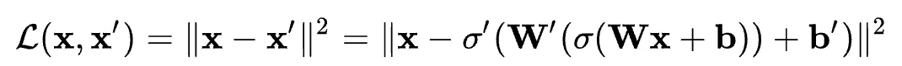

由于输入和输出是相同的图像，这不是真正的监督或无监督学习，所以我们通常称之为自监督学习。自动编码器的目的是以这样一种方式选择我们的编码器和解码器功能，即我们需要最少的信息来编码图像，以便它可以在另一侧重新生成。

如果我们在瓶颈层中使用的节点太少，我们重新创建图像的能力将会受到限制，并且我们将重新生成模糊或无法从原始图像中识别的图像。如果我们使用太多的节点，那么使用压缩就没有什么意义了。

压缩的例子很简单，例如，每当你在网飞上下载东西，发送给你的数据都是压缩的。一旦它到达你的电脑，它通过一个解压缩算法，然后显示在你的电脑上。这类似于 zip 文件的工作方式，只是它是通过流算法在幕后完成的。

**去噪自动编码器**

还有几种其他类型的自动编码器。最常用的一种是去噪自动编码器，它将在本教程的后面使用 Keras 进行分析。这些自动编码器在训练之前向数据添加一些白噪声，但是在训练时将误差与原始图像进行比较。这迫使网络不会过度适应图像中存在的任意噪声。我们稍后将使用它来消除文档扫描图像中的折痕和暗区域。

**稀疏自动编码器**

与直觉相反，稀疏自动编码器具有比输入或输出维度更大的潜在维度。然而，每次网络运行时，只有一小部分神经元激活，这意味着网络本质上是“稀疏的”。这类似于去噪自动编码器，因为它也是一种正则化形式，以减少网络过拟合的倾向。

**收缩式自动编码器**

收缩编码器与最后两个过程非常相似，但在这种情况下，我们不改变架构，只是在损失函数中添加一个正则项。这可以被认为是岭回归的一种神经形式。

所以现在我们了解了自动编码器是怎样的，我们需要了解它们不擅长什么。一些最大的挑战是:

*   潜在空间的缺口
*   潜在空间中的可分性
*   离散潜在空间

这些问题都可以在这张图表中得到说明。

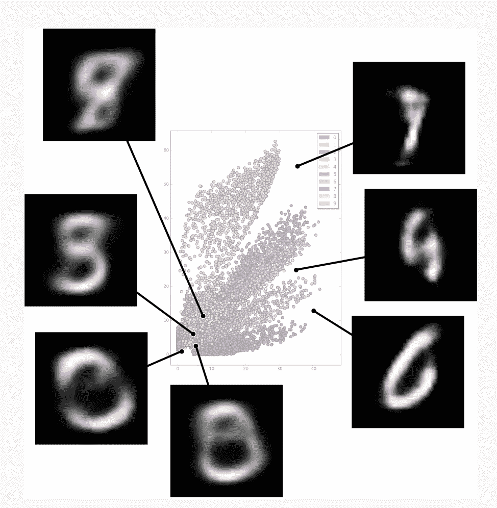

Latent space representation for MNIST dataset.

这张图向我们展示了不同标记数字在潜在空间中的位置。我们可以看到，潜在空间包含间隙，我们不知道这些空间中的字符可能看起来像什么。这相当于在监督学习问题中缺乏数据，因为我们的网络没有针对潜在空间的这些情况进行训练。另一个问题是空格的可分性，在上图中有几个数字被很好地分开，但也有一些区域的标签是随机散布的，这使得很难分开字符的独特特征(在本例中是数字 0-9)。这里的另一个问题是无法研究连续的潜在空间，例如，我们没有一个为任意输入而训练的统计模型(即使我们封闭了潜在空间中的所有间隙也不会)。

传统自动编码器的这些问题意味着，在我们能够了解数据生成分布并产生新的数据和图像之前，我们还有一段路要走。

现在我们已经了解了传统的自动编码器是如何工作的，我们将继续讨论变化的自动编码器。这些方法稍微复杂一些，因为它们实现了一种来自贝叶斯统计的变分推理。我们将在下一节更深入地讨论这一点

# 可变自动编码器

VAEs 继承了传统自动编码器的架构，并使用它来学习数据生成分布，这允许我们从潜在空间中随机采样。然后，可以使用解码器网络对这些随机样本进行解码，以生成独特的图像，这些图像具有与网络被训练的图像相似的特征。

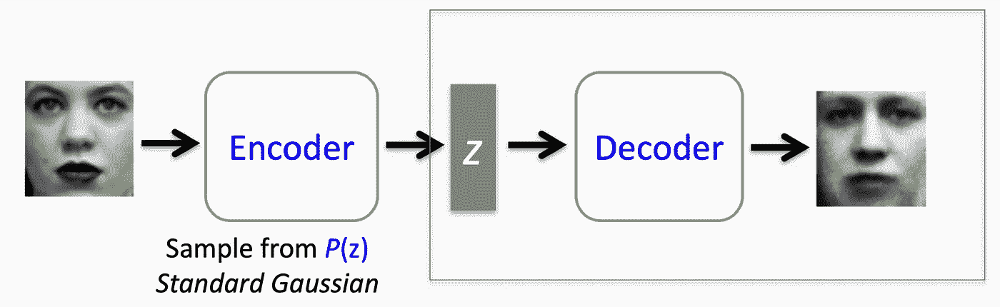

对于熟悉贝叶斯统计的人来说，编码器正在学习后验分布的近似值。这种分布通常难以解析，因为它没有封闭形式的解。这意味着我们可以执行计算量大的采样程序，如马尔可夫链蒙特卡罗(MCMC)方法，或者我们可以使用变分法。正如人们可能怀疑的那样，变分自动编码器使用变分推理来生成其对该后验分布的近似。

我们将详细讨论这个过程，但是对于深入的分析，我强烈推荐查看 Jaan Altosaar 的博客文章。变分推理是研究生机器学习或统计学课程的一个主题，但你不需要统计学学位就能理解其基本思想。感兴趣的人可以链接到 Jaan 的文章:

 [## 教程-什么是可变自动编码器？—贾恩·阿尔托萨尔

### 从两个角度理解变分自动编码器:深度学习和图形模型。

jaan.io](https://jaan.io/what-is-variational-autoencoder-vae-tutorial/) 

对于那些对基础数学不感兴趣的人，可以直接跳到 VAE 编码教程。

我们首先需要了解的是后验分布，以及为什么我们不能计算它。看看下面的等式，这是贝叶斯定理。这里的前提是，我们想知道如何学习如何从我们的潜变量 **z** 生成数据 x。这暗示了我们要学习 p(z|x)。不幸的是，我们不知道这个分布，但我们不需要知道，因为我们可以用贝叶斯定理重新表述这个概率。然而，这并不能解决我们所有的问题，因为分母，即证据，通常是难以处理的。然而，并没有失去一切，因为存在一个厚脸皮的解决方案，允许我们近似这个后验分布。事实证明，我们可以将这个推理问题转化为一个优化问题。

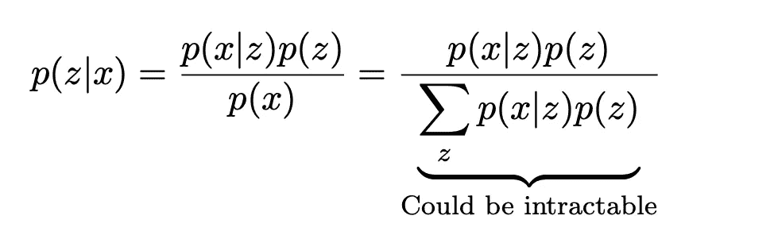

为了逼近后验分布，我们需要一种方法来评估建议分布与真实后验分布相比有多好。为了做到这一点，我们使用贝叶斯统计学家最好的朋友，库尔巴克-莱布勒分歧。KL 散度是两个概率分布相似程度的度量；如果相同，则散度为零，如果是正数，则两个分布不同。KL 散度严格来说是正的，虽然它在技术上不是距离，因为函数是不对称的。我们以下面的方式使用 KL 散度。

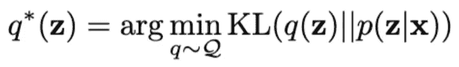

这个等式可能看起来吓人，但这里的想法很简单。我们提出了一系列可能的分布，这些分布可能就是我们的数据是如何生成的， *Q* ，并且我们希望找到最佳分布， *q** ，它使我们提出的分布和实际分布之间的距离最小化，由于实际分布的困难性，我们试图对其进行近似。这个公式还有一个问题，即我们实际上不知道 p(z|x ),所以我们不能计算 KL 散度。我们如何解决这个问题？

这就是事情变得有点深奥的地方。我们可以做一些数学操作，用所谓的 ELBO(证据下限)和另一个涉及 p(x)的术语重写 KL 散度。

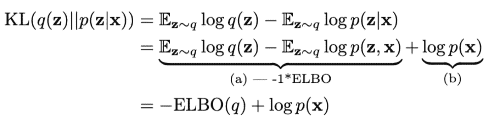

有趣的是，ELBO 是这个等式中唯一的变量，它取决于我们选择的分布。另一项不受我们选择的分布的影响，因为它不依赖于 *q* 。因此，我们可以通过最大化(因为它是负的)上式中的 ELBO 来最小化 KL 散度。这里的关键点是，我们实际上可以计算 ELBO，这意味着我们现在可以执行优化程序。

因此，我们现在需要做的就是为 *Q* 想出一个好的选择，然后对 ELBO 求微分，将其设置为零，瞧，我们就有了最佳分布。在这成为可能之前还有一些障碍，首先，我们必须决定选择什么样的发行版家族。

典型地，当定义 *q* 时，为了简单起见，进行平均场变分推断。这实质上是说，每个变分参数都是相互独立的。因此，对于每个数据点，我们有一个单独的 *q* ，我们可以将它们相乘，得到一个联合概率，从而得到“平均场”*q*

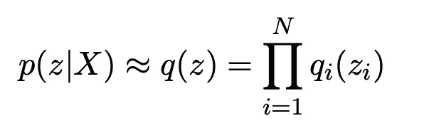

实际上，我们可以选择任意多的字段或集群。例如，在 MNIST 的情况下，我们可能选择 10 个分类，因为我们知道可能存在 10 个可能的数字。

我们需要做的第二件事是通常被称为重新参数化的技巧，借此我们将随机变量从导数中取出，因为对随机变量取导数会由于它们固有的随机性而给我们带来更大的误差。

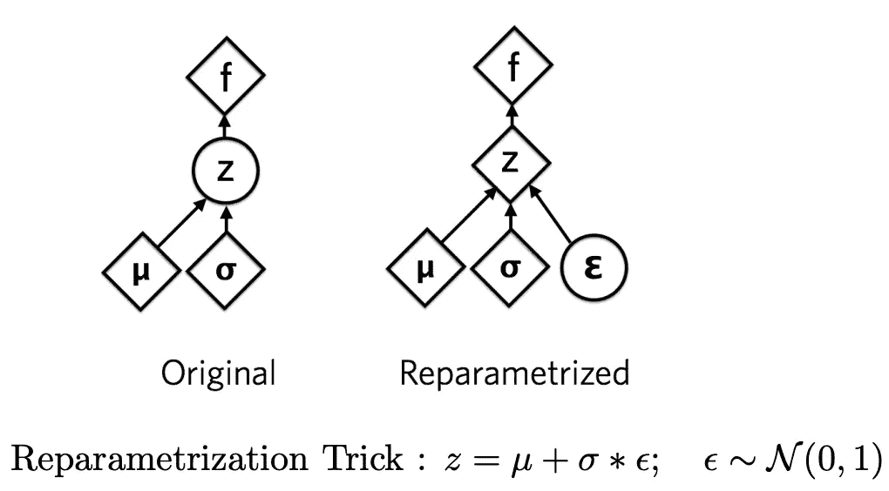

重新参数化的技巧有点深奥，但它基本上是说，我可以将正态分布写成一个平均值加上一些标准差，乘以一些误差。这意味着当求导时，我们不求随机函数本身的导数，而只求它的参数。

如果这没有多大意义，这里有一篇很好的文章解释了这个技巧，以及为什么它比随机变量本身的导数表现得更好:

 [## 重新参数化技巧

### 戈克尔·埃尔多安的个人网站。

gokererdogan.github.io](https://gokererdogan.github.io/2016/07/01/reparameterization-trick/) 

这种方法没有一般的封闭解，所以我们在近似后验分布的能力上仍然受到一些限制。然而，事实上，指数分布族有一个封闭形式的解。这意味着我们可以使用标准分布，如正态分布、二项式分布、泊松分布、贝塔分布等。因此，虽然我们可能找不到真正的后验分布，但我们可以找到一个近似，它在给定指数分布族的情况下做得最好。

变分推理的艺术是选择我们的分布族， *Q* ，使其足够大，以获得后验概率的良好近似，但又不要太大，以至于计算时间过长。

既然我们已经对我们的网络如何被训练来学习我们数据的潜在分布有了一个不错的想法，我们可以看看我们如何使用这种分布来生成数据。

# 数据生成过程

看下图，我们可以认为我们对数据生成过程的近似决定了我们要生成数字“2”，所以它从潜在变量质心生成值 2。然而，我们可能不希望每次都生成看起来一样的“2”，就像我们的视频游戏中的植物示例一样，所以我们在潜在空间中向这个项目添加一些随机噪声，这是基于随机数和值“2”的分布的“学习”分布。我们把它通过我们的解码器网络，我们得到了一个看起来和原来不同的 2。

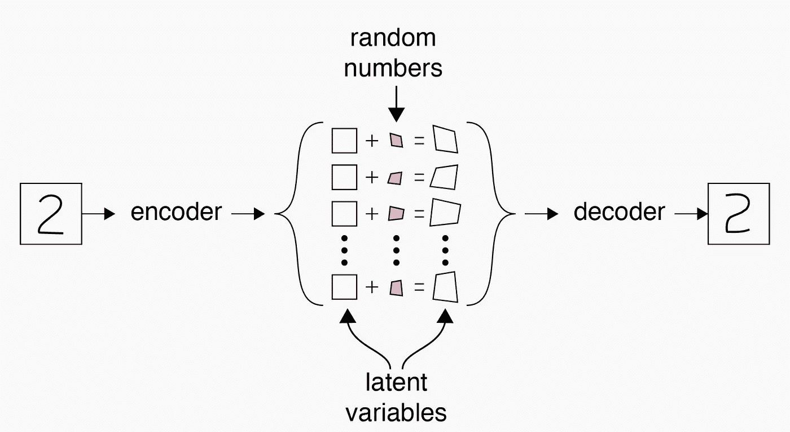

这是一个过于简化的版本，它抽象了实际自动编码器网络的架构。下面是在编码器和解码器网络中使用卷积层的实际变分自动编码器的架构表示。我们看到，我们正在分别学习潜在空间内数据生成分布的中心和分布，然后从这些分布中“采样”以生成本质上“虚假”的数据。

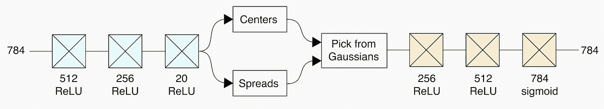

学习过程的固有性质意味着看起来相似的参数(刺激相同的网络神经元放电)在潜在空间中聚集在一起，而不是任意隔开。下图对此进行了说明。我们看到我们的值 2 开始聚集在一起，而值 3 逐渐被推开。这是有用的，因为这意味着网络不会任意地将字符放置在潜在空间中，使得值之间的转换不那么虚假。

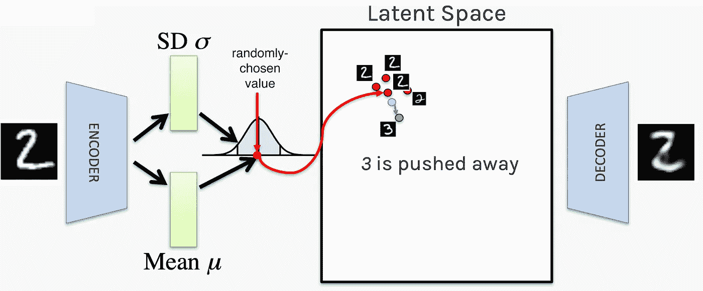

整个网络架构的概述如下所示。希望，在这一点上，程序是有意义的。我们使用一组图像来训练自动编码器，以学习我们在潜在空间内的均值和标准差，这形成了我们的数据生成分布。接下来，当我们想要生成类似的图像时，我们从潜在空间中的一个质心进行采样，使用我们的标准偏差和一些随机误差稍微扭曲它，然后将它通过解码器网络。从这个例子中可以清楚地看出，最终输出看起来与输入图像相似，但并不相同。

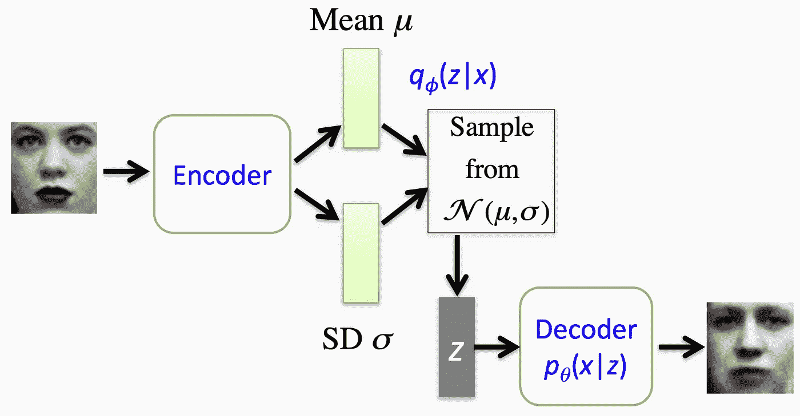

# VAE 编码教程

在本节中，我们将研究一个简单的去噪自动编码器，用于消除文档扫描图像上的折痕和标记，以及消除时尚 MNIST 数据集中的噪声。在 MNIST 数据集上训练网络之后，我们将使用 VAEs 来生成新的服装项目。

**去噪自动编码器**

**时尚 MNIST**

在第一个练习中，我们将向时尚 MNIST 数据集添加一些随机噪声(椒盐噪声),并尝试使用去噪自动编码器来消除这些噪声。首先，我们执行预处理:下载数据，缩放数据，然后添加噪声。

之后，我们为自动编码器网络创建架构。这涉及多层卷积神经网络、编码器网络上的最大池层和解码器网络上的升级层。

这个模型需要一段时间来运行，除非你有一个图形处理器，它可能需要大约 3-4 分钟的时间。我们的输入图像、带噪声的输入图像和输出图像如下所示。

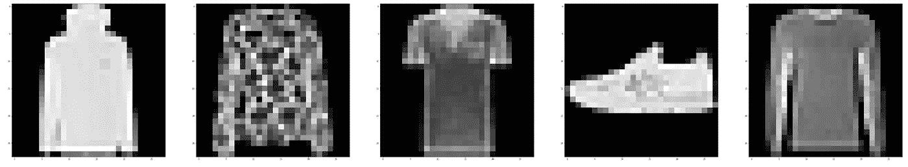

Input images from fashion MNIST.

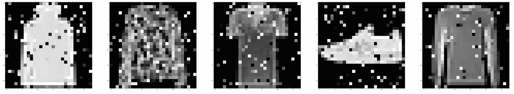

Input images with salt and pepper noise.

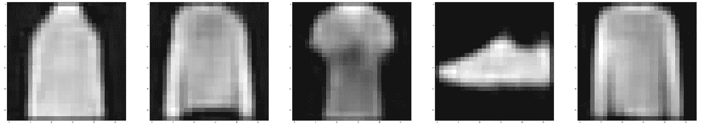

Output from denoising network

正如你所看到的，我们能够从嘈杂的图像中充分去除噪声，但我们失去了相当数量的服装细节的分辨率。这是我们为强大的网络付出的代价之一。可以调整网络，以便使最终输出更能代表输入图像。

**文字清理**

去噪自动编码器的第二个例子包括清理扫描图像的折痕和暗区。这是我们希望获得的输入和输出图像。

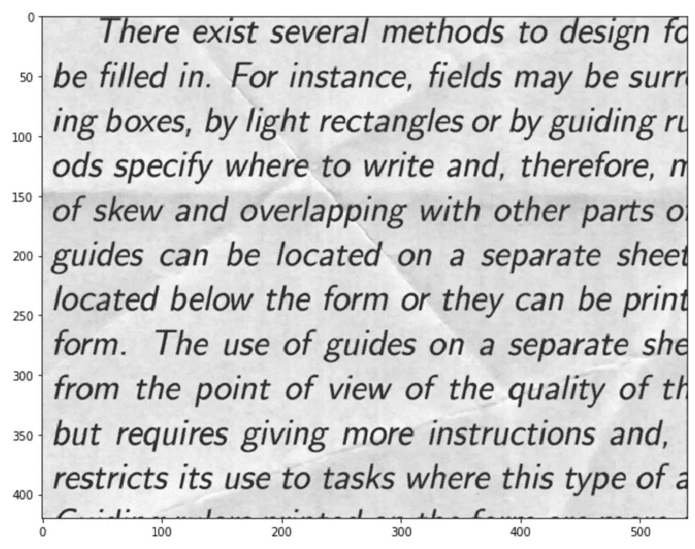

Input images of ‘noisy’ text data.

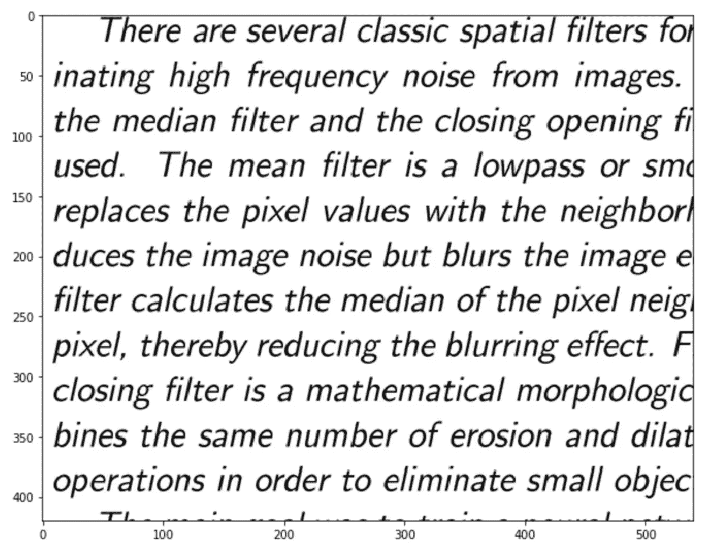

Cleaned text images.

这方面的数据预处理有点复杂，所以我不会在这里介绍，但它可以在我的 GitHub 存储库中找到，还有数据本身。网络架构如下。

**变型自动编码器**

最后，我们将尝试生成时装 MNIST 数据集中出现的服装项目的新图像。

这方面的神经架构稍微复杂一点，包含一个称为“Lambda”层的采样层。

这是架构，但我们仍然需要插入损失函数，并纳入 KL 散度。

我们现在可以查看重构的样本，看看我们的网络能够学习到什么。

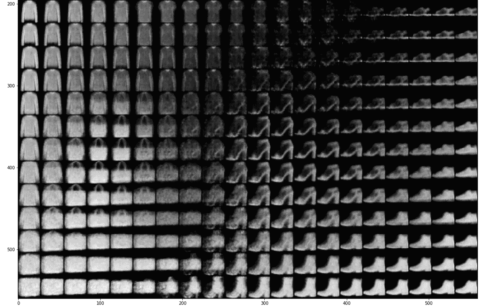

我们可以清楚地看到鞋子、手袋以及服装之间的过渡。并非所有的潜在空间都绘制在这里，以帮助图像清晰。我们还可以查看时装 MNIST 数据集中的 10 件服装的潜在空间和颜色代码。

我们看到这些项目被分成不同的组。

# **最终点评**

本教程是自动编码器、变分自动编码器和变分推理的速成课程。我希望读者对此感兴趣，并且现在对什么是自动编码器以及如何在实际应用中使用它们有了更好的理解。

在我的下一个教程中，我将着眼于使用生成式对抗网络制作名人和动漫人物的假图像，这是变型自动编码器的天然垫脚石。