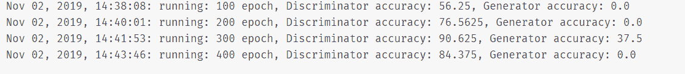

# 利用生成性对抗网络生成现代艺术

> 原文：<https://towardsdatascience.com/generating-modern-arts-using-generative-adversarial-network-gan-on-spell-39f67f83c7b4?source=collection_archive---------2----------------------->

## 趣味甘

## 创建一个生成性对抗网络来生成现代艺术，并在 Spell 平台的 GPU 上对其进行训练


Arts Generated By Our GAN

# 先决条件

你需要很好地理解:

1.  图像处理
2.  Python 编程语言
3.  numpy——科学计算图书馆
4.  Keras —深度学习图书馆

和一些基本知识:

1.  生成对抗网络

# 使用的数据集

本项目中使用的图像数据收集自[](https://www.wikiart.org/)**。**

# **介绍**

**在本教程中，我们将看一步一步的过程来创建一个生成性的对抗性网络，以生成现代艺术，并使用 Python 和 Keras 编写代码。**

**之后，为了训练模型，我们将使用一个强大的拼写平台的 GPU 实例。一切都将在途中解释，并提供进一步阅读的链接。**

**我们开始吧！**

# **探索数据集**

**在开始之前，让我们看看我们的图像数据集。**

**WikiArt 收藏了大量不同风格的现代艺术作品。对于我们的特定项目，我们将使用 [**立体派**](https://www.wikiart.org/en/paintings-by-style/cubism?select=featured#!#filterName:featured,viewType:masonry) 风格的图像。**

****

**你可以从 WikiArt.org 了解更多的艺术风格和现代艺术。**

# **下载图像**

**你既可以从 WikiArt 下载你喜欢的图片，也可以通过 [**cs-chan**](https://github.com/cs-chan/ArtGAN/tree/master/WikiArt%20Dataset) 前往该库下载 26GB 的 WikiArt 图片。**

**因为它有所有不同类型的集合，我们将只选择**立体主义**并将它们存储在名为 dataset 的文件夹中。**

****

## **处理图像数据**

**我们数据集中的图像大小不同，为了将它们输入到我们的生成性对抗性神经网络中，我们将把所有图像的大小调整为 128X128。**

**开始之前，在数据集文件夹所在的根目录下创建一个 python 文件。**

****

**现在，让我们编写一个小的 python 脚本，从文件夹中选择所有图像，并将其大小调整为 128X128，然后保存在 **cubism_data.npy** 文件中。**

```
*## image_resizer.py*
*# Importing required libraries*
**import** os
**import** numpy **as** np
**from** PIL **import** Image

*# Defining an image size and image channel*
*# We are going to resize all our images to 128X128 size and since our images are colored images*
*# We are setting our image channels to 3 (RGB)*

IMAGE_SIZE = 128
IMAGE_CHANNELS = 3
IMAGE_DIR = 'dataset/'

*# Defining image dir path. Change this if you have different directory*
images_path = IMAGE_DIR 

training_data = []

*# Iterating over the images inside the directory and resizing them using*
*# Pillow's resize method.*
print('resizing...')

**for** filename **in** os.listdir(images_path):
    path = os.path.join(images_path, filename)
    image = Image.open(path).resize((IMAGE_SIZE, IMAGE_SIZE), Image.ANTIALIAS)

    training_data.append(np.asarray(image))

training_data = np.reshape(
    training_data, (-1, IMAGE_SIZE, IMAGE_SIZE, IMAGE_CHANNELS))
training_data = training_data / 127.5 - 1

print('saving file...')
np.save('cubism_data.npy', training_data)
```

**我们来分解一下。**

**在上面的代码块中，在前几行，我们已经导入了执行调整大小操作所需的所有库。**

```
**import** os
**import** numpy **as** np
**from** PIL **import** Image

IMAGE_SIZE = 128
IMAGE_CHANNELS = 3
IMAGE_DIR = 'dataset/'

images_path = IMAGE_DIR
```

**这里，我们使用 Pillow 将所有图像调整到我们想要的大小，并将它们作为 numpy 数组添加到一个列表中。**

```
training_data = []**for** filename **in** os.listdir(images_path):
 path = os.path.join(images_path, filename)
 image = Image.open(path).resize((IMAGE_SIZE, IMAGE_SIZE), Image.ANTIALIAS)
training_data.append(np.asarray(image))
```

**之后，我们使用 **numpy** 以合适的格式重塑数组，并规范化数据。**

```
training_data = np.reshape(
training_data, (-1, IMAGE_SIZE, IMAGE_SIZE, IMAGE_CHANNELS))
training_data = training_data / 127.5–1
```

**标准化之后，我们将图像数组保存在 **npy** 二进制文件中，这样我们就不必每次都遍历所有的图像。**

```
np.save(‘cubism_data.npy’, training_data)
```

**这就是处理我们的图像数据。**

# **创建 GAN**

**现在是我们项目中最激动人心的部分了，从这里开始我们将为生成性对抗网络(GAN)编写代码。**

**我们将使用**Keras——一个深度学习库**来创建我们的 GAN。**

**开始之前，让我们简单了解一下什么是 GAN 及其结构。**

## **甘是什么？**

**生成对抗网络(GANs)是机器学习领域一项令人兴奋的最新创新。伊恩·哥德费罗在他的论文 [**中首次提出了生成对抗网络**](https://arxiv.org/abs/1406.2661) 。**

**gan 是**生成型**模型:在给定一些训练数据后，它们可以创建看起来像你的训练数据的新数据实例。例如，GANs 可以创建看起来像人脸照片的图像，即使这些人脸不属于任何真实的人。**

**关于 GAN 的一个很好的例子，你可以访问[](https://www.thispersondoesnotexist.com/)**，它是由 **Nvidia** 创造的。它生成了一个不存在的人的高质量图像。****

****听起来很有趣，对吗？****

## ****它是如何工作的？****

****让我们了解它的结构和工作原理。****

********

****甘提出了两种模型:生成模型和判别模型。****

****生成模型负责生成不同种类的噪声数据，而鉴别模型负责鉴别给定数据是真的还是假的。****

********

****生成模型不断地训练自己，通过生成假噪声数据来欺骗判别模型，而判别模型从训练集中训练自己来分类数据是否来自数据集，并且不被生成模型欺骗。****

********

****GAN structure [source](https://skymind.ai/images/wiki/GANs.png)****

## ****损失函数****

****GAN 中的鉴别器使用交叉熵损失，因为鉴别器的工作是分类；交叉熵损失是最好的方法。****

********

****这个公式表示 p:真实分布和 q:估计分布之间的交叉熵损失。****

****(p)和(q)是 m 维的，其中 m 是类的数量。****

********

****在 GAN 中，鉴别器是一个二元分类器。它需要区分数据是真的还是假的。也就是说 m = 2。真正的分布是一个仅包含 2 项的热向量。****

****对于 n 个样本，我们可以对损失求和。****

****上面所示的等式是二元交叉熵损失，其中 y 可以取两个值 0 和 1。****

****GAN 有一个潜在向量 z，图像 G(z)就神奇地从中生成。我们对真实图像 x 和生成的图像 G(z)应用鉴别器函数 D。****

****损失函数的目的是将真实图像的预测推向 1，将伪图像推向 0。我们用对数概率项来做。****

********

******注** : **~** 符号表示:分布为，这里的 **Ex** 表示期望值:由于我们不知道样本是如何被送入鉴别器的，所以我们将它们表示为期望值而不是总和。****

****如果我们观察联合损失函数，我们将最大化鉴别器项，这意味着 D(x)的 log 应该逐渐接近零，而 D(G(z))的 log 应该接近 1。在这里，生成器试图使 D(G(z))英寸更接近 1，而鉴别器试图做相反的事情。****

# ****GAN 的代码****

****现在，让我们毫不迟疑地写我们的 GAN。****

****我们将把我们的文件命名为 **art_gan.py** ，并将其存储在根目录中。这个文件将包含我们的生成器和鉴别器的所有超参数和函数。****

****让我们写一些代码:****

```
****from** keras.layers **import** Input, Reshape, Dropout, Dense, Flatten, BatchNormalization, Activation, ZeroPadding2D
**from** keras.layers.advanced_activations **import** LeakyReLU
**from** keras.layers.convolutional **import** UpSampling2D, Conv2D
**from** keras.models **import** Sequential, Model, load_model
**from** keras.optimizers **import** Adam
**import** numpy **as** np
**from** PIL **import** Image
**import** os**
```

****在这里，我们导入创建 GAN 所需的所有库和辅助函数。****

****所有的导入都是不言自明的。在这里，我们正在导入一些 keras 层来创建我们的模型。****

****现在让我们定义一些参数:****

```
***# Preview image Frame
PREVIEW_ROWS = 4
PREVIEW_COLS = 7
PREVIEW_MARGIN = 4
SAVE_FREQ = 100**# Size vector to generate images from
NOISE_SIZE = 100**# Configuration
EPOCHS = 10000 # number of iterations
BATCH_SIZE = 32**GENERATE_RES = 3
IMAGE_SIZE = 128 # rows/cols*IMAGE_CHANNELS = 3**
```

****在这里的前几行，我们已经定义了图像帧的大小和填充来保存我们生成的图像。****

****这里是生成我们的图像的潜在维度大小。****

******EPOCHS** 是迭代次数:它定义了我们想要迭代训练图像的次数，而 **BATCH_SIZE** 是每次迭代中要输入的图像数量。****

******IMAGE_SIZE** 是我们之前调整到 128X128 的图像尺寸，而 **IMAGE_CHANNELS** 是我们图像中的通道数；也就是 3。****

> *****注意:图像应始终为方形尺寸*****

****让我们加载之前创建的 npy 数据文件。****

```
**training_data = np.load(‘cubism_data.npy’)**
```

****为了加载 npy 文件，我们使用 numpy 的 load 函数并将文件路径作为参数传递。****

****因为我们的数据文件在根目录中，所以不需要额外的路径参数。如果您已经将数据存储在其他地方，您可以使用以下代码来加载数据:****

```
**training_data = np.load(os.path.join(‘dirname’, ‘filename.npy’))**
```

****这就是加载我们的训练数据。****

****现在我们可以创建生成器和鉴别器函数了。****

****让我们看看代码:****

```
****def** **build_discriminator**(image_shape): model = Sequential() model.add(Conv2D(32, kernel_size=3, strides=2,
    input_shape=image_shape, padding=”same”))
    model.add(LeakyReLU(alpha=0.2))
    model.add(Dropout(0.25)) model.add(Conv2D(64, kernel_size=3, strides=2, padding=”same”))
    model.add(ZeroPadding2D(padding=((0, 1), (0, 1))))
    model.add(BatchNormalization(momentum=0.8))
    model.add(LeakyReLU(alpha=0.2))
    model.add(Dropout(0.25)) model.add(Conv2D(128, kernel_size=3, strides=2, padding=”same”))
    model.add(BatchNormalization(momentum=0.8))
    model.add(LeakyReLU(alpha=0.2))
    model.add(Dropout(0.25)) model.add(Conv2D(256, kernel_size=3, strides=1, padding=”same”))
    model.add(BatchNormalization(momentum=0.8))
    model.add(LeakyReLU(alpha=0.2)) model.add(Dropout(0.25))
    model.add(Conv2D(512, kernel_size=3, strides=1, padding=”same”))
    model.add(BatchNormalization(momentum=0.8))
    model.add(LeakyReLU(alpha=0.2)) model.add(Dropout(0.25))
    model.add(Flatten())
    model.add(Dense(1, activation=’sigmoid’)) input_image = Input(shape=image_shape)
    validity = model(input_image)
    **return** Model(input_image, validity)**
```

****分解一下:****

****如果您对 keras 有所了解，那么代码是不言自明的。****

****总的来说，我们正在定义一个以 **image_shape** 为参数的函数。****

****在这个函数中，我们从 keras 中初始化一个顺序模型，帮助我们创建线性层堆栈。****

```
**model = Sequential()**
```

****之后，我们在顺序模型中添加一些层。****

****我们的第一层是一个 32 形状的卷积层，其 kernel_size 为 3，我们的步幅值为 2，填充值相同。因为它是第一层，所以它保存输入形状。****

****要了解这是怎么回事，可以参考 keras 官方文档页面。****

****简单地说，我们在这里定义一个卷积层，它有一个大小为 3X3 的滤波器，该滤波器跨越我们的图像数据。我们有相同的衬垫，这意味着，没有额外的衬垫。它仍然和原来一样。****

```
**model.add(Conv2D(32, kernel_size=3, strides=2,
  input_shape=image_shape, padding=”same”))model.add(LeakyReLU(alpha=0.2))**
```

****之后，我们添加了一个激活函数 LeakyRelu 层。****

****类似地，在其他块中，层被添加到顺序模型中，具有一些漏失和批量标准化，以防止过度拟合。****

****我们模型的最后一层是具有激活函数 sigmoid 的全连接层。****

****由于我们的鉴别器的工作是分类给定的图像是否是假的，这是一个二元分类任务，sigmoid 是一个将每个值压缩到 0 和 1 之间的激活。****

```
**model.add(Flatten())
model.add(Dense(1, activation=’sigmoid’))**
```

****现在，在初始化我们的鉴别器模型之后，让我们也创建一个生成模型。****

```
****def** **build_generator**(noise_size, channels):
    model = Sequential()
    model.add(Dense(4 * 4 * 256, activation=”relu”,       input_dim=noise_size))
    model.add(Reshape((4, 4, 256))) model.add(UpSampling2D())
    model.add(Conv2D(256, kernel_size=3, padding=”same”))
    model.add(BatchNormalization(momentum=0.8))
    model.add(Activation(“relu”)) model.add(UpSampling2D())
    model.add(Conv2D(256, kernel_size=3, padding=”same”))
    model.add(BatchNormalization(momentum=0.8))
    model.add(Activation(“relu”)) **for** i **in** range(GENERATE_RES):
         model.add(UpSampling2D())
         model.add(Conv2D(256, kernel_size=3, padding=”same”))
         model.add(BatchNormalization(momentum=0.8))
         model.add(Activation(“relu”)) model.summary()
    model.add(Conv2D(channels, kernel_size=3, padding=”same”))
    model.add(Activation(“tanh”)) input = Input(shape=(noise_size,))
    generated_image = model(input)

    **return** Model(input, generated_image)**
```

****分解一下:****

****这里我们定义了一个函数，它将 noise_size 和 channels 作为参数。****

****在函数内部，我们再次初始化了一个序列模型。****

****因为我们的生成器模型必须从噪声向量生成图像，所以我们的第一层是大小为 4096 (4 * 4 * 256)的完全连接的密集层，它将 noise_size 作为参数。****

```
**model.add(Dense(4 * 4 * 256, activation=”relu”, input_dim=noise_size))**
```

> *****注意:我们已经定义了它的大小为 4096，以便在 4X4X256 的图层中调整它的大小。*****

****之后，我们使用整形图层将完全连接的图层整形为 4X4X256 的形状。****

```
**model.add(Reshape((4, 4, 256)))**
```

****这之后的层块只是一个具有批量归一化和激活函数 relu 的卷积层。****

****为了看到和理解它的样子，我们来看一下模型摘要:****

********

****从 4X4 的形状扩展到 128X128 的大小，这是我们的 training_data 形状。****

****我们的生成器模型将噪声作为输入，输出图像。****

****初始化生成器和鉴别器模型后，让我们编写一个助手函数，在一些迭代后保存图像。****

```
****def** save_images(cnt, noise):
    image_array = np.full((
        PREVIEW_MARGIN + (PREVIEW_ROWS * (IMAGE_SIZE + PREVIEW_MARGIN)),
        PREVIEW_MARGIN + (PREVIEW_COLS * (IMAGE_SIZE + PREVIEW_MARGIN)), 3),
        255, dtype=np.uint8)generated_images = generator.predict(noise)generated_images = 0.5 * generated_images + 0.5image_count = 0
    **for** row in range(PREVIEW_ROWS):
        **for** col in range(PREVIEW_COLS):
            r = row * (IMAGE_SIZE + PREVIEW_MARGIN) + PREVIEW_MARGIN
            c = col * (IMAGE_SIZE + PREVIEW_MARGIN) + PREVIEW_MARGIN
            image_array[r:r + IMAGE_SIZE, c:c +
                        IMAGE_SIZE] = generated_images[image_count] * 255
            image_count += 1output_path = 'output'
    if not os.path.exists(output_path):
        os.makedirs(output_path)filename = os.path.join(output_path, f"trained-{cnt}.png")
    im = Image.fromarray(image_array)
    im.save(filename)**
```

****我们的 save_images 函数将计数和噪声作为输入。****

****在函数内部，它根据我们上面定义的参数生成帧，并存储我们根据噪声输入生成的图像数组。****

****之后，它会将其保存为图像。****

****现在，是我们编译模型并训练它们的时候了。****

****让我们也为此编写一段代码:****

```
**image_shape = (IMAGE_SIZE, IMAGE_SIZE, IMAGE_CHANNELS)optimizer = Adam(1.5e-4, 0.5)discriminator = build_discriminator(image_shape)
discriminator.compile(loss=”binary_crossentropy”,
optimizer=optimizer, metrics=[“accuracy”])
generator = build_generator(NOISE_SIZE, IMAGE_CHANNELS)random_input = Input(shape=(NOISE_SIZE,))generated_image = generator(random_input)discriminator.trainable = **False**validity = discriminator(generated_image)combined = Model(random_input, validity)
combined.compile(loss=”binary_crossentropy”,
optimizer=optimizer, metrics=[“accuracy”])y_real = np.ones((BATCH_SIZE, 1))
y_fake = np.zeros((BATCH_SIZE, 1))fixed_noise = np.random.normal(0, 1, (PREVIEW_ROWS * PREVIEW_COLS, NOISE_SIZE))cnt = 1
**for** epoch **in** range(EPOCHS):
 idx = np.random.randint(0, training_data.shape[0], BATCH_SIZE)
 x_real = training_data[idx]

 noise= np.random.normal(0, 1, (BATCH_SIZE, NOISE_SIZE))
 x_fake = generator.predict(noise)

 discriminator_metric_real = discriminator.train_on_batch(x_real, y_real)discriminator_metric_generated = discriminator.train_on_batch(
 x_fake, y_fake)

discriminator_metric = 0.5 * np.add(discriminator_metric_real, discriminator_metric_generated)generator_metric = combined.train_on_batch(noise, y_real)**if** epoch % SAVE_FREQ == 0:
   save_images(cnt, fixed_noise)
   cnt += 1

   print(f”{epoch} epoch, Discriminator accuracy: {100*  discriminator_metric[1]}, Generator accuracy: {100 * generator_metric[1]}”)**
```

****分解一下:****

****在这里的前几行中，我们已经定义了我们的输入形状:128X128X3 (image_size，image_size，image_channel)。****

****之后，我们使用亚当作为我们的优化器。****

> *****注:所有参数均来源于论文[1]。*****

```
**image_shape = (IMAGE_SIZE, IMAGE_SIZE, IMAGE_CHANNELS)optimizer = Adam(1.5e-4, 0.5)discriminator = build_discriminator(image_shape)
discriminator.compile(loss=”binary_crossentropy”,
optimizer=optimizer, metrics=[“accuracy”])**
```

****初始化优化器后，我们调用 build_discriminator 函数并传递图像形状，然后用损失函数和优化器对其进行编译。****

****因为它是一个分类模型，我们使用准确性作为它的性能度量。****

****类似地，在下一行中，我们调用 build_generator 函数并传递 random_input 噪声向量作为它的输入。****

```
**generator = build_generator(NOISE_SIZE, IMAGE_CHANNELS)random_input = Input(shape=(NOISE_SIZE,))generated_image = generator(random_input)**
```

****它将生成的图像作为输出返回。****

****现在，GAN 的一个重要部分是我们应该阻止我们的鉴别器进行训练。****

```
**discriminator.trainable = **False**validity = discriminator(generated_image)combined = Model(random_input, validity)
combined.compile(loss=”binary_crossentropy”,
optimizer=optimizer, metrics=[“accuracy”])**
```

****因为我们在这里只是训练生成器，所以我们不想调整鉴别器的权重。****

****这就是对抗性网络中“对抗性”的真正含义。****

****如果我们不设置这个，生成器会调整它的权重，这样它就能更好的愚弄鉴别器，它也会调整鉴别器的权重，使它更好的被愚弄。****

****我们不想这样。所以，我们要分开训练他们，互相对抗。****

****然后，我们用损失函数和优化器编译生成模型。****

****之后，我们将两个向量定义为 y_real 和 y_fake。****

```
**y_real = np.ones((BATCH_SIZE, 1))
y_fake = np.zeros((BATCH_SIZE, 1))fixed_noise = np.random.normal(0, 1, (PREVIEW_ROWS * PREVIEW_COLS, NOISE_SIZE))**
```

****这些向量由随机的 0 和 1 值组成。****

****之后，我们创建一个 fixed_noise:这将导致生成的图像被保存下来，我们可以看到它在每次迭代中变得更好。****

****之后，我们将使用我们定义的时期范围迭代我们的训练数据。****

```
**cnt = 1
**for** epoch **in** range(EPOCHS):
  idx = np.random.randint(0, training_data.shape[0], BATCH_SIZE)
  x_real = training_data[idx]

  noise= np.random.normal(0, 1, (BATCH_SIZE, NOISE_SIZE))
  x_fake = generator.predict(noise)

  discriminator_metric_real = discriminator.train_on_batch(x_real, y_real) discriminator_metric_generated = discriminator.train_on_batch(
 x_fake, y_fake)

  discriminator_metric = 0.5 * np.add(discriminator_metric_real,   discriminator_metric_generated) generator_metric = combined.train_on_batch(noisse, y_real)
  **if** epoch % SAVE_FREQ == 0:
     save_images(cnt, fixed_noise)
     cnt += 1

     print(f”{epoch} epoch, Discriminator accuracy: {100*  discriminator_metric[1]}, Generator accuracy: {100 * generator_metric[1]}”)**
```

****在迭代过程中，我们从真实图像中提取样本，并将其放在 x_real 上。之后，我们定义一个噪声向量，并将其传递给我们的生成器模型，以在 x_fake 中生成一个假图像。****

****然后，我们分别在真实和虚假图像中训练我们的鉴别器模型。****

```
**discriminator_metric_real = discriminator.train_on_batch(x_real, y_real)discriminator_metric_generated = discriminator.train_on_batch(
 x_fake, y_fake)**
```

****一些研究表明，分别训练他们可以让我们得到更好的结果。****

****训练后，我们从两个模型中提取指标并取平均值。****

```
**discriminator_metric = 0.5 * np.add(discriminator_metric_real, discriminator_metric_generated)**
```

****通过这种方式，我们获得了鉴别器模型的指标，现在，对于发生器模型，我们在噪声向量和 y_real:上训练它，y _ real:是 1 的向量。****

****在这里，我们试图训练发电机。超时生成器将从这些输入中变得更好，并且鉴别器将不能鉴别输入是假还是真。****

****这里需要注意的一点是，我们的组合模型是基于直接链接到鉴别器模型的生成器模型。这里我们的输入是发生器想要的输入:噪声，输出是鉴别器给我们的。****

****最后，我们有一个 if 语句来检查我们的检查点。****

```
****if** epoch % SAVE_FREQ == 0:
 save_images(cnt, fixed_noise)
 cnt += 1

 print(f”{epoch} epoch, Discriminator accuracy: {100* discriminator_metric[1]}, Generator accuracy: {100 * generator_metric[1]}”)**
```

****如果到达检查点，则保存当前迭代噪声并打印生成器和鉴别器的当前精度。****

****这都是为了创建 GAN 的编码部分，但我们还没有完成。****

****我们刚刚为它编写了代码，现在我们必须实际训练这些模型，并查看它的输出表现如何。****

# ****训练甘****

****在普通的笔记本电脑上训练 GAN 是不可能的，因为它需要很高的计算能力。****

****普通 CPU 的普通笔记本电脑无法处理如此庞大的任务，所以我们准备用 [**拼**](https://web.spell.run/refer/anyesh) :这是机器学习和深度学习最快最强大的端到端平台。****

## ****为什么拼写？****

********

****魔咒是构建和管理机器学习项目的强大平台。魔咒负责基础设施，使机器学习项目更容易启动，更快获得结果，更有组织性，比自己管理基础设施更安全。****

> ****在每一个法术注册，你可以获得 10 元免费信贷！****

****简单地说，我们将把我们的数据文件上传到拼写平台，让它处理我们所有的训练任务。Spell 在他们强大的 GPU 中运行我们的任务，这样我们就什么都不用担心了。我们可以从他们的 Web GUI 监控我们的日志，并且我们所有的输出都被安全地保存。****

## ****培训过程****

****在[拼写](https://spell.run/)运行我们的项目之前，有几件事情要涉及。****

****首先，我们必须创建我们的法术账户。在他们的官方页面上有很好很容易上手的[文档](https://spell.run/docs/)。****

****创建帐户后，我们可以使用 pip install 安装 Spell CLI:****

```
**pip install spell**
```

****这就把所有的法术能量都安装到了我们的笔记本电脑上。我们既可以使用 Web GUI，也可以轻松地登录到 spell 服务器，从 cmd 或 bash 执行命令。****

****为了上传我们的项目，我们将使用命令行工具。****

****让我们在项目文件夹的根目录中打开命令行终端，并使用拼写登录命令登录到服务器:****

```
**spell login**
```

****成功登录后，现在我们可以上传我们的训练数据文件，并在拼写服务器中运行我们的代码:****

```
**Spell upload “filename”**
```

********

****之后，我们的训练数据将被上传到服务器。****

> *****注意:在服务器运行代码之前，代码已经被推送到 github。*****

****现在我们准备在拼写服务器中执行我们的代码。****

****在命令行中，让我们运行以下命令:****

```
**Spell run python art_gan.py -t V100 -m uploads/art_gan/cubism_data.npy**
```

****上面的命令在机器类型为 V100 的 Spell 服务器上运行我们的代码，这是一台 GPU 机器。最后一个参数挂载数据集目录，以便我们的代码可以访问它。****

****现在代码已经成功执行，您可以在控制台上看到日志。如果您想在 GUI 中进行监控，那么您可以登录到 Spell 的 Web GUI，查看“运行”部分。****

********

****如您所见，它保存了我们最近运行的所有信息。****

********

****就像我们写的代码一样。在每 100 次迭代中，我们生成的图像被保存在输出目录中，并打印带有精度度量的日志。****

********

****您可以在日志部分查看它们。****

********

****太棒了，不是吗？当它为你训练和保存输出时，你可以做你的其他工作。****

## ****输出****

****现在，训练完成后，Spell 会自动将我们的输出保存在 resources/runs 目录中。****

********

****之后，我们可以使用以下命令将 Spell 运行的输出下载到我们的本地机器上:****

```
**spell cp [OPTIONS] SOURCE_PATH [LOCAL_DIR]**
```

****对于这个项目，它将是:****

```
**spell cp runs/44**
```

****您只需输入 runs/ <number of="" your="" run="">即可下载该 runs 的内容。</number>****

****就是这样！！现在，您已经在本地机器上的 Spell 的 GPU 机器上训练了 GAN 的输出。现在，您可以从输出图像中直观地看到 GAN 执行情况。****

# ****结论****

****GANs 是一个令人兴奋且快速变化的领域，它实现了生成模型的承诺，能够在一系列问题领域生成真实的例子。一夜之间理解 GAN 或者任何机器学习、深度学习领域都不是一件容易的事情。这需要耐心、大量的练习和理解。****

****在以前，对于像我们这样有抱负的 ML 爱好者来说，进行重复的练习来看看发生了什么是不可能的。但是现在，像 **Spell** 这样的平台帮助我们提供一个系统来运行和管理我们的项目，这样我们就可以运行和测试我们的模型。****

****我们所创造的只是 GAN 如何被创造和 GAN 能做什么的简单表示。还有更高级的调整有待执行。****

****为了更进一步，你可以调整参数，看看它如何不同地生成图像。****

****还有很多东西可以研究。****

****如有任何疑问和讨论，你可以从这里加入拼写社区:【https://chat.spell.ml/ ****

# ****参考****

****[1] **生成对抗网络**，伊恩·古德菲勒，让·普盖-阿巴迪，迈赫迪·米尔扎，徐炳，大卫·沃德-法利，谢尔吉尔·奥泽尔，亚伦·库维尔，约舒阿·本吉奥，2014****

****[2] **生成性对抗网络(GANs)的温和介绍**杰森·布朗利，2019【在线】[https://machine learning mastery . com/what-are-Generative-Adversarial-Networks-GANs/](https://machinelearningmastery.com/what-are-generative-adversarial-networks-gans/)****

****[3] **生成对抗网络(GANs)入门指南**克里斯，2019【在线】[https://skymind.ai/wiki/generative-adversarial-network-gan](https://skymind.ai/wiki/generative-adversarial-network-gan)****