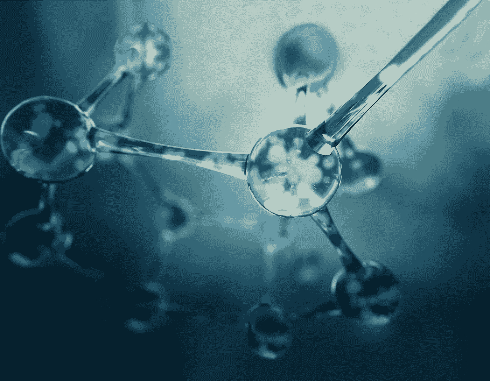
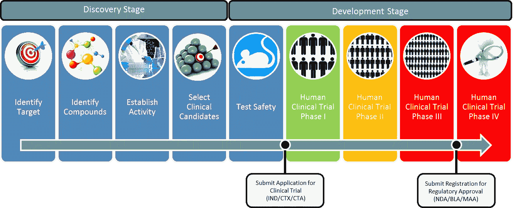
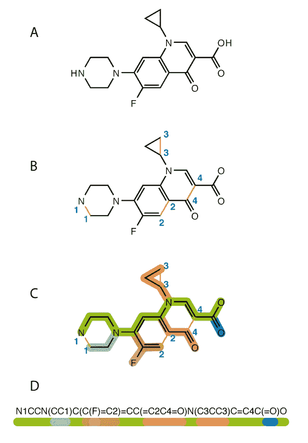
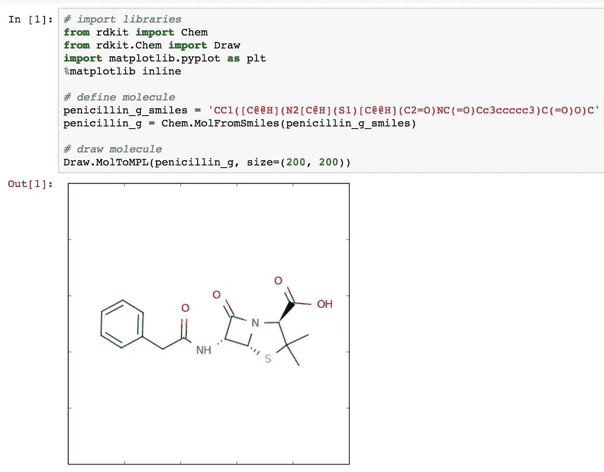
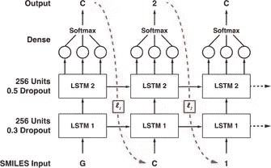
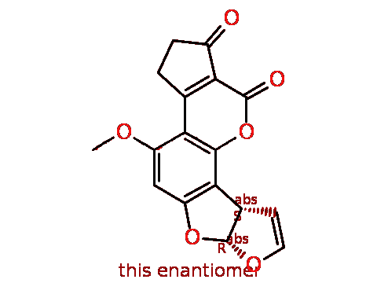
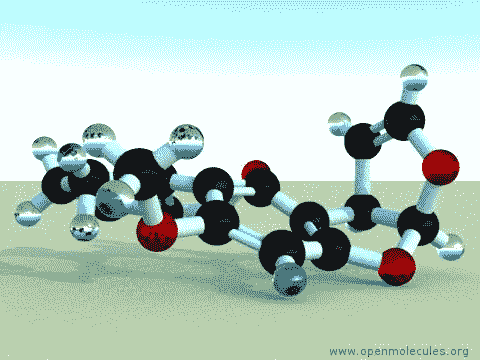
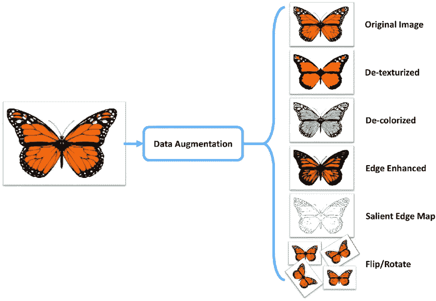
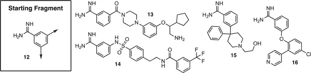

# 借助递归神经网络生成分子

> 原文：<https://towardsdatascience.com/generating-molecules-with-the-help-of-recurrent-neural-networks-c3fe23bd0de2?source=collection_archive---------7----------------------->



## 理解材料科学的深度学习

**2017 年，“数字医学”Spinraza 在经过多年的药物开发后向公众发布，用于治疗脊髓性肌萎缩症(SMA)，价格最初为 75 万美元，此后每年为 37.5 万美元。**

SMA 的原因是 5 号染色体上 SMN1 基因的简单突变。**sm n1 基因外显子中的一个改变的核苷酸序列**改变了出生时患有这种疾病的儿童的完整生命轨迹，许多儿童在婴儿期结束前死亡。然而，许多政府和保险公司拒绝支付药品的价格，使得儿童无法获得治疗。这种药物所做的只是，获取邻近内含子序列的反向互补序列，并与之结合。这控制着外显子是否包含在内，因为内含子编码基因的逻辑。许多其他更传统的药物也一样简单，使用抑制或阻止某种疾病机制发生的分子实体或化合物。那么**为什么开发一种药物的过程如此昂贵和耗时**，我们如何改变这种情况？



The average drug takes **12 years and 1.5B to produce,** according to Scientifist**.** Spinraza, for example, took 12 years from when the compound was discovered.

**传统药物开发**分两个阶段进行；**发现阶段、**和**开发阶段。**一旦发现某种疾病的靶标或根本原因/机制，我们需要鉴定化合物并验证这些化合物是否有任何作用来停止或抑制这些疾病的活性。在每 5000 种被测试的化合物中，只有一种具有初步的积极效果，对于那些我们对其毒性或其他生理化学特征没有基本了解的化合物。这导致长期而艰巨的工作，收效甚微甚至毫无结果。与此同时，数百万人死于这些疾病。很大程度上是因为这个原因，投资大多数制药公司不如把你的存款存入高息账户。

但是，我们如何能够尝试和**加速我们识别针对特定目标效应的化合物**的方法呢？在这种情况下，生成网络的领域迅速普及，以帮助使用网络如 RNNs 生成新的分子。我们的目标是通过**全新药物设计**来消除我们必须手动测试大量化合物以识别有效化合物的过程，从而加快发现阶段的过程。

# **从头项目:产生新分子**



Each colour corresponds to a sequence of characters in a SMILES string

我的项目的目标是使用递归神经网络生成新的分子。从头简单地意味着从简单分子合成新的复杂分子。然而，有一个主要的警告:我们不知道这些分子有多有用，甚至不知道它们的有效性，但在本文的最后，我提到了我可以扩展这个模型来做到这一点的方法。想法是训练模型学习微笑串中的**模式，以便生成的输出可以匹配有效的分子。SMILES 只是基于分子的结构和不同组成部分的分子的字符串表示，并且适合以计算机理解的方式表示分子。**



Penicillin as a SMILES String converted to its structural formula (source: Chemistry Stack Exchange)

因为我们将网络文本作为数据输入，所以 RNNs 是生成新的 SMILES 字符串的最佳网络。大多数论文和研究人员推荐使用 LSTM 细胞来增强 RNN 的内部结构，这是一种更高效和有效的相对方法。因此，我们将使用 RNN w/ 2 LSTM 层，在 100，000 个微笑字符串的数据集上进行训练。

# **第一阶段——测绘**

该项目的第一阶段是创建一个将字符映射到整数的指南，以便 RNN 在将结果和输出转换回字符时可以处理数据，反之亦然。我们需要创建一组唯一的字符，并枚举(为每个字符定义一个数值)每一项。微笑字符串由两种类型的字符组成，它们是特殊字符，如“/”或“=”，以及元素符号，如“P”、“Si”、“Mg”等。我们将这些枚举的独特字符放入独特的字典中，

```
unique_chars = sorted(list(set(raw_text)))
char_to_int = dict((c, i) for i, c in enumerate(unique_chars))
char_to_int.update({-1 : "\n"})
```

为“\n”创建映射的原因是它表示。txt 文件。

# 阶段 2—数据预处理

一旦我们为字符映射创建了字典，我们就调用字典 char_to_int 将 SMILES 字符串数据集中的每个字符转换成整数。规范化的工作原理是将字符的每个整数值除以数据集中唯一字符的数量。然后，我们使用 NumPy 将输入数组 X 重新整形为一个用于[样本、时间步长、物理化学特征]的三维数组，这是递归模型的预期输入格式。输出变量 Y 被一键编码以在训练模型后生成新的微笑。一键编码处理的是整数表示，就像我们刚刚做的那样，整数编码变量被删除，新的二进制变量被添加到每个唯一的整数值中。

# 阶段 3—模型架构



The Model Architecture, consisting of two LSTM layers with 256 units (Gupta et al.)

我构建的架构的设计基于 Gupta 等人的研究论文“[为*新*药物设计](https://www.ncbi.nlm.nih.gov/pmc/articles/PMC5836943/)生成递归网络”。我决定采用这种架构，因为它在创建有效微笑字符串方面产生了 97%的准确性，并且它是一种非常简单的架构。它由两个 LSTM 层组成，每一层都有一个隐藏的状态向量 H，它通过一个又一个单元传递 RNN 从未见过的信息。像这样更多的循环连接允许网络理解更复杂的 SMILES 序列的相关性。我还在这些层上使用了 0.25 的下降正则化，然后是由使用 softmax 激活函数的中子单元组成的密集输出层。Softmax 是一个函数，它将 K 个*实数的向量(在我们的例子中是输出向量 Y)作为输入，并将其归一化为由 *K 个*概率组成的概率分布。如果你想了解更多关于这个激活功能的信息，我会推荐 [softmax 功能](https://en.m.wikipedia.org/wiki/Softmax_function)的 wiki 页面。*

```
# Create the model (simple 2 layer LSTM)
model = Sequential()
model.add(LSTM(128, input_shape=(X.shape[1], X.shape[2]), return_sequences = True))
model.add(Dropout(0.25))
model.add(LSTM(256, return_sequences = True))
model.add(Dropout(0.25))
model.add(LSTM(512, return_sequences = True))
model.add(Dropout(0.25))
model.add(LSTM(256, return_sequences = True))
model.add(Dropout(0.25))
model.add(LSTM(128))
model.add(Dropout(0.25))
model.add(Dense(Y.shape[1], activation='softmax'))
```

随意添加更多层或改变辍学率，但请记住，NN(神经网络)中的**层和神经元**越多，**计算量就越大，越精确**。这个网络是在具有 30GB RAM 的 Paperspace Cloud GPU 上训练的，但是每个 epoch 仍然需要 3 个小时来训练！

# 第 4 阶段—培训:

对于我们的网络，我使用分类交叉熵作为损失函数，以及 Adam 优化器。我使用了一个包含 100，000 个 SMILES 字符串的数据集，但是我想在不需要等待 4 天的情况下最大限度地利用它，所以我用 512 个批量训练了 10 个时期的模型以供学习。这里的经验法则是理解**更多的时期+更小的批量=更好地理解数据，**但是代价是**更长的训练时间。**我们还可以利用**检查点，**Keras 库中的一个内置函数来保存我们的训练进度，以及每个时期的模型权重，供以后传输或保存。当我们想要在 GPU 或云服务上训练(就像我一样)，然后在 CPU 上加载训练节省的权重，以减少项目时间时，检查点是有用的。

```
# Define checkpoints (used to save the weights at each epoch, so that the model doesn't need to be retrained)
filepath="weights-improvement-{epoch:02d}-{loss:.4f}.hdf5"checkpoint = ModelCheckpoint(filepath, monitor = 'loss', verbose = 1, save_best_only = True, mode = 'min')
callbacks_list = [checkpoint] # Fit the model
model.fit(X, Y, epochs = 19, batch_size = 512, callbacks = callbacks_list) """TO TRAIN FROM SAVED CHECKPOINT"""
# Load weights
model.load_weights("weights-improvement-75-1.8144.hdf5") # load the model
new_model = load_model ("model.h5") assert_allclose(model.predict(x_train),new_model.predict(x_train), 1e-5) # fit the model
checkpoint = ModelCheckpoint(filepath, monitor='loss', verbose=1, save_best_only=True, mode='min')
callbacks_list = [checkpoint]new_model.fit(x_train, y_train, epochs = 100, batch_size = 64, callbacks = callbacks_list)
```

# 阶段 5 —生成新分子:

生成新分子的工作相当简单。首先，我们加载预训练的权重，从而避免每次在生成新的微笑字符串之前都必须训练模型。然后，我们从数据集中随机选择一个 SMILES 字符串作为参考字符串，并在范围内生成指定数量的字符，并将整数值转换回字符。从技术上讲，上面的代码可以用于生成任何类型的文本，无论是故事、音乐还是微笑分子。根据自定义调整、学习速度、数据集大小和质量，结果会有所不同，但最终我们应该得到一个字符串，它代表了类似于有效分子的东西。该模型可能首先生成一个只有一个字符的序列(NNNNNN)，然后学习在分子中发现的新的子结构和分支(N1CCN(CC1)C(C(F)=C2…)。

下面是分子结构的二维(O1C = C[C @ H]([C @ H]1 O2)C3 C2 cc(OC)C4 c3oc(= O)C5 = C4 CCC(= O)5)**I 生成:**

****

**2-d molecular structure**

**以及立体结构:
**O1C = C[C @ H]([C @ H]1 O2)C3 C2 cc(OC)C4 c3oc(= O)C5 = C4 CCC(= O)5****

****

**3-d molecular structure**

# ****可能的改进****

1.  ****检查这些分子的有效性:**我们不知道我们生成的分子是否有任何用例，甚至是有效的分子结构。我们必须通过将这些分子与用于训练的原始分子进行比较来验证它们。通过为数据计算它们共同的生理化学特征，并对训练数据的特征使用主成分分析，我们可以确定新产生的分子是否被相应地转化。**
2.  **微笑字符串是代表分子的最佳方式吗？: LSTMs 充其量只能让生成的文本样本看起来有一定的说服力，因为微笑字符串只是观察分子化学组成的一种基本方式。我们很可能会创造出更好的方法来表现分子的复杂性，以便在未来进行更精确的测试。然而，目前，SMILES 字符串和 RNNs 是使用 ML 生成分子的标准。**
3.  ****数据集:通过数据扩充，**我们可以对微笑字符串进行排列或不同的排列，并将它们添加到我们的数据集。扩充数据集的另一种方法是枚举原始形式之外的 SMILES 字符串，或者用另一种方式编写它。**

****

**An example of data augmentation on image data.**

# **不断变化的药物发现:基于片段的药物发现(FBDD)**

****

**SMILES fragment 12-which is known to bind to an active site is used to create the following molecular structures**

**这种产生分子的方法的一个主要应用是**基于片段的药物发现，或 FBDD** 。在这种情况下，我们可以从已知与感兴趣的靶疾病机制结合的片段开始，而不是以标记(一种特殊值或字符，其使用其存在作为终止条件)开始输入。通过将这个片段的微笑串作为输入，我们可以用 RNN“生长”分子的其余部分，创造出更多被证明能抵消某种功能的分子！这种方法肯定很有前途，将来会被更多地使用，这很有趣。**

# ****结论+关键要点****

**RNNs 提供了一种简单而有效的生成分子的方法，仅使用固体数据集上的几个参数。该领域的大多数研究都希望结合 RL 或对抗性训练等架构，以帮助增加生成的有效分子的数量，或使模型偏向于创建具有特定药物特定属性的分子。希望在未来，通过这种方法，基于片段的药物发现变得更加普遍，并有助于使药物开发更加可行和经济。**人工智能是消除创造疗法中猜测的关键。****

## ****关键要点****

*   **缓慢而昂贵的药物开发和材料科学研究是当前方法缓慢的直接结果**
*   **使用磁共振成像，我们可以加快 R&D 发生的速度。**
*   **使用 ML 生成分子最有效的方法是使用 RNN 和斯迈尔斯分子串表示法，但是它们并不是最佳的方法。**
*   **在我们能够使用人工智能以更快的速度制造出更准确、更有效的分子结构之前，我们还有很长的路要走，但是有太多的事情值得期待了！**

# **后续步骤**

**如果您喜欢这篇文章，请务必遵循这些步骤，与我未来的项目和文章保持联系！**

1.  **在 Linkedin[上与我联系，了解我未来的发展和项目。我目前正在研究 cfDNA，并确定用于早期癌症诊断的独特生物标志物。](https://www.linkedin.com/in/seyone-chithrananda-a5974915b/)**
2.  **我的[网站](https://seyonechithrananda.github.io/)现在有了我所有的内容，还有我的 [Github](https://github.com/seyonechithrananda) 。**
3.  **请务必[订阅](https://www.subscribepage.com/e8v5s6)我的每月简讯，以查看我参加的新项目、会议和发表的文章！**
4.  **随时给我发电子邮件在 seyonec@gmail.com 谈论这个项目和更多！**