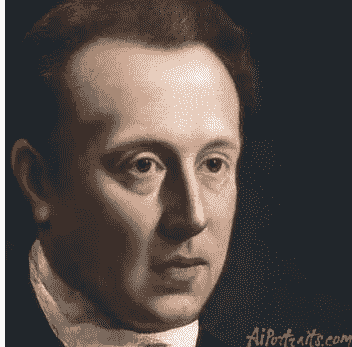

# 生成多对比度的 MRI 图像

> 原文：<https://towardsdatascience.com/generating-mri-images-of-multiple-contrast-levels-89c3b6c00e68?source=collection_archive---------11----------------------->

## 利用 CycleGans 将 T1 加权 MRI 图像转换为 T2 加权 MRI 图像。

**放射科医师每年误诊全球 4000 万人**🤯**！**

虽然技术等其他事物在不断创新，但我们也必须大幅改进疾病诊断方法。通过简单地减少假阴性和假阳性误诊病例，我们可以真正解决一半的医疗保健问题。

如果存在更好的成像工具和设备，能够更准确地发现患病部位，这可能会挽救数百万人的生命！特别是像癌症这样的疾病，当在早期诊断时，与晚期相比，其 5 年存活率明显更高，但是很少在早期检测到疾病的任何“迹象”，这是一个问题。

# 核磁共振扫描

让我们来玩一个小游戏，*，在这里你可以假装是放射科医生*。你的工作是*在下面的 MRI 图像中找到异常区域*:

**提示:** *有* ***两个*** *异常区域。*

[Source](https://www.radiologymasterclass.co.uk/tutorials/mri/t1_and_t2_images#top_3rd_img): MRI T1-weighted scan

如果我也给你这个核磁共振扫描，这一切会变得容易得多，你也会对你的答案更有信心:

[Source](https://www.radiologymasterclass.co.uk/tutorials/mri/t1_and_t2_images#top_3rd_img): MRI T2-weighted scan

请注意，在上面的 MRI 扫描中，两个异常区域要亮得多，也更容易发现。

[Source](https://www.radiologymasterclass.co.uk/tutorials/mri/t1_and_t2_images#top_3rd_img)

上面显示的两幅不同的 MRI 图像具有不同的对比度。在这种情况下，异常区域恰好表明肿瘤的迹象，特别是这名患者患有*多发性骨髓瘤。*

磁共振成像主要有两种类型， **T1 加权磁共振成像和 T2 加权磁共振成像。**这两种类型的核磁共振成像对比体内不同的区域。

上面呈现的第一个 MRI 图像是 T1 加权的 MRI 图像👆，而第二个提出的是 T2 加权磁共振成像图像。

T1 加权图像特别突出了脂肪组织，而 T2 加权图像突出了体内的脂肪和水。

*   **T1 加权→** 脂肪组织看起来很亮
*   **T2 加权→***脂肪和水区域看起来都很亮*

**

*Summarizes the regions T1 and T2 images highlight*

*拥有这两种类型的 MRI 扫描可以通过为医生提供更全面的理解来大大提高诊断的准确性。*

*然而，在实践中，病理学家*很少*能够访问这两种类型的 MRI 图像用于检查和诊断目的。这是因为多种原因，例如某些扫描时间限制以及其他因素，例如在 MRI 图像中由于噪声或伪影而发现的失真对比度。*

*克服这些低效率的方法之一是使用一种称为**风格转移的人工智能技术，从现有的 MRI 扫描中合成不同对比度水平的 MRI 图像。***

*具体来说，我利用了一种可以执行风格转移的算法，称为**循环生成对抗网络(CycleGAN)，从 T2 加权的 MRI 图像合成 T1 加权的 MRI 图像，反之亦然。***

# *什么是风格转移？*

*风格转移正是它听起来的样子！让我们用一个埃隆·马斯克的类比来进一步分解它😍。*

*这是 21 世纪的埃隆·马斯克:*

**

*埃隆·马斯克(Elon Musk)很酷，但我一直想知道 16 世纪的优秀的老埃隆·马斯克会是什么样子。风格转移让我满足了我的好奇心，这就是它对埃隆·马斯克的影响:*

**

*Painting of Elon Musk in the 16th century*

*那是埃隆·马斯克在 16 世纪的一幅画👆！*

*这是一个风格转换的演示，将一张“现代”的照片几乎完美地变成了一幅古典绘画。特别是，这被称为 ***图像到图像的翻译*，将图像从一个域转移到另一个域的任务。***

*这里有更多的例子！*

**

*🐴我以前从未见过斑马在美丽的大自然中奔跑，但现在我看到了…*

**

*☀️，我真的希望季节转换的魔力真的存在于现实生活中，而不仅仅是图像。*

**

*🎨《蒙娜丽莎》五季怎么样？(我知道，我知道，你想说只有四个季节，对吧，我想传统是要打破的。)*

**

*🐰史上最可爱的仓鼠！(ps:实际上我不知道那是不是仓鼠，但它可能是)*

**

*这里还有一些👆。享受吧。*

***好的，我得到了样式转移部分，但是是什么使 CycleGan 适合于将样式转移应用于 MRI 图像的特定任务呢？***

*风格转移并不是一个真正的新概念，已经做了大量的工作。但使 **CycleGAN 成为一个有吸引力的模型的是，它不需要*成对的训练数据*** ，但仍然能够合成“惊人”质量的风格转移图像。*

**

*Paired data vs unpaired data*

***成对数据**是 x1 对应 y1、x2 对应 y2 等的数据。就 T1 加权和 T1 加权 MRI 图像而言，如果数据是成对的，这意味着每个 T1 加权 MRI 图像及其对应的 T2 加权 MRI 图像来自同一患者。*

***不成对数据**则是两组数据，其中 x1 不需要对应 y1，x2 到 y2 等等。*

*先前用于风格转移的机器学习方法工作良好，并且仅在用配对数据训练的情况下产生“体面”的结果。*然而，成对数据的大型数据集非常罕见。**

*CycleGAN 很有用，因为它可以像其他风格传输方法一样出色地执行，但使用的是*不成对数据*。寻找数据集是一件痛苦的事情，如果你在机器学习方面做过一些工作，你就会知道这有多痛苦！如果你想要成对数据的大型数据集，那就更痛苦了，而且大多数时候，对于像 MRI 图像这样的数据集，*公共成对数据集甚至不存在*(或者，我没有挖掘足够多😅).*

***这就是 CycleGAN 如此有用的原因，与成对数据相比，它可以用不成对数据进行同样好的训练。***

*在我们深入到 CycleGAN 之前，让我们先来看看正则生成敌对网络(GANs)。*

## *生成对抗网络*

**

***GANs 的魔力包括两个关键部分:***

*   ***生成器**——负责生成“逼真”的合成数据(在这种情况下，它们是图像)*
*   ***鉴别器** —尽力将生成器生成的“虚假”[0]数据与训练数据集中提供的“真实”[1]数据区分开来*

*让我们用一个类比来帮助我们更直观地理解这一点。*

*杰西卡是一名专业的艺术品侦探，她的职责是侦查伪造的艺术品。*

*艺术界有成千上万的“伪造者”在生产“伪造”艺术品。*

*   ***伪造者的工作**(“生成者”)是制作看起来非常“逼真”的赝品，并试图愚弄侦探杰西卡(“鉴别者”)。*
*   ***杰西卡**(“鉴别者”)负责区分“真”艺术品与伪造者(“生成者”)的“假”艺术品。*

**

*杰西卡和伪造者本质上是在这场猫和老鼠的竞赛中竞争。为了训练甘斯产生逼真的图像，最终目标是训练生成者(“伪造者”)变得真正擅长愚弄鉴别者(“杰西卡”)。*

*杰西卡和伪造者都很有竞争力，他们互相依赖，以求更好。随着鉴别器更好地检测由发生器从真实图像合成的假图像，这迫使发生器也变得更好地生成“逼真”的图像。*

# *CycleGAN 式传输，但数据不成对*

*CycleGAN 比常规 GAN 更复杂，但它包含类似的组件，如发生器和鉴别器。别担心，只是稍微复杂一点，嗯，也许…*

*让我们首先来看看数据集，它包括两个独立的数据集。我用来训练我的 CycleGAN 模型的两个数据集包括以下内容:*

*   ***数据集#1:** 真实 T1 加权脑 MRI 图像*
*   ***数据集#2:** 真实的 T2 加权脑 MRI 图像*

**

*Daily dose of MRI! Left: T1-weighted MRI image, Right: T2-weighted MRI Image. **Ps: Another example of how having both types of MRI images allows for a more comprehensive diagnosis.***

*CycleGAN 的架构有点像 2 个 GAN 的组合，总共由 4 个模型组成(2 组 1 个发生器网络+ 1 个鉴别器网络)。下面是每个 GAN 在一个 CycleGAN 中所负责的内容:*

## *甘#1:*

> *GAN #1 负责对 T1 加权的 MRI 图像(第一数据集)应用风格转移，以合成生成其对应的 T2 加权的 MRI 图像(第二数据集)。*

***甘#1 发电机:***

*   *输入:T1 加权脑 MRI 图像(第一数据集)*
*   *输出:合成相应的 T2 加权*

***GAN # 1 的鉴别器:***

*   *输入:T2 加权脑 MRI 图像的数据集(数据集#2) +来自 GAN #1 的发生器的合成生成的 T2 加权脑 MRI 图像*
*   *输出:真实[1]或虚假[0]-表示生成的图像与来自数据集#2 的真实图像相比有多真实*

## *甘二号:*

> *GAN #2 负责将风格转移应用于 T2 加权 MRI 图像(第二数据集)以合成生成其对应的 T1 加权 MRI 图像(第一数据集)。*

***甘#2 发电机:***

*   *输入:T2 加权脑 MRI 图像(第二数据集)*
*   *输出:合成相应的 T2 加权*

***GAN # 2 的鉴别器:***

*   *输入:T1 加权脑 MRI 图像的数据集(数据集#1) +来自 GAN #2 发生器的合成生成的 T1 加权脑 MRI 图像*
*   *输出:真实[1]或虚假[0]-表示生成的图像与数据集#1 中的真实图像相比有多真实*

**

*CycleGAN representation*

***好的，但是发生器和鉴别器的组成部分到底是什么？***

*发生器的结构由一个编码器-解码器网络组成。*

**

***发电机包含三种主要类型的部件:***

***1。编码器** —由卷积层组成，将图像解压缩为代表其压缩特征的矢量。*

*   *接受“真实的”MRI 图像，即来自中提供的数据集的 256 x 256 图像作为输入。*
*   *将图像的压缩表示作为特征向量输出。*

***2。转换器** —由负责解释编码的残差神经网络(ResNet)组成。*

*   *ResNet 层将来自编码器的特征向量作为输入。*
*   *它负责将变换应用于特征向量，以使特征向量与期望的输出相匹配。例如，对于负责将 T1 加权 MRI 图像变换为 T2 加权 MRI 图像的 GAN #1，变换器的工作是变换 T1 加权 MRI 图像的压缩特征向量，使得它类似于 T2 加权 MRI 图像的特征向量。*
*   *每个 ResNet 层由两个使用跳过连接的卷积层组成。跳过连接确保早期层中的变换在整个模型中得以保留，因为它解决了渐变消失的问题。这允许输出在重建(由解码器执行)期间保留原始输入图像的大部分特征。*

***3。解码器** —由解卷积层(与卷积层相反)组成，它将图像的紧凑表示解构成原始大小。*

*   *在这种情况下，原始大小是 256 x256 的图像。*
*   *解码器将来自 ResNet 层的*变换后的*特征向量作为输入，并对其进行上采样以生成新的 256×256 图像。*

**

*Convolutional neural network*

***解码器网络的架构要简单得多，由一个执行图像分类的卷积神经网络**组成。如上所述，卷积层决定了输入模型的图像是真的[1]还是假的[0]。*

*在只训练了我的模型 2 个时期后，它就能够合成看起来“干净”的 MRI 图像了！然而，我建议为大约 50 个纪元训练这样的模型，这可能需要几天时间📆。*

## *结果如下:*

*这是从 T1 加权 MRI 图像生成 T2 加权 MRI 图像的例子之一。*

**

*Real: T1–weighted MRI image, Generated: T2-Generated MRI image*

*这是产生相应 T2 加权 MRI 图像的 T1 加权 MRI 图像的模型的另一个例子。*

**

*Real: T2-weighted MRI image, Generated: T1-weighted MRI image*

*这项技术的含义是疯狂的！CycleGAN 可以用来合成任何对比度级别的 MRI 图像！此外，它甚至有可能被部署精确地导出 CT 扫描、PET 扫描、X 射线等。核磁共振扫描，反之亦然！*

## *关键要点:*

*   *CycleGAN 使用不成对的数据，这使得它非常有吸引力，因为成对的数据很少，很难找到*
*   *GANs 包括两个网络:生成器(“伪造者”)和鉴别器(“侦探”)*
*   *一个循环中涉及两个 GAN*
*   *我训练了一个 CycleGAN 来合成 T1 加权的 MRI 图像，给定 T2 加权的 MRI 图像，反之亦然*

**在您离开之前，如果您有任何疑问，请随时联系我，并通过* [*LinkedIn*](https://www.google.com/url?sa=t&rct=j&q=&esrc=s&source=web&cd=1&cad=rja&uact=8&ved=2ahUKEwjsqKS-y8DmAhVJXK0KHYHrCK0QFjAAegQIBxAB&url=https%3A%2F%2Fca.linkedin.com%2Fin%2Fjoey-mach-6293b1175&usg=AOvVaw2zgAwIF5r8P-8rHkWc5B_A) *与我联系！PS:我每月都会发简讯，如果你有兴趣了解这位 16 年的创新者/人工智能爱好者的最新动态，* ***请随意订阅*** [***这里***](https://landing.mailerlite.com/webforms/landing/j8c7g3) ***！****