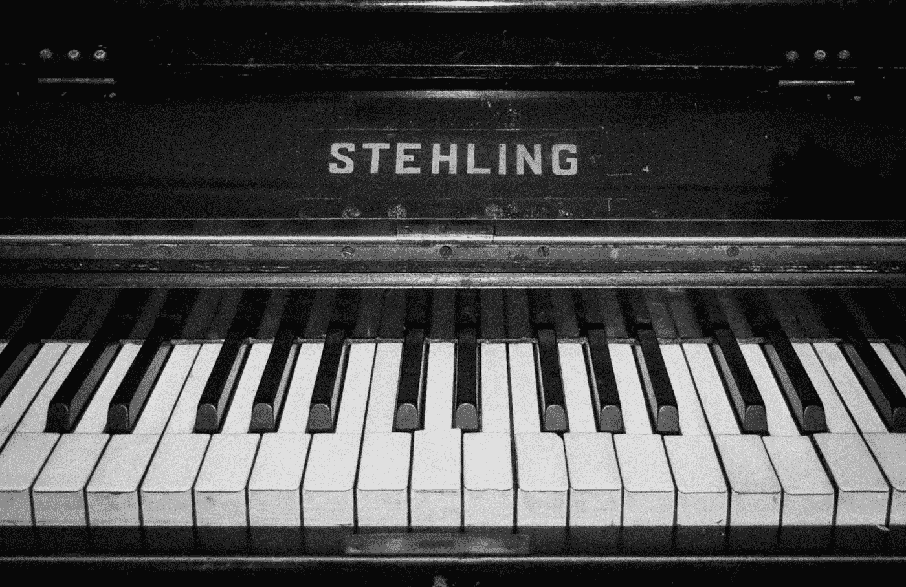
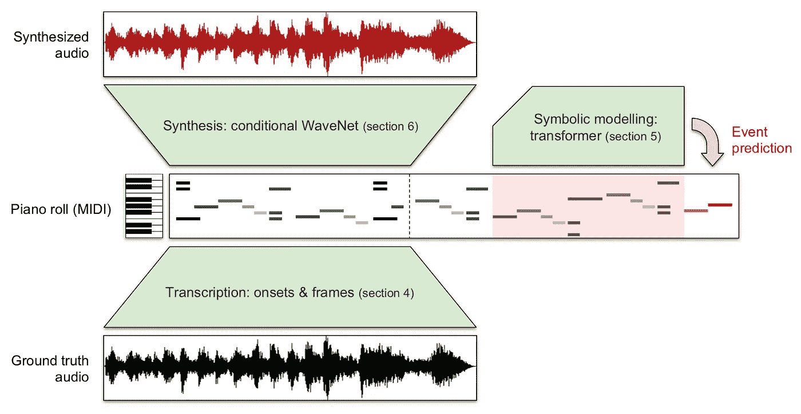
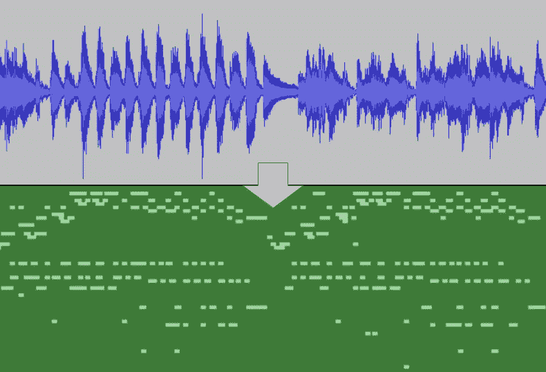
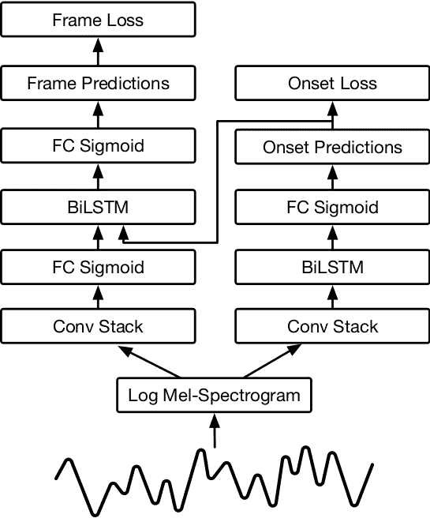
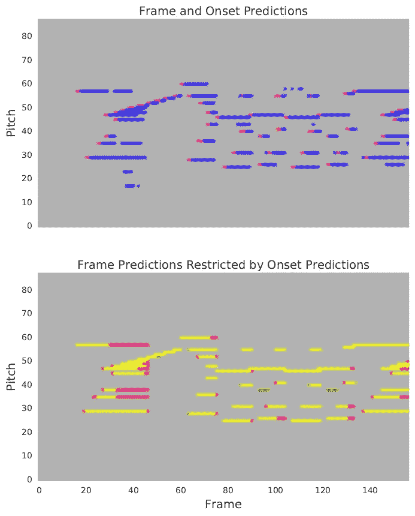
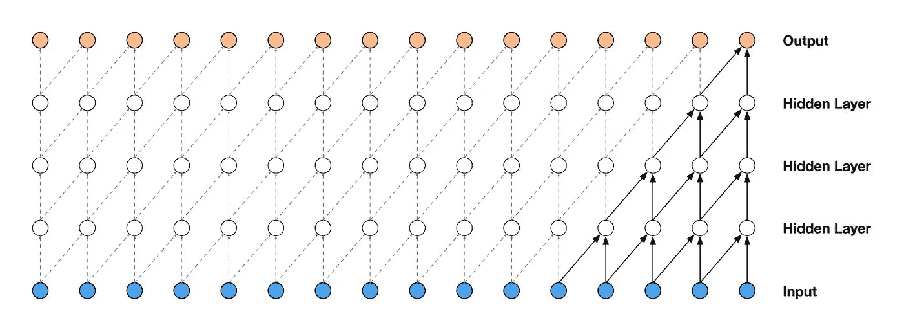
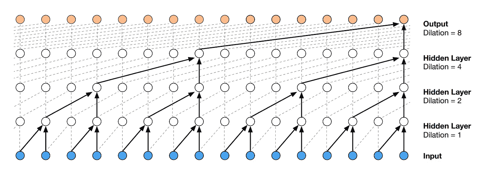
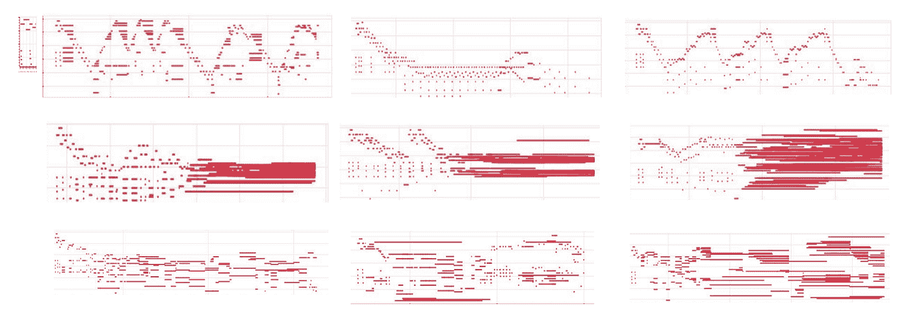

# 用人工智能创作音乐

> 原文：<https://towardsdatascience.com/generating-music-with-artificial-intelligence-9ce3c9eef806?source=collection_archive---------4----------------------->

## 我从用机器学习研究音乐生成中学到了什么

Photo by [Oleg Kuzmin](https://unsplash.com/@skytta?utm_source=medium&utm_medium=referral) on [Unsplash](https://unsplash.com?utm_source=medium&utm_medium=referral)

我五岁时开始弹钢琴。我曾经每天练习大约一个小时，让我告诉你，一个小时感觉像永远。我没有停止思考，但是我继续练习，因为我真的喜欢音乐。

几年后，我开始做一些真正先进的东西。我的手在键盘上飞来飞去，我可以闭着眼睛弹奏。开玩笑的。实际上我并没有那么好，但我希望有一秒钟你认为我是一个钢琴神童或什么的。😉

我几乎喜欢钢琴演奏的每个方面。音乐的声音，琴键的触感…除了乐理以外的一切。这就像你把一个沉迷于规则的老家伙和他的音乐创造力和独创性结合起来。音乐语法，分析和创作音乐时遵循的规则，调号和拍号。这都是一堆你需要记住的漂浮在页面上的随机的东西。

What music theory feels like at times.

但是等等，一大堆数据？很多规则和模式？音符的顺序和序列？这听起来像是*(戏剧钢琴曲)*机器学习的完美工作！

可惜没那么容易。

# 用于音乐生成的递归神经网络

*注意:如果你需要复习，请随意查看我的文章***关于用 RNNs 生成文本。**

**

*Visualizing the flow of information in a Recurrent Neural Network. [Source.](https://www.analyticsvidhya.com/blog/2017/12/introduction-to-recurrent-neural-networks/)*

*递归神经网络的快速概述；*

*   ***普通神经网络不擅长处理时序或时间数据**，它们还需要固定的输入大小*
*   *递归神经网络通过让后续迭代从最后一次迭代传输数据来解决这个问题，这意味着每次运行时**信息都通过网络传递***
*   ***通过获取一次前向传递的输出并将其输入下一次传递，您可以生成全新的数据序列。**这就是所谓的取样*
*   *rnn 有一些问题，例如当网络太深时出现的消失/爆炸梯度。这通过使用 LSTMs 来解决，LSTMs 基本上在网络中创建快捷方式*

*因此，在了解了递归神经网络之后，我认为这将完全是创建能够产生新类型音乐的 ML 模型的最佳解决方案。我很接近了。*

*在做了一些研究并了解了更多关于使用递归神经网络生成音乐的信息后，我发现它工作得相当好。而且其实超级变态。*

*A sequence generated by an RNN trained by Daniel Johnson. [Source.](http://www.hexahedria.com/2015/08/03/composing-music-with-recurrent-neural-networks/)*

*但是如果你明白我的意思，它仍然没有那种魅力。我不认为这将很快取代我的 Spotify 播放列表中的莫扎特。虽然这首音乐完全由神经网络生成非常酷，但考虑到上下文，我认为大多数人都能够看出它是由机器或我创作的。*

*这让我想了解更多，深入这个话题，这是我发现的一个超级有趣的事情。*

# *MAESTRO 数据集和 Wave2Midi2Wave*

**

*A diagram showing the different parts of Wave2Midi2Wave. [Source.](https://magenta.tensorflow.org/maestro-wave2midi2wave)*

*在查看了一些更多的资源后，我发现了一篇研究论文，其中介绍了一个名为 MAESTRO 的新数据集(代表为同步轨道和组织编辑的 MIDI 和音频)。它还提出了一种新的架构，Wave2Midi2Wave，它基本上结合了三种最先进的算法，并在 MAESTRO 数据集上训练它们。*

*MIDI 基本上是一种技术标准，包括一系列计算机与不同种类音频设备接口的协议。这很有用，因为传输的信息包含有关音符、音高、力度和速度的信息。*

*这个新数据集如此重要的主要原因是，它包含的数据比以前的所有数据集都多。客观地说，**MAESTRO 数据集包含 172 小时的音频和 MIDI 转录。**地图数据集仅包含 17.9 小时，音乐网数据集仅包含 15.3 小时。*

*正如我之前提到的，**wave 2 mid 2 wave 基本上是三个不同的艺术模型的组合，它们各自执行不同的任务。**首先，Wave2Midi 用于将音频转录为符号表示(Midi)。然后网络的 Midi 部分产生新的内容。所有这些都由 Midi2Wave 合成，以获得逼真的声音音乐。*

## *Wave2Midi:开始和框架*

**

*Audio transcription from an audio file to a MIDI representation. [Source.](https://magenta.tensorflow.org/onsets-frames)*

*Wave2Midi2Wave 中的第一个网络使用了一种称为 Onsets and Frames 的艺术架构，它可以自动将您的录音转换为 Midi 中的音符。所以，如果你是即兴创作，你可以确切地知道你演奏的是什么！*

*使用 CNN 和 LSTMs，研究人员能够“预测音高开始事件，然后[使用]这些预测来调节逐帧音高预测。”这基本上意味着模型中的一个神经网络用于预测音符何时演奏(即开始)。而另一个神经网络预测音符演奏多长时间(音符活跃的每一帧)。*

**

*Two stacks of neural networks to predict the onset and frames of an audio file. [Source.](https://magenta.tensorflow.org/onsets-frames)*

*查看上图，您可以看到一个箭头从开始预测器的输出指向帧预测器中的 BiLSTM 层。**这很有用，因为没有相应开始预测的每个帧预测都被移除了。**这就像神经网络在反复检查它的预测。*

**

*The pink lines in the top image represent onset predictions and the blue lines represent frame predictions. The bottom image shows the output of the network after removing the frames without onsets.*

*如果你有兴趣了解这个超级酷的模型，你可以查看 TensorFlow Magenta 的博客文章[这里](https://magenta.tensorflow.org/onsets-frames)，研究论文[这里](https://arxiv.org/abs/1710.11153)，以及 Colab 笔记本[这里](https://colab.research.google.com/notebook#fileId=/v2/external/notebooks/magenta/onsets_frames_transcription/onsets_frames_transcription.ipynb)！*

## *Midi:音乐变压器*

*对于 wave 2 mid 2 wave 中的第二个网络，一种特殊类型的转换器用于生成具有长期一致性的全新音乐序列。与其他神经网络相比，该网络的输出更有结构意义。*

**

*A diagram showing the events in the network and the long-term relations between them. [Source.](https://magenta.tensorflow.org/music-transformer)*

***在一个常规的转换器中，自我关注被用来模拟单词之间的关系**，因为在句子中，一个单词的含义不仅基于它之前的单词，还基于整个句子的上下文。*

*转换器从网络的所有其他部分收集信息，并根据整个上下文为每个单词生成一个表示。对每个单词重复这一过程以产生新的表示。*

**

*An animation showing how Transformers are applied to machine translation. The bubbles represent the representations for each word. [Source.](https://ai.googleblog.com/2017/08/transformer-novel-neural-network.html)*

***这里的要点是，使用变压器，我们可以根据整个网络的上下文将信息归属于不同的数据。**那么让我们回到音乐一代的话题。*

*原始变形金刚的一个问题是，它依赖于自我关注的绝对位置。当把它应用到音乐中时，变形金刚会在距离、顺序和重复上挣扎。**通过使用相对注意力，音乐转换器模型可以关注关系特征并生成超出训练示例中给出的序列。***

*如果你想了解更多关于音乐转换器的信息，还有一篇附带的[博客文章](https://magenta.tensorflow.org/music-transformer)和[研究论文](https://arxiv.org/abs/1809.04281)！*

## *Midi2Wave: WaveNet*

*网络的最后一部分采用 WaveNet 模型，并在数据集上对其进行训练，以生成听起来像录音的音乐。 **WaveNet 是基于 PixelCNN 的模型架构，专门用于合成音频。***

*该架构利用了卷积层。因为卷积不像 RNNs 那样使用循环连接，这意味着它们通常比 RNNs 更容易训练。但一个问题是，为了增加感受域(模型可以覆盖的数据量)，需要大量的层或超大的过滤器，从而增加了计算成本。*

**

*A diagram showing a stack of convolutional layers. [Source.](https://arxiv.org/pdf/1609.03499.pdf)*

*为了解决这个问题，使用了扩张回旋。这基本上意味着，如果跳过某些输入值，可以在更大的区域上应用过滤器。如果你用零来扩大它，你会得到和一个更大的滤波器几乎一样的效果，但是它更有效。*

**

*A diagram showing a stack of dilated convolutional layers. [Source.](https://arxiv.org/pdf/1609.03499.pdf)*

*在 MAESTRO 数据集上训练语音合成的艺术模型 WaveNet，给出了一些非常令人难以置信的结果。我在这里链接了 WaveNet 博客文章和研究论文[，在这里](https://deepmind.com/blog/wavenet-generative-model-raw-audio/)链接了[。](https://arxiv.org/abs/1609.03499)*

## *最后的结果*

**注意:在 TensorFlow Magenta 页面上有更多 wave 2 mid 2 wave 的音频记录。可以在这里* *查看* [*。*](https://storage.googleapis.com/magentadata/papers/maestro/index.html)*

*当你把这个和之前的例子比较时，很明显音频更加真实。对我来说，这听起来就像是一个真实的人在弹钢琴。我还想说，虽然有些部分听起来可能不太好听，但整体效果是一首更加连贯的音乐。*

*看看歌曲的实际结构，音乐转换器在生成结构上有意义的新作品方面更加有效，这一点变得更加清楚。*

**

*Top: Music Transformer. Middle: Transformer. Bottom: LSTM. Source.*

*   *第一行清楚地表明了音乐中的长期结构和重复模式。*
*   *第二行开始时是连贯的模式，但几秒钟后就变成了没有明显结构的音符和和弦的混乱。*
*   *最后一行显示了更少的重复、结构和连贯性。*

# *关键要点*

1.  *音乐可以用递归神经网络和 LSTMs 生成，但由于它们的顺序性质，它们通常很难训练。*
2.  *MAESTRO 数据集包括 172 小时的钢琴录音和转录，比任何其他类似的数据集多十倍。*
3.  *wave 2 mid 2 wave 结合了在 MAESTRO 数据集上为三个任务训练的三个独立的最先进的模型。转录、生成和合成。*

*在研究用不同类型的神经网络生成音乐的过程中，我学到了很多关于可以用来转录、生成和合成音频的不同方法和模型。有很多我还没有看到的资源和架构，在接下来的一年左右的时间里，这将会是非常令人兴奋的。*

*感谢阅读！如果您喜欢，请:*

*   *在 LinkedIn[上添加我](https://www.linkedin.com/in/alexjy/)并关注我的媒体，了解我的旅程*
*   *在我的个人网站[查看我的其他项目](https://alexyu.ca)*
*   *留下一些反馈或者给我发邮件(alex@alexyu.ca)*
*   *与你的网络分享这篇文章*