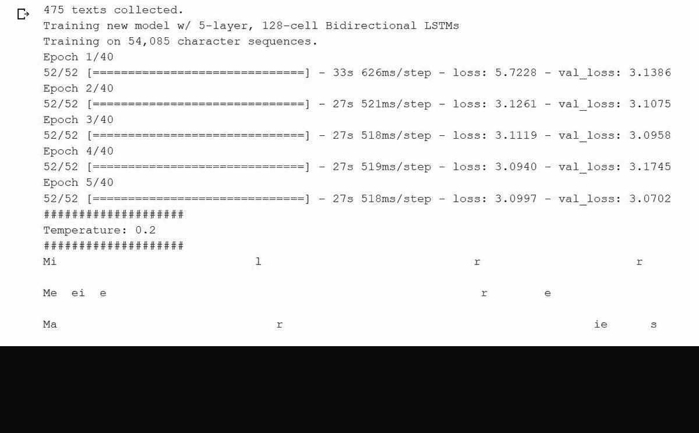
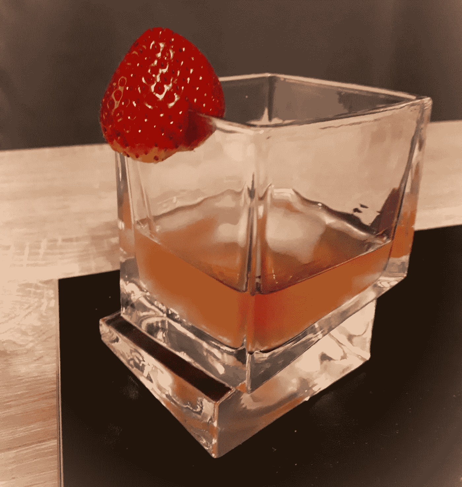

# 通过递归神经网络生成具有特定风格的新型鸡尾酒配方

> 原文：<https://towardsdatascience.com/generating-novel-cocktail-recipes-with-a-specific-style-through-recurrent-neural-networks-4339e9168404?source=collection_archive---------24----------------------->

## 使用自然语言处理和深度学习来生成文本

深度学习现在风靡一时。它被用于从病理学图像分类到谷歌助手或亚马逊 Echo 中使用的语音识别的所有事情。因此，至少把它作为一项技能应用到你的工作流程中似乎是有用的。就像你学习的每一项新技能一样，在整个学习过程中，开始学习并保持动力是很有挑战性的。那么，有什么比选择鸡尾酒作为研究主题更好的激励自己的方式呢？在成功完成项目后，你可以用美味的饮料奖励自己。

简而言之:我计划使用 Python 中的深度学习生成一个程序，可以从头开始生成新的鸡尾酒配方。为此，我选择了[递归神经网络](https://medium.com/explore-artificial-intelligence/an-introduction-to-recurrent-neural-networks-72c97bf0912) (RNNs)，一种经常用于自然语言处理(NLP)的深度学习形式。更具体地说，我用[长短期记忆单位](http://colah.github.io/posts/2015-08-Understanding-LSTMs/)(lstm)作为 RNN 的单位来创建一个 LSTM 网络。顾名思义，LSTMs(以及一般的 rnn)具有内存优势，如果您一次生成一个字符或一个单词的连贯文本，并且不希望以混乱的方式结束，这将非常有用。[在这里](http://www.wildml.com/2015/09/recurrent-neural-networks-tutorial-part-1-introduction-to-rnns/)你可以找到一个关于 NLP 的 RNNs 的优秀介绍，但简单来说，这里是 LSTM 的情况:单个 LSTM 由一个包含记忆的单元、一个输入门、一个输出门和一个遗忘门组成。简单地说，输入和遗忘门决定了有多少输入值传输到输出门，门的激活函数通常是逻辑函数。我们有效地从输入数据中学到的是影响这些门的活动的连接的权重，并希望在这个过程中产生令人敬畏的鸡尾酒！

与所有此类项目一样，数据是第一位的。要生成鸡尾酒配方，你首先需要鸡尾酒配方，这样你的 RNN 就可以学习正确的配料和数量等嵌入(根据 [Firth](http://cs.brown.edu/courses/csci2952d/readings/lecture1-firth.pdf) 的“一个词保持的公司”)。当然，从理论上讲，你可以选择你遇到的任何鸡尾酒配方，但我决定把自己限制在一个特定酒吧的配方上，用这种人工智能算法模仿他们的风格。更确切地说，我选择了纽约市著名的酒吧[死亡&公司](https://www.deathandcompany.com/)。方便的是，我有一本他们极力推荐的书[“死亡&公司:现代经典鸡尾酒，有超过 500 种配方】](https://www.amazon.com/Death-Co-Modern-Classic-Cocktails/dp/1607745259)，我曾经(手动)将大约 500 种配方输入到一个文本文件中(每行一个鸡尾酒配方，因为你在假期还会做什么)。重要的是，我在抄写食谱的时候调整了它们。对我们来说，史密斯&克罗斯朗姆酒或圣塔特蕾莎 1796 朗姆酒的差异和共性可能是显而易见的，尤其是在口味上。然而，我简单地称之为“棕色朗姆酒”的东西的太多变体可能会剥夺 RNN 人有效了解棕色朗姆酒和酸橙汁之间联系的机会。我去掉了品牌名称、配料的分类，并将盎司、破折号和滴数转换成统一的毫升数。这当然也意味着我们可能必须通过尝试不同版本的“棕色朗姆酒”来优化生成的配方。

现在有了数据，就可以开始深度学习了！一个很好的资源是[合作实验室](https://colab.research.google.com/)，这是一个由谷歌提供的免费 Jupyter 笔记本环境。除了能够将你的笔记本连接到你的 Google Drive 文件，你还可以使用免费的 Tesla K80 GPU 进行计算(神经网络比笔记本电脑的 CPU 快得多)。对于使用 RNNs 的文本生成， [textgenrnn](https://github.com/minimaxir/textgenrnn) 是一个基于 Keras/TensorFlow 的高效工具。在我们开始训练之前，我们首先需要设置定义模型架构的超参数。为了建立这个模型，我结合了五层 LSTM 层，每层都有 128 个具有上述栅极的存储单元。此外，我决定使用双向 LSTMs，它将感兴趣的字符之前和之后的字符都考虑在内，以增强 RNN 的上下文意识。在一次以单词为特征的半成功尝试后，我转向了专注于字符的 RNN 版本(更适合 textgenrnn，因为它是基于 Andrej Karpathy 的 [char-rnn](https://github.com/karpathy/char-rnn) )。最终文本生成的另一个重要考虑因素是，在生成下一个字符之前，RNN 应该考虑多少个上下文字符，我设置为 40 个。

Watching the RNN grow & learn how to construct cocktail recipes

现在，对于每个时期，完整地通过训练数据，每个字符的 40 个上下文字符被转换成它们的 100 维嵌入，并被馈入和通过五个 LSTM 层。所有的五层也在末端连接到一个关注层。大致基于人类的注意力，注意力层将网络集中在周围角色的特定区域，而淡化其他区域，然后重复转移他们的注意力。RNN 的最终输出是下一个字符的预测概率。在这里，我对我的 RNN 进行了 40 个时期的训练，这意味着训练数据经过了 40 次完整的传递。开始时，RNN 不能构建连贯的单词，如示例所示。然而，在训练过程中的每一步，鸡尾酒配方生成的改进都可以清楚地看到，最后，大多数单词和用法似乎都是正确的。最大的问题可以从鸡尾酒名称中看出，因为输入名称大多是虚构的，并且只出现一次或两次(后缀除外，如“… Daiquiri”或“… Julep”)。

现在好戏开始了！经过 40 个纪元的训练(在 GPU 上大约需要 20 分钟)，模型现在可以部署了。还有一个不得不提的细节就是温度。在这里，温度被用作“创造力”(越热越有创造力)的替身，并决定模型创作与输入文本的接近程度。我们现在可以利用这个模型，在给定的温度和所创建的食谱的最大长度下，生成无限数量的受 Death & Co 风格启发的新鸡尾酒食谱。我个人喜欢在我的作品中混合不同的温度，因为这给了你更多的选择。因为你必须选择一点，因为几个食谱是没有意义的。例子包括对“176 毫升肉桂糖浆”或来自不同宇宙的成分的需求，如“15 毫升 laro werry”。不过总的来说，这确实是一个获得新鸡尾酒组合灵感的好方法，通过结合人类和人工智能，创造的食谱可以进一步调整到完美。

如果您想自己制作鸡尾酒配方，您可以在此下载所述 RNN [的模型重量、词汇和配置。此外，如果你对这种鸡尾酒产生了什么以及味道如何感兴趣，请前往](https://ln.sync.com/dl/c05a4da40/mtxyvcah-tcfserys-spwidfbs-ebeemr2f)[我的另一篇文章](https://medium.com/@daniel_24692/rage-with-the-machine-tasting-cocktails-created-by-an-ai-5651d05ca6e0)，在那里我尝试了一些鸡尾酒，并深入研究了机器想出的风味组合。这里只是一个更有趣的创作之一，深奥命名的 Pon Cong 的简短挑逗，我填写了杜松子酒的品牌和详细的说明。干杯！

A cocktail dreamt up by a machine

**彭聪**

1 颗草莓

45 毫升(1.5 盎司)野生陋居爱尔兰杜松子酒

7.5 毫升(0.25 盎司)香草糖浆

装饰物:1 颗草莓

说明:将草莓与杜松子酒和糖浆混在一起。小心地将混合物滤入一个装满冰块的混合罐中并搅拌。小心地将混合物滤入预冷的玻璃杯中，用切好的草莓装饰。

香草糖浆:将 1 杯水和 1 杯糖与半颗香草豆一起煮沸。过夜离开；紧张。