# 通过生成密码来揭开生成模型的神秘面纱—第 1 部分

> 原文：<https://towardsdatascience.com/generating-passwords-with-generative-models-from-probabilistic-to-deep-learning-approaches-54d41d8810e3?source=collection_archive---------23----------------------->

## 从概率到深度学习方法

## 理解朴素贝叶斯模型和变分自动编码器(VAE)在生成任务中的区别。

Photo by [Dan Meyers](https://unsplash.com/@dmey503?utm_source=unsplash&utm_medium=referral&utm_content=creditCopyText) on [Unsplash](https://unsplash.com/search/photos/generator?utm_source=unsplash&utm_medium=referral&utm_content=creditCopyText)

# 介绍

机器学习和深度学习模型已经在广泛的行业中展示了它们的能力，网络安全当然也不例外。一个相对较新的研究例子是 PassGAN，这是一个深度学习模型，可以生成逼真的密码，从而提高暴力攻击的有效性[1]。

在这篇文章中，我想借用这个想法，并用它作为一个例子来解释生成模型和判别模型之间的差异，以及强调(并证明)深度学习在高维数据方面优于传统概率建模的优势。

# 判别模型与生成模型

在 ML/DL 模型中有一个非常著名的分类法，它由生成模型和判别模型组成，每种模型都有自己独特的特征。然而，给初学数据的科学家造成困惑是极其常见的。事实上，这是完全可以理解的，因为这个名字可能会误导他们的用例。直觉上，你会认为一个判别模型会被用来判别多个类和生成新的合成数据，当然，这是绝对正确的。然而，这并不意味着创成式模型不能用作分类器，正如其名称最初所暗示的那样。

不同之处在于模型如何学习。简而言之，生成模型学习数据是如何生成的，并因此使用它来对看不见的数据进行分类，而判别模型只学习每个类之间的差异(边界)。

为了给你一个更具体的例子，想象一下:我们有一个人和动物的涂鸦集合，我们想创建一个模型，可以将涂鸦作为输入，并反馈它看起来更像人还是动物。

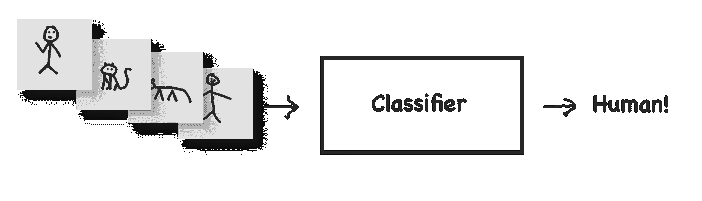

有趣的是，生成模型将首先学习如何绘制人类和动物的涂鸦，当给定一个看不见的涂鸦时，它将绘制一个动物和一个人，并将其与给定的进行比较。

或者，辨别模型将学习每个类别的细微差别，即动物有尾巴、人类的姿势、形状等，并在没有学习任何绘画知识的情况下使用这些来辨别两个类别。简单吧？

尽管判别模型因其简单性而在传统上更受青睐[2]，但生成模型也有其自身的优势，正变得越来越受欢迎。当有缺失数据时，甚至在检测异常值时，它们表现得特别好。甚至，毕竟，我们可能想要生成新的数据，这是判别模型所不能做到的。事实上，直到最近，生成模型才达到生成内容的真实水平(见下图)。

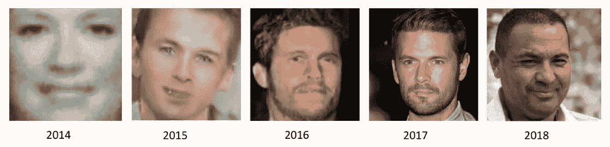

Face generation with generative modelling. Source: David Foster. “Generative Deep Learning.” [3]

## 可能性

我尽可能地避免使用数学术语，但是为了更清楚地建立判别和生成模型，引入一些数学概念是必要的。

假设我们有一些观察数据 **X** 用标签 **Y.** 标记，从概率的角度来看，一个判别分类器将试图对 **P(Y|X)** 的条件概率建模。也就是说，给定观察值 X，我标记 Y 的概率是多少？(不要把条件概率和联合概率 **P(A，B)** 混淆，联合概率是指 A 和 B 同时发生的概率)。另一方面，生成建模试图直接对概率**P(X)**建模，简单来说，首先获得观察值 X 的概率是多少？注意，标签对于这个模型不是必需的，但是，如果我们想要执行分类，标签可以用于定义 **P(X|Y)。**

# 简化的生成模型

为了实际理解什么是生成模型，让我们想象一个极其简化的场景，其中只有二维的生成模型。这个例子的灵感来自大卫·福斯特的《生成性深度学习》一书，我强烈推荐这本书！

考虑在下面的二维空间上由称为**P**数据的规则生成的一些点:

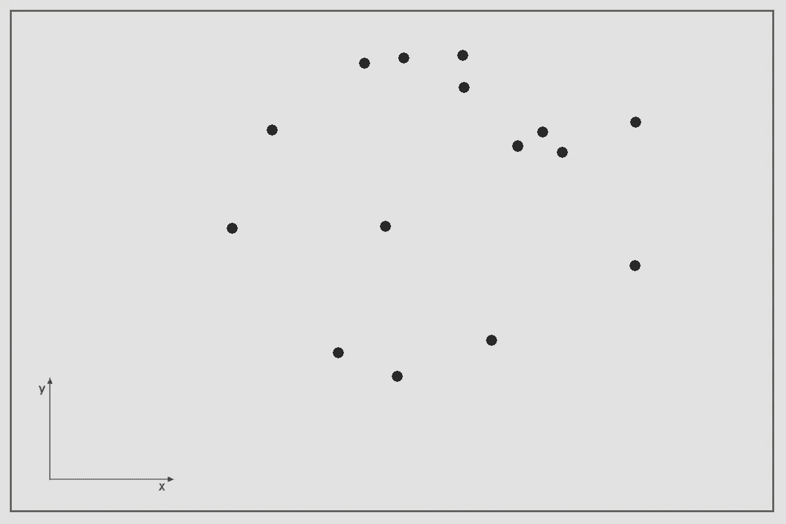

生成模型的目的是生成一个新点 **X** = (x，y)，该点看起来像是由**P**数据生成的。由此，我们来构造一个对**P**数据的估计，称为**P**模型。一种可能的估计是在橙色边界框内的任何地方生成一个点的均匀概率分布，以及在边界框外生成一个点的概率为零，如下图所示。

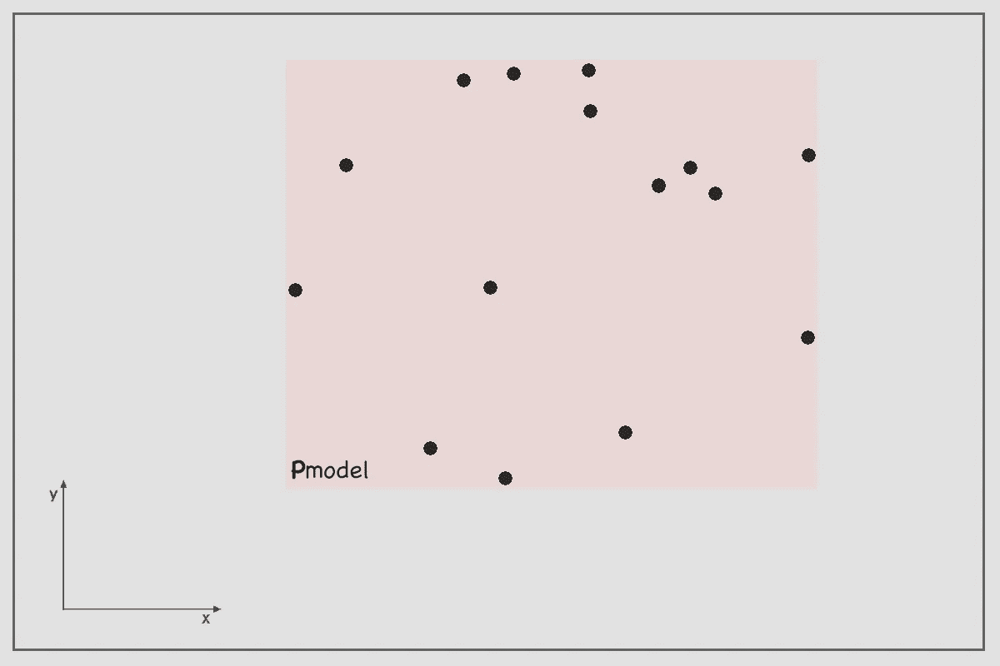

回到前面章节的创成式模型描述，我们刚刚创建了一个模型，它首先定义了如何创建数据点！虽然过于简单，但您刚刚开发了一个生成模型！

现在让我们更深入一点，观察我们的模型相对于真实的 **P** *数据*分布的表现。注意，原始的 **P** *数据*代表该土地上生长的树木的概率分布(见下图)。一棵树在有土壤的地方生长的几率大致相等，但在水中生长的几率为零。

> 这强调了数据科学家的另一个非常可取的特征。对先验数据分布的高级认知能力与数据科学家的领域专业知识直接相关。对于这个例子，根据自然经验，我们知道树木不能在水上生长！类似地，在真实世界的场景中，大多数情况下，数据科学家后退一步分析问题域是有帮助的，这样在未来就有可能对数据模型的结果进行推理。

值得注意的是，尽管 **P** *模型*是 **P** *数据*的过度简化，但它设法掌握了原始分布的主要机制。从**P***模型中采样 3 点 A、B、C，很明显我们的模型并不完美。点 **C** 无法从**P**数据中生成，但人工点 **A** 和 **B** 与真实点无法区分。这是生成模型的主要目的。生成不同于现有数据的新数据，但看起来像是由相同的规则创建的。*

# *概率与深度学习方法*

*在这一部分，我们将通过实际例子来探索为什么深度学习对生成模型的快速发展做出了重大贡献。但是首先，有必要提出概率方法，以便有一个可以比较的基准。*

## *最大似然估计*

*最大似然估计是一种统计技术，可用于计算参数，使我们的模型生成给定数据的可能性最大化。这一开始听起来可能有点混乱，所以让我们把它放到上面例子的上下文中。*

*假设上面的橙色框是一个**概率密度函数，**简单来说是一个函数，给定我们的**样本空间中的一个点(地图上的 x，y)**返回一个从 0 到 1 的值，一个概率。直观上，概率密度函数(积分)上所有点的总和应该总是等于 1。回到我们的例子，因为盒子代表均匀分布，边界盒子外面的概率是 0，里面的概率是常数。在数学符号中，它可以表示为:*

*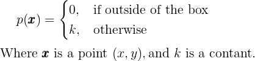*

*继续，设θ是一组 4 个参数{θ1，θ2，θ3，θ4}，一个似然函数*L(θ|****x****)*试图回答以下问题:*

> *给定点 **x** 参数的一些具体值有多大可能？*

*但是你可能想知道这些参数是干什么的？这些来自一个众所周知的统计学领域，叫做**参数建模。**换句话说，这是一种用有限的一组参数来表示概率分布的方法。在这种背景下，我们的概率分布(框！)可以用四个参数建模，左上角点(θ1，θ2)和右下角点(θ3，θ4)。更现实的例子是高斯(正态)分布，它有两个参数，均值μ和标准差σ。*

*更准确地说，似然函数定义如下:*

*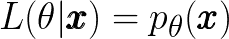*

*这是由θ参数化的概率密度函数返回的在 **x** 处的概率。*

*现在，如果不是只有一个数据点，而是有 **n** 个数据点 **Xn** = { **x1** ， **x2** ，…， **xn** }那么可能性可以被评估为:*

*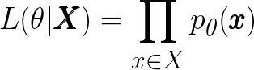*

*然而，由于该乘积可能很难处理，因此也可以用对数形式表示，此时乘积变成一个和，从而更容易区分:*

*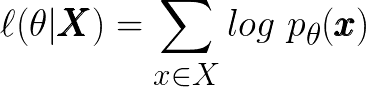*

> *顺便说一下，转换成对数形式是可能的，因为自然对数是一个单调递增的函数。简单地说，当 x 增加时，y 也增加，所以最大值不变。*

*既然有了这些，就有可能回到最初的概念，**最大似然估计**。或者简单地说，找到最好地解释数据集 **X.** 的一些最佳参数θ，相当于说这些参数最有可能被用于对生成 **X.** 的概率分布进行建模。正式地，这被定义为:*

*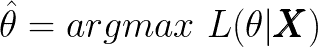*

*所有这些应该给你一个更清晰的画面，如何最大似然估计可以用来创建一个生成模型，但仍然，这都是理论，上面使用的例子只是为了有一个更容易理解的可视化参考。在下一节中，我们将应用这里所描述的来开发一个有些用处的生成模型。*

## *用于密码生成的朴素贝叶斯*

*让我们再一次构建一个故事，假设你很难想出密码，所以你想出了一个好主意，创建一个为你创建密码的生成模型！*

*Source: Giphy.com*

*请记住，这是一个假设的应用程序，用于在实践中应用这里描述的模型，并获得实践经验，而不仅仅是解释背后的理论。更重要的是，这里展示的方法和技术也有实际应用，例如特定于域的密码暴力破解，将随机密码生成过程替换为更容易记住但具有同等安全性的过程等等。这里不做描述，但提供给读者作为进一步探索的启示。*

*您已经创建了您的密码想要包含的元素列表:*

> ***文字:**过关，咖啡馆，宾果，hyper，李特，哈克曼，忍者，贝比
> 数字: 1234，111，777，000，0101，2019，2018，1，2，10，123
> ，特殊:！、@、$、%、*、_
> **大写:** A、E、T、P*

*并定义了您的密码应该遵循的标准格式:*

> *大写+单词+数字+特殊*

*基本上，你的每个密码都可以用这 4 个特征来定义，它们总是以相同的顺序排列:一个大写字母，一个单词，一个数值和一个特殊字符。所有这些都来自上面提供的列表。*

*总的来说，这等于 8 * 11 * 6 * 4 = 2112 种组合！当然，您可以简单地为您的密码中的每个特征选择一个随机元素，然后使用它**但是**您希望每次都避免随机密码，因为它会变得更难记住。相反，根据对您以前的密码的观察，最好比其他密码更频繁地使用一些密码。用更正式的术语来说，应该有一个有利于某些元素的分布过程。*

*最初，您按照相同的格式收集了过去使用过的 30 个密码:*

*以下是数据集的前 10 个密码:*

*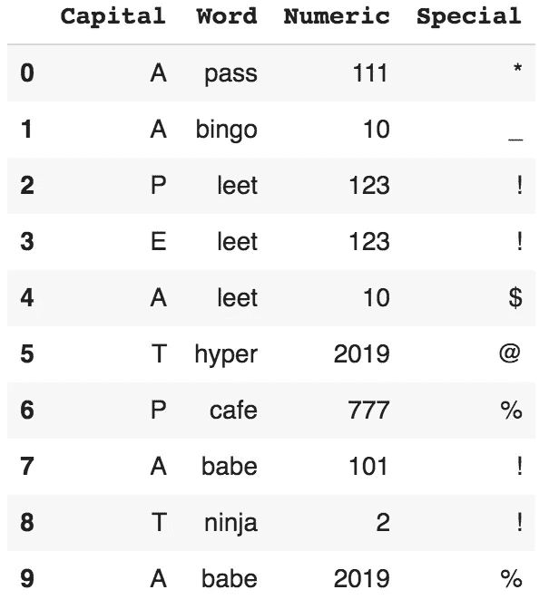*

*让我们问自己一个问题。拥有密码 **x** 的概率是如何定义的？*

> *回想一下，密码 **x** 由 4 个特征定义。这相当于我们在上面的简单例子中描述的地图点，但是它现在有 4 个维度——x1，x2，x3，x4，而不是 **x，y****T22。***

*直观上，我们可以说答案是同时有 **x1，x2，x3，x4** 一起发生的概率。所以:*

*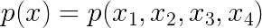*

*这可以使用 [**链式规则**](https://www.eecs.qmul.ac.uk/~norman/BBNs/Chain_rule.htm) 进一步扩展到条件概率。因此，上面的表达式变成:*

*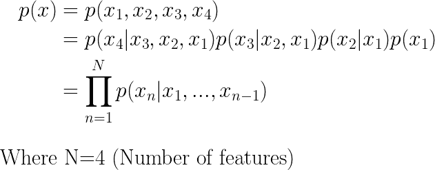*

*为了继续使用朴素贝叶斯模型，我们必须做一个强有力的假设。每个特征都是相互独立的。也就是说，大写字母与单词或数值的选择无关。这是一个相当**幼稚的**假设，因此得名。更明确地说:*

*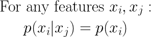*

*考虑到这一点，前面从链规则导出的表达式被简化为:*

*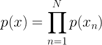*

*等等，当我们描述最大似然估计时，概率密度函数是由分布参数集θ参数化的，它有 4 个参数，因为我们知道分布可以描述为一个盒子。但是，在这种情况下，概率是如何参数化的呢？*

*因为我们的数据集由离散值组成，或者更抽象地说，由一组有限值的元素组成，所以我们可以使用**多项式分布**，结果是**多项式朴素贝叶斯**。在这种情况下，我们可以简单地为模型的每个特征的每个值分配一个参数，这样就产生了总共`8+11+6+4-4=25`个参数。*

> *-4 是为了补偿每个要素的最后一个值，因为它不必进行计算，因为它被强制使总和等于 1。*

*此外，要找到多项式分布中的最大似然估计，我们只需将每个特征值的出现次数除以总观察次数，如下所示:*

*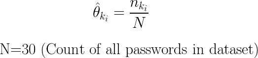**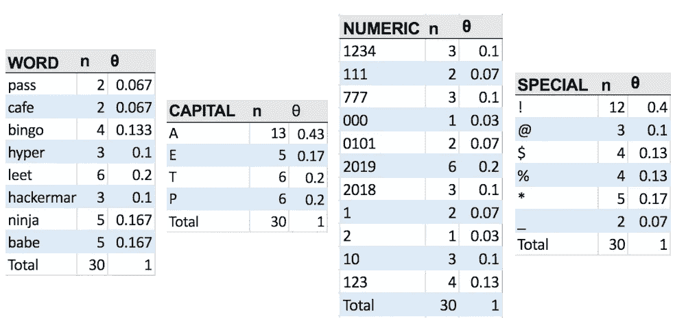*

*Maximum Likelihood Estimation of feature parameters.*

*既然我们已经计算了每个特征的最大似然估计值，就可以从每个特征中抽取一个值，并将它们连接在一起以获得一个新密码！以下是我列出的由该模型生成的 10 个新密码:*

*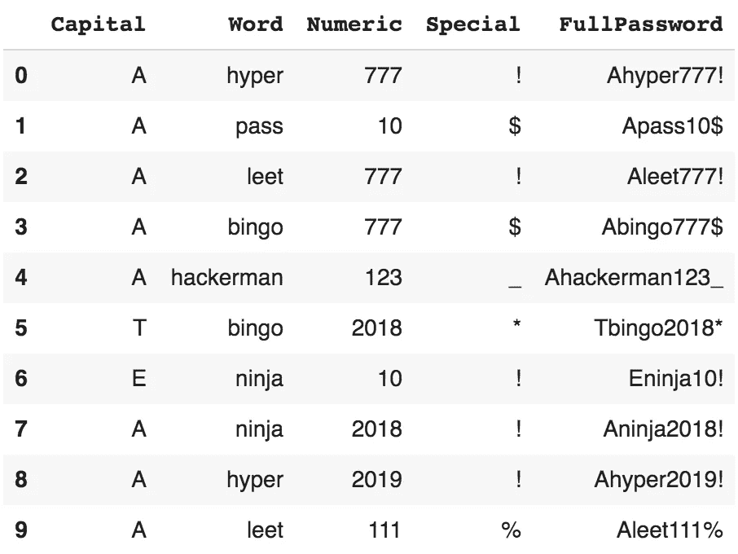*

*注意，我们的模型已经生成了最初在数据集中没有的密码(Ahyper777！，Apass10$ …。)!*

*您可以在下面的 Google Colab 链接中找到生成式朴素贝叶斯模型的相关代码:*

* [## 谷歌联合实验室

### 多项式朴素贝叶斯——生成模型

colab.research.google.com](https://colab.research.google.com/drive/1oUEPz7Kl7TqgWHpfSHPU4NY4CCs3aZlU#scrollTo=aWdPKcXXlVl7) 

## 旁注—可选阅读

当然，为了使文章尽可能简洁，有些细节被省略了，但我会在这里提到它们，以供参考，如果你想自己查找的话。

例如:如果一个元素没有出现在初始数据集中，会发生什么？假设“hyper”这个词在之前的密码中没有使用过？那么 MLE 将返回 0 概率，因此没有机会由模型生成。为了缓解这个问题，有平滑技术，如**拉普拉斯或李德斯通平滑。**

此外，我们只讨论了生成数据，而没有讨论分类，因为这些帖子的概念是生成模型。朴素贝叶斯也可以通过使用**贝叶斯定理、**作为分类器，但为此，要求数据点有标签。

# 转到第 2 部分

恭喜你！您刚刚从头开始创建了一个真正的概率生成模型！当然，这是一个非常简单的方法，但是希望你明白了！

回想一下，这仅仅是因为我们依赖于朴素贝叶斯独立性假设，这很好！在某些情况下，它工作得非常好，但在[下一部分](https://medium.com/@apogiatzis/demystifying-generative-models-by-generating-passwords-part-2-38ad3c325a46)中，我们将探索当这个假设崩溃时会发生什么，以及深度学习如何能够拯救我们！

# 参考

[1] B. Hitaj，P. Gasti，G. Ateniese，F. Perez-Cruz， [PassGAN:密码猜测的深度学习方法，](https://arxiv.org/abs/1709.00440)*计算机科学中的应用密码学和网络安全讲义*，217–237 页，2019。

[2] Ng、Andrew Y 和 Michael I. Jordan。判别分类器与生成分类器:逻辑回归和朴素贝叶斯的比较。*神经信息处理系统的进展*。2002.

[3]福斯特 D. *生成性深度学习:教机器画画、写字、作曲、演奏*。第一版。奥莱利；2019.*