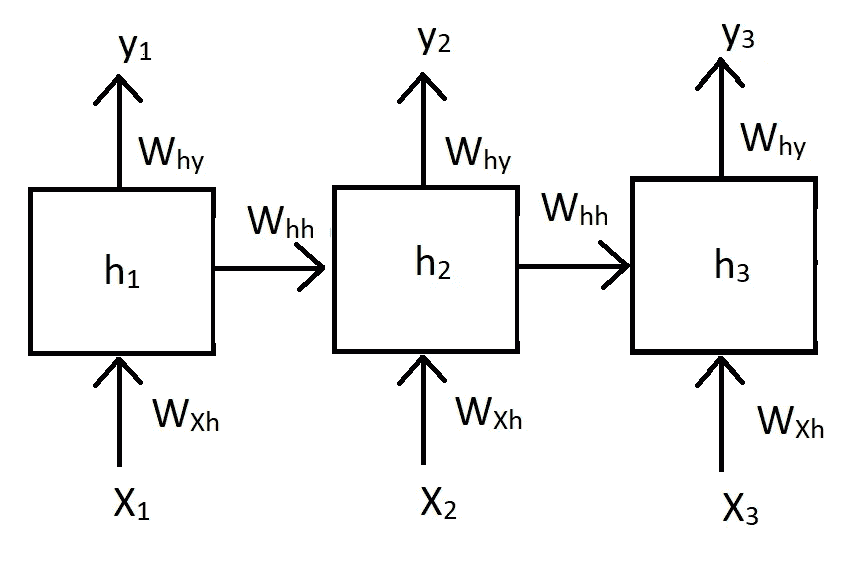

# 使用 RNNs 生成神奇宝贝名称

> 原文：<https://towardsdatascience.com/generating-pok%C3%A9mon-names-using-rnns-f41003143333?source=collection_archive---------19----------------------->


# 字符级单词生成的一个例子

不久前，当我完成 Coursera 上的深度学习专业时，我决定尝试实施我学到的一些东西，因为每个参加这些课程的人都知道理论是不可思议的，但实践几乎只是一个预制的代码，有一些空白需要填充。我认为这不是一个很好的学习方法，所以我想从头开始编码。最吸引我的例子是生成看起来像模型给出的数据的单词。课程用了恐龙的名字，我决定改用神奇宝贝的名字。我使用 keras 和 python 来生成 entor、incono 和 areacita 之类的名字。代码可以在我的 [github](https://github.com/yangobeil/Pokemon-name-generator) 上找到。

# 模型

为了像我一样在字符的基础上生成名字，我不得不使用递归神经网络(RNNs)。这些网络以“时间”步长的形式接受一系列输入。这些输入中的每一个在被转换成输出之前都要经过一层或多层神经元。用于从输入到神经元、从神经元到输出以及从一个时间的神经元到下一个时间的神经元的权重在每个时间步长是相同的。这使得网络可以模拟序列中后面的元素依赖于前面的元素的情况，比如时间序列或文本。



Example of 3-to-3 RNN. Each input X is converted into neurons h by using weights W. The neurons are then converted into outputs y using a different set of weights and are passed to the next time step using another set of weights.

有各种可能的输入/输出组合可用于具有不同数量元件的 rnn。例如，有必要使用具有许多输入(比如每个单词一个)而只有一个输出的网络，以便进行情感分析并将文本分类为正面或负面。为了生成名称，所使用的体系结构是多对多的，具有相同数量的输出作为输入。

需要提供给这个模型的数据首先是作为输入分解成字符的姓名。每个时间步长的输出(这里，时间步长=字符)是序列中的下一个字符。例如，如果输入是“皮卡丘”，则对应的输出是“ikachu”。注意输出末尾的空格，它使得输入和输出具有相同的字符数。这很重要，因为神经网络具有固定的大小，所有数据都必须具有该大小。这个空格也告诉模型这个名字已经结束了。

数据需要以这种特殊方式格式化的原因是，该模型在预测时用于一个接一个地预测新名称的字母。我给模型一个空字符(不是空格！)作为第一个输入和第一个输出，是我用来生成名字的第一个字母的字符的概率分布。然后，这个字母作为第二个输入，生成第二个字符的概率分布，继续下去，直到得到一个空格，这意味着名字的结尾。

# 收集和清理数据

为了训练这样一个生成模型，我需要尽可能多的数据。在这种情况下，数据只是所有现存神奇宝贝的名字列表。原来有一个很好看的[网站](https://pokeapi.co/)有一个 API 收集了一堆关于神奇宝贝的数据。我只需要名字，所以很容易使用。

这产生了 964 个名字的列表，但是有一些问题。许多神奇宝贝被多次列入名单。有些有巨大的进化，表现为“名字巨大”,许多其他特征也是如此。对此，我发现的最简单的解决方案是删除破折号后的所有内容。然而，一些真实的名字有破折号，所以我不得不在清理之前处理它们。例如，我不得不手动将“mr-mime”改为“mr mime”。最后一个问题是“porygon-2”。因为我不想在我允许的字符中包含数字，所以我把这个神奇宝贝的名字改成了‘porygon two’。

在处理完所有这些细节后，我用破折号进行了拆分，只保留了单词的第一部分。这导致许多名字的副本出现在列表中，所以我必须删除重复的。这给出了 806 个神奇宝贝名字的最终计数。

最后一个重要的步骤是在每个名字后面加一个句号。我不得不这样做，因为有些名字中包含空格，所以我不能用空格作为名称结束的标志。这个时期会做这项工作。

到目前为止，我只把名字当作一个字符列表，但对于神经网络来说，理解这些字符，对它们进行一次性编码是很重要的。这意味着每个字符都被表示为一个向量，其大小与我考虑的不同字符的数量相同。在这种情况下，它是 a-z 加上一个空格和一个句点，所以是 28 个字符。除了与编码的字符相对应的条目之外，这个向量的每个条目都是零。单词中的每个字符都是这样编码的，它们组合成一个矩阵来代表一个完整的名字。因为 RNN 具有固定的大小，所以这个矩阵必须足够大以编码最长的名字，所以较短的名字在末尾有一些空向量的实例。我选择使用这样的约定:矩阵的每一行都是一个字符，所以矩阵的大小为(max_char，char_dim)，其中 max_char 是名称中的最大字符数，char_dim 是字符空间的维数。

为了对此进行编码，我首先创建了一个字典，在字符和一次性编码索引之间进行转换。然后我定义了重要的量，最后创建了上面描述的训练数据。

需要注意的一点是，没有将数据拆分为训练集和测试集。这是因为这不是一个通常的监督学习任务，其中有一个固定的预期输出。因此，我能够使用所有的数据来训练模型。

# 训练模型

准备好数据后，最后一步是创建和训练递归网络。

我决定选择 LSTM 图层，因为我发现这是最普通的图层。长短期记忆层由一些不同的激活组成，这些激活以某种方式结合起来，以记住在先前的时间步骤中发生的事情。它能够自己学习过去要走多远。层的大小是通过训练模型并查看哪一个生成的结果最好来决定的。输出的密集层由一系列 softmax 激活组成，这些激活给出了每个字符在每个位置出现的概率。我再次使用 Adam 优化器，因为它是最常见的一个，并且我使用分类交叉熵损失，因为 softmax 激活了输出。

因为这里的目标不是预测输出，所以很难评估学习的进度。对于这样的问题，没有度量是有用的。我决定在训练模型时，在每个时期生成几个名字，以判断模型的表现。

这个函数基本上实现了上面描述的生成名称的过程。它从一个空输入开始，并将其提供给模型。然后，它将第一个输出作为概率分布来采样一个字符，然后将该字符作为生成的名称的第一个元素。这个部分名称再次被馈送到网络，并且第二输出现在被用作概率分布来对第二字符进行采样。这种情况会持续下去，直到找到一个句点，或者直到该单词达到网络的大小。

这个生成单词的函数在训练模型时被用作 keras 回调函数。

这在训练期间每 25 个时期产生三个名字。获得的名称的几个例子是

```
Names generated after epoch 0:
dxjaemprwpk.
zykhv.
uzvlzwbvisa.Names generated after epoch 125:
ugerli.
yunof.
mhanurs.Names generated after epoch 275:
urcono.
iggyy.
louk.
```

显然，最初的模型产生了垃圾，但它很快开始产生可行的单词。然而，125 个时代后生成的单词看起来一点也不像我们对神奇宝贝的期望。训练结束时的名字看起来更像其他神奇宝贝的名字。甚至会出现真实姓名，因此模型接近过度拟合。根据目标，这两种情况都是有用的。

如果你读了这篇文章，并觉得它有趣/有用，我非常感谢你！不要犹豫，留下你的评论或者问任何你可能有的问题。我心中还有很多项目想做，想写些什么:)