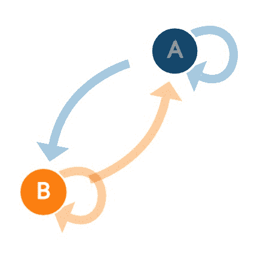

# 用马尔可夫链生成启动名称

> 原文：<https://towardsdatascience.com/generating-startup-names-with-markov-chains-2a33030a4ac0?source=collection_archive---------16----------------------->

## 因为生成新内容并不复杂

毫无疑问，机器学习最有趣的应用是生成模型。

在数据中寻找模式并生成与你的数据相似但又独特的新内容的想法，一直让我着迷。

所以我决定开发一个简单的文本生成器，用马尔可夫链来创建创业公司的名字。

但是首先，简单介绍一下马氏链🔗

# 马尔可夫链

马尔可夫链是随时间发生的随机过程的模型。

马尔可夫链之所以这样叫，是因为它们遵循一个叫做马尔可夫性质的规则。马尔可夫特性表明，在一个过程中，无论接下来发生什么，都只取决于它现在的状态。

例如，考虑仅使用当前天气信息预测第二天天气的例子。通过分析一些实际数据，我们可以发现这些情况:

*   假设今天是晴天，明天 90%的时间也会是晴天
*   假设今天是晴天，明天 10%的时间会下雨
*   鉴于今天是雨天，明天也将有 50%的时间是雨天
*   假设今天下雨，明天 50%的时间会是晴天

这是通过下面的马尔可夫链建模的，其中每个圆圈是一个状态，箭头中的数字代表从当前状态变化的概率。


Image source: [https://www.kdnuggets.com/2018/03/introduction-markov-chains.html](https://www.kdnuggets.com/2018/03/introduction-markov-chains.html)

因此，如果我们想对明天做出预测，我们只需要验证我们当前所处的状态(晴天或雨天)，并使用转移概率来计算下一个状态更有可能出现。

对马尔可夫链的深入解释，加上一些很酷的动画，可以在这里找到:[http://setosa.io/ev/markov-chains/](http://setosa.io/ev/markov-chains/)



Image source: [http://setosa.io/ev/markov-chains/](http://setosa.io/ev/markov-chains/)

# 马尔可夫链在文本生成中的应用

那么，我们如何应用这个想法来生成文本呢？嗯，实际上很简单。

名字或句子基本上是一个字符序列，这些序列遵循一些模式。

例如，如果我让你说出以 **whe__** 开头的单词，你会很快想到**何时、何地、何时**等等。虽然**喘息**是一个完全有效的词，但考虑到开头的 **whe_** ，它出现的频率较低。换句话说，给定状态 **whe** ，我们将最有可能改变到状态 **when，where** 或**when**而不是状态**wheeping**。

那么，在给定数据的情况下，我们如何建立一个模型来捕捉这些概率呢？

为此，我将向您展示如何使用单词 **startup** 、 **statistic** 和 **artist** 构建一个简单的马尔可夫链。首先，我们将列出每个 3 个字符的元组的所有状态转换:

```
**Startup**
sta -> tar
tar -> art
art -> rtu
rtu -> tup**Statistic**
sta -> tat
tat -> ati
ati -> tis
tis -> ist
ist -> sti
sti -> tic**Artist** art -> rti
rti -> tis
ist -> ist
```

现在，如果你仔细观察这些状态，你会注意到它们中的一些是在不同的元组中共享的。为了更好地形象化，让我们创建一个字典，其中每个条目是一个状态，值是下一个状态及其权重。

```
{
   "sta": {
      "tar": 1,
      "tat": 1
   },
   "tar": {
      "art": 1
   },
   "art": {
      "rtu": 1,
      "rti": 1
   },
   "rtu": {
      "tup": 1
   },
   "tat": {
      "ati": 1
   },
   "ati": {
      "tis": 1
   },
   "tis": {
      "ist": 2
   },
   "ist": {
      "sti": 1
   },
   "sti": {
      "tic": 1
   },
   "rti": {
      "tis": 1
   }
}
```

哒哒！这就是我们的马尔可夫链。很简单，不是吗？(PS:从技术上讲，马尔可夫链是用一个带有概率的转移矩阵来定义的，而不是权重。我们可以很容易地转换成一个转换矩阵，但是对于我们所想到的问题，这是一个更好的可视化方法。

现在，我们如何用这个产生新的数据呢？

基本上有四个步骤，让我们逐一介绍:

**第一步:从一些初始随机状态开始**

您可以选择任何一个州作为起始位置，但是，您很可能会生成没有任何意义的文本。例如， **rtu** 是一个有效的初始状态，但是你在现实生活中找不到一个以这些字母开头的单词(至少我想不出来)

更好的方法是在另一个字典中记录起始状态，并从那里选择第一个状态。在我们的例子中，可能的初始状态是 **sta** (因为启动和统计都从 **sta** 开始)和 **art** 。对于我们的示例，让我们选择 **sta** 。

**步骤 2:** 考虑其权重，随机选择其一个过渡状态

对于元组 **sta，**可以去 **tar** 或者 **tat，**两者概率相同(权重相同)。在真实情况下，考虑到数据集中的分布情况，它们会有不同的权重，但由于我们刚刚使用了三个词，所以它们具有相同的权重。让我们*随机选择元组 **tar。***

***步骤 3:** 将新的状态添加到生成的文本中*

*到目前为止，我们已经从状态 **sta** 开始，并过渡到状态 **tar** 。所以我们现在生成的字是**星**。*

***第四步:**使用新状态重复第一步，直到找到停止字符，或者直到您对结果满意*

*现在，对于我们当前的状态 **tar** ，唯一可能的状态是 **art** ，所以我们生成的字变成了 **start** 。*

*现在让我们以更快的方式继续这个算法。从**艺术**可以去 **rti** 或者 **rtu** 。让我们选择 **rti** 。如果继续应用算法，很快就会生成我们的新词: **Startist** ，是 startup 和 artist 的混合体。*

*尽管这个例子非常简单，但它展示了马尔可夫链的潜力。*

*既然我们已经手动“实现”了一个马尔可夫链，那么让我们用 Python 来实现，使用真实的数据，你可以得到实际有用的结果。*

# *我们来编码吧！*

*我们先从导入一些模块开始。我们只需要两个:读取 CSV 数据的 **pandas** ，以及(不出所料)生成随机数的 **random** 。*

```
*import pandas as pd
import random*
```

*作为我们的初创公司名称生成器的数据集，我们将使用来自大约 18000 家公司的 2015 年转储数据。*

*数据集没有那么大，但是您会看到，即使数据库比这小得多，马尔可夫链也能很好地工作。*

*读取我们公司的数据非常简单:pandas **read_csv** 函数接受一个 URL 作为参数并返回一个数据帧。我们还删除了符号，并将名称转换为小写。*

```
*companies = pd.read_csv('[https://github.com/notpeter/crunchbase-data/blob/master/companies.csv?raw=true'](https://github.com/notpeter/crunchbase-data/blob/master/companies.csv?raw=true'))
companies['name'] = companies['name'].replace({r'[^\w ]':''}, regex=True)
companies['name'] = companies['name'].apply(lambda n:str(n).lower())*
```

*正如我们之前所讨论的，为马尔可夫链建模的最简单的方法是一个包含状态和转移权重的字典。*

```
*chain = build_markov_chain(companies['name'].tolist(), 3)
print(chain['sta'])*
```

*如果您运行上面的代码，您将得到以下结果:*

```
*{
   'tar':290,
   'tat':151,
   'ta.':52,
   'ta ':35,
   'tac':55,
   'tag':43,
   'tal':46,
   'tay':34,
   'tau':22,
   'tad':14,
   'tam':19,
   'tas':19,
   'taq':5,
   'tan':92,
   'tab':23,
   'tap':6,
   'tak':8,
   'tai':22,
   'taf':16,
   'tax':5,
   'ta™':1,
   'tah':2,
   'tav':5,
   'tae':1,
   'taj':1,
   'taw':1,
   'taa':2,
   'taz':1
}*
```

*这是什么意思？考虑到当前状态是元组 **sta** ，这些是马尔可夫链上的下一个状态和权重的列表。下一个状态权重越高，就越有可能过渡到下一个状态。*

*例如，如果你拿第一个州 **tar** 来说，它在这个州列表中的权重最大。直觉上，这是有意义的，因为它可能捕捉到单词 **startup 的出现。***

*现在我们需要构建一个函数，考虑到权重，从链中返回一个随机的**元组**。*

*最后，神奇的事情发生了:让我们创造一些新词。*

*让我们一步一步地进入我们的**生成**函数。*

```
*tuple = select_random_item(chain['_initial'])    
result = [tuple]*
```

*还记得我们提到过，最好跟踪初始元组，并选择其中一个作为初始状态吗？这正是我们在这里所做的。*

```
*while True:        
    tuple = select_random_item(chain[tuple])        
    last_character = tuple[-1]        
    if last_character == '.':          
       break 
    result.append(last_character)*
```

*这是我们浏览马尔可夫链的地方，考虑它的概率。我们选择一个随机加权的下一个状态，并将该状态的最后一个字符附加到我们的**结果**字符串中。然而，如果最后一个字符是一个**句点**，我们停止我们的生成，因为这是我们链的结尾。*

*我们可以添加额外的规则，比如生成给定最小或最大长度的单词，但现在让我们保持简单。*

```
*generated = ''.join(result)    
if generated not in chain['_names']: 
    return generated    
else:        
    return generate(chain)*
```

*最后，我们将所有生成的字符连接在一起，并进行最后的验证。因为没有什么可以阻止马尔可夫链生成一个已经存在的名字，并且我们对创建新名字感兴趣，所以如果生成的名字已经在我们的数据库中，我们将简单地生成一个新名字。*

# *结果*

*这里有几个来自我们的 Startup Name Generator 的例子。*

*   *多莫斯*
*   *Hup 在线*
*   *武班基*
*   *小丽鱼*
*   *Ignaly*
*   *iFly*

*很酷吧。😎*

# *更多想法*

*最后一个想法，如果我们为每个行业生成特定的创业公司名称会怎么样？太棒了，你不觉得吗？*

*让我们做吧，这将是非常容易的🙃*

*我们唯一要做的事情就是只考虑我们感兴趣的行业的例子来建立我们的马尔可夫链。*

*这是我们的结果:*

## *旅游创业公司*

```
*print(generate_amount_by_category('Travel',5))*
```

*   *潘戈*
*   *电影学*
*   *Nextrive*
*   *Triptel*
*   *斯汀吉*

## *科技创业公司*

```
*print(generate_amount_by_category('Technology',5))*
```

*   *Naco 创新*
*   *Kicksense*
*   *网络观察*
*   *乔尼*
*   *数据*

# *自己试试*

*你可以自己尝试使用这个 [Google Colab 链接](https://colab.research.google.com/drive/1Fr9khK_OzNZyoV87F2dce0-Zk29F7feq)或者直接从我的 [GitHub](https://github.com/gzomer/startup-name-gen) 下载源代码。*

*[](https://colab.research.google.com/drive/1Fr9khK_OzNZyoV87F2dce0-Zk29F7feq) [## 启动名称生成器

colab.research.google.com](https://colab.research.google.com/drive/1Fr9khK_OzNZyoV87F2dce0-Zk29F7feq) 

你有什么想法？对新内容有什么建议吗？反馈？请在评论中告诉我。

希望你喜欢:)*