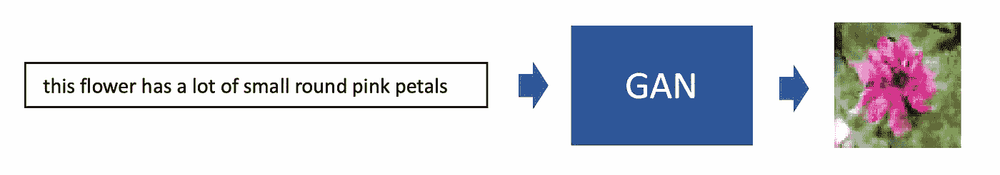
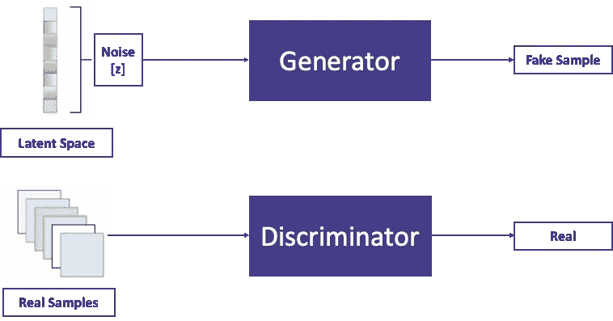
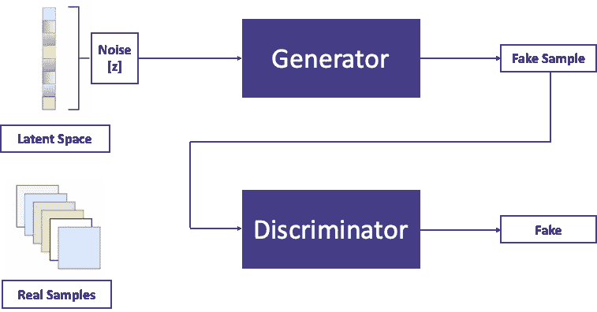
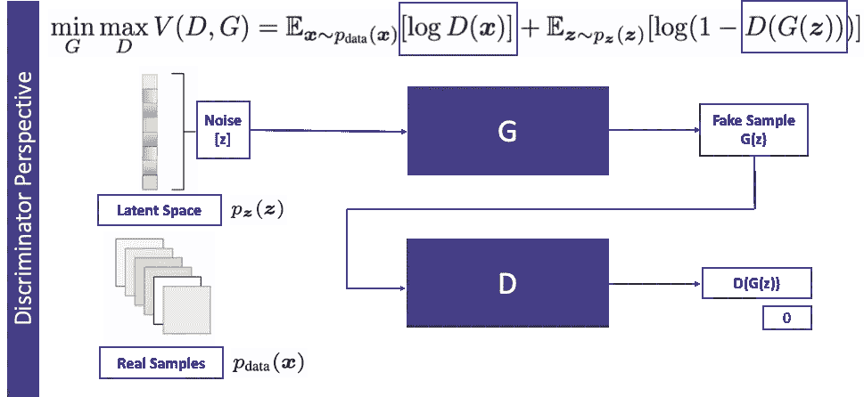
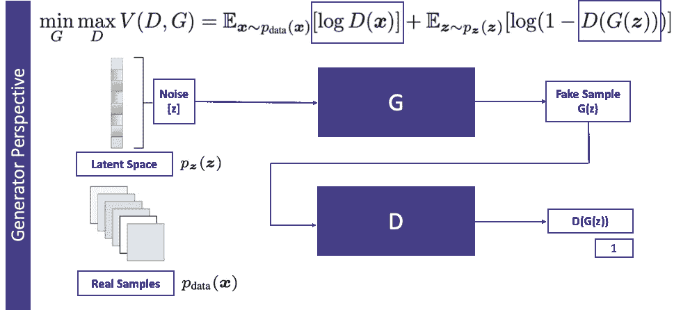
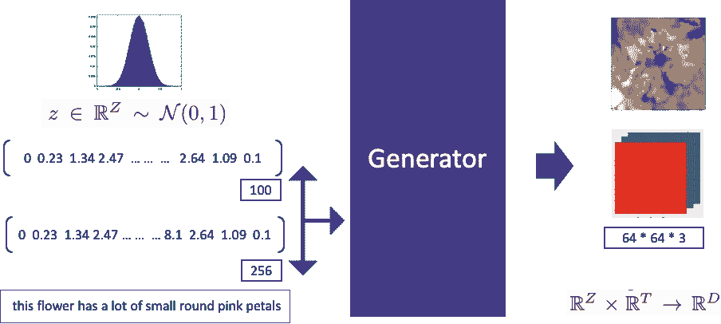
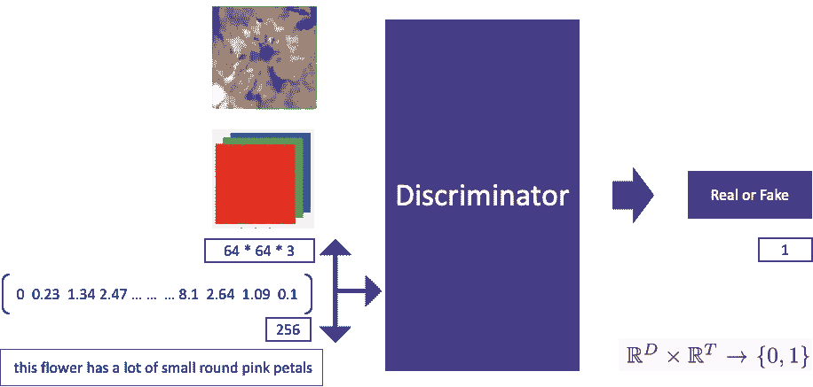
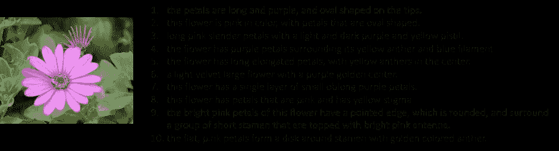
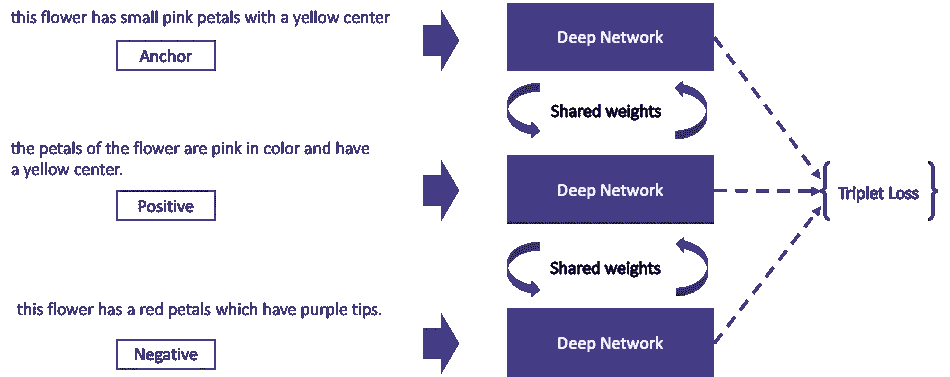
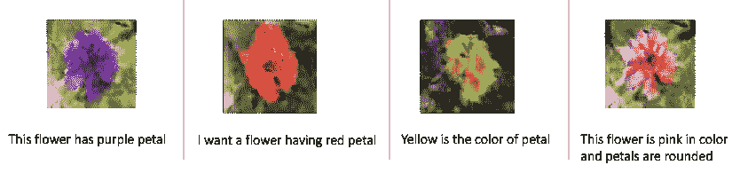

# 使用 GANs 从文本描述生成合成图像

> 原文：<https://towardsdatascience.com/generating-synthetic-images-from-textual-description-using-gans-e5963bae0df4?source=collection_archive---------8----------------------->

真实图像的自动合成是极其困难的任务，甚至最先进的 AI/ML 算法也难以满足这种期望。在这个故事中，我将讨论如何从描述图像的文本描述中生成逼真的图像。如果你是生成性对抗网络[GAN]的粉丝，那么你来对地方了。

GAN 在 2014 年由 Ian Goodfellow 介绍，从那时起，这个主题本身在研究社区变得非常受欢迎，我们看到在几年内发表了大量论文。深度卷积 GAN [DC-GAN]就是其中之一。今天的话题是关于 DC-甘。

你能猜出这个图像是真实的可爱的婴儿还是甘想象出来的吗？

这个图像实际上是由 GAN 生成的。这项工作由 NVIDIA 的 [Karras 等人完成，论文名为 StyleGAN](https://arxiv.org/pdf/1812.04948.pdf) 。本文的目的是生成高分辨率的人脸图像。您可以访问 https://thispersondoesnotexist.com[网站](https://thispersondoesnotexist.com/)，每次访问该网站都会随机生成人脸图像。自开始以来，GAN 在很短时间内经历了许多发展，今天我们正处于生成与真实图像难以区分的图像的阶段。GAN 模型非常擅长生成随机图像，但要控制 GAN 生成我们感兴趣的图像却极其困难。在这个主题中，我将讨论如何从详细描述图像的文本描述中生成图像。

**讨论主题:**我将讨论一个 GAN 公式，它将文本描述作为输入，并生成文本输入中描述的 rgb 图像。举个例子，给定

> “这朵花有许多小而圆的粉红色花瓣”

因为输入将生成如下具有圆形粉红色花瓣的花的图像:

**香草甘的工作原理:**在继续之前，让我们快速了解一下香草甘的工作原理。

> ***如果你已经了解香草甘，可以跳过这一节。***

GAN 由两个独立的网络组成。一个称为**发生器**，另一个称为**鉴别器。**发生器在给定随机噪声[从潜在空间采样]的情况下生成合成样本，鉴别器是一个二元分类器，用于区分输入样本是真实的[输出标量值 1]还是虚假的[输出标量值 0]。*生成器生成的样本被称为假样本。*

这一表述的美妙之处在于生成器和鉴别器之间的对立性质。鉴别器希望以最好的方式完成它的工作，当一个假样本(由生成器生成)被提供给鉴别器时，它希望将其称为假样本，但生成器希望以某种方式生成样本，以便鉴别器在将其称为真样本时出错。在某种意义上，生成器试图欺骗鉴别器。

让我们快速看一下目标函数以及优化是如何完成的。这是一个最小-最大优化公式，其中生成器希望最小化目标函数，而鉴别器希望最大化相同的目标函数。

鉴别器希望将 D(G(z))的可能性驱动到 0。因此，它希望最大化(1-D(G(z)))，而生成器希望将 D(G(z))的可能性强制为 1，以便鉴别器在调用生成的样本作为真实样本时出错。因此，生成器希望最小化(1-D(G(z))。

当数据分布和模型分布相同时，目标函数的这种最小-最大公式化具有全局最优，这意味着如果优化函数收敛到全局最小值，则模型已经学习了输入训练数据集中存在的基础数据分布。跟随[甘](https://papers.nips.cc/paper/5423-generative-adversarial-nets.pdf)的论文进行更好的理解。

**文本到图像公式化:**在我们的公式化中，不是只有噪声作为生成器的输入，而是首先将文本描述转换成文本嵌入，与噪声向量连接，然后作为输入提供给生成器。作为一个例子，文本描述已经被转换成 256 维嵌入，并与 100 维噪声向量(从正态分布中采样)连接。此公式将帮助生成器生成与输入描述一致的图像，而不是生成随机图像。

对于鉴别器，不是只有图像作为输入，而是发送一对图像和文本嵌入作为输入。输出信号为 0 或 1。早期鉴别器的职责只是预测给定图像是真是假。现在，Discriminator 又多了一个额外的职责。除了识别给定图像是可读的还是伪造的，它还预测给定图像和文本是否相互对齐的可能性。这个公式迫使生成器不仅生成看起来真实的图像，而且生成与输入文本描述一致的图像。

为了实现鉴别器双重责任的目的，在训练期间，一系列不同的(图像、文本)对作为输入给出如下:

1.  作为输入和目标变量的(真实图像、真实字幕)对被设置为 1
2.  (错误图像，真实字幕)对作为输入，目标变量设置为 0
3.  作为输入和目标变量的(伪图像、真实字幕)对被设置为 0

这里要注意一件非常有趣的事情，从鉴别器的角度来看，当(假图像，真实字幕)对的目标变量为 0 时。发生器损耗设置为 1，因为发生器希望鉴别器将其作为真实图像输出。

**数据集:**这个解决方案使用了一个非常流行的开源数据集。它被称为[牛津花-102 数据集](https://www.robots.ox.ac.uk/~vgg/data/flowers/102/)，它有 102 个不同类别的大约 8k 张图像，每张图像有 10 个不同的标题描述图像。人们可以用各种不同的方式写标题，这个数据集就是一个很好的例子，它涵盖了每张图片的各种各样的标题。这个丰富的数据集有助于我们学习更好的文本嵌入，并有助于解决以不同方式表达相同意图的可变性问题。

**如何学习文本嵌入:**有几种无监督学习文本嵌入的方法。学习文本嵌入的一个非常成功的方法是[跳过思维向量](https://arxiv.org/pdf/1506.06726.pdf)。这种预先训练的向量可用于多种目的，以解决下游应用。另一种流行的学习文本嵌入的方法叫做三元组丢失。对于三重损失公式，选择相同图像的两个字幕，其中一个被认为是锚，而另一个被认为是正的。来自不同类别随机字幕被认为是负面的。可以参考我之前的故事，了解更多关于三重态丢失的知识。

 [## 使用三重损失的图像相似性

### 你训练过机器学习模型解决分类问题吗？如果是，数量是多少

towardsdatascience.com](/image-similarity-using-triplet-loss-3744c0f67973) 

您可以参考下面的 git 存储库作为三元组丢失实现的参考。

 [## sanku-lib/image_triplet_loss

### 这个库是以下“中等”故事的实现:使用三元组损失执行的图像相似性…

github.com](https://github.com/sanku-lib/image_triplet_loss) 

**结果:**正如您在下面看到的，即使文本以所有不同的格式书写，该模型也能够解释意图并相应地生成图像。由于模型是在花的图像上训练的，因此输入“我想要一只有白色条纹的黑猫”将会生成一个随机图像。

**结论:**该工作为生成对抗网络的未来提供了一个很好的方向。研究界在控制 GAN 产生什么样的图像方面取得了良好的进展。随着这一领域的研究取得更多的进展，你可以期待在不久的将来会有更好的结果。

**参考文献:**

1.[https://thispersondoesnotexist.com/](https://thispersondoesnotexist.com/)

2.生成性对抗网络[[https://papers . nips . cc/paper/5423-generative-Adversarial-Nets . pdf](https://papers.nips.cc/paper/5423-generative-adversarial-nets.pdf)

3.生成性对抗性文本到图像的合成[【https://arxiv.org/pdf/1605.05396.pdf】T4

4.深度卷积生成对抗网络的无监督表示学习[[https://arxiv.org/pdf/1511.06434.pdf](https://arxiv.org/pdf/1511.06434.pdf)

5.跳过思维向量[[https://arxiv.org/pdf/1506.06726.pdf](https://arxiv.org/pdf/1506.06726.pdf)

6.一种基于风格的生成性对抗网络生成器架构[[https://arxiv.org/pdf/1812.04948.pdf](https://arxiv.org/pdf/1812.04948.pdf)

7.[https://github.com/reedscot/icml2016](https://github.com/reedscot/icml2016)

8.[https://github.com/paarthneekhara/text-to-image](https://github.com/paarthneekhara/text-to-image)

[9。https://github.com/ryankiros/skip-thoughts](https://github.com/ryankiros/skip-thoughts)

[10。https://github.com/carpedm20/DCGAN-tensorflow](https://github.com/carpedm20/DCGAN-tensorflow)