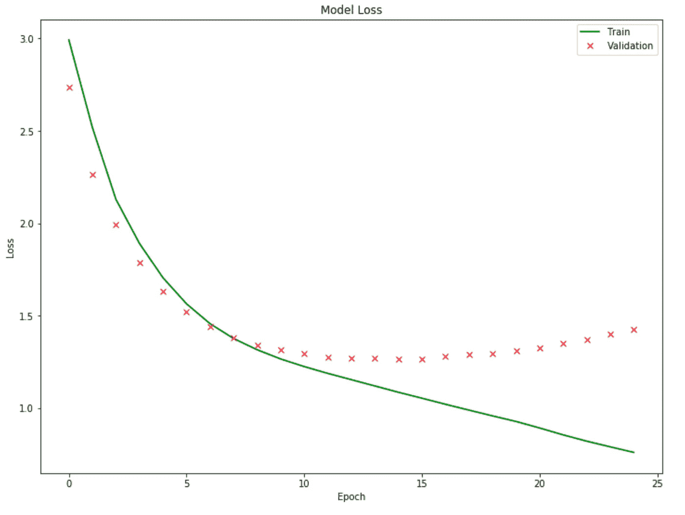
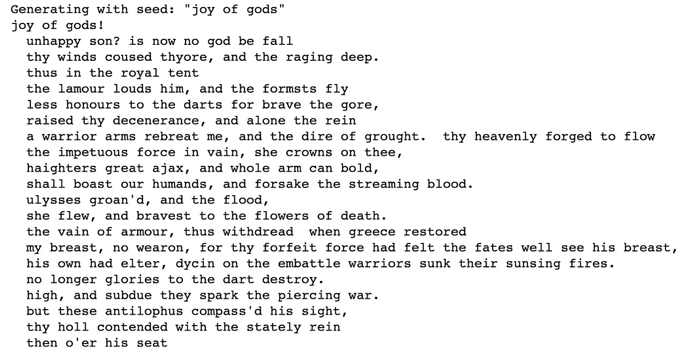

# 使用 TensorFlow 2.0 生成文本

> 原文：<https://towardsdatascience.com/generating-text-with-tensorflow-2-0-6a65c7bdc568?source=collection_archive---------10----------------------->


Photo by [AussieActive](https://unsplash.com/@aussieactive?utm_source=medium&utm_medium=referral) on [Unsplash](https://unsplash.com?utm_source=medium&utm_medium=referral)

# 序文

在工作中，我大部分时间都在处理表格数据，所以扩展到相邻的机器学习领域有助于拓宽我的视野，识别潜在的应用……去年，我不得不钻研计算机视觉，以便完成[微软在 AI](https://academy.microsoft.com/en-us/professional-program/tracks/artificial-intelligence/) 期末项目中的专业开发计划，今年我决定开始学习更多关于文本生成的知识。

我选择了伊利亚特作为我的训练文本，因此有了上面的卫城图片。虽然我也在 PyTorch、Keras(带有 TensorFlow 后端)和 TensorFlow 中实现了递归神经网络(RNN)文本生成模型，但我发现 TensorFlow 2.0 的到来非常令人兴奋，并且对机器学习的未来充满希望，因此我将在本文中重点讨论这个框架。

代码和文本可以在我的[公共 Github 库](https://github.com/mlai-demo/TextGen-tf2)中找到。我已经从[古腾堡项目](http://www.gutenberg.org/)中提取了文本，并在上传到资源库之前进行了预处理。你也可以在这里找到关于 RNN 文本生成的优秀教程[。](https://www.tensorflow.org/alpha/tutorials/text/text_generation)

# 设置

让我们下载项目需要的东西，并确认一切都如预期的那样，GPU 可用(您肯定希望在这个项目上使用 GPU，这会节省您很多时间):

```
from __future__ import absolute_import, division, print_function, unicode_literals!pip install tensorflow-gpu==2.0.0-alpha0
import tensorflow as tfimport numpy as np
import os
import datetimefrom tensorflow.python.client import device_lib
print(device_lib.list_local_devices())print(“TensorFlow version: “, tf.__version__)
```

如果一切正常，你会看到你正在使用 TensforFlow 2.0.0-alpha0，如果在谷歌的 Colab 上运行代码，你会看到一个名为特斯拉 T4 的漂亮的 GPU 机器。我喜欢检查设备列表，尤其是在 Colab 上，因为有时我会忘记更改运行时类型，所以这是一个提醒。在这种情况下，由于 tensorflow-gpu 下载，Colab 会将您放在 GPU 运行时上，否则默认为 CPU。

要在 [Google Colab](https://colab.research.google.com/notebooks/welcome.ipynb) 中运行代码，要么通过文件>上传笔记本菜单直接在 Colab 网站上传笔记本，要么只需点击笔记本左上角的相应图标。

要将文本下载到 Colab，请使用以下代码片段:

```
from google.colab import filesuploaded = files.upload()for fn in uploaded.keys():
    print(‘User uploaded file “{name}” with length {length}    bytes’.format(name=fn, length=len(uploaded[fn])))
```

注意:Colab 中的“代码片段”是迷你解决方案的重要资源。

您将在“文件”选项卡下找到上传的文本文件，考虑到文件上传到笔记本本身时会通知您，您甚至不需要查找它。您可能知道，您在 Colab 中的工作和文件是短暂的，在您下次登录时就会消失，因此在您注销之前将您的工作保存到其他地方是很重要的。

```
import os
path = os.getcwd()text = open(path + ‘/Iliad_v3.txt’,  ‘rb’).read().decode(encoding=’utf-8')
print(“Text is {} characters long”.format(len(text)))
```

文本应该有 886，809 个字符长，所以不是一个大样本。出于好奇，我们也可以查一下字数，这样我就知道高中的时候这篇课文是否值得跳过:

```
words = [w for w in text.split(‘ ‘) if w.strip() != ‘’ or w == ‘\n’]
print(“Text is {} words long”.format(len(words)))
```

应该有 153，260 个单词，所以真的没有当时看起来那么长。

为了确保机器正在读取预期的内容，请快速检查前 100 个字符:

```
print(text[:100])
```

```
achilles' wrath, to greece the direful spring
of woes unnumber'd, heavenly goddess, sing!
that
```

对，就是这样！

# 准备课文

创建一个由唯一字符排序的向量—在此文本中应该有 34 个字符:

```
vocab = sorted(set(text))
print (‘There are {} unique characters’.format(len(vocab)))
char2int = {c:i for i, c in enumerate(vocab)}
int2char = np.array(vocab)
print(‘Vector:\n’)
for char,_ in zip(char2int, range(len(vocab))):
    print(‘ {:4s}: {:3d},’.format(repr(char), char2int[char]))
```

让我们来看一个数字映射示例，看看文本的数字表示:

```
text_as_int = np.array([char2int[ch] for ch in text], dtype=np.int32)
print (‘{}\n mapped to integers:\n {}’.format(repr(text[:100]), text_as_int[:100]))
```

从文本中创建训练和验证数据(确保训练片段可被批量大小整除，在本例中为 64)，并查看形状是否符合预期:

```
tr_text = text_as_int[:704000] 
val_text = text_as_int[704000:] print(text_as_int.shape, tr_text.shape, val_text.shape)
```

# 建立模型

我喜欢将(大部分)可调参数放在一个地方，以便在需要进行多次调整时可以方便地访问:

```
batch_size = 64
buffer_size = 10000
embedding_dim = 256
epochs = 50
seq_length = 200
examples_per_epoch = len(text)//seq_length
#lr = 0.001 #will use default for Adam optimizer
rnn_units = 1024
vocab_size = len(vocab)
```

准备训练和验证数据集，然后检查形状:

```
tr_char_dataset = tf.data.Dataset.from_tensor_slices(tr_text)
val_char_dataset = tf.data.Dataset.from_tensor_slices(val_text)tr_sequences = tr_char_dataset.batch(seq_length+1, drop_remainder=True)
val_sequences = val_char_dataset.batch(seq_length+1, drop_remainder=True)
def split_input_target(chunk):
    input_text = chunk[:-1]
    target_text = chunk[1:]
    return input_text, target_texttr_dataset = tr_sequences.map(split_input_target).shuffle(buffer_size).batch(batch_size, drop_remainder=True)val_dataset = val_sequences.map(split_input_target).shuffle(buffer_size).batch(batch_size, drop_remainder=True)print(tr_dataset, val_dataset)
```

最后，建立模型——我使用了两个 LSTM 层和辍学:

```
def build_model(vocab_size, embedding_dim, rnn_units, batch_size):
     model = tf.keras.Sequential([
     tf.keras.layers.Embedding(vocab_size, embedding_dim,
     batch_input_shape=[batch_size, None]),
     tf.keras.layers.Dropout(0.2),
     tf.keras.layers.LSTM(rnn_units,
     return_sequences=True,
     stateful=True,
     recurrent_initializer=’glorot_uniform’),
     tf.keras.layers.Dropout(0.2), 
     tf.keras.layers.LSTM(rnn_units,
     return_sequences=True,
     stateful=True,
     recurrent_initializer=’glorot_uniform’),
     tf.keras.layers.Dropout(0.2),
     tf.keras.layers.Dense(vocab_size)
 ])

return modelmodel = build_model(
    vocab_size = len(vocab),
    embedding_dim=embedding_dim,
    rnn_units=rnn_units,
    batch_size=batch_size)
```

顺便说一句，如果在谷歌云平台(GCP)上设置这个模型，你可能会得到一个警告*"<tensor flow . python . keras . layers . recurrent . unified lstm object…>:注意，这个图层没有针对性能进行优化。请使用 tf.keras.layers.CuDNNLSTM 在 GPU 上获得更好的性能。*但是，CuDNNLSTM 不可用，因此不确定这是否是以前 TensorFlow 版本的剩余警告，而 LSTM 在 2.0 中已经针对性能进行了优化，或者 CuDNNLSTM 只是尚未可用。

# 运行模型

检查输出形状和模型，并定义损耗:

```
model.summary()for input_example_batch, target_example_batch in tr_dataset.take(1):
    example_batch_predictions = model(input_example_batch)
    print(example_batch_predictions.shape)def loss(labels, logits):
    return tf.keras.losses.sparse_categorical_crossentropy(labels,    logits, from_logits=True)example_batch_loss  = loss(target_example_batch, example_batch_predictions)
print("Loss:      ", example_batch_loss.numpy().mean())
```

让我们使用 Adam optimizer，并在验证错误没有改善的 10 个时期之后停止训练:

```
optimizer = tf.keras.optimizers.Adam()
model.compile(optimizer=optimizer, loss=loss)
patience = 10
early_stop = tf.keras.callbacks.EarlyStopping(monitor='val_loss', patience=patience)
```

创建目录来保存我们的检查点，然后…运行！

```
checkpoint_dir = ‘./checkpoints’+ datetime.datetime.now().strftime(“_%Y.%m.%d-%H:%M:%S”)
checkpoint_prefix = os.path.join(checkpoint_dir, “ckpt_{epoch}”)checkpoint_callback=tf.keras.callbacks.ModelCheckpoint(
    filepath=checkpoint_prefix,
    save_weights_only=True)history = model.fit(tr_dataset, epochs=epochs, callbacks=[checkpoint_callback, early_stop] , validation_data=val_dataset)print (“Training stopped as there was no improvement after {} epochs”.format(patience))
```

在我的例子中，训练在第 25 个时期停止，这意味着验证误差的最后一次改善是在第 15 个时期。趋势(下图)是人们可以预期的:首先，验证误差甚至略好于训练误差(即，一个时期的验证损失是使用改进的训练模型计算的，因为它是在该时期的末尾，而训练损失是使用各批损失的平均值评估的——在开始时，这可能导致验证误差降低)，但随着时间的推移，训练和验证集出现分歧——训练误差持续下降，而验证变平，然后开始恶化:



# 生成文本


Photo by [Ksenia Makagonova](https://unsplash.com/@dearseymour?utm_source=medium&utm_medium=referral) on [Unsplash](https://unsplash.com?utm_source=medium&utm_medium=referral)

让我们从最近的检查点加载权重(或者将 load.weights 行调整到任何其他检查点),并生成一个一千字符的文本:

```
model = build_model(vocab_size, embedding_dim, rnn_units, batch_size=1)
model.load_weights(tf.train.latest_checkpoint(checkpoint_dir)) 
model.build(tf.TensorShape([1, None]))def generate_text(model, start_string):

    print('Generating with seed: "' + start_string + '"')

    num_generate = 1000 input_eval = [char2int[s] for s in start_string]
    input_eval = tf.expand_dims(input_eval, 0) text_generated = [] temperature = 1.0 model.reset_states()
    for i in range(num_generate):
        predictions = model(input_eval)
        predictions = tf.squeeze(predictions, 0)
        predictions = predictions / temperature
        predicted_id = tf.random.categorical(predictions,      num_samples=1)[-1,0].numpy()
        input_eval = tf.expand_dims([predicted_id], 0)
        text_generated.append(int2char[predicted_id]) return (start_string + ''.join(text_generated))print(generate_text(model, start_string="joy of gods"))
```

以下是我得到的信息:



对于不到一百万字符的文本样本的 10 分钟单 GPU 训练来说，这是一个相当好的输出！

感谢您的阅读，我希望这段代码将成为您进一步探索文本生成的良好起点！