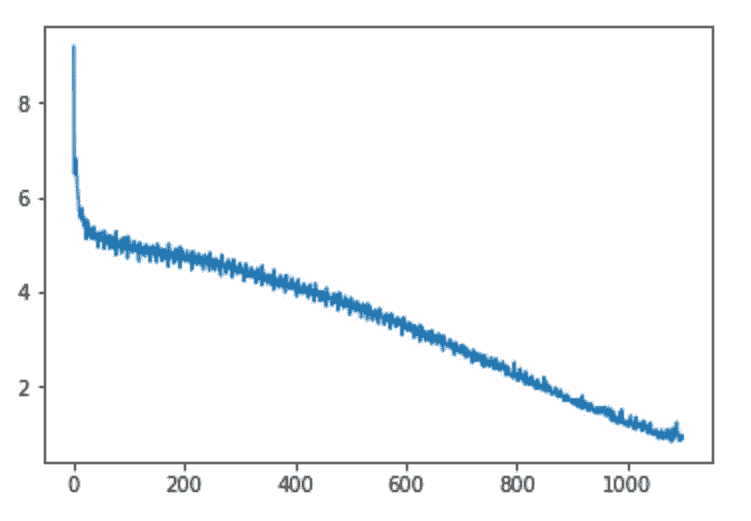

# 用 LSTM 为 Kaggle 内核生成标题

> 原文：<https://towardsdatascience.com/generating-titles-for-kaggle-kernels-with-lstm-957541aff48f?source=collection_archive---------17----------------------->

Photo by [Donatello Trisolino](https://www.pexels.com/@donatello-trisolino-572447?utm_content=attributionCopyText&utm_medium=referral&utm_source=pexels) from [Pexels](https://www.pexels.com/photo/person-typing-1375261/?utm_content=attributionCopyText&utm_medium=referral&utm_source=pexels)

## 使用 PyTorch 的小型深度学习项目

# 介绍

当我第一次发现[序列模型](https://medium.com/machine-learning-bites/deeplearning-series-sequence-models-7855babeb586)时，我惊讶于我们可以如此容易地将它们应用于广泛的问题:文本分类、文本生成、音乐生成、机器翻译等等。在本文中，我将重点介绍创建模型的一步一步的过程，不会涉及序列模型和 LSTMs 理论。

我有了一个想法，使用[元 Kaggle](https://www.kaggle.com/kaggle/meta-kaggle) 数据集来训练一个模型，为 Kaggle 生成新的内核标题。内核是用户发布在 Kaggle 上的 R 或 Python 语言的笔记本。Kaggle 用户可以投票支持内核。根据支持票的数量，果仁会获得奖章。生成内核标题的 Model 可以帮助捕捉 Kaggle 内核的趋势，并作为编写新内核和获得奖牌的灵感。在本文中:

*   我描述了如何从[元数据集中加载和预处理内核数据。](https://www.kaggle.com/kaggle/meta-kaggle)
*   我演示了如何训练 PyTorch LSTM 模型来生成新的 Kaggle 标题并显示结果。

这个小项目的完整代码可以在 [GitHub](https://github.com/Lexie88rus/sequence-models/blob/master/lstm-for-kernel-title-generation-with-pytorch.ipynb) 上获得，或者你可以在 Kaggle 上玩代码[。](https://www.kaggle.com/aleksandradeis/lstm-for-kernel-title-generation-with-pytorch)

# 加载数据

首先，我需要加载数据。我正在加载内核和 KernelVersions 表，其中包含所有内核的信息、每个内核的投票总数(稍后我会解释为什么我们需要这个)和内核标题。

# 列出流行的内核名称

下一步是列出最流行的内核标题，然后将其转换成单词序列并传递给模型。结果是内核标题**极其混乱**:拼写错误的单词、外来词、特殊符号或者有像‘kernel 678 hggy’这样糟糕的名字。

这就是为什么:

*   **我从分析中丢弃没有投票的内核**。我假设向上投票的内核应该有更好的质量和更有意义的标题。
*   我根据投票总数对内核进行排序，而**只选择投票最多的内核**。

# 预处理内核标题并创建词汇表

我决定尝试一个基于单词的模型。这就是为什么，在下一步，我需要**创建一个词汇表**，它应该被用来编码单词序列。

要创建词汇表，我必须执行以下步骤:

*   **清理每个标题**去掉标点符号，所有单词小写。
*   **将每个标题拆分成单词**并将每个单词添加到词汇表中。
*   **引入一个符号，表示标题的结尾**(我选了`.`，不过可以改)，加入词汇表。

让我们引入一个简单的函数来清理内核标题:

现在我们来介绍一个标题结尾的符号和一个单词提取功能:

下一步是制作由提取的单词组成的词汇表:

# 准备训练集

在本节中，我将为我们的未来模型创建一个训练集:

*   **介绍使用上面创建的词汇表将每个单词编码成张量**的函数。我使用单词的一键编码:每个单词被表示为一个张量，其中 0 和 1 的位置都是 0 和 1，这与单词在词汇表中的索引有关。使用单词嵌入代替一次性编码无疑是对我的方法的改进。
*   **从内核标题中生成序列。**序列的长度是一个超参数。我选择了长度等于 3 的序列。因此，我们给该模型一个包含 3 个单词的编码的张量和一个预测目标，该预测目标包含后面第 4 个单词的索引。

以下函数将单词编码成张量:

现在让我们从最流行的内核名称中生成单词序列:

# 构建序列模型

下一步是构建一个简单的 **LSTM 模型**:

*   **模型的输入和输出大小**应该等于词汇表的大小，因为我们试图预测一个序列的下一个单词；
*   LSTM 区块有 128 个隐藏单元；
*   一个**线性层**从隐藏尺寸转换成输出尺寸；
*   使用 **Softmax 激活**。

所以让我们用 PyTorch 定义并初始化一个模型:

我还需要一个实用函数将模型的输出转换成一个词:

# 训练模型

现在，数据集和模型已经为训练做好了准备。在训练之前，我需要做的另一件事是引入一个函数，它将词汇表中单词的索引转换为张量:

下一步是设置超参数和设备(CPU 或 GPU，如果可用):

定义模型培训程序:

现在训练本身的一切都准备好了:

作为训练的结果，我们应该看到损失是如何随着像这样的时期的数量而减少的:

Training loss decreases over the number of epochs

# 来自模型的示例内核标题

最激动人心的部分来了。现在我们可以使用我们训练过的模型来生成新的内核标题！我们需要做的就是编写一个简单的采样程序:

1.  介绍标题中**最大字数**(以 10 为例)；
2.  向模型传递零个张量作为初始字**和隐藏状态**；
3.  重复以下步骤，直到对标题符号的结尾进行采样或超过标题中的最大字数:

*   使用来自模型输出的概率来**得到序列的下一个单词**；
*   **将采样的字作为下一个输入**传递给模型。

因此，让我们定义采样函数，并从模型中采样一些标题:

# 结论

在这个小项目中:

*   我加载并预处理了真实文本数据。
*   我创建了一个基于单词的序列模型，可以用来生成新的内核标题。

你可以看到这个模型没有产生有意义的东西，但是仍然有一些有趣的结果，比如:

*   财富碗数据挖掘
*   补充批准的数据库
*   平面忽略人口竞争
*   规划超级食物处方调查
*   晚餐课网络放映
*   弹性网游乐场

当模型挤入现实生活数据时，这种事情就会发生。它们包含缩写、昵称、不同语言的单词、拼写错误的单词等等。当然，你可以通过**更好的数据预处理**来改善这些结果。我在下面描述了改善结果的措施。

# 进一步改进

虽然我设法获得了一些令人兴奋的结果，但我还有很多可以改进的地方:

*   **更好的数据清理**:许多标题应该从分析中删除，因为它们不是英文的，或者它们就是不能使用(例如“kernel123”)。
*   **自动纠正拼错的单词**:标题可以通过自动纠正拼错的单词进行预处理(比如考虑 [PySpell 包](https://facelessuser.github.io/pyspelling/))。这个过程需要很长时间。然而，这仍然是一种选择，因为数据预处理只在训练前进行一次。
*   **超参数调整**:我认为学习率和序列长度可以被调整以达到更好的结果。
*   **使用** [**单词嵌入**](https://hackernoon.com/word-embeddings-in-nlp-and-its-applications-fab15eaf7430) **代替对单词的一键编码**。