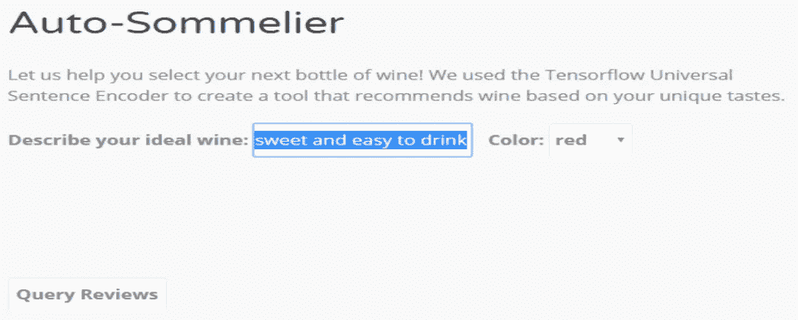
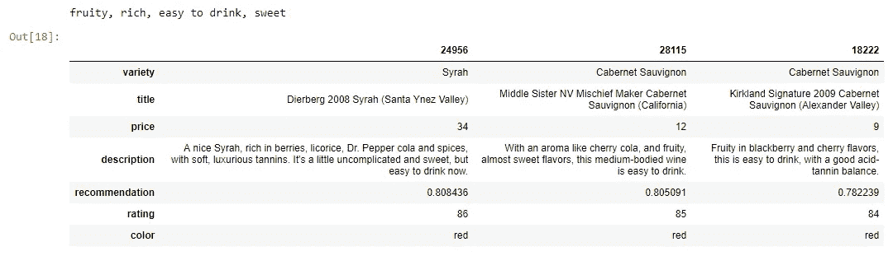

# 使用通用句子编码器生成葡萄酒推荐

> 原文：<https://towardsdatascience.com/generating-wine-recommendations-using-the-universal-sentence-encoder-d086edd13d00?source=collection_archive---------17----------------------->


## 探索自然语言处理

自从我在大学学习修辞理论和技术交流时第一次读到图灵测试，自然语言处理(NLP)就让我着迷。我们交流的复杂性和微妙性似乎一直是使我们成为独特和智慧物种的决定性因素，因此训练机器理解语言将交流从如此模糊、有说服力和深情的东西转变为似乎机械、有序和可预测的东西。一旦我开始编码，没过多久我的好奇心就驱使我更好地理解我们如何使用机器学习来获得对自然语言的新见解，并推导出我们可能错过的细微差别。例如，最近发表的一篇论文讨论了 NLP 如何用于材料科学的新发现。

我一直在玩的 NLP 工具之一是托管在 [Tensorflow-hub](https://tfhub.dev/google/universal-sentence-encoder/2) 上的[通用句子编码器](https://arxiv.org/pdf/1803.11175.pdf)(使用)。使用预先训练的模型，将文本编码成 512 维向量。它针对大于单词长度的文本进行了优化，并针对各种数据源进行了训练。有几种不同的用法。我选择了使用深度平均网络(DAN)训练的模型，因为它比基于变压器的模型占用的资源更少。我使用该工具的第一个项目是基于葡萄酒描述和我的搜索查询之间的语义相似性生成葡萄酒推荐。该项目在 www.robotsdodream.com[举办](http://robotsdodream.com/)



The Auto-Sommelier allows a user to input a query and generate three wine recommendations.

# 数据

由模型编码的葡萄酒数据来自在[kaggle.com 上找到的](https://www.kaggle.com)[葡萄酒评论](https://www.kaggle.com/zynicide/wine-reviews)数据集。它包含大约 130，000 行数据，包括国家、描述、标题、品种、酒厂、价格和评级等列。将数据放入 dataframe 后，我删除了包含重复描述的行和价格为空的行。我还将数据限制在有超过 200 条评论的葡萄酒品种上。

```
*#import dependancies*
**import** **numpy** **as** **np**
**import** **pandas** **as** **pd
import** **tensorflow** **as** **tf**
**import** **tensorflow_hub** **as** **tfhub
import** **sqlite3
from** **sqlite3** **import** Error
**import io**#create a connection to the sqlite database.
conn = sqlite3.connect('db\wine_data.sqlite', detect_types = sqlite3.PARSE_DECELTYPES)
c = conn.cursor()*#read the table in the database.*
wine_df = pd.read_sql('Select * from wine_data', conn)*#Drop the duplicate descriptions.*
wine_df = wine_df.drop_duplicates('description')*#drop null prices.*
wine_df = wine_df.dropna(subset=['price'])*#filter the dataframe to include only varieties with more than 200 reviews.*
wine_df = wine_df.groupby('variety').filter(**lambda** x: len(x) > 200)
```

通过排除少于 200 条评论的品种来减少数据，我得到了 54 种葡萄酒。通过谷歌搜索剩下的品种，我可以添加一个颜色栏，这样用户就可以通过想要的葡萄酒颜色来限制他们的搜索。

```
*#create a column named color.*
wine_df["color"] = ""*#used to update the database with the wine color. Manually updated each wine variety.*
c.execute("update wine_data set color = 'red' where variety = 'Aglianico'  ")*#commit the update to the database so it saves.*
conn.commit()*#remove all the records without a color.*
wine_df = pd.read_sql("select country, description,rating,price,province,title,variety, winery, color  from wine_data where color in ('red', 'white', 'other')", conn)
wine_df.to_sql('wine_data', conn, if_exists = "replace")
```

清理完数据，就剩下 100228 行了。

# 设置通用句子编码器

基于 DAN 的模型大约有 800mb，所以我觉得在本地托管它很重要。使用 OS 库，我设置了模型缓存的位置，并且能够从本地目录调用它，而不是每次都下载它。

```
**import** **os***#create the directory in which to cache the tensorflow universal sentence encoder.*
os.environ["TFHUB_CACHE_DIR"] = 'C:/Users/Admin/Downloads'
download = tfhub.Module("https://tfhub.dev/google/universal-sentence-encoder/2")
```

下载完模型后，在指定的目录下会出现一个文件，名字类似于*1 FB 57 C3 FFE 1a 38479233 ee 9853 DDD 7 a 8 a 8 a 8 c 47。*

# 创建函数

即使下载了模型，应用程序的最初几个迭代也是资源密集型的，而且慢得令人恼火。经过一点研究和修改，我决定使用函数来减少 tensorflow 构建图形和编码数据的开销和时间。通过使用占位符，我相信性能会得到提高，因为它降低了图形的复杂性。以这种方式编码数据会比较快。

```
def embed_useT():
    with tf.Graph().as_default():
        text_input = tf.compat.v1.placeholder(dtype = tf.string, shape=[None])
        embed = tfhub.Module('C:/Users/Admin/Downloads/1fb57c3ffe1a38479233ee9853ddd7a8ac8a8c47')
        em_txt = embed(text_input)
        session = tf.compat.v1.train.MonitoredSession()
    return lambda x:session.run(em_txt, feed_dict={text_input:list(x)})*#run the model.*
embed_fn = embed_useT()*#encode the wine descriptions.*
result = embed_fn(wine_df.description)
```

对所有描述进行编码会消耗系统资源，并占用 2gb 或更多的 RAM。为了节省系统内存，我将 numpy 数组保存到我的 SQLite 数据库中。从数据库调用数组而不是对其进行动态编码，这使我可以在使用 2g ram 的虚拟机上运行应用程序。在运行中对它们进行编码，我使用了一台至少有 4g 内存的机器，即使这样有时也不够。由于我在 stackoverflow 上找到了一个解决方案，将 numpy 数组保存到数据库变得很容易:

```
def adapt_array(arr):
    '''
    [http://stackoverflow.com/a/31312102/190597](http://stackoverflow.com/a/31312102/190597) (SoulNibbler)
    '''
    out = io.BytesIO()
    np.save(out, arr)
    out.seek(0)
    return sqlite3.Binary(out.read())

def convert_array(text):
    out = io.BytesIO(text)
    out.seek(0)
    return np.load(out)

# Converts np.array to TEXT when inserting.
sqlite3.register_adapter(np.ndarray, adapt_array)# Converts TEXT to np.array when selecting,
sqlite3.register_converter("array", convert_array)c.execute("create table embeddings (arr array)")conn.commit()c.execute("insert into embeddings (arr) values (?)", (result, ))conn.commit()#return the array
c.execute("select * from embeddings")
data = c.fetchone()[0]
```

对葡萄酒描述进行编码后，我创建了一个函数，通过对用户查询进行编码并找到两个数组的点积来输出葡萄酒推荐:

```
def recommend_engine(query, color, embedding_table = result): wine_df = pd.read_sql('Select * from wine_data', db.session.bind) embedding = embed_fn([query])#Calculate similarity with all reviews
    similarity_score = np.dot(embedding, embedding_table.T) recommendations = wine_df.copy()
    recommendations['recommendation'] = similarity_score.T
    recommendations = recommendations.sort_values('recommendation', ascending=False)#filter through the dataframe to find the corresponding wine color records.
    if (color == 'red'):
        recommendations = recommendations.loc[(recommendations.color =='red')] 
        recommendations = recommendations[['variety', 'title', 'price', 'description', 'recommendation'
                                    , 'rating','color']]
    elif(color == "white"):
        recommendations = recommendations.loc[(recommendations.color =='white')] 
        recommendations = recommendations[['variety', 'title', 'price', 'description', 'recommendation'
                                    , 'rating','color']]
    elif(color == "other"):
        recommendations = recommendations.loc[(recommendations.color =='other')] 
        recommendations = recommendations[['variety', 'title', 'price', 'description', 'recommendation'
                                    , 'rating','color']]
    else:
        recommendations = recommendations[['variety', 'title', 'price', 'description', 'recommendation'
                                    , 'rating','color']]

    return recommendations.head(3).T
```

测试功能:

```
query = "fruity, rich, easy to drink, sweet"
color = 'red'recommendation = recommend_engine(query, color)
print(query)recommendation.head(3).T
```



探索所有的葡萄酒数据并提出一种基于搜索查询生成推荐的轻量级方法是很有趣的。我计划继续探索通用句子编码器，并思考新的项目来挑战自己和改进我的代码。点击这里查看我的 github 上的其余项目代码:

 [## 弯曲游戏/葡萄酒推荐

### 此时您不能执行该操作。您已使用另一个标签页或窗口登录。您已在另一个选项卡中注销，或者…

github.com](https://github.com/bendgame/WineRecommend) 

把所有的放在一起

```
**import** **numpy** **as** **np**
**import** **pandas** **as** **pd
import** **tensorflow** **as** **tf**
**import** **tensorflow_hub** **as** **tfhub
import** **sqlite3
from** **sqlite3** **import** Error
**import io**conn = sqlite3.connect('db\wine_data.sqlite', detect_types = sqlite3.PARSE_DECELTYPES)
c = conn.cursor()*#read the table in the database.*
wine_df = pd.read_sql('Select * from wine_data', conn)*#Drop the duplicate descriptions.*
wine_df = wine_df.drop_duplicates('description')*#drop null prices.*
wine_df = wine_df.dropna(subset=['price'])*#filter the dataframe to include only varieties with more than 200 reviews.*
wine_df = wine_df.groupby('variety').filter(**lambda** x: len(x) > 200)*#create a column named color.*
wine_df["color"] = ""*#used to update the database with the wine color. Manually updated each wine variety.*
c.execute("update wine_data set color = 'red' where variety = 'Aglianico'  ")*#commit the update to the database so it saves.*
conn.commit()*#remove all the records without a color.*
wine_df = pd.read_sql("select country, description,rating,price,province,title,variety, winery, color  from wine_data where color in ('red', 'white', 'other')", conn)
wine_df.to_sql('wine_data', conn, if_exists = "replace")**import** **os***#create the directory in which to cache the tensorflow universal sentence encoder.*
os.environ["TFHUB_CACHE_DIR"] = 'C:/Users/Admin/Downloads'
download = tfhub.Module("https://tfhub.dev/google/universal-sentence-encoder/2")def embed_useT():
    with tf.Graph().as_default():
        text_input = tf.compat.v1.placeholder(dtype = tf.string, shape=[None])
        embed = tfhub.Module('C:/Users/Admin/Downloads/1fb57c3ffe1a38479233ee9853ddd7a8ac8a8c47')
        em_txt = embed(text_input)
        session = tf.compat.v1.train.MonitoredSession()
    return lambda x:session.run(em_txt, feed_dict={text_input:list(x)})*#run the model.*
embed_fn = embed_useT()*#encode the wine descriptions.*
result = embed_fn(wine_df.description)def recommend_engine(query, color, embedding_table = result): wine_df = pd.read_sql('Select * from wine_data', db.session.bind) embedding = embed_fn([query])#Calculate similarity with all reviews
    similarity_score = np.dot(embedding, embedding_table.T)recommendations = wine_df.copy()
    recommendations['recommendation'] = similarity_score.T
    recommendations = recommendations.sort_values('recommendation', ascending=False)#filter through the dataframe to find the corresponding wine color records.
    if (color == 'red'):
        recommendations = recommendations.loc[(recommendations.color =='red')] 
        recommendations = recommendations[['variety', 'title', 'price', 'description', 'recommendation'
                                    , 'rating','color']]
    elif(color == "white"):
        recommendations = recommendations.loc[(recommendations.color =='white')] 
        recommendations = recommendations[['variety', 'title', 'price', 'description', 'recommendation'
                                    , 'rating','color']]
    elif(color == "other"):
        recommendations = recommendations.loc[(recommendations.color =='other')] 
        recommendations = recommendations[['variety', 'title', 'price', 'description', 'recommendation'
                                    , 'rating','color']]
    else:
        recommendations = recommendations[['variety', 'title', 'price', 'description', 'recommendation'
                                    , 'rating','color']]

    return recommendations.head(3).Tquery = "fruity, rich, easy to drink, sweet"
color = 'red'recommendation = recommend_engine(query, color)
print(query)recommendation.head(3).T
```

# 谢谢大家！

*   *如果你喜欢这个，* [*跟我上 Medium*](https://medium.com/@erickleppen) *了解更多*
*   [*通过订阅*](https://erickleppen.medium.com/membership) 获得完全访问权限并帮助支持我的内容
*   *我们来连线一下*[*LinkedIn*](https://www.linkedin.com/in/erickleppen01/)
*   *用 Python 分析数据？查看我的* [*网站*](https://pythondashboards.com/)

[**—埃里克·克莱本**](http://pythondashboards.com/)