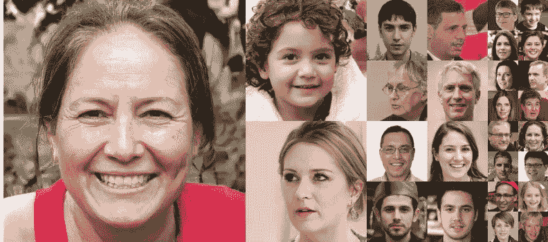
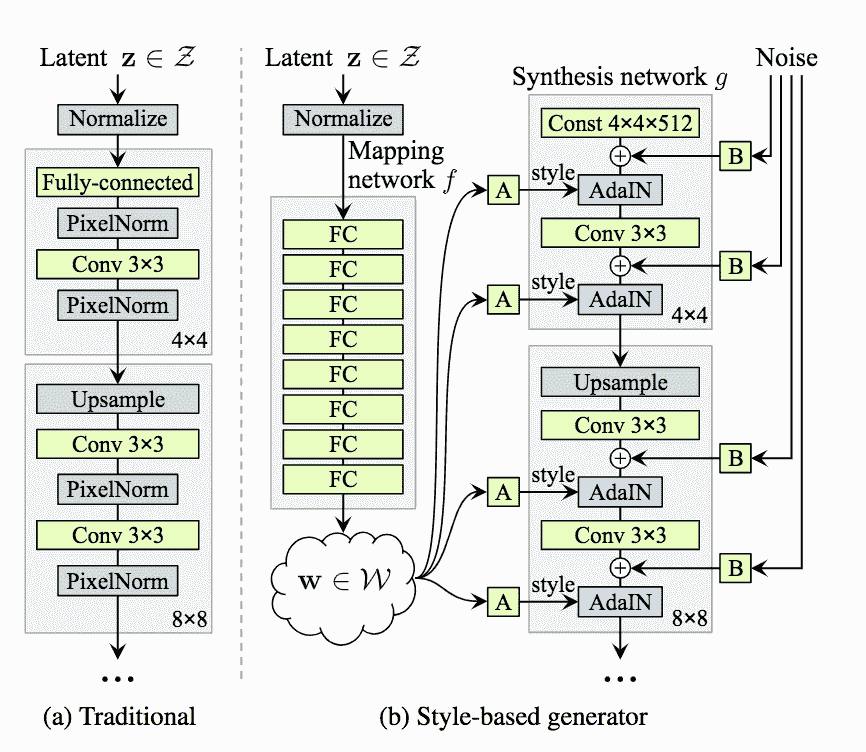
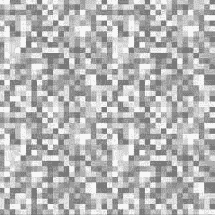
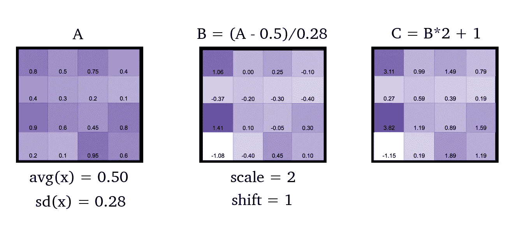
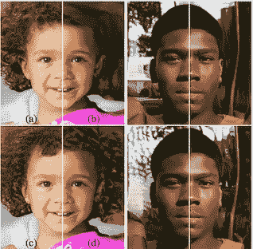
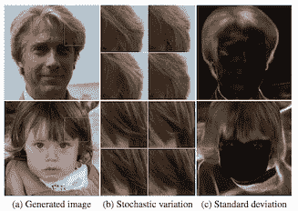

# 生成，风格:NVIDIA 的高逼真 GAN 图像背后的机制

> 原文：<https://towardsdatascience.com/generating-with-style-the-mechanics-behind-nvidias-highly-realistic-gan-images-b6937237e3c6?source=collection_archive---------11----------------------->

如果你在去年年底关注任何机器学习新闻，你可能会看到这样的图像流传，这是 NVIDIA 团队最近的一篇论文指定的一种新的生成对抗网络(GAN)架构的结果:

An apparently randomly selected set of faces produced by NVIDIA’s “Style-Based” GAN

如果你关注这一领域，那么听到一些新奇味道的甘产生令人瞠目结舌的结果并不是一种新的体验，但即使按照最近提高的标准，这些图像也是令人震惊的。第一次，我确信我个人无法区分这些照片和真实的照片。从纸张框架的字里行间来看，这种方法的主要目标似乎实际上是创建一种生成器架构，其中全局和局部图像特征以更可分离的方式表示，因此可以更容易地配置来指定和控制您想要生成的图像。事实上，这些图像也非常逼真，这似乎是一个令人愉快的副作用。

(作为题外话，这篇文章将假设一个基本的背景知识如何卷积甘工作；如果你没有这样的背景，[这篇文章](https://medium.freecodecamp.org/an-intuitive-introduction-to-generative-adversarial-networks-gans-7a2264a81394)是一个很好的起点)

# 但是首先，最基本的

传统的卷积 gan 的工作方式是对某个分布的向量 z 进行采样，将该向量投影到低分辨率空间形式，然后执行一系列转置卷积，将 2×2 特征空间上采样到 4×4，然后到 8×8，依此类推。虽然 Z 向量只是随机采样，但我们的最终目标是在图像分布和我们的参考分布 Z 之间创建一个映射，使得 Z 中的每个向量都对应于一个真实的图像。因此，尽管一开始毫无意义，但每个特定的 z 最终都对应于它将产生的图像的编码属性。

在其最简单的形式中，转置卷积通过学习滤波器矩阵(例如，3x3)并将其乘以每个像素的值来在空间上向外扩展其信息。4×4 表示中的每个单个“像素”影响输出的 3×3 小块中的值；这些面片重叠并相加，以创建最终的“展开”表示。

上图虽然有助于建立简化的直觉，但有一点误导，因为它看起来像是放大的面片的值必须从单个像素的单个信息中分离出来。请记住:在网络的这一点上，四个“像素”中的每一个都包含一个完整的向量，可能相当于 128 或 256 个特征地图的信息。

由于较大的“上采样”图像中的大多数区域将仅从某一组“父”像素获得信息(例如，4x4 图像中的左上像素仅包含来自 2x2 图像中的左上像素的信息)，因此每一级的信息需要在空间上有所不同——以便能够展示不同组件在空间中的位置——但也需要有所全局化，因为如果我们试图创建一幅黑白图像， 每一个 2x2 像素都需要包含这些信息，以确保它被传递给下一代，我们不会以最终图像的一大块没有得到备忘录而告终。 从指定完整图像的完全全局 Z 向量开始，每个像素负责向其子像素传达它需要向其子像素传达的信息，以此类推，直到最后一层“子像素”只是输出图像的 RGB 像素。

这是转置(或“反进化”)网络(尽管这是一个令人困惑的术语，因此不推荐)正在解决的基本问题，如 GAN 发生器中使用的网络:**如何将信息和指令分配到不同的空间区域，**以便最终能够协调全球一致的高质量图像的产生。

# 全球化思考，本地化生产

如前一节所述，在典型 GAN 的生成器的层中，全局信息(指定所有区域需要协调的图像范围参数)和局部信息(我们应该将手、眼睛和头发放在哪里)都混合在一个共享的特征向量中，从一层传递到下一层。

由 [NVIDIA 论文](https://arxiv.org/pdf/1812.04948.pdf)提出的方法，他们称之为“基于风格的生成器”，采取了一种不同的方法:不是在网络的开始只输入一个向量，而是在网络的每一层重新注入一个全局参数向量，称为 W，以及从随机向量样本 Z 学习到的转换的输出。

浏览左边的图表:首先，从 Z 分布中进行绘制，它通常类似于多维高斯分布。然后，使用映射网络将 z 向量转换成 w 向量。这种转换的想法是，通过 z 和 w 之间的映射，我们可能能够获得更自然或更清晰的概念表示。(“解开”在这里意味着向量的每个维度都对应于一个独立的特征轴，图像沿着该轴变化，如头发颜色或年龄)。该论文对此的解释是，由于我们通常受限于我们可以轻松采样的分布类型，因此以轴对齐的方式表示图像概念并仍然填充采样分布的所有区域并对应于相干点可能并不容易。

在生成器方面，我们不是从通常的随机 z 向量开始，而是从一个学习到的常数 4x4 特征向量开始，只是为了获得正确的形状。然后，我们看到两个操作，噪声和风格注入，然后在整个网络中重复。

## 谣传

首先执行噪声处理，在图中表示为 B 和加法运算符。随机生成一个噪声图(最初大小为 4x4，但在随后的层中，无论表示在那里的维度如何),并传递到网络中。每个要素地图都会将此值的缩放版本添加到其值中，并将每个地图的唯一缩放因子作为网络参数学习。这具有随机扰动每个特征图的值的效果，并且重要的是，基于那里的采样噪声的幅度，以不同的量扰动图*的每个空间像素处的值。我会绕回来，试着建立一些直觉来解释为什么这是一件有价值的事情*

## 风格注入

在噪声之后，网络执行“样式”注入，这是一种基于全局样式参数的学习归一化形式。这里我们使用映射网络生成的 *w* 向量，它捕获图像的全局规格。在执行该操作的每个地方，我们使用学习的仿射变换(基本上是典型的单个神经网络层)来接受该全局向量 w，并输出包含在网络中该点处存在的每个特征图的两个值的向量，一个比例参数和一个偏移(或“偏差”)参数。这些参数用于所谓的自适应实例规范化，简称 AdaIN，这是一种应用单独的每特征移动和重新缩放的操作。

在上面的等式中，索引 *i* 指的是特定的特征图。换句话说，我们取第 *i* 个特征图(记住，它是在一些空间维度上展开的)并计算它的平均值和标准偏差。然后，我们执行归一化和重新缩放操作，这让人想起 batch norm:减去并除以平均值和 sd，然后乘以并加上缩放和偏移参数。

这两个操作允许我们通过我们学习的每个特征的比例和偏移参数来控制正在生成的每个图像的每个特征的均值和方差。关于所有这些操作，最重要的事实是它们是全局执行的，一次跨所有空间区域。如果你认为(非常粗略地)这些特征映射中的每一个都是控制各种图像特征的刻度盘——肤色、头发长度、两眼之间的距离，那么基于从我们的全局风格参数 *w* 计算出的值执行这种重新缩放操作就像将这些刻度盘从默认的“平均脸”位置移动到我们想要的这个特定图像的值。在这种架构中，每个反卷积操作不再需要学习如何记住全局信息，并在所有空间区域保持一致:这种一致性是免费的。

这两种操作，即噪声和风格驱动的归一化，是这种架构的核心——通过在去卷积和上采样的任何一侧应用这两种操作来实现网络功能。总的来说，它们似乎具有将信息“分解”成更可分离和可单独控制的成分的效果，并有助于更真实地生成随机图像元素。

# 这噪音是怎么回事？

作者使用噪声注入的基本原理是，图像的某些方面，如果不是严格意义上的完全随机，至少在信息上没有意义，并且当噪声被直接提供给网络时，更容易以令人信服的随机方式生成。例如，考虑下面左边图片(a)中小女孩头发的卷曲，或者右边相同位置叶子的确切位置。当单个卷发或树叶的位置和方向看起来随机时，这两者看起来更真实。

This figure shows the same generated image, but with injected noise removed at different levels of the network. (a) shows the default StyleGAN, with noise at all levels. In (b), all noise is removed from the network. In (c), noise is applied at the later layers responsible for fine detail, but not at coarser/lower resolution layers. Finally, in (d), that is swapped, and noise is present for coarse layers but not fine ones. The same orientation of a/b/c/d follows for the boy on the right.

然而，令人信服的随机性对于一个网络来说实际上是相对难以原生生成的；由于网络中的一切都只是确定性的数学变换，因此随机性通常会被一些具有明显模式或周期性的参数函数所近似。作为一个例子，考虑左下角矩形中的男孩的照片:叶子以大约均匀的间隔放置，以一种看起来不是特别真实的方式。

考虑噪声作用的另一种方式是给网络一种方法，从给定图像的等效似是而非的变化分布中容易地进行采样。左边的图像显示了一个生成的图像，然后显示了当您使用所有相同的全局元素生成该图像时所得到的差异，但是使用了不同的精细噪声实例。结果通常是非常相似的图像，但是对于图像的核心特征来说，细节上的微小变化并不重要。虽然很明显这些人都不是“真实的”，但你可以把这想象成给同一个人拍不同的照片，但随着风或灯光的改变，这些随机元素的外观会有所不同。

# 你很有型

这解释了噪声的价值，但我们从这种风格的注入设置中得到什么好处呢？提醒一下，样式是通过每个特征图计算的两个归一化参数在每个图像的基础上配置的，这些参数是基于全局样式向量 *w* 确定性地计算的。顺便说一句，术语“风格”用于指这些全局参数，因为它们全局地影响图像，并影响广泛的美学和内容特征，让人想起风格转移工作，其中一个艺术家的视觉风格用于照片或另一个艺术家的工作。我认为这有点令人困惑，并且更愿意将样式视为配置，或者全局参数设置，但我仍然偶尔使用“样式”，因为这是本文使用的术语。

回到我们的比喻，样式是一种在每个特征的基础上“调节”图像生成的方式，演示样式如何控制结果图像的一种方式是，看看当您将两个不同图像的特征设置组合在一起时会发生什么。因为风格注入在每一层单独发生，这可以很容易地通过将人 A 的 w 向量提供给某一组层，并将人 B 的 w 向量提供给其余层来完成。这导致一些层根据人 A 的参数进行配置，而其他层根据人 B 的参数进行配置。这就是上图中显示的内容:在每一行中，我们取最左边的图像，用相应列中的图像替换掉它的一些样式参数。对于前三行，我们从源中交换粗略的样式参数，对于后两行、中间行和最后一行，只有精细的样式参数从备用图像中“导入”。(注意，这些都不是真实的图像，只是来自输入 *z* 分布的不同人工绘制，然后使用映射网络将其映射到 *w* 向量)

可以预见，重新配置图像的粗略参数具有最显著的影响，完全改变年龄、性别和面部形状以匹配源图像，但种族和整体调色板与目的地保持不变。当我们只改变精细级别参数时，我们得到的是一个具有相同性别、表情和面部表情，但头发和肤色有微小变化的人。根据金发女孩原则，中间层介于两者之间:更像是两个图像的平等融合。

所有这些都展示了一种有用的灵活性:这种架构不仅仅能够在生成的图像之间进行插值，并使全局和局部特征共同变化，而是允许在特定比例甚至逐个特征的基础上对合并或修改进行更大的控制。通常，这种级别的生成控制可以通过训练一个类条件模型来实现，在这个模型中，您可以为每个图像生成一个指定的类。我们还没有达到能够指定一组图像指令，并将其翻译成生成器可以遵循的蓝图的地步，但是这种方法使我们更接近于在没有直接类监督的情况下做到这一点的能力。

# 缩小

我记得曾读到有人对这篇论文发表过一个有趣的看法(可惜我忘了是谁)，那就是，与其说它是 GAN 设计的进步，不如说它是许多非常聪明的针对图像的*发生器设计。我认为这是一个需要记住的很好的区别，无论是在这里还是更广泛的 ML 中:由于如此多的现代深度学习研究都集中在图像上，保持对什么样的成功代表普遍进步与特定领域进步的持续了解是有价值的。并不是说聪明的特定领域的工作有什么*错误*，相反我认为它有巨大的价值，但是我们应该小心将“在图像上有令人印象深刻的进步”与“在更广泛的学习任务上有令人印象深刻的进步”混为一谈。*

*快速提醒:我深入研究了这篇论文，对自己的理解相对有信心，但还没有像以前的一些帖子那样对相关文献进行彻底的回顾，所以我可能误解了风格根与当前艺术水平的关系。如果你认为是这样，请告诉我！*