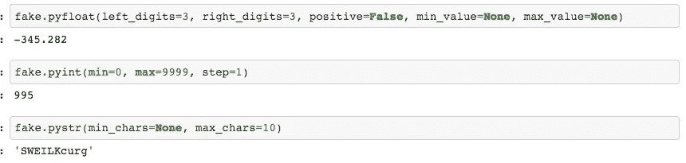

# 使用 Python Faker 库生成大型 CSV 数据。

> 原文：<https://towardsdatascience.com/generation-of-large-csv-data-using-python-faker-8cfcbedca7a7?source=collection_archive---------10----------------------->

对于那些需要大量虚假数据来试验不同算法的学习者来说。各种领域每秒钟都有大量数据在线生成，但出于学习和实验目的，原始数据由于安全性和许多其他限制而无法使用。所以我在这里谈论的是使用 Python 的一个名为 **Faker** 的库生成大量的虚假数据。


# Faker 图书馆

[*Faker*](https://faker.readthedocs.io/en/master/) 是一个生成假数据的 Python 包。

**使用 pip 安装** Faker 库:

```
pip install Faker
```

## Python 用法

*faker。Faker()* 初始化一个伪生成器，可以根据不同的数据类型为不同的属性生成数据。faker generator 的不同属性打包在“providers”中。不同造假者的名单可以在[这里](https://faker.readthedocs.io/en/stable/providers.html)找到。它还拥有 ipv4 互联网提供商和其他社区提供商，如 web、云和 wifi。可以使用*fake . add _ provider(custom provider)创建和添加自定义提供程序。*

不同数据类型的一些假生成器如下所示。本笔记本[中给出了不同提供商的更详细使用方法。](https://github.com/Krishna-Parekh/pythonFaker/blob/master/Faker_providers.ipynb)

```
from faker import Faker
from faker.providers import internetfake = Faker()fake.pybool()   # Randomly returns True/Falseprint(fake.pyfloat(left_digits=3, right_digits=3, positive=False, min_value=None, max_value=None))   # Float dataprint(fake.pystr(min_chars=None, max_chars=10))  # String dataprint(fake.pylist(nb_elements=5, variable_nb_elements=True))  # Listfake.add_provider(internet)
print(fake.ipv4_private())  # Fake ipv4 address
```

数据输出如下所示:



Some faker functions with output

*faker。Faker()* 可以将区域设置作为参数，以返回本地化的数据。默认区域设置是 en_US。它支持印地语、法语、西班牙语、中文、日语、阿拉伯语、德语和更多的 T21 语。

```
from faker import Fakerfake_H = Faker('hi_IN')   # To generate Hindi Fake data
fake_H.name()
```

## 命令行用法:

Faker 也可以在安装后从命令行调用。

```
faker [-h] [--version] [-o output]
      [-l {bg_BG,cs_CZ,...,zh_CN,zh_TW}]
      [-r REPEAT] [-s SEP]
      [-i {package.containing.custom_provider otherpkg.containing.custom_provider}]
      [fake] [fake argument [fake argument ...]]where;
-h, --help : shows a help message
--version : shows the program version
-o : output file
[-l {bg_BG,cs_CZ,...,zh_CN,zh_TW}] : allows using localized provider
[-r REPEAT] : To generate specified number of outputs
[-s SEP] : Separator to separate generated outputs
[-i {package.containing.custom_provider otherpkg.containing.custom_provider}] : to add custom providers
[fake] : name of fake to generate an output for (e.g. name, address)
```

# CSV 的生成

带有虚假数据的大型 CSV 文件可以非常容易地生成任意数量的记录。你需要做的只是传递 CSV 的标题，并在标题中为每一列指定数据属性。

Faker 有助于生成各种类型的数据，如姓名、电子邮件、url、地址、电话号码、邮政编码、城市、州、国家、日期、时间等等。生成假 CSV 数据的代码如下所示。

你可以在这里找到代码文件。希望这篇文章对你有所帮助，并为你提供了一些有意义的见解！非常欢迎您的宝贵反馈。快乐学习！！！