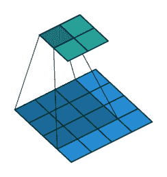

# 面向初学者的生成性对抗网络(GANs ):生成分心驾驶员的图像

> 原文：<https://towardsdatascience.com/generative-adversarial-networks-gans-for-beginners-82f26753335e?source=collection_archive---------7----------------------->

生成对抗网络(GANs)是指一组通常用于生成刺激(如图片)的神经网络模型。GANs 的使用挑战了计算机没有创造力的教条。GANs 的应用仍处于早期阶段，但这是一个非常令人兴奋的研究领域。在这里，我回顾了 GAN 的基本组成部分，并展示了一个我用来生成分心驾驶员图像的示例 GAN。具体来说，我将审查一个瓦瑟斯坦甘。如果读者对 Wasserstein GAN 背后的理论更感兴趣，我建议你参考[链接的论文](https://arxiv.org/abs/1701.07875)。这篇文章对应的所有代码都可以在我的 [GitHub](https://github.com/zachmonge/wgan_statefarm) 上找到。

我们开始吧！GAN 由两种类型的神经网络组成:**生成器和鉴别器**。

# 发电机

生成器的工作是获取噪声并创建图像(例如，一个分心的司机的照片)。

Generator

这到底是怎么回事？我们首先从创建噪声开始，对于小批量中的每一件商品，噪声由一个 0 到 1 之间的随机正态分布数字的向量组成(在注意力分散的驾驶员的例子中，长度是 100)；注意，这实际上不是一个向量，因为它有四个维度(批量大小，100，1，1)。

然后，我们必须从一个数字向量到一个完整的图像，我们使用**转置卷积**来完成。对于以前有计算机视觉经验的读者，您可能熟悉可以对图像进行缩减像素采样的普通卷积图层。例如，下图显示了一个卷积层，内核为 3x3，步幅为 1，没有填充。可以看出，输入的大小从 4×4 减小到 2×2。

Convolution layer with a 3x3 kernel, stride of 1, and no zero padding. Image from the [Convolution Arithmetic Tutorial](http://deeplearning.net/software/theano/tutorial/conv_arithmetic.html).

也有过滤器“跳过”像元的跨距卷积层。例如，下面是一个具有 3x3 内核、步幅为 2 且没有填充的卷积层。可以看出，输入的大小从 5×5 减少到 2×2。

Convolution layer with a 3x3 kernel, stride of 2, and no zero padding. Image from the [Convolution Arithmetic Tutorial](http://deeplearning.net/software/theano/tutorial/conv_arithmetic.html).

对于转置卷积，输入通常会被*上采样*，而不是被下采样。例如，下面是一个转置卷积层，其内核为 3x3，步幅为 1，没有零填充。可以看出，输入的大小从 2x2 增加到 4x4。

Transposed convolution layer with a 3x3 kernel, stride of 1, and no zero padding. Image from the [Convolution Arithmetic Tutorial](http://deeplearning.net/software/theano/tutorial/conv_arithmetic.html).

还有带步幅的转置卷积层。例如，下面是一个转置卷积层，其内核为 3x3，步幅为 2，没有零填充。可以看出，输入的大小从 2×2 增加到 5×5。

Transposed convolution layer with a 3x3 kernel, stride of 2, and no zero padding. Image from the [Convolution Arithmetic Tutorial](http://deeplearning.net/software/theano/tutorial/conv_arithmetic.html).

利用 GAN 发生器，我们实际上是对噪声进行上采样，直到它达到一幅图像的大小。在这样做的同时，我们也减少了过滤器的数量。具体细节见我的 [GitHub](https://github.com/zachmonge/wgan_statefarm) 上的代码。

# 鉴别器

鉴别者的工作是拍摄一幅图像，并试图判断它是真的还是假的(即*鉴别*假的和真的图像)。该模型实际上非常简单，它基本上包括使用一组标准卷积层和 stride 对图像进行下采样，最终达到一个值。这个值就是损失。如下文在训练模型中所述，对真实和伪生成的图像都计算该损失。在对“图像”进行下采样时，我们增加了滤镜的数量。再一次，查看我的 [GitHub](https://github.com/zachmonge/wgan_statefarm) 上的代码以获得准确的细节。

# **训练模型**

现在我们有了生成器和鉴别器模型，我们可以开始训练它们了！事实证明，对于 GANs 来说，重要的是我们的鉴别器真的很擅长区分真假图像。因此，每次更新生成器权重时，我们都会更新鉴别器的权重 5–100 次(详见代码)。好吧，很好，但是我们到底要怎么训练鉴别者呢？其实挺容易的。首先，我们取一小批真实图像，并让它们通过鉴别器。鉴频器的输出是*实际损耗*。然后我们让噪声通过我们的发生器，让这些假图像通过鉴别器。鉴别器的这个输出就是*假损耗*。通过从*实际损耗* ( *实际损耗* - *假损耗*)中减去*假损耗*来计算鉴频器损耗。相对于该损失更新权重。因此，正如你所看到的，**生成器基本上是在试图欺骗鉴别器**，这就是生成对抗网络的*对抗*部分。

那么生成器如何变得善于欺骗鉴别器呢？训练发电机其实很简单。我们只是制造一些噪音，让它通过发生器，让这些假生成的图像通过鉴别器。该输出是发电机损耗，用于更新发电机的权重。

这就是训练 GAN 的全部内容！真的不太复杂。现在让我们来看一个 GAN 的动作。

# 生成分心司机的图像

在这里，我使用 [Kaggle State Farm 分心驾驶员检测数据集](https://www.kaggle.com/c/state-farm-distracted-driver-detection)来训练 GAN，以生成分心驾驶员的图像(我也包括训练未分心的控制驾驶员)。该数据集基本上由一大堆分心司机的照片组成，如司机发短信、化妆或与另一名司机交谈。这个数据集最初是由 State Farm 作为 Kaggle 竞赛发布的，用于训练一个分类器来检测司机如何分心。如果你还记得几年前，State Farm 引入了在汽车上安装摄像头的想法，这种摄像头基本上可以检测司机是否分心，并可能根据这些信息调整保费(我实际上不知道这是否是他们检测分心司机的意图)。

开始训练吧！只是一个小注意，我最初将图像下采样为 64x64 像素，以便我可以更快地训练 GAN，因此这些图像的质量不如原始分辨率好。下面是一个时期后生成的 64 幅图像示例。如你所见，它们看起来什么都不像。让我们继续训练。

After 1 epoch

现在我们可以看到在 20 个纪元后，它看起来确实像是在创造汽车司机的照片！

After 20 more epochs

经过一段时间的训练，我们得到了一些相当合理的图片。看看下面两张图片，你可以看到一个例子产生分心的司机。好像这个人在打手机(酷！).

After training for a little while

Generated distracted driver

太好了！这些图像是完美的吗？不，但是只要付出很少的努力，它们就不会太差(至少在我看来是这样！).我发现神经网络能够学习如何生成图像，这真是令人惊讶。GANs 是一个真正令人兴奋的研究领域，它开始打破计算机没有创造力的假设。GANs(例如 CycleGANs)最近还有许多其他的突破，它们甚至更有趣，我可能会在以后写出来。再次，在我的 [GitHub](https://github.com/zachmonge/wgan_statefarm) 上查看这篇博文的代码，并关注未来关于 GANs 和其他机器学习主题的帖子！