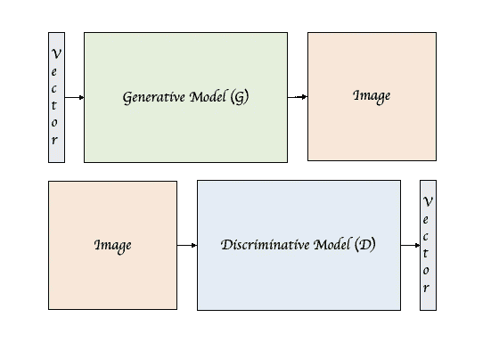
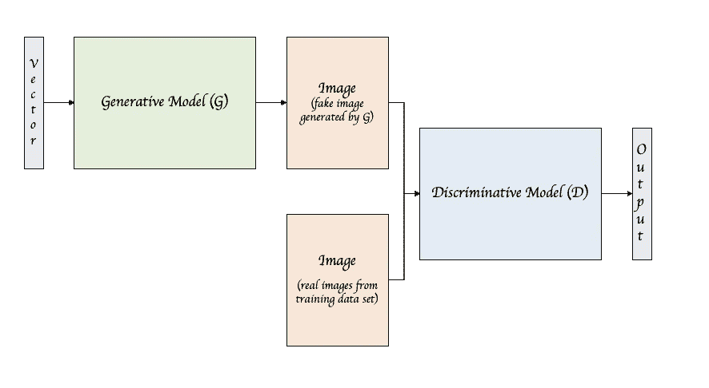
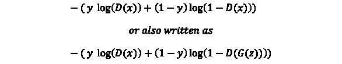
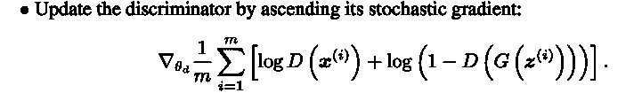
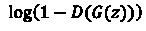
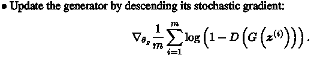
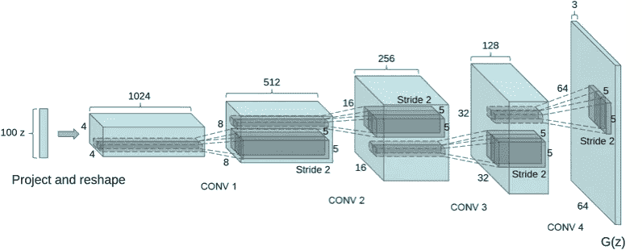
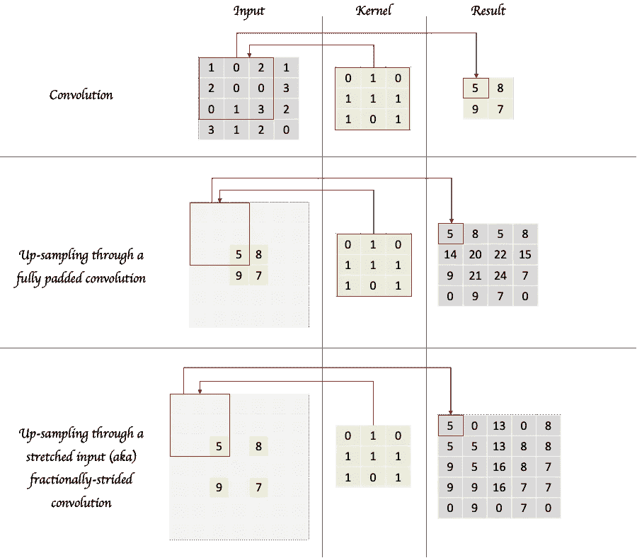
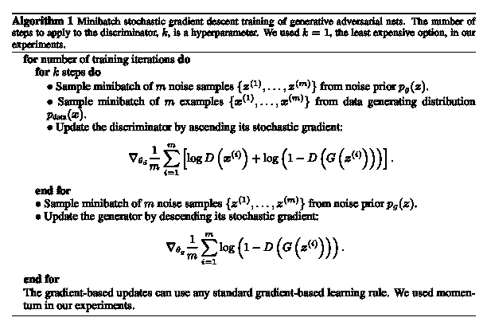

# 生成性对抗网络——学习创造

> 原文：<https://towardsdatascience.com/generative-adversarial-networks-learning-to-create-8b15709587c9?source=collection_archive---------10----------------------->

## 一窥 GANs 背后的设计、训练、损失函数和算法

假设我们有一个卧室图像的数据集和一个图像分类器 CNN，它在这个数据集上被训练来告诉我们一个给定的输入图像是否是一个卧室。假设图像的大小为 16 * 16。每个像素可以有 256 个可能的值。因此有无限多的可能输入(即 256 种⁶* ⁶或~10⁶ ⁶可能的组合)。这确实使我们的分类器模型成为一个高维概率分布函数，它给出了来自这个大输入空间的给定输入是卧室的概率。

因此，如果我们可以学习这种用于分类目的的卧室图像数据分布的高维知识，我们应该肯定能够利用相同的知识甚至生成全新的卧室图像？事实证明，是的，我们可以。

虽然生成建模有多种方法，但我们将在本帖中探索生成对抗网络。最初的 [GAN 论文](https://arxiv.org/pdf/1406.2661.pdf)发表于 2014 年，深度卷积生成对抗网络(DCGANs)在论文[中介绍，并一直是流行的参考。这篇文章基于对这两篇论文的研究，对 GANs 做了很好的介绍。](https://arxiv.org/pdf/1511.06434.pdf)

GAN 是一个网络，其中同时训练两个模型，生成模型 G 和判别模型 D。生成模型将被训练以通过捕获与训练数据集相关联的数据分布来产生新的卧室图像。鉴别模型将被训练以将给定的输入图像正确地分类为真实的(即来自训练数据集图像)或虚假的(即由生成模型产生的合成图像)。简单来说，判别模型是典型的 CNN 图像分类器模型，或者更具体地说，是二值图像分类器。

与判别模型相比，生成模型略有不同。它的目标不是分类，而是生成。在给定输入图像的情况下，鉴别模型吐出表示不同类别的激活向量作为输出，而生成模型则相反。

Generative vs Discriminative Model

它可以被认为是一个反向 CNN，在某种意义上，它将采用一个随机数向量作为输入，并产生一个图像作为输出，而正常的 CNN 则相反，采用一个图像作为输入，并产生一个数字或激活向量(对应于不同的类)作为输出。

但是这些不同的模型是如何协同工作的呢？下图给出了该网络的示意图。首先，我们将随机噪声向量作为生成模型的输入，生成图像输出。我们将这些生成的图像称为假图像或合成图像。然后我们有鉴别模型，该模型将来自训练数据集的假图像和真图像作为输入，并产生分类该图像是假图像还是真图像的输出。

An illustration of Generative Adversarial Network

用这两个模型训练和优化这个网络的参数就变成了一个两个人的极大极小游戏。鉴别模型的目标是最大限度地将图像正确分类为真与假。相反，生成模型的目标是最小化正确地将假图像分类为假的鉴别器。

反向传播用于像常规 CNN 一样训练网络参数，但是存在两个具有不同目标的模型的事实使得反向传播的应用不同。更具体地说，涉及的损失函数和在每个模型上执行的迭代次数是 GANs 不同的两个关键方面。

判别模型的损失函数将只是与二元分类器相关联的常规交叉熵损失函数。取决于输入图像，损失函数中的一项或另一项将为 0，并且结果将是图像被正确分类的模型预测概率的负对数。换句话说，在我们的上下文中，“y”对于真实图像是“1”，而“1–y”对于虚假图像是“1”。“p”是图像是真实图像的预测概率,“1-p”是图像是伪造图像的预测概率。

Cross Entropy Loss for a Binary Classifier

上面的概率“p”可以表示为 D(x)，即由鉴别器 D 估计的图像“x”是真实图像的概率。重写后，看起来像下面这样:

Dicriminator’s loss function

基于我们如何分配上下文，等式的第一部分将被激活，而第二部分对于真实图像将为零。对于假图像来说，反之亦然。记住这一点，第二部分中图像“x”的表示因此可以由“G(z)”代替。换句话说，在给定“z”作为输入的情况下，假图像被表示为模型“G”的输出。“z”只不过是模型“G”产生“G(z)”的随机噪声输入向量。不必太担心其余的数学符号，这与 [GAN 论文](https://arxiv.org/pdf/1406.2661.pdf)中提出的鉴频器 D 的损失函数相同。乍一看，这些信号令人困惑，但本文中的算法通过“上升”其随机梯度来更新鉴别器，从而提供了清晰度，这与如上所述的最小化损失函数是相同的。这是论文中函数的一个快照:

From [here](https://arxiv.org/pdf/1406.2661.pdf)

回到发生器 G，G 的损失函数将反过来，即最大化 D 的损失函数。但是等式的第一部分对生成器没有任何意义，所以我们真正要说的是第二部分应该最大化。因此，G 的损失函数将与 D 的损失函数相同，只是符号被翻转，第一项被忽略。

Generator’s loss function

这是论文中发电机损耗函数的一个快照:

From [here](https://arxiv.org/pdf/1406.2661.pdf)

我也很好奇，想知道更多关于生成模型的内部情况，因为它做了一些直观上与典型的 CNN 图像分类相反的事情。如 DCGAN 论文中所示，这是通过整形和转置卷积的组合来实现的。这是论文中发电机的示意图:

DCGAN Generator from [here](https://arxiv.org/pdf/1511.06434.pdf)

转置卷积不同于卷积的逆卷积，在给定原始卷积输出的情况下，转置卷积不会恢复输入，而只是改变形状。下图展示了上面发电机模型背后的数学原理，尤其是 CONV 层。

Illustration of a regular convolution used in CNNs followed by two examples of up-sampling achieved through transposed convolutions. The result of the first example is used as input in the second and third examples with the same kernel to demonstrate transposing is not the same as deconvolution and is not meant to recover an original input.

报纸上还有一些有趣的地方值得注意。一个是原始论文提出的算法中的内部 for 循环。这意味着，对于 k > 1，对于 G 的每次迭代，我们对鉴别器 D 执行多次训练迭代。这是为了确保 D 得到充分训练，并且与 G 相比更早地学习。我们需要一个好的 D 来愚弄 G。

From [here](https://arxiv.org/pdf/1406.2661.pdf)

另一个相关亮点是发生器可能记忆输入示例的问题， [DCGAN 论文](https://arxiv.org/pdf/1511.06434.pdf)通过使用 3072-128-3072 去噪丢失正则化 RELU 自动编码器(基本上是一种减少和重建机制)来解决该问题，以最大限度地减少记忆。

DCGAN 论文还强调了当生成器被操纵以忘记它正在生成的卧室图像中的某些对象时，它是如何表现的。他们通过丢弃与第二高卷积层特征集中的窗口相对应的特征图来实现这一点，并展示了网络如何用其他对象替换窗口空间。

还演示了基于对作为发生器输入给出的噪声向量“Z”执行的运算的附加操作。就像当从“微笑的女人”的向量中减去产生“中性女人”的向量，并将结果添加到“中性男人”的向量时，合成的向量产生“微笑的男人”图像，透视输入和输出空间之间的关系以及两者之间发生的概率分布映射。

虽然上面看到了算法和损失函数的其他变体，但这有望为这个有趣的主题提供一个合理的介绍。