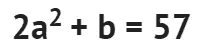
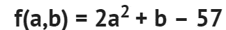
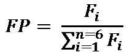
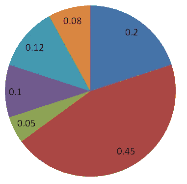
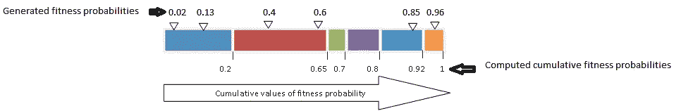
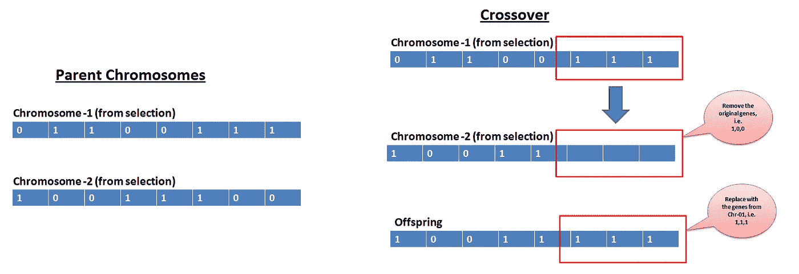
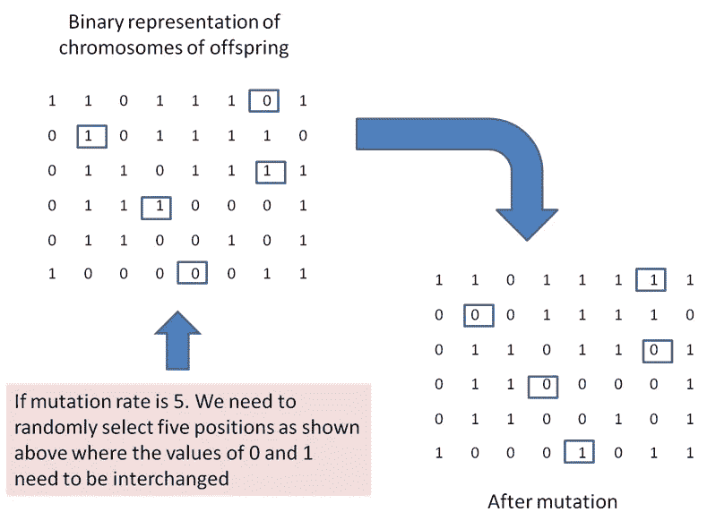

# 遗传算法——用例子逐步解释

> 原文：<https://towardsdatascience.com/genetic-algorithm-explained-step-by-step-65358abe2bf?source=collection_archive---------2----------------------->


Photo by [David Clode](https://unsplash.com/@davidclode?utm_source=unsplash&utm_medium=referral&utm_content=creditCopyText) on [Unsplash](https://unsplash.com/s/photos/dna?utm_source=unsplash&utm_medium=referral&utm_content=creditCopyText)

在本文中，我将通过解决一个非常简单的优化问题来解释遗传算法(GA)是如何工作的。这篇笔记的思想是通过一步一步地解决一个优化问题来理解算法的概念。

让我们使用满足下面表达式的 GA 来估计 a 和 b 的最佳值。



任何优化问题都始于一个目标函数。上面的等式可以写成:



据了解，该函数的值为 0。这个函数是我们的目标函数，目标是估计 a 和 b 的值，使得目标函数的值最小化到零。整个优化过程将在下面的四个主要步骤中进行解释，并用 R 进行编码，用于一次迭代(或生成)。

# 第一步

这个步骤从猜测 a 和 b 值的初始集合开始，这些集合可能包括也可能不包括最优值。这些数值组被称为“染色体”，这个步骤被称为**“初始化群体**”。这里人口意味着集合 a 和 b [a，b]。用随机均匀函数产生 a 和 b 的初始值，在这个优化问题中，在 1 到 10 之间产生 6 组 a 和 b 的值。生成初始染色体的 R 代码如下所示。

```
intial_popu <- NULL
x <- 1
repeat {
  crm <- runif(2,1,10)
  crm <- as.integer(crm)
  intial_popu <- rbind(intial_popu,crm)
  x = x+1
  if (x == 7){
    break
  }
}
rownames(intial_popu) <- c('Cromosome1','Cromosome2','Cromosome3','Cromosome4','Cromosome5','Cromosome6')print(intial_popu)
##            [,1] [,2]
## Cromosome1    5    9
## Cromosome2    9    7
## Cromosome3    9    9
## Cromosome4    3    3
## Cromosome5    7    8
## Cromosome6    8    4
```

# 第二步

在这个步骤中，计算每个染色体的目标函数值。目标函数的值也称为适应值。这一步非常重要，被称为“**选择”**，因为从群体中选择最适合的染色体用于后续操作。

基于适应值，选择具有产生低值适应函数值的可能性(因为我们的目标函数值需要为 0)的更合适的染色体，并允许其在后续世代中存活。一些染色体因不适合产生低适应值而被丢弃。

遗传算法中应用最广泛的选择方法之一是“轮盘赌法”。轮盘赌方法将在下面详细讨论。

## 轮盘赌方法

轮盘赌是一个饼图，其中每个饼图的值用适合度概率来表示。注意，适应值和适应概率是两个不同的术语。在这个优化问题中，产生低适应值的染色体具有高适应概率。每个染色体的适应度概率是根据适应度值计算的。具有高适应概率的染色体将有更高的机会被选择。以下表达式用于计算单个染色体的适合度概率。



其中， *FP* =第 *i* 条染色体的适应度概率， *Fi* =第 *i* 条染色体的适应度值



Roulette wheel showing fitness probabilities of chromosomes

在该图中，显示了使用上述表达式计算的六个不同染色体的适合度概率。所有适合度概率的总和必须总是等于 1。

为了选择最合适的染色体，生成了六个随机概率(即生成 0 到 1 之间的六个值)。例如，假设生成的六个概率是:

1 号染色体的 Pr 01 = 0.02
2 号染色体的 Pr 02 = 0.13
3 号染色体的 Pr 03 = 0.40
4 号染色体的 Pr 04 = 0.60
5 号染色体的 Pr 05 = 0.85
6 号染色体的 Pr 06 = 0.96

基于上述概率值在轮盘赌轮盘上的位置进行选择，以累积适合度概率的比例表示**。**选择上述值所在的段进行下一步。**请记住每个片段代表其对应的染色体。为了更好的理解，轮盘赌轮盘被拉直，并显示生成的概率值的位置。**



Positions of the random fitness probabilities on Roulette wheel

在此图中，染色体 1、2、5、6 是从 6 条染色体中选出的。染色体的顺序从左到右，蓝色是染色体 1，橙色是染色体 6。这些染色体将用于下一步的交叉操作。最后，新的染色体组是:

新染色体-1 =染色体-1
新染色体-2 =染色体-1
新染色体-3 =染色体-2
新染色体-4 =染色体-2
新染色体-5 =染色体-5
新染色体-6 =染色体-6

上面的新染色体是交叉操作的潜在亲本。据观察，染色体-3 和-4 已被丢弃不适合。

对于这个优化问题，下面给出一段 R 代码来选择最适合的染色体(新群体)。

```
## Function to compute fitness
fit <- function(A){
  a <- A[1]
  b <- A[2]
  return(((2*a^2 + b) - 57))
}
fitness <- apply(intial_popu, 1, FUN = 'fit')
fitting <- 1/(fitness)
probfitting <- fitting/sum(fitting)#generate random values of fitness prob. from 0 to 1
prob_gen <- runif(6,0,1)
newpopulation <- NULL
for(rr in prob_gen){
  sum <- 0
  for(prob in probfitting){
    sum <- sum + prob
    if(rr < sum){
      bin <- prob
      cromosomeS <- which(probfitting == bin, arr.ind = T)
      if(length(cromosomeS)>1){
        cromosomeS <- cromosomeS[1]
      } else{
        cromosomeS <- cromosomeS
      }
      cromname <- paste0('Cromosome',cromosomeS[1])
      newcromosome <- intial_popu[which(rownames(intial_popu) == cromname),]
      break
    }
  }
  newpopulation <- rbind(newpopulation,newcromosome,deparse.level = 2)
}
rownames(newpopulation) <- rownames(intial_popu) print(newpopulation)
##            [,1] [,2]
## Cromosome1    5    9
## Cromosome2    5    9
## Cromosome3    9    7
## Cromosome4    5    9
## Cromosome5    5    9
## Cromosome6    5    9
```

# 第三步

这一步叫做'**交叉'。**在这个步骤中，染色体以基因的形式表达。这可以通过将 a 和 b 的值转换成二进制字符串来实现，这意味着这些值需要用 0 或 1 来表示。例如，9 的二进制形式是[1001]。

## 什么是跨界？

交叉是由于两个亲代染色体之间的交配而发生的单个(0 或 1)或一组基因(例如[1，0，1])的变化。交叉操作后产生的新染色体称为‘后代’。下图解释了交叉过程。永远记住交叉发生在亲代染色体之间。



Crossover operation explained

在我们目前的优化问题中，从步骤 2 中获得的染色体是用二进制表示的。例如，如果 a = [1，0，0，1]和 b = [1，1，1，0]的二进制表示则染色体[a，b]表示为[1，0，0，1，1，1，1，0]。所有染色体都转换成二进制，写成 6 行 8 列的矩阵形式。

一个重要的参数在这里发挥作用，它被称为**交叉参数**。该参数值介于 0 和 1 之间。值为 0.5 表示，在六条染色体中，允许三条染色体交叉产生三个后代。

接下来是职位的选择。基因将在染色体的选定位置进行交换。例如，如果染色体是[1，1，0，1，1，0，0，1]，位置是 2(左起)。那么值 1 将被相同位置的交配染色体的值所取代。请记住，可以选择多个位置或区段进行交叉。

包含将整数转换成二进制字符串和交叉操作函数的 R 代码块如下所示。

```
##Function to convert integer to binary
binary <- function(x) {
  i <- 0
  string <- numeric(32)
  while(x > 0) {
    string[32 - i] <- x %% 2
    x <- x %/% 2
    i <- i + 1 
  }
  first <- match(1, string)
  string[first:32] 
}##create binary matrix of 8 cols and 6 rows
binary_popu <- matrix(NA,nrow = 6,ncol = 8)
for(i in 1:nrow(newpopulation)){
 x <- binary(newpopulation[i,1])
binary_popu[i,1:length(x)] <- x
y <- binary(newpopulation[i,2])
binary_popu[i,5:(4+length(y))] <- y
  }
rownames(binary_popu) <- rownames(newpopulation)
cross_paramter <- 0.5
i = 1
crom_cross <- NULL
while(length(crom_cross) < 3){
  cross.crossover.prob <- runif(6,0,1)
  crom_cross <- which(cross.crossover.prob < cross_paramter,arr.ind = T)
  i = i + 1
}
parents <- binary_popu[crom_cross,]
position = 2 ##crossover position
cross_parent <- parents
cross_parent[1,1:position] <- parents[2,1:position]
cross_parent[2,1:position] <- parents[3,1:position]
cross_parent[3,1:position] <- parents[1,1:position]

listofindex <- which(row.names(binary_popu) %in% row.names(cross_parent))
offSpring <- binary_popu
offSpring[listofindex,] <- cross_parentprint(offSpring) ##offspring after crossover
##            [,1] [,2] [,3] [,4] [,5] [,6] [,7] [,8]
## Cromosome1    1    0    1   NA    1    0    0    1
## Cromosome2    1    0    1   NA    1    0    0    1
## Cromosome3    1    0    0    1    1    1    1   NA
## Cromosome4    1    0    1   NA    1    0    0    1
## Cromosome5    1    0    1   NA    1    0    0    1
## Cromosome6    1    0    1   NA    1    0    0    1
```

# 步骤 4

这一步叫做“**突变**”。突变是改变基因值的过程，即用 0 代替 1，反之亦然。例如，如果后代染色体是[1，0，0，1]，突变后就变成了[1，1，0，1]。在这里，后代染色体的第二个值被决定突变。它已从 0 更改为 1。

现在的问题是，需要改变多少基因，在什么位置改变。**突变参数**决定了多少基因将被突变。如果突变参数为 0.1(通常保持低值)。那么允许总基因的 0.1 倍变异。在本优化问题中，基因的总数是 48(6×8)。所以允许 4.8 ~ 5 个基因突变。

关于突变位置，选择行和列的 5 个随机值。突变过程如下图所示。



Illustration of mutation process

变异后，二进制染色体被转换成整数形式，并计算适应值。如果任何一个染色体产生的目标适应值等于 0，我们就此打住。否则，通过将突变染色体等同于新群体，该过程将从步骤 2 重复到步骤 4。

这一步的 R 代码块如下所示。

```
mutation_paramter <- 0.09
no.of.mutations <- 4  ## Calculated as nrow(offSpring)*ncol(offSpring)*mutation_paramter

randrow <- round(runif(no.of.mutations,1,nrow(offSpring)))
rancol <-  round(runif(no.of.mutations,1,ncol(offSpring)))

## Now get the offsprings by mutating at above position
for(r in 1:length(randrow)){
  if(is.na(offSpring[randrow[r],rancol[r]])){
    offSpring[randrow[r],rancol[r]] <- NA
  }else{
    if(offSpring[randrow[r],rancol[r]] == 0){
      offSpring[randrow[r],rancol[r]] <- 1
    }else{
      offSpring[randrow[r],rancol[r]] <- 0
    }
  }
}

print(offSpring) ## Chromosomes after mutation
##            [,1] [,2] [,3] [,4] [,5] [,6] [,7] [,8]
## Cromosome1    1    0    1   NA    1    0    0    1
## Cromosome2    1    0    1   NA    1    0    0    1
## Cromosome3    1    0    0    1    1    1    0   NA
## Cromosome4    1    0    1   NA    0    0    0    1
## Cromosome5    1    0    1   NA    1    0    0    1
## Cromosome6    1    1    1   NA    1    0    0    1## Now convert binary back to integer
binary_decimal = function(base_number, base = 2) {
  split_base = strsplit(as.character(base_number), split = "")
  return(sapply(split_base, function(x) sum(as.numeric(x) * base^(rev(seq_along(x) - 1)))))
}
offSpring_inter <- matrix(NA,6,2)
for(i in 1:nrow(offSpring)){
  a <- offSpring[i,1:4]
  a <- na.omit(a)
  a <- as.numeric(paste(a, collapse = ""))
  a <- binary_decimal(a)
  b <- offSpring[i,5:8]
  b <- na.omit(b)
  b <- as.numeric(paste(b, collapse = ""))
  b <- binary_decimal(b)
  offSpring_inter[i,1] <- a
  offSpring_inter[i,2] <- b
}
rownames(offSpring_inter) <- rownames(offSpring)
## Chromosomes converted back to integer after end of 1st of generation
print(offSpring_inter)
##            [,1] [,2]
## Cromosome1    5    9
## Cromosome2    5    9
## Cromosome3    9    6
## Cromosome4    5    1
## Cromosome5    5    9
## Cromosome6    7    9
```

这个优化问题的最终结果如下所示，其中计算了 10 代的适应值。染色体 6 即[a，b] = [5，7]是产生适应值等于 0 的最优解

```
## Iteration:  1 
## Cromosome1 Cromosome2 Cromosome3 Cromosome4 Cromosome5 Cromosome6 
##        -30         76        -17        -18         -3        -45 
## Iteration:  2 
## Cromosome1 Cromosome2 Cromosome3 Cromosome4 Cromosome5 Cromosome6 
##         -3         45        -40        -42        -30         -3 
## Iteration:  3 
## Cromosome1 Cromosome2 Cromosome3 Cromosome4 Cromosome5 Cromosome6 
##         -3         -3         -3         -3         -7         -3 
## Iteration:  4 
## Cromosome1 Cromosome2 Cromosome3 Cromosome4 Cromosome5 Cromosome6 
##         -3         -2         -2         -3         -3         -3 
## Iteration:  6 
## Cromosome1 Cromosome2 Cromosome3 Cromosome4 Cromosome5 Cromosome6 
##         -3         -3         -3         -3         -2         -3 
## Iteration:  7 
## Cromosome1 Cromosome2 Cromosome3 Cromosome4 Cromosome5 Cromosome6 
##         -3        -20         -3         -3         -3         -2 
## Iteration:  8 
## Cromosome1 Cromosome2 Cromosome3 Cromosome4 Cromosome5 Cromosome6 
##         -3         -2         -3         -2         -2         -2 
## Iteration:  9 
## Cromosome1 Cromosome2 Cromosome3 Cromosome4 Cromosome5 Cromosome6 
##         46         -2         -2        -20         -2         -2 
## Iteration:  10 
## Cromosome1 Cromosome2 Cromosome3 Cromosome4 Cromosome5 Cromosome6 
##         -3        -19         -1         47         -1          0## The final set of Chromosomes
##            [,1] [,2]
## Cromosome1    5    4
## Cromosome2    4    6
## Cromosome3    5    6
## Cromosome4    7    6
## Cromosome5    5    6
## Cromosome6    5    7
```

## 参考

使用进化算法的多目标优化(2005)