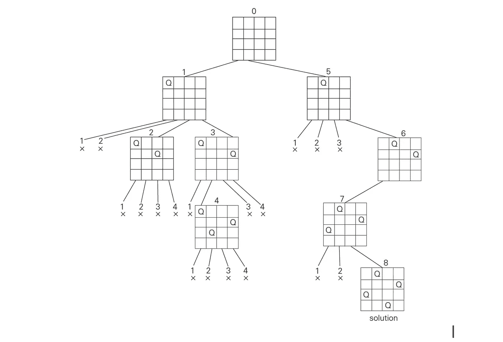

# 遗传算法与回溯:N 皇后问题

> 原文：<https://towardsdatascience.com/genetic-algorithm-vs-backtracking-n-queen-problem-cdf38e15d73f?source=collection_archive---------13----------------------->

## 回溯求解器和遗传算法性能的比较。

几个月前，我熟悉了遗传算法。我开始阅读它，我对它感到非常惊讶。遗传算法解决的最著名的问题之一是 [n 皇后问题](https://en.wikipedia.org/wiki/Eight_queens_puzzle)。我使用 python 3 实现了我的遗传解算器，加上著名的老式回溯解算器。我实现了一个象棋类(回溯求解器)和一个 GeneticChess 类(遗传求解器)。这些类都有一个二维列表的属性板。列表的每一行都用 N 个零填充。

# 回溯求解器

如你所知，回溯求解器是一个简单的函数，它通过在棋盘的第一行放置一个皇后来开始解决问题，并试图将第二个皇后放在第二行，这样就不会与第一个皇后冲突。它继续一行一行地把皇后放在棋盘上，直到把最后一个放在第 n 行。如果它不能填充一行中的任何瓷砖，它会返回并改变前一行皇后的位置。

下面的树描述了回溯算法如何解决 4 皇后问题。



4-queen backtracking solution

回溯求解器将为我们找到解决方案。但是随着 N 的增加，它变得更慢。如果 N=25，则需要 322.89 秒才能找到答案，而当 N=26 时，则需要永远的时间！因此，需要一种能更快找到解决方案的方法。这是回溯法:

```
**def solveBackTracking(self,col):****if col >= self.size:
    self.solutions.append(self.board)
    return True****for i in range(self.size):
    if self.isSafe(i,col):
    self.board[i][col] = 1
        if self.solveBackTracking(col+1) == True:
            return True** **self.board[i][col] = 0****return False**
```

# 遗传算法求解器

一种方法是使用遗传算法来解决这个问题。那么遗传算法是如何工作的呢？

基本想法来自于自然界发生的事情。在一个环境中，存在一些染色体(或一族)。这些染色体结合在一起，在环境中创造了一些孩子。新的染色体是其父母 DNA 的结合，并且它自身也发生了变异。当然，环境有人口限制。因为每条染色体都是独一无二的，所以可以理解的是，有些染色体比其他的强。根据自然法则，强壮的生物会存活到下一代，而弱小的会死去。因此，我们期望每一代都由更强壮的染色体组成。这就是遗传算法的工作原理。

应采取以下步骤来实现遗传算法:

1.  创建染色体表示
2.  创建一个效用函数
3.  创建一个交叉函数
4.  创建一个变异函数
5.  创造环境

现在让我们进入这些步骤来创建我们的遗传算法。

## 第一步:染色体

基本上，染色体(也称为 gen)是一个解决方案的表示，不管它是否有效。我们如何表示一个 n 皇后解？一种方法是创建一个用 0 填充的二维列表，然后用 N 个代表女王位置的 1 填充它。这可能是第一个想到的东西，但实际上并不好。一个更好更简单的表示是染色体是一个长度为 n 的列表，每个索引指定了棋盘的一列。每个索引的值都在 0 到 N-1 之间，表示一列中皇后的行。


## 第二步:效用函数

效用函数是决定一个解决方案有多好的函数。所以这个函数把 gen 作为它的参数，并返回一个数字，这个数字就是效用。在这种情况下，我们的效用函数将基于皇后位置来评估冲突的数量。它是每个皇后左侧冲突数量的总和。因此，如果效用函数返回 0，我们知道板上没有冲突，因此，我们有我们的解决方案。

```
**def utilityFunction(self,gen):** **hits = 0
    board = self.createBoard(self.size)
    self.setBoard(board,gen)
    col = 0** **for dna in gen:
        try:
            for i in range(col-1,-1,-1):
                if board[dna][i] == 1:
                    hits+=1

        for i,j in zip(range(dna-1,-1,-1),range(col-1,-1,-1)):
            if board[i][j] == 1:
                hits+=1
        for i,j in zip(range(dna+1,self.size,1),range(col-1,-1,-1)):
            if board[i][j] == 1:
                hits+=1
        col+=1
     return hits**
```

## 第三步:交叉功能

我说过，孩子的染色体是父母 DNA 的组合。这个过程叫做**交叉**。这个函数是使遗传算法比回溯求解器更快的关键函数。存在许多交叉函数，你甚至可以实现自己的函数。该函数以两条染色体作为参数。这些是父母，他们将创造新的孩子染色体。每当一个列表中的两个元素之差小于 2 时，我决定将第一个列表中的元素与第二个列表中的元素交换。

```
**def crossOverGens(self,firstGen,secondGen):

    for i in range(1,len(firstGen)):
        if abs(firstGen[i-1] — firstGen[i])<2:
            firstGen[i],secondGen[i] = secondGen[i],firstGen[i]
        if abs(secondGen[i-1] — secondGen[i])<2:
            firstGen[i],secondGen[i] = secondGen[i],firstGen[i]**
```

## 第四步:变异函数

在交叉过程之后，子对象被创建。现在，孩子试图以某种方式改变自己，以降低效用值。交叉后，gen 中的一些元素可能是多余的(例如[1，1，2，3])。突变功能将删除冗余元素，并用 gen 中未使用的元素填充它们。另外，将从染色体的左侧和右侧选择两个随机元素，并将它们交换。这种方法可能会降低效用。

```
**def MutantGen(self,gen):** **bound = self.size//2
    from random import randint as rand
    leftSideIndex = rand(0,bound)
    RightSideIndex = rand(bound+1,self.size-1)
    newGen = []
    for dna in gen:
        if dna not in newGen:
            newGen.append(dna)
    for i in range(self.size):
        if i not in newGen:
            newGen.append(i)** **gen = newGen
     gen[leftSideIndex],gen[RightSideIndex] =      gen[RightSideIndex],gen[leftSideIndex]
     return gen**
```

## 5 .环境

现在我们有了我们的功能，让我们创造我们的环境和它无情的规则。首先我们初始化第一代染色体，它们只是一些随机的染色体。之后，检查所有染色体，以找出解决方案是否已经存在。如果它不存在，染色体开始创造孩子。因为群体超过了它的极限，所以计算每个染色体的效用。具有较高效用(较高冲突)的那些将从环境中移除，而具有较低效用的那些将被选择。现在第二代产生了。这个循环继续创造下一代，直到找到解决方案。

```
**def solveGA(self):
    self.initializeFirstGenereation()
    for gen in self.env:
        if self.isGoalGen(gen):
            return gen
    while True:
        self.crossOverAndMutant()
        self.env = self.makeSelection()
        if self.goalIndex >= 0 :
            try:
                return self.goal
            except IndexError:
                 print(self.goalIndex)
        else:
            continue**
```

# 结果

正如我提到的，回溯求解器最多只能解决 N=25 的问题，这需要大约 322.89 秒才能找到答案。GA 求解器仅用 1.83 秒就找到了 N=25 的解。我实现的交叉和变异函数不是最好的算法，但我还是很快得到了结果。我测试了从 N=4 到 N=66 的 GA 解算器，对于 N=66，该算法求解该问题的最大时间为 125.93 秒。我甚至试过 N=80，在 122.82 秒内得到解！这太神奇了！该算法基于随机数。它可能看起来比回溯求解器更糟糕，但结果却非常有趣。我强烈建议你自己实现 B-Solver 和 GA-Solver，看看遗传算法的魔力。你可以在我的 [Github 链接](https://github.com/hiradbaba/GANQ)找到我的代码。

希望这篇文章对你有帮助！