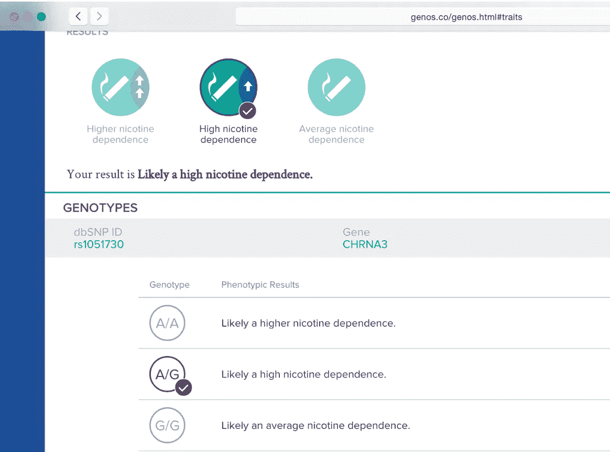
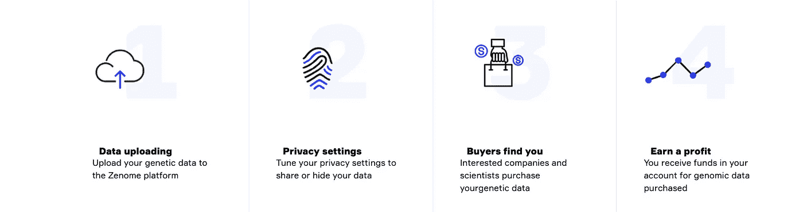
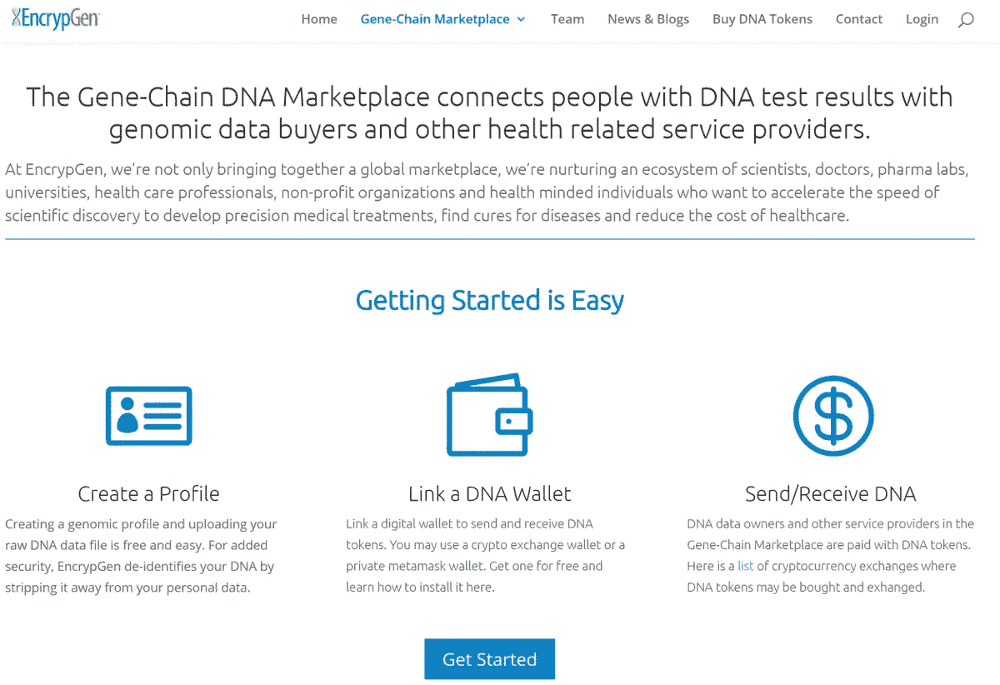
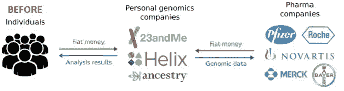
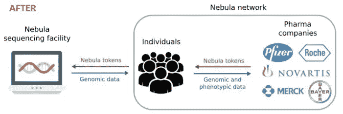

# 基因组数据、区块链和货币

> 原文：<https://towardsdatascience.com/genomic-data-blockchain-and-money-a6e5597ebe3e?source=collection_archive---------22----------------------->

## 基因组数据市场即将出现。买卖基因组数据将比以往更加容易

基因检测和测序一年比一年便宜。半导体革命加上大量的资金已经导致了更快的 DNA 测试。

Photo by [William Moreland](https://unsplash.com/@relentlessjpg?utm_source=medium&utm_medium=referral) on [Unsplash](https://unsplash.com?utm_source=medium&utm_medium=referral)

很大程度上，由于 DNA 测试和测序成本的降低，接受测试越来越受欢迎。这一趋势在对自己祖先感兴趣的消费者、对研究感兴趣的科学界和对金钱感兴趣的制药行业中同样流行。后者正在花费数亿美元购买基因组数据，以了解各种基因对不同药物疗法的反应，这意味着你的基因组数据可能会被出价最高的人收购。

## 金钱游戏

如果数据是新油，基因数据就是这种油的无铅过滤高辛烷值版本。像 23andMe 和杰诺斯这样的公司向做基因测试的顾客收费。一旦他们有了顾客的基因数据，他们就把它卖给制药和研究公司。拥有其数据的人[每次请求](https://www.buzzfeednews.com/article/stephaniemlee/these-startups-will-pay-you-for-your-dna)可以收到 50-200 美元。

 [## 23andMe 从葛兰素史克获得 3 亿美元用于开发新药

### 总部位于伦敦的制药巨头葛兰素史克公司正与旧金山遗传学初创公司 23andMe 合作，开发…

www.forbes.com](https://www.forbes.com/sites/matthewherper/2018/07/25/23andme-gets-300-million-boost-from-glaxo-to-develop-new-drugs/) 

所有这些初创公司都因其潜力获得了大量资金。人类有 99.5%的相同 DNA。这意味着只有 0.5%的基因组定义了人类之间的独特差异。这组差异被理解为遗传变异，并通过你基因中的变异数量来量化。根据社区调节的参考基因组测量变异。

虽然一些消费者可能选择简单地将他们的匿名 DNA 数据捐赠给科学，以帮助推进医学研究，但其他人可能希望自己赚钱，而不是让检测公司利用消费者提供的数据..瑞士制药巨头罗氏公司的美国分公司提出支付高达 6000 万美元，以获取 23andMe 数据库中约 3000 名帕金森病患者的数据。这笔交易为每套数据设定了 2 万美元的价值。

 [## 23andMe 以 6000 万美元的价格向基因泰克出售帕金森病患者的 DNA 数据

### 总部位于加州的个人基因公司 23andMe 正在向生物技术公司 Genentech 出售其客户的数据

www.techtimes.com](http://www.techtimes.com/articles/25237/20150108/23andme-to-sell-dna-data-of-parkinsons-customers-to-genentech-for-60-million.htm) 

## 区块链和交易

虽然一些公司如 23andme 和 genos 提供基因检测以及出售数据的资金，但某些其他公司只是专注于创建这些数据的交易网络。

一家名为 Zenome 的公司计划为网络参与者提供的基因组数据建立一个分散的存储系统，并在内部加密货币的帮助下提供财政支持。他们的愿景是在网络内开始基因组和个人数据的自由交换。将有可能找到一个人，他具有特定的(你感兴趣的)眼睛颜色、年龄、体重、国籍和对他的基因组信息的访问权(对基因组的非敏感部分)。

[https://zenome.io/about/](https://zenome.io/about/)

另一家类似的初创公司 EncrypGen 已经开始交易其 DNA 令牌。EncrypGen 的基因链是为两类人服务的

1.  那些已经做了或想要做基因测试，但希望更好地控制自己的数据以及通过匿名向科学家出售数据获利的可能性的人，以及
2.  研究人员希望更好地访问匿名数据，并能够向直接使用其数据的人支付费用。

EncrypGen

有了所有这些选择，又有一只独角兽引领着这个领域。在从 Khosla Ventures 牵头的 A 轮融资中筹集了 430 万美元后，Nebula Genomics 不再需要个人基因组公司作为数据所有者和数据购买者之间的中间人。相反，数据所有者可以从星云测序设施或其他来源获得他们的个人基因组数据，加入星云区块链的点对点网络，并直接与数据购买者联系。这种模式降低了有效的测序成本，并增强了对个人基因组数据的保护。

Left — The popular Model | Right — The Nebula

更有趣的是，他们与 Veritas Genetics 合作，Veritas Genetics 是一家获得 5100 万美元资金的初创公司，艾莉·莉莉等也是投资者。相比之下，EncrypGen 筹集了大约 100 万美元，很容易看出 Nebula 有更大的机会将“基因组区块链网络”变成现实。

无论基因组测序的状况如何，它的市场已经越来越受欢迎。看看这些市场是反乌托邦还是最终造福人类，将会很有趣。