# 轻轻潜入卷积神经网络背后的数学

> 原文：<https://towardsdatascience.com/gentle-dive-into-math-behind-convolutional-neural-networks-79a07dd44cf9?source=collection_archive---------0----------------------->

## 神经网络之谜第五部分

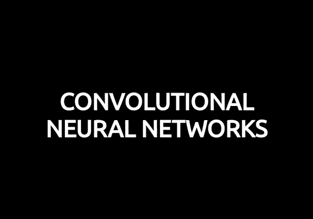

自动驾驶、医疗保健或零售只是计算机视觉让我们实现一些直到最近还被认为是不可能的事情的一些领域。今天，无人驾驶汽车或自动化杂货店的梦想听起来不再那么超前了。事实上，我们每天都在使用计算机视觉——当我们用面部解锁手机或在社交媒体上发布照片之前自动修饰照片时。卷积神经网络可能是这一巨大成功背后最关键的组成部分。这一次，我们将扩大我们对神经网络如何与特定于 CNN 的想法一起工作的理解。请注意，这篇文章将包括相当复杂的数学方程，但是**如果你对线性代数和微分不熟悉，不要气馁**。我的目标不是让你记住那些公式，而是给你提供下面正在发生的事情的直觉。

**附注:**我第一次决定用一个音频版本来丰富我的艺术作品，我诚挚地邀请你来听听。你会在上面找到 Soundcloud 的链接。在这篇文章中，我主要关注 CNN 的典型问题。如果你正在寻找更多关于深度神经网络的一般信息，我鼓励你阅读我在本系列[的其他帖子。像往常一样，带有可视化和注释的完整源代码可以在我的](/https-medium-com-piotr-skalski92-deep-dive-into-deep-networks-math-17660bc376ba) [GitHub](https://github.com/SkalskiP/ILearnDeepLearning.py) 上找到。开始吧！

## 介绍

过去我们了解了所谓的密集连接神经网络。这些网络的神经元被分成若干组，形成连续的层。每个这样的单元连接到相邻层的每个单个神经元。下图显示了这种架构的一个示例。

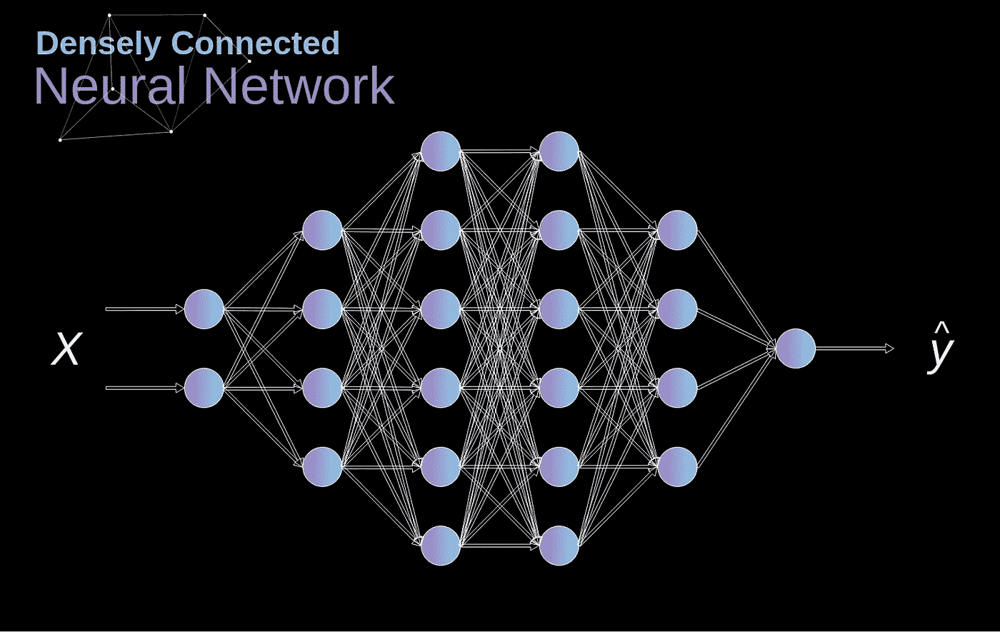

**Figure 1.** Densely connected neural network architecture

当我们基于一组有限的已定义特征来解决分类问题时，这种方法非常有效——例如，我们根据足球运动员在比赛中记录的统计数据来预测他的位置。然而，当处理照片时，情况变得更加复杂。当然，我们可以将每个像素的亮度视为一个独立的特征，并将其作为输入传递给我们的密集网络。不幸的是，为了让它适用于典型的智能手机照片，我们的网络必须包含数千万甚至数亿个神经元。另一方面，我们可以缩小照片，但在这个过程中我们会丢失有价值的信息。我们马上发现传统策略对我们毫无用处——我们需要一种新的巧妙方法来使用尽可能多的数据，同时减少必要的计算和参数数量。这就是 CNN 发挥作用的时候。

## 数字照片数据结构

让我们先花一分钟解释一下数码图像是如何存储的。你们大多数人可能意识到它们实际上是巨大的数字矩阵。每个这样的数字对应于单个像素的亮度。在 RGB 模型中，彩色图像实际上由三个这样的矩阵组成，对应于三个颜色通道——红色、绿色和蓝色。在黑白图像中，我们只需要一个矩阵。每个矩阵都存储从 0 到 255 的值。这个范围是存储关于图像的信息的效率(256 个值完全适合 1 个字节)和人眼的灵敏度(我们区分同一颜色的有限数量的阴影)之间的折衷。

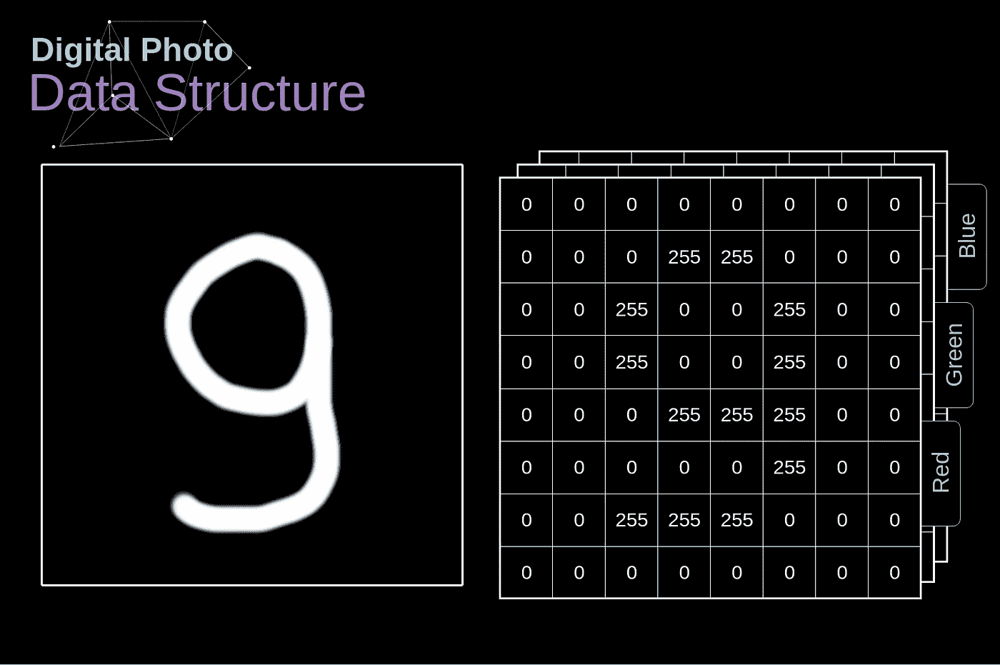

**Figure 2.** Data structure behind digital images

## 盘旋

K ernel 卷积不仅用于 CNN，也是许多其他计算机视觉算法的关键元素。**这是一个过程，我们采用一个小的数字矩阵(称为内核或过滤器)，我们把它传递到我们的图像，并根据过滤器的值进行转换。**根据以下公式计算后续特征图值，其中输入图像用 *f* 表示，我们的核用 *h* 表示。结果矩阵的行和列的索引分别用 *m* 和 *n* 标记。

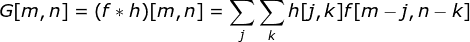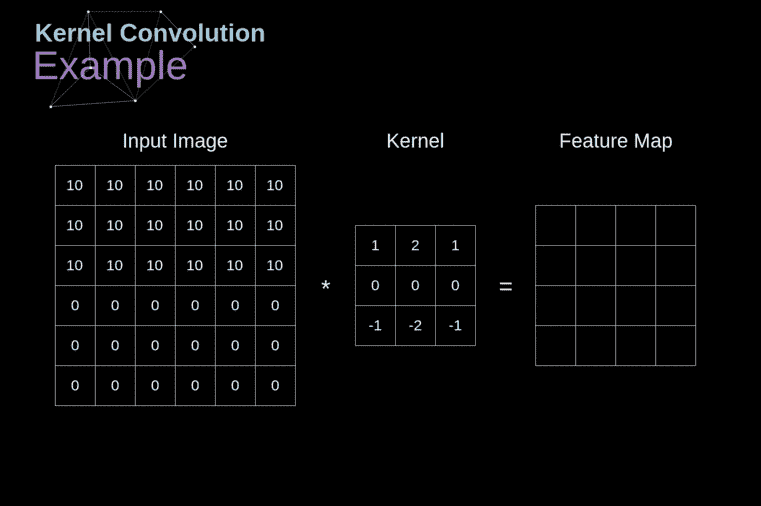

**Figure 3.** Kernel convolution example

在将我们的过滤器放置在一个选定的像素上之后，我们从内核中取出每个值，并将它们与图像中相应的值成对相乘。最后，我们总结所有内容，并将结果放在输出特征图的正确位置。上面我们可以看到这样的操作在微观尺度下是什么样子，但更有趣的是，我们可以通过在完整的图像上执行它来实现它。图 4 显示了几种不同滤波器的卷积结果。

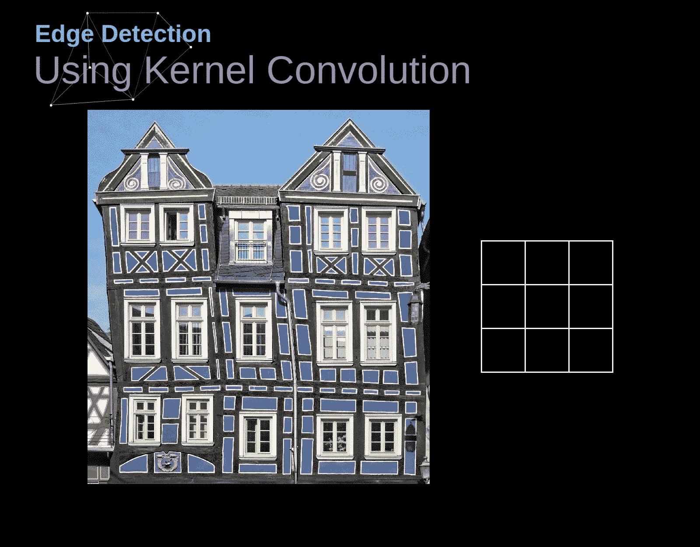

**Figure 4.** Finding edges with kernel convolution [[Original Image](https://www.maxpixel.net/Idstein-Historic-Center-Truss-Facade-Germany-3748512)]

## 有效且相同的卷积

正如我们在图 3 中看到的，当我们用 3x3 内核对 6x6 图像执行卷积时，我们得到了 4x4 特征图。这是因为只有 16 个独特的位置，我们可以在这张图片中放置我们的过滤器。**由于我们每次进行卷积时，图像都会缩小，所以在图像完全消失之前，我们只能进行有限次数的卷积。此外，如果我们观察我们的内核如何在图像中移动，我们会发现位于外围的像素的影响远小于图像中心的像素。**这样我们会丢失图片中包含的一些信息。下面你可以看到像素的位置如何改变它对特征图的影响。

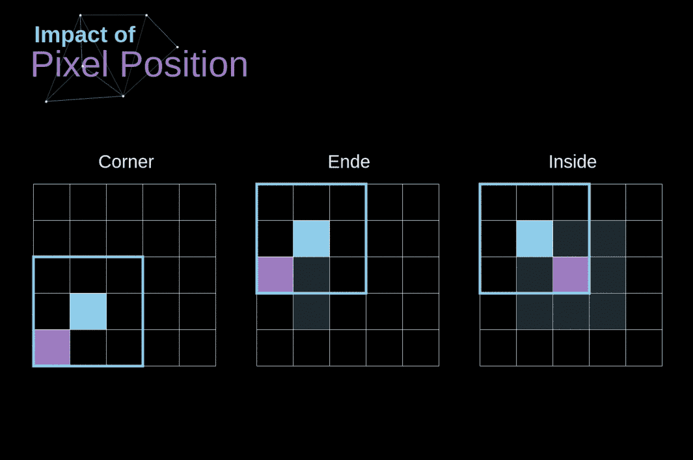

**Figure 5.** Impact of pixel position

为了解决这两个问题，我们可以用额外的边界填充我们的图像。例如，如果我们使用 1px 填充，我们将照片的大小增加到 8x8，这样，使用 3x3 滤镜的卷积输出将是 6x6。通常在实践中，我们用零填充额外的填充。根据我们是否使用填充，我们处理两种类型的卷积——有效卷积和相同卷积。命名是相当不幸的，所以为了清楚起见: **Valid —意味着我们使用原始图像，Same —我们使用它周围的边框**，这样输入和输出的图像大小相同。在第二种情况下，填充宽度应满足以下等式，其中 *p* 是填充，而 *f* 是滤波器尺寸(通常为奇数)。

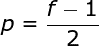

## 步进卷积

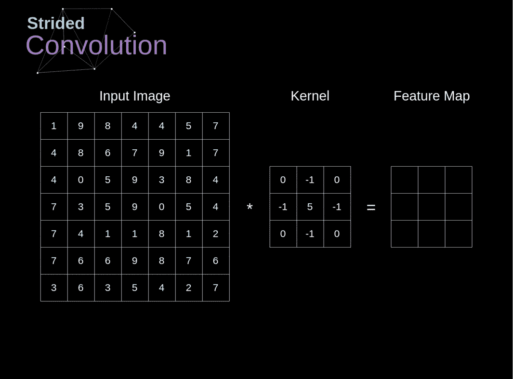

**Figure 6.** Example of strided convolution

在前面的例子中，我们总是将内核移动一个像素。然而，步长也可以被视为卷积层超参数之一。在图 6 中，我们可以看到如果使用更大的步幅，卷积会是什么样子。当设计我们的 CNN 架构时，如果我们希望感受野重叠更少，或者如果我们希望我们的特征图的空间维度更小，我们可以决定增加步长。考虑到填充和步幅，输出矩阵的维数可以使用下面的公式计算。

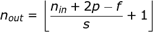

## 向第三维度的过渡

体积上的变换是一个非常重要的概念，它不仅允许我们处理彩色图像，更重要的是允许我们在一个图层中应用多个滤镜。**第一个重要的规则是，滤镜和你要应用它的图像，必须有相同数量的通道。**基本上，我们的操作与图 3 中的例子非常相似，不过这次我们将三维空间中的值对相乘。**如果我们想在同一个图像上使用多个过滤器，我们分别对每个过滤器进行卷积，将结果一个叠在另一个上面，然后将它们组合成一个整体。**接收到的张量(我们可以称之为 3D 矩阵)的维数满足以下等式，其中: *n* —图像大小， *f* —滤波器大小， *nc* —图像中的通道数，*p*—使用的填充， *s* —使用的步距， *nf* —滤波器数。

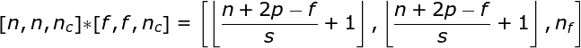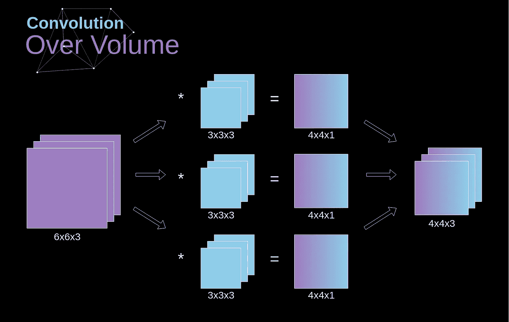

**Figure 7.** Convolution over volume

## 卷积层

使用我们今天所学的一切，建立一个单一层次的 CNN 的时候终于到了。我们的方法与我们用于密集连接神经网络的方法几乎相同，唯一的区别是，这次我们将使用卷积，而不是使用简单的矩阵乘法。正向传播包括两个步骤。第一个是计算中间值 **Z** ，它是将前一层的输入数据与 **W** 张量(包含滤波器)卷积，然后加上偏置 **b** 得到的结果。第二种是将非线性激活函数应用于我们的中间值(我们的激活用 g 表示)。矩阵方程的爱好者会在下面找到合适的数学公式。如果你对正在讨论的任何操作不清楚，我强烈推荐我的[上一篇文章](/https-medium-com-piotr-skalski92-deep-dive-into-deep-networks-math-17660bc376ba)，其中我详细讨论了密集连接的神经网络内部正在发生的事情。顺便说一下，在下面的插图中你可以看到一个小的可视化，描述了方程中使用的张量的维数。

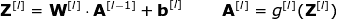

**Figure 8.** Tensors dimensions

## 连接切割和参数共享

在文章的开头，我提到密集连接的神经网络不擅长处理图像，因为需要学习大量的参数。现在我们已经了解了卷积是怎么一回事，让我们来考虑它如何让我们优化计算。在下图中，2D 卷积以略微不同的方式进行了可视化-用数字 1-9 标记的神经元形成接收后续像素亮度的输入层，而单位 A-D 表示计算的要素地图元素。最后但同样重要的是，I-IV 是来自内核的后续值——这些必须学习。

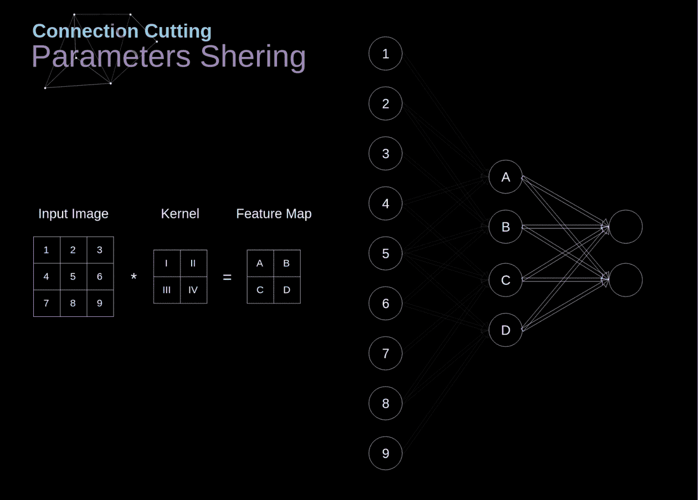

**Figure 9.** Connections cutting and parameters sharing

现在，让我们来关注卷积层的两个非常重要的属性。**首先，你可以看到，并不是所有连续两层中的神经元都是相互连接的。**例如，单元 1 只影响 a 的值**其次，我们看到一些神经元共享相同的权重。**这两个特性意味着我们需要学习的参数要少得多。顺便说一下，值得注意的是，来自过滤器的单个值影响特征图的每个元素-这在反向传播的上下文中是至关重要的。

## 卷积层反向传播

任何试图从头开始编写自己的神经网络的人都知道，前向传播不到成功的一半。真正的乐趣是在你想回去的时候开始的。如今，我们不需要为反向传播而烦恼——深度学习框架为我们做了这件事，但我觉得了解引擎盖下发生的事情是值得的。**就像在密集连接的神经网络中一样，我们的目标是计算导数，然后使用它们在一个称为梯度下降的过程中更新我们的参数值。**

在我们的计算中，我们将使用链式法则——我在以前的文章中提到过。**我们希望评估参数变化对最终特征图的影响，以及随后对最终结果的影响。**在我们开始讨论细节之前，让我们就我们将使用的数学符号达成一致——为了让我的生活更轻松，我将放弃偏导数的完整符号，而采用下面可见的简化符号。但是请记住，当我使用这个符号时，我总是指成本函数的偏导数。

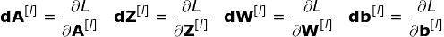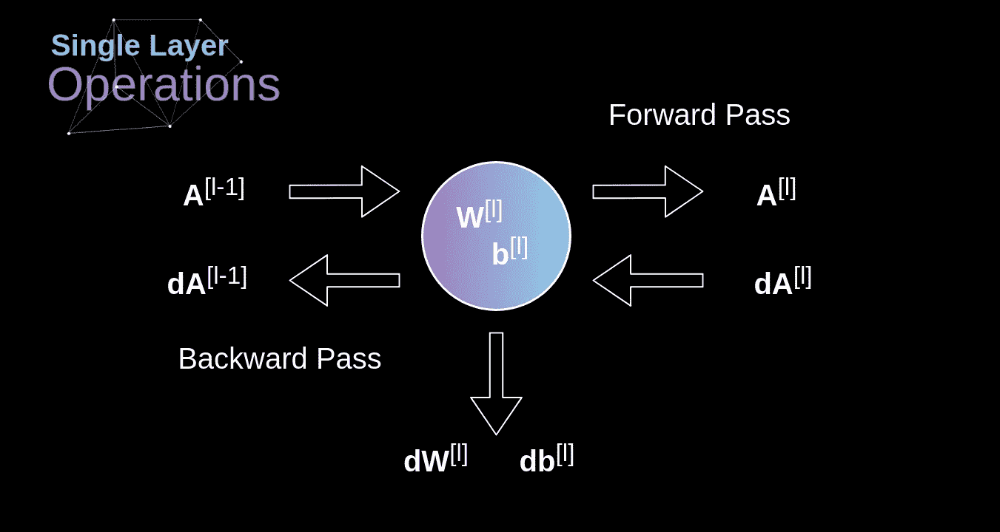

**Figure 10.** Input and output data for a single convolution layer in forward and backward propagation

我们的任务是计算与当前层参数相关联的导数 **dW[l]** 和 **db[l] -** ，以及将传递给上一层的 **dA[ l -1]** - 的值。如图 10 所示，我们接收 **dA[l]** 作为输入。当然，张量 **dW** 和 **W** 、 **db** 和 **b** 以及 **dA** 和 **A** 的尺寸分别是相同的。第一步是通过将我们的激活函数的导数应用于我们的输入张量来获得中间值 **dZ[l]** 。根据链式法则，这个操作的结果将在后面使用。

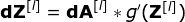

现在，我们需要处理卷积本身的反向传播，为了实现这一目标，我们将利用一种称为全卷积的矩阵运算，如下图所示。注意，在这个过程中，我们使用了内核，我们之前将它旋转了 180 度。这个运算可以用下面的公式来描述，其中滤波器用 **W** 来表示， **dZ[m，n]** 是一个标量，属于从前一层得到的偏导数。

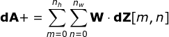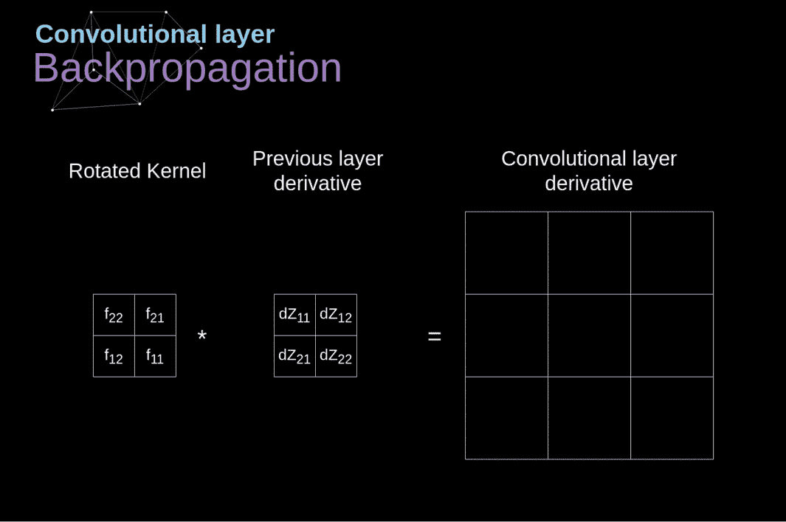

**Figure 11.** Full convolution

## 池层

除了卷积层，CNN 经常使用所谓的池层。它们主要用于减少张量的大小和加速计算。这一层很简单——我们需要把我们的图像分成不同的区域，然后对每一部分执行一些操作。例如，对于 Max Pool 层，我们从每个区域中选择一个最大值，并将其放在输出中的相应位置。与卷积层的情况一样，我们有两个可用的超参数——过滤器大小和步幅。最后但同样重要的是，如果您正在为多通道图像执行池化，则每个通道的池化应该单独完成。

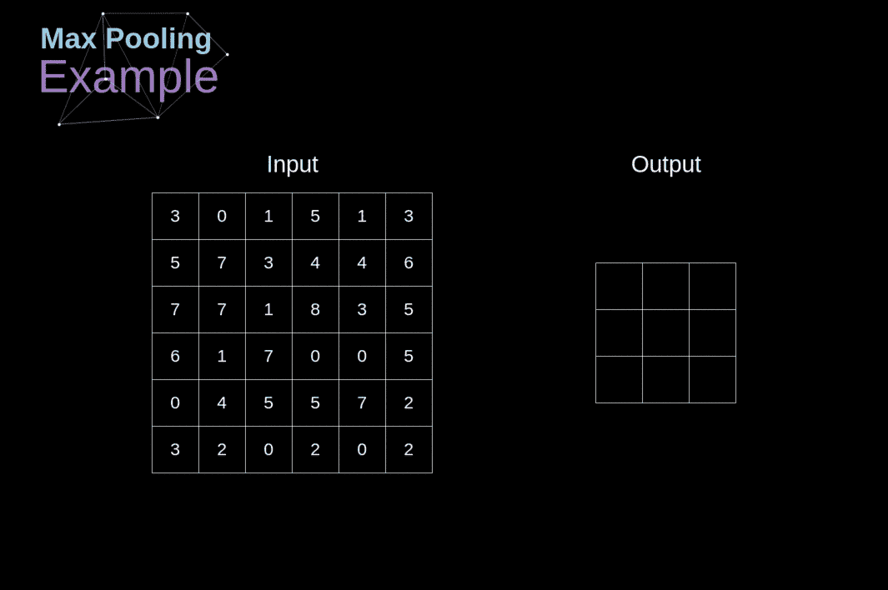

**Figure 12.** Max pooling example

## 池层反向传播

在这篇文章中，我们将只讨论最大池反向传播，但是我们将学习的规则(稍作调整)适用于所有类型的池层。由于在这种类型的层中，我们没有任何必须更新的参数，我们的任务只是适当地分发 gradiwents。正如我们所记得的，在最大池的前向传播中，我们从每个区域中选择最大值，并将它们传递到下一层。因此，很明显，在反向传播期间，梯度不应该影响没有包括在正向传递中的矩阵元素。在实践中，这是通过创建一个记住第一阶段中使用的值的位置的掩码来实现的，我们稍后可以利用它来转移梯度。

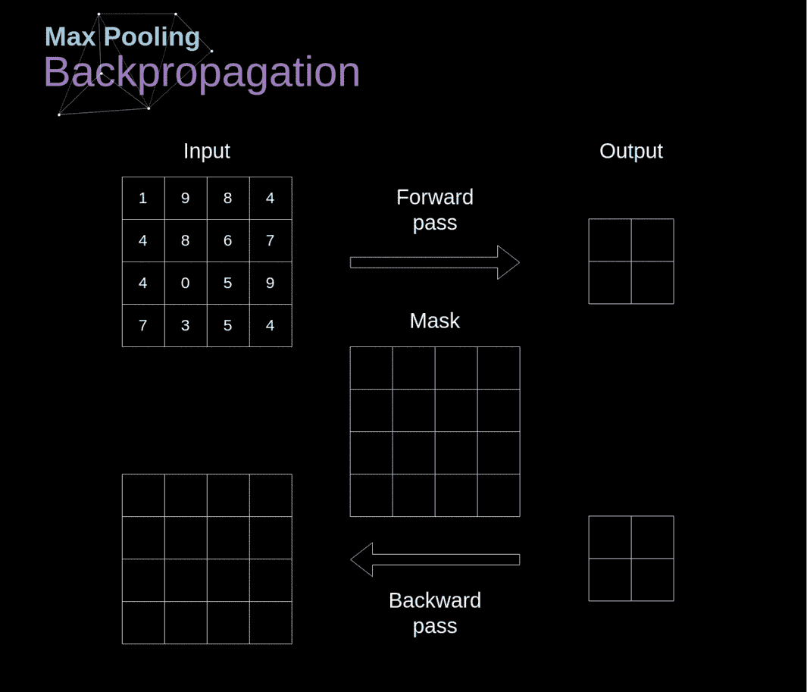

**Figure 13.** Max pooling backward pass

## 结论

如果你设法来到这里，祝贺你。非常感谢你花时间阅读这篇文章。如果你喜欢这篇文章，考虑把它分享给你的朋友，或者两个或五个朋友。如果你注意到思维方式、公式、动画或代码有任何错误，请告诉我。

这篇文章是“神经网络的奥秘”系列的另一部分，如果你还没有机会，请阅读[其他文章](/preventing-deep-neural-network-from-overfitting-953458db800a)。此外，如果你喜欢我目前的工作，请在 [Twitter](https://twitter.com/PiotrSkalski92) 和 [Medium](https://medium.com/@piotr.skalski92) 上关注我，并在 [GitHub](https://github.com/SkalskiP) 和 [Kaggle](https://www.kaggle.com/skalskip) 上查看我正在进行的其他项目。保持好奇！

