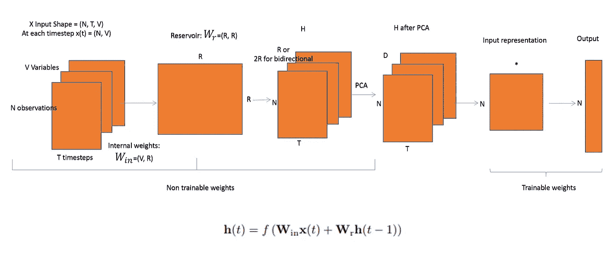

# 回声状态网络简介

> 原文：<https://towardsdatascience.com/gentle-introduction-to-echo-state-networks-af99e5373c68?source=collection_archive---------8----------------------->

## 也是油藏计算的介绍

本帖将回答以下问题:

1.  什么是回声状态网络？
2.  为什么以及何时应该使用回应状态网络？
3.  python 中的简单实现示例

下图是对论文[多变量时间序列](https://arxiv.org/pdf/1803.07870.pdf)表示和分类的储层计算方法的简化，但它很好地抓住了 ESNs 的要点。每个组件将在下面的章节中详细介绍。

Echo State Networks are recurrent networks. **f** is a nonlinear function (such as tanh) which makes the current state dependent on the previous state and the current input

# 什么是回声状态网络？

回声状态网络是一种递归神经网络，是*油藏计算*框架的一部分，具有以下特殊性:

*   输入-隐藏层('水库'): *Win* 之间的权重以及'水库': *Wr* 之间的权重**是随机分配的**和**是不可训练的**
*   输出神经元的权重(“读出”层)是可训练的(**,可以学习，因此网络可以复制特定的时间模式**
*   隐藏层(或“储层”)与输入的连接非常稀疏(通常为< 10% connectivity)
*   the reservoir architecture creates a recurrent **非线性**嵌入(下图中的 H )),然后可以连接到所需的输出，这些最终权重是可训练的
*   可以将嵌入连接到不同的预测模型(用于分类问题的可训练神经网络或岭回归器/SVM)

## 油藏计算

储层计算是神经网络的扩展，其中输入信号连接到固定(不可训练)和随机动态系统(储层)，从而创建更高维度的表示(嵌入)。这种嵌入然后通过可训练单元连接到期望的输出。

储层计算的非递归等价物是[极限学习机](https://en.wikipedia.org/wiki/Extreme_learning_machine)，仅由仅具有可训练读出层的前馈网络组成。

## 工作流程

对于形状为 N，T，V 的输入，其中 N 是观测值的数量，T 是时间步长的数量，V 是变量的数量，我们将:

*   选择储层 R 的大小和控制连接稀疏性水平的其他参数，如果我们想要对泄漏建模，维数减少后的理想组件数量等
*   通过从随机二项式分布中取样，生成(V，R)个输入权重 *Win*
*   通过从具有给定密度的均匀分布中取样，生成(R，R)储层权重 *Wr* ，该参数设置了稀疏程度
*   将高维状态表示 H 计算为当前时间步长(N，V)的输入乘以内部权重加上先前状态再乘以储层矩阵(R，R)的非线性函数(通常为 tanh)
*   可选地，我们可以运行降维算法，例如 PCA 到 D 分量，这将 H 带到(N，T，D)
*   通过使用例如整个储层和训练回归器来映射状态 t 到 t+1，创建输入表示:一个表示可以是所有计算的斜率和截距的矩阵。另一种选择是使用 H 的平均值或最后值
*   通过使用可训练的 NN 结构或通过使用其他类型的预测器，将这种嵌入连接到期望的输出。上述论文建议使用岭回归

## 为什么以及何时应该使用回声状态网络？

*   传统的神经网络结构受到消失/爆炸梯度问题的困扰，因此，隐藏层中的参数要么变化不大，要么导致数值不稳定和混沌行为。回声状态网络没有这个问题
*   传统的神经网络结构计算昂贵，回声状态网络非常快，因为在储层上没有反向传播相位
*   传统的神经网络会被[分叉](http://www.scholarpedia.org/article/Bifurcation)破坏
*   ESN 非常适合处理混沌时间序列

## 履行

该论文提供了一个简洁的、有良好文档记录的流水线实现，提出了每一步的各种方法(权重初始化方案、维度减少、输入表示、读出层)。我通过精选步骤创建了更简化的版本，如 PCA、基于岭回归的储层表示和输出的线性回归连接，因为这些选项在我的输入中表现最佳。我在这里[提供了这个版本](https://github.com/ciortanmadalina/EchoStateNetwork/blob/master/EchoStateNetwork.ipynb)。

# 参考

[https://github . com/FilippoMB/Reservoir-Computing-framework-for-variable-time-series-class ification](https://github.com/FilippoMB/Reservoir-Computing-framework-for-multivariate-time-series-classification)

[https://www . research gate . net/post/what _ is _ the _ realition ship _ between _ deep _ learning _ methods _ and _ reservoir _ computing _ if _ any](https://www.researchgate.net/post/what_is_the_realitionship_between_deep_learning_methods_and_reservoir_computing_if_any)