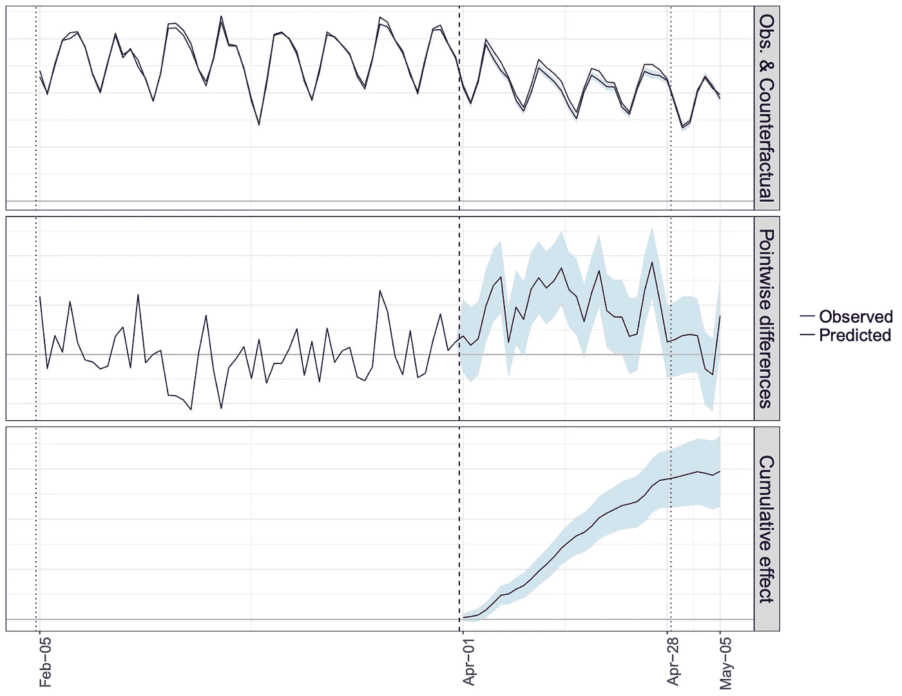

# Geo 实验，A/B 测试的完美补充

> 原文：<https://towardsdatascience.com/geo-experiments-the-perfect-complement-to-a-b-testing-1e0939996d26?source=collection_archive---------25----------------------->

## 它是什么，对你的营销有什么帮助？

这将是一个由三部分组成的系列，讨论地理实验及其在营销中的应用。

第一部分:它是什么？它对你的营销有什么帮助？

**第二部分**:理解地球物理实验背后的数学原理

**第三部分**:Geo 实验应用实例及 R 代码

# 测试和学习的面包和黄油

A/B 测试(又名分割测试)对于帮助营销人员消除猜测并做出基于数据的决策至关重要。对于大多数营销人员来说，这是着陆页优化的形式。您将流量分成不同的组，向其中一个组展示页面的一些更改，同时保持其他组的所有内容不变，测量感兴趣的特定指标(注册率、点击率等)的差异，并确定两组之间的差异是否具有统计学意义。一些付费营销专家可能在谷歌广告或脸书广告中做过 A/B 测试，在这些广告中，受众受到不同广告格式或广告文案的影响。两者的方法相似，但应用方式不同。

那么为什么营销人员要进行 A/B 测试呢？这是营销人员戴上科学家帽子的地方。营销人员进行 A/B 测试，以了解某件事的因果和增量影响，无论是登录页面的变化还是脸书营销活动的广告文案。他们想知道，对于他们所做的这件事，它的增量影响是什么，这样他们就可以对下一步该做什么做出明智的决定。

A/B 测试已经成为营销人员进行测试和学习的基础。但是如果我让你设计一个 A/B 测试来回答下面的每个问题，你会怎么做呢？

1.  了解脸书活动对客户转化的增量影响？(也就是说，我想知道对整体客户转化率的实际影响，而不是你的脸书业务经理在转化率栏下报告的内容)
2.  了解广告牌广告对网站访问量的影响

考虑一下吧。

让我们仔细检查每个问题，看看为什么我们最喜欢的 A/B 测试不起作用:

1.  您可以 A/B 测试您的脸书活动，以了解 CTR 或参与度等指标的增量影响，但客户转化率略有不同。为什么？因为在你的整个测量框架下，存在着一个以非完美方式分配信用的归因模型。因此，即使您正在运行 A/B 测试来了解客户转换，它也只能为您提供两个活动之间的相对比较。它没有提供该活动是否带来增量客户的总体视图。你不知道你是否只是从其他渠道获得了客户转化。
2.  这个很简单。首先，您没有任何直接的响应指标可以衡量。其次，你计划如何创建你的控制和测试组？你计划在一个经过广告牌的城市里，蒙住一半人口的眼睛，以确保他们看不到广告牌，而让另一半人看到它吗？

当您无法控制您的人口或没有感兴趣的度量标准的直接度量时，A/B 测试不起作用。虽然 A/B 测试是营销人员的主要工作，但我们也看到了它的局限性，以及需要额外的工具来帮助营销人员回答重要的问题。

# 面包和橄榄油:地理实验

有时候面包和黄油是不够的，你必须改变一下。面包和橄榄油通常也搭配得很好。那么 Geo 实验到底是什么？简而言之，地理实验就像 A/B 测试，但是使用地理来定义你的控制和治疗组，而不是个人或网络 cookies。在 Geo 实验中，地理区域被分为治疗组和对照组。治疗组中的区域暴露于市场干预，而对照组中的区域保持现状。营销干预持续一段时间，并观察响应度量。想法是检测在治疗区域中的响应度量中是否有增量提升。

让我们以上面的脸书问题为例，假设我们正在美国开展广告活动。首先，我们在美国随机选择一组城市，将他们分为治疗组和对照组。就像 A/B 测试一样，随机化是实验设计的关键部分。然后在脸书业务经理中，我们将活动设置为仅在治疗组的城市中运行。我们在一段时间内开展活动，并通过比较对照组和治疗组之间的差异来衡量获得的增量客户(不知道归因模型)。例如，我们可能会看到这样的内容:

这是由谷歌开发的 [GeoexperimentsResearch](https://github.com/google/GeoexperimentsResearch) R 包制作的图表，该包实现了 Geo Experiment 方法，并提供了一种简单的方法来进行分析。我将在第 3 部分演示如何使用这个 R 包！但在较高层次上，y 轴可以是客户转化率。在我们的示例中，x 轴分为三个不同的时间段:

*   测试前期(2 月 5 日—3 月 31 日):活动开始前
*   测试期(4 月 1 日—4 月 28 日):活动进行期间
*   冷却期(2005 年 4 月 29 日-5 月 5 日):活动停止运行，但可能会有一个广告涓涓细流挥之不去的影响

上图显示了观察到的响应度量随时间的变化与预测的反事实的对比。我们将在第 2 部分详细讨论这一点，但本质上，如果营销活动没有进行，我们会观察到反事实。中间的图说明了按天估算的升力的观察值和反事实值之间的差异。最后，下图是我们在实验中观察到的总升力。

我上面的解释是对方法论的过度简化。为了真正了解发生了什么，你需要进入引擎盖内，看看发动机。Geo 实验背后的方法和数学不同于传统的 A/B 测试，但总体思路是相似的。如前所述，我将把数学的详细解释留到本系列的第 2 部分。我将在第 2 部分介绍的方法是来自 Google 的研究，所以如果您感兴趣，可以先看一看。一行解释:回归模型用于学习控制区域和治疗区域之间的可交换性因子，然后用于预测干预期间的反事实。也许这句话对你来说根本没有任何意义。别担心，我会用简单的术语来分解它！敬请期待！

我想花一点时间来强调 Geo 实验是营销科学中回归的另一个用例。如果你没有读过我的文章“营销分析师应该在他们的分析工具包中拥有的一样东西”，看看为什么回归是每个营销分析师应该在他们的工具包中拥有的工具。

Geo 实验绝不是为了取代传统的 A/B 测试。它们服务于非常不同的目的，回答不同的问题，但两者同样重要。就像他们说的，“没有放之四海而皆准的”，你不应该只在面包上涂黄油。继续添加一些品种，橄榄油也很棒！

# 挑战和局限

到目前为止，我可能已经向您介绍了这种新工具有多棒，但是像任何其他工具一样，Geo Experiment 也有其自身的局限性和挑战:

*   管理费用:建立一个地理实验可能需要更多的工作，这取决于你如何建立你的活动。您可能需要重组您现有的数字营销账户，使您能够在城市/地区级别开展营销活动，以创建您的控制和治疗小组。
*   **平台**:并不是每一个你投放广告的营销平台都允许你在城市/地区层面开展活动。例如，你可以在城市/地区层面投放脸书付费广告，但是当你在播客中投放广告时，你没有这个能力。
*   预算:根据你的业务、活动和许多其他因素，你需要的活动预算会有很大的不同。对于刚刚开始数字营销的公司，我还不会考虑地理实验。如果你的业务已经成熟，你正在寻求优化，那么我认为这是一个很好的选择。
*   **控制变量**:你能控制发生在不同城市的营销活动吗？例如，您的组织在特定城市开展的其他营销活动是否可能与您的地理实验重叠？

最后，永远记住为正确的工作选择正确的工具。不存在一刀切！

*原载于 2019 年 3 月 25 日*[*artofmarketingscience . github . io*](https://artofmarketingscience.github.io/AOM-geo-experiments-part1/)*。*