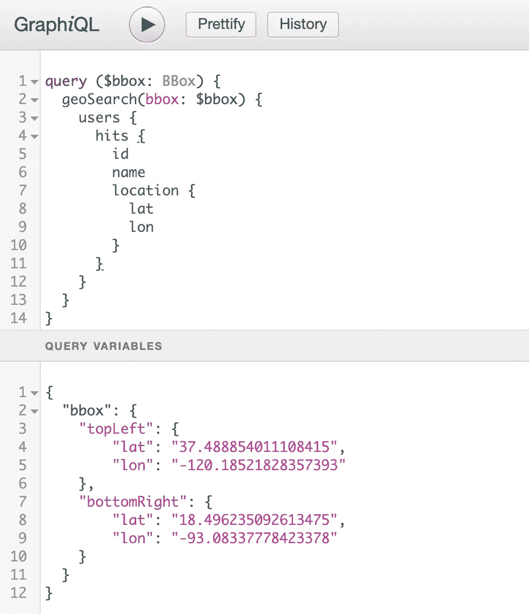
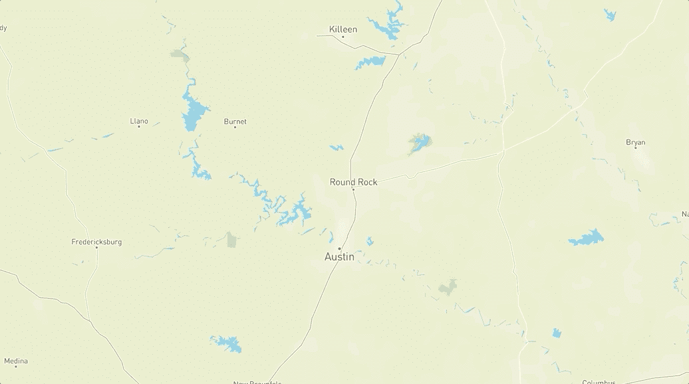
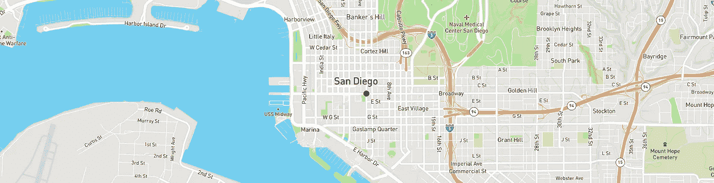

# 带弹性搜索的 Geo-GraphQL

> 原文：<https://towardsdatascience.com/geo-graphql-with-elasticsearch-b01a6bdf0dc8?source=collection_archive---------22----------------------->

## 教程


Photo by [chuttersnap](https://unsplash.com/@chuttersnap?utm_source=medium&utm_medium=referral) on [Unsplash](https://unsplash.com?utm_source=medium&utm_medium=referral)

我们最近在 [RigUp](https://www.rigup.com/) 举办了第二届黑客马拉松，我的团队获得了客户类别的第一名！我们的解决方案包括定制的抓取器、队列、数据 ETL 和结果数据的查询。然后，我们编写了一个 React 应用程序来提供流畅的可视化来显示这些数据。📈由于我们只有 48 小时，我们的代码还没有准备好投入生产。

本教程探索了我在空闲时间改进项目的方法。我决定编写一个 [GraphQL](https://graphql.org/) 服务器来访问我们的 [ElasticSearch](https://www.elastic.co/) 地理数据。我选择的语言是 [Scala](https://www.scala-lang.org/) ，利用了 [Akka Http](https://akka.io/) 和 [Sangria](https://sangria-graphql.org/) 库。应该注意的是，RigUp 不是 Scala 之家，只是 Scala 是我背景的一大部分。

对于我们的黑客马拉松，我们为不同类型的文档建立了多个 ElasticSearch 索引，但是每个文档类型都有一个纬度和经度。这要求我们向 ElasticSearch 发出多个 API 请求，这意味着要复制大量的搜索逻辑。由于我们在地图上查看数据，我们利用了 Elastic 的[地理边界框查询](https://www.elastic.co/guide/en/elasticsearch/reference/current/query-dsl-geo-bounding-box-query.html)。

```
// Pseudocode
fetch('/users', { geo_bounding_box, ...some_filter_here });
fetch('/coffee-shops', { geo_bounding_box, ...other_filter });
```

理想情况下，我们希望创建一个简洁的 GQL 查询，其中地理边界框将传播到嵌套查询。在 geoSearch 下添加继承边界框变量的其他模型应该很容易:

users and coffeeShops can access bbox variable

$bbox 引用将指向我们在 graphiql 的查询变量窗格中定义的`“bbox”`对象。我们过滤掉这个框之外的用户。

`“bbox”` variable as an object in the bottom **Query Variables** pane

> 下面从[桑格利亚汽酒文档](https://sangria-graphql.org/)以及 [HowToGraphQL Scala 教程](https://www.howtographql.com/graphql-scala/0-introduction/)中获取**重磅**灵感。**我们将创建 GraphQL 查询，根据名称和地理位置过滤用户和咖啡店。**

# 项目设置

所有最终代码都可以在 [GitHub](https://github.com/duanebester/gql-elastic-scala) 上获得

## 弹性搜索

最简单的设置是使用下面的 docker-compose 文件，或者在本地安装 Elastic 并在默认端口(9200)上运行。

跑步`docker-compose up -d`应该能让你开始。确保您可以在浏览器中从 ElasticSearch 得到响应，网址为 [localhost:9200](http://localhost:9200/)

要加载我们的测试用户和咖啡店，将目录切换到 scripts 文件夹并运行加载脚本:

```
$ cd src/main/resources/scripts/
$ ./load-test-data.sh
```

导航到[http://localhost:9200/test-users/_ search？pretty](http://localhost:9200/test-users/_search?pretty) 应该会给你一个用户列表。

## 属国

## 资源

让我们将[**graphiql.html**](https://github.com/graphql/graphiql/blob/master/packages/examples/graphiql-cdn/index.html)添加到我们的资源目录中(在`/src/main/resources`下)，这样我们就可以有一个操场来测试我们的 GraphQL 查询。我们将在下面看到一个路由，它将从资源目录中提供这个文件。

# 主服务器

只有两条路线:一个接受到/graphql 的 POST，另一个提供静态资源。现在，向 graphql 端点发出 POST 请求只会返回一个字符串。我们在`/src/main/scala`下创建`Main.scala`

# 模型

模型可以分为几类:变量、响应和公共变量。变量是将被映射到 GraphQL 参数的类。这些响应将是来自 GraphQL 服务器的响应，并将直接绑定到 GraphQL 模式中。这些输入和输出之间可以共享公共模型，这一点很快就会清楚。

让我们添加一个包含嵌套目录和类的模型文件夹，如下所示:

```
 ├── Main.scala
    └── models
        ├── common
        │   └── Location.scala
        ├── responses
        │   ├── CoffeeShop.scala
        │   ├── SearchResponse.scala
        │   └── User.scala
        └── variables
            ├── BBox.scala
            └── Filter.scala
```

## 普通的

`Location`是一个简单的 case 类，具有*纬度*和*经度*属性。

## 变量

让我们建立我们的边界框和过滤器类。`BBox`以两个`Location`对象*左上方*和*右下方*为属性，Filter 以可选`BBox`和可选`String`对象为属性。*顶部左侧*和*底部右侧*与我们屏幕上渲染地图的角落相关。

## 反应

让我们创建一个通用的`SearchResponse`类:

一个`User`案例类将有*名称、*和*位置*属性。位置属性将是一个类型为`Location`的对象。

我们的`UsersResponse` case 类将包含一个*总计*属性和一个用户列表。

`CoffeeShop`和`CoffeeShopResponse`模型与用户和用户响应模型非常相似:

# 核心代码

让我们继续在`/src/main/scala`中创建/添加以下文件

```
├── Elastic.scala
├── GraphQLSchema.scala
├── GraphQLServer.scala
├── Main.scala
└── models
```

## GraphQL 模式

要深入了解 Sangria 和 GraphQL 模式定义，请参阅 [Sangria 文档](https://sangria-graphql.org/learn/#schema-definition)

在这里，我们将模型与一个 GraphQL 模式联系起来:

## 弹性搜索

在 [HowToGraphQL 教程](https://www.howtographql.com/graphql-scala/0-introduction/)中，作者使用 Slick 和内存中的 H2 数据库来保存和查询数据。我们将使用橡皮筋。我们创建一个特征来保存我们的弹性配置和方法(使得测试更容易):

接下来，我们将添加一个实现这个特征和我们定义的方法的类:

> Sangria 有一个随 GraphQL 查询流动的上下文概念。这对我们的用例非常重要，因为它将保存我们的弹性类和 BBox 变量的实例。

我们可以在`GraphQLSchema.scala`中将我们的上下文定义为一个简单的 case 类:

```
case class MyContext(elastic: Elastic, bbox: Option[BBox] = None)
```

## GraphQL 服务器

现在我们将创建一个 GraphQL 服务器，它将拥有一个 Akka Http `Route`和一个我们的`Elastic`类的实例。下面的端点方法获取一个`JsValue`，解析它，并返回一个`Route`。

你会看到我们打电话给`executeGraphQLQuery`。让我们接下来构建它:

这里是我们传递弹性实例以及之前定义的`GraphQLSchema.SchemaDefinition`的地方。让我们不要忘记更新`Main.scala`来将请求路由到我们的 GraphQLServer:

# 测试我们的设置

为了运行我们的服务器，我们使用 sbt。从根目录:

```
$ sbt ~reStart
```

导航到 [localhost:8080](http://localhost:8080) 并输入我们的查询和 bbox 变量:



当我们使用以下边界框坐标进行搜索时，我们将看到从查询中返回 3 个用户。所有这些用户都位于德克萨斯州的奥斯汀。

```
{
  "data": {
    "geoSearch": {
      "users": {
        "hits": [
          {
            "id": 3,
            "name": "Ricky", 
            "location": ...
          },
          {
            "id": 4,
            "name": "Carter", 
            "location": ...
          },
          {
            "id": 5,
            "name": "Mitch", 
            "location": ...
          }
        ]
      }
    }
  }
}
```

让我们调整边界框来覆盖更多的区域:

我们看到第四个用户，他正好在加利福尼亚州的圣地亚哥:

```
{
  "id": 1,
  "name": "Duane", 
  "location": {
    "lat": "32.715736",
    "lon": "-117.161087"
  }
}
```

我们最后一次调整边界地理框:

我们在🇲🇽墨西哥城看到了我们的第五个也是最后一个用户

```
{
  "name": "Matt",
  "id": 2,
  "location": {
    "lat": "19.42847",
    "lon": "-99.12766"
  }
}
```

# 扩展我们的设置

难题的最后一部分是添加一个额外的字段来搜索和过滤我们的用户。我们将添加一个名称过滤器，这样我们就可以进行如下查询:

为了按名称过滤，让我们更新`Elastic.scala`中的`buildQuery`方法:

现在，如果我们从上面运行新的查询，我们将只看到 Matt 和 Mitch 返回！非常容易添加新功能。

```
{
  "data": {
    "geoSearch": {
      "users": {
        "hits": [
          {
            "id": 2,
            "name": "Matt",
            "location": {
              "lat": "19.42847",
              "lon": "-99.12766"
            }
          },
          {
            "id": 5,
            "name": "Mitch",
            "location": {
              "lat": "30.366666",
              "lon": "-97.833330"
            }
          }
        ],
        "total": 2
      }
    }
  }
}
```

最后，假设我们希望在地理框中搜索名称以“M”开头的用户，以及该地区名称为“Starbucks”的咖啡店

```
{
  "data": {
    "geoSearch": {
      "users": {
        "hits": [
          {
            "id": 2,
            "name": "Matt",
            "location": {
              "lat": "19.42847",
              "lon": "-99.12766"
            }
          },
          {
            "id": 5,
            "name": "Mitch",
            "location": {
              "lat": "30.366666",
              "lon": "-97.833330"
            }
          }
        ],
        "total": 2
      },
      "coffeeShops": {
        "hits": [
          {
            "name": "Starbucks"
          },
          {
            "name": "Starbucks"
          }
        ],
        "total": 2
      }
    }
  }
}
```

我们可以快速将一个简单的 React 应用程序与 [Mapbox](https://github.com/alex3165/react-mapbox-gl) 和 [Apollo](https://www.apollographql.com/docs/react/get-started/) 连接起来，以显示我们的一些数据([源代码](https://github.com/duanebester/gql-elastic-app)):



Display our users within the map’s bounding box

```
npx create-react-app gql-elastic-app
cd gql-elastic-app/
npm install apollo-boost @apollo/react-hooks graphql
npm install react-mapbox-gl mapbox-gl --save
```

让我们开始我们的`UserFeatures`组件，它将把我们的用户映射到 Mapbox 特性:

现在我们添加 GraphQL 查询字符串:

让我们在应用程序组件中设置 Mapbox:

现在轮到阿波罗了:

接下来，我们需要为地图的边界框添加一些状态:

一个快速实用函数，将地图框的`Bounds`对象转换成我们自己的`BBox`对象:

最后，我们添加了两个处理程序，它们接收地图事件并更新我们的本地状态:

运行该应用程序会像上面的 GIF 一样将你放大到德克萨斯州的奥斯汀，并将显示 3 个用户。如果我们将地图移到圣地亚哥，我们会看到第四个用户:



您也应该看到我们在墨西哥城的第 5 位用户！如果你一直跟随，你会注意到一个 CORS 错误。这是一个简单的修复方法，已在回购的`[Main.scala](https://github.com/duanebester/gql-elastic-scala/blob/master/src/main/scala/Main.scala#L44)` [中解决。](https://github.com/duanebester/gql-elastic-scala/blob/master/src/main/scala/Main.scala#L44)

希望你喜欢用 GraphQL & ElasticSearch 进行地理搜索！所有的代码都是开源的。😎欢迎 PRs、评论等！

Scala 后端代码—[https://github.com/duanebester/gql-elastic-scala](https://github.com/duanebester/gql-elastic-scala)

反应前端代码—[https://github.com/duanebester/gql-elastic-app](https://github.com/duanebester/gql-elastic-app)