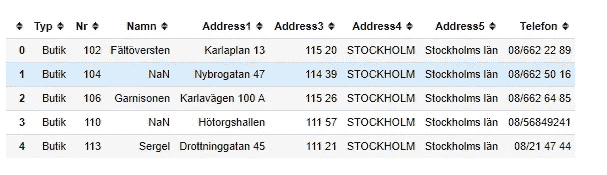
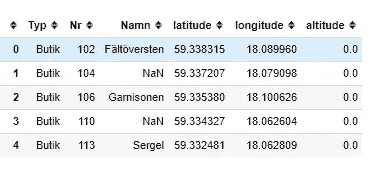
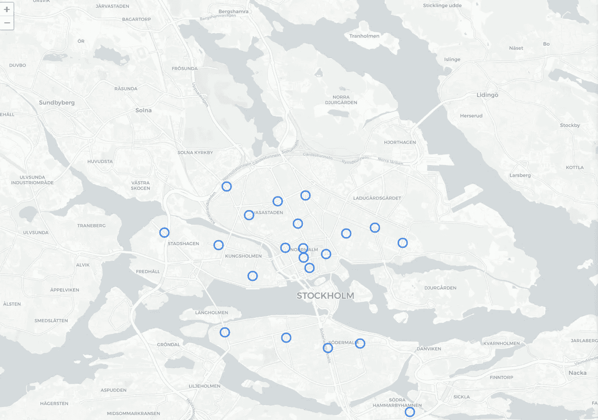
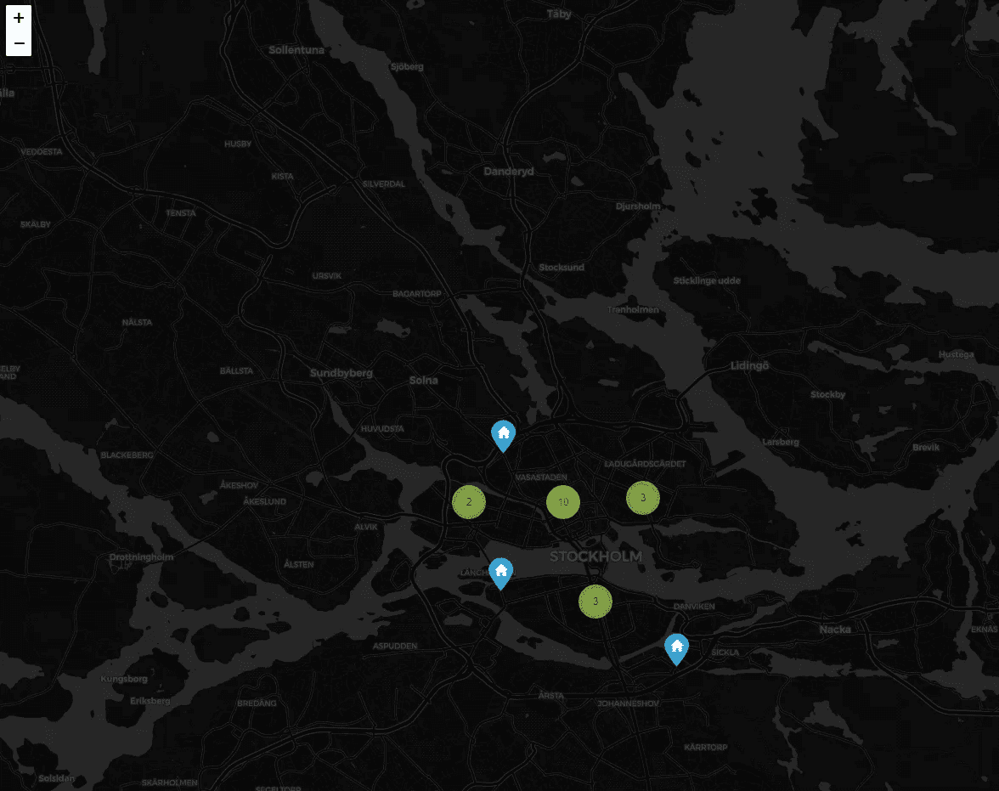

# 使用 Python 进行地理编码

> 原文：<https://towardsdatascience.com/geocode-with-python-161ec1e62b89?source=collection_archive---------1----------------------->

## 如何将物理地址转换为地理位置→经纬度


Photo by [Thor Alvis](https://unsplash.com/@terminath0r?utm_source=medium&utm_medium=referral) on [Unsplash](https://unsplash.com?utm_source=medium&utm_medium=referral)

数据集很少是完整的，通常需要预处理。想象一下，一些数据集只有一个地址列，而没有纬度和经度列来表示地理上的数据。在这种情况下，您需要将数据转换成地理格式。将地址转换为地理信息(纬度和经度)以绘制其位置的过程被称为**地理编码**。

Geocoding 是将一个 [**物理地址**](https://en.wikipedia.org/wiki/Address_(geography)) **描述为地球表面上一个** [**位置**](https://en.wikipedia.org/wiki/Location_(geography)) **的** **计算过程(以数值坐标表示)——维基百科**

在本教程中，我将向您展示如何借助 Geopy 和 Geopandas 库在 Python 中执行地理编码。如果您已经安装了 Anaconda 环境，让我们用 Pip 安装这些库。

```
pip install geopandas
pip install geopy
```

如果你不想安装库并直接与本教程附带的 Jupyter 笔记本交互，本文底部有 Github 与 MyBinder 的链接。这是一个集装箱化的环境，它允许你直接在网上实验本教程，而不需要任何安装。数据集也包含在这个环境中，因此本教程不需要下载数据集。

## 地理编码单个地址

要对单个地址进行地理定位，可以使用 Geopy python 库。 [Geopy](https://geopy.readthedocs.io/en/stable/#) 有不同的地理编码服务可供选择，包括谷歌地图、ArcGIS、AzureMaps、Bing 等。其中一些需要 API 键，而另一些则不需要。


Geopy

作为我们的第一个例子，我们使用的是建立在 OpenStreetMap 数据之上的 nomist 地理编码服务。让我们对一个地址进行地理编码，巴黎的埃菲尔铁塔。

```
locator = Nominatim(user_agent=”myGeocoder”)
location = locator.geocode(“Champ de Mars, Paris, France”)
```

我们创建了保存地理编码服务的`locator`,命名。然后，我们传递我们创建的定位器来对任何地址进行地理编码，在本例中，是 Eifel tower 地址。

```
print(“Latitude = {}, Longitude = {}”.format(location.latitude, location.longitude))
```

现在，我们可以打印出我们创建的位置的坐标。

```
Latitude = 48.85614465, Longitude = 2.29782039332223
```

尝试一些不同的地址。在下一节中，我们将介绍如何对熊猫数据帧中的许多地址进行地理编码。

## 对熊猫的地址进行地理编码

让我们阅读本教程的数据集。在本教程中，我们使用商店地址数据集的示例。CSV 文件可通过此链接获得。

[](https://www.dropbox.com/s/nt9ab4nnhpyrmxe/addresses.csv?dl=0) [## addresses.csv

### Dropbox 是一项免费服务，可以让你将照片、文档和视频带到任何地方，并轻松分享。从不发电子邮件…

www.dropbox.com](https://www.dropbox.com/s/nt9ab4nnhpyrmxe/addresses.csv?dl=0) 

下载 CSV 文件，用熊猫看。

```
df = pd.read_csv(“addresses.csv”)
df.head()
```

下表提供了 DataFrame 表的前五行。如您所见，没有纬度和经度列来映射数据。



Ddataframe

我们将地址列连接成一个适合地理编码的列。例如，第一个地址是:

```
Karlaplan 13,115 20,STOCKHOLM,Stockholms län, Sweden
```

我们可以像这样连接 pandas 中的地址列，为地理编码创建一个地址列:

一旦我们创建了地址列，我们就可以像下面的代码片段一样开始地理编码。

*   # 1-我们首先在每个地址之间延迟 1 秒钟进行地理编码。当您对大量物理地址进行地理编码时，这非常方便，因为地理编码服务提供商可以拒绝对服务的访问。
*   #2 —通过应用我们创建的`geocode`来创建一个`df['location']`列。
*   #3 —第三，我们可以将纬度、经度和海拔高度创建为一个元组列。
*   #4 —最后，我们将纬度、经度和海拔列分成三个单独的列。

上面的代码生成了一个带有纬度和经度列的数据帧，您可以使用自己选择的任何地理可视化工具绘制该数据帧。让我们看一下数据帧的前几个草图，但是首先，我们将清理掉不需要的列。

```
df = df.drop([‘Address1’, ‘Address3’, ‘Address4’, ‘Address5’,’Telefon’, ‘ADDRESS’, ‘location’, ‘point’], axis=1)df.head()
```



cleaned table with latitude and longitude

我将使用 lyum 来绘制我们创建的点，但也可以随意使用您选择的任何其他地理可视化工具。首先，我们用叶子将位置显示为圆形地图。

下面生成的地图将地理编码地址显示为圆圈。



Map

或者，如果您喜欢带有聚合点簇的深色背景，您可以执行以下操作:

下面是一个黑暗的背景地图与集群点地图在叶。



Clustered map

## 结论

在许多需要坐标系的定位任务中，地理编码是一项关键任务。在本文中，我们看到了如何用 Python 进行地理编码。还有许多其他服务提供免费或付费的地理编码服务，您可以在 GeoPy 中进行试验。我发现 Google Maps 地理编码服务比我们在本教程中使用的 Openstreetmap 服务更强大，但是它需要一个 API 密钥。

为了在没有任何安装的情况下与本教程进行交互和实验，我创建了一个活页夹。进入 GitHub 库，点击启动活页夹。

[](https://github.com/shakasom/geocoding) [## shaka som/地理编码

### 此时您不能执行该操作。您已使用另一个标签页或窗口登录。您已在另一个选项卡中注销，或者…

github.com](https://github.com/shakasom/geocoding) 

或者直接访问 Jupyter 笔记本活页夹链接:

[](https://mybinder.org/v2/gh/shakasom/geocoding/master) [## GitHub:shaka som/geocoding/master

### 单击运行此交互式环境。来自活页夹项目:可复制、可共享、交互式计算…

mybinder.org](https://mybinder.org/v2/gh/shakasom/geocoding/master)