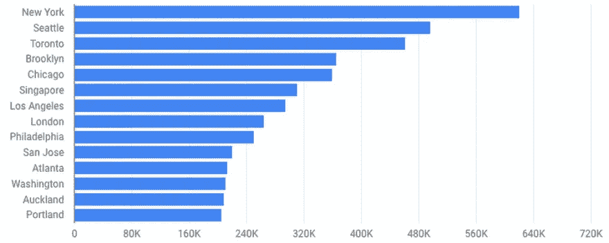

# 使用 BigQuery 进行地理定位:在 20 秒内识别出 7600 万个 IP 地址

> 原文：<https://towardsdatascience.com/geolocation-with-bigquery-de-identify-76-million-ip-addresses-in-20-seconds-e9e652480bd2?source=collection_archive---------32----------------------->

## 四年前，我们发布了第一个去识别 IP 地址的方法- [使用 Google BigQuery 的 GeoIP 地理定位-](https://cloudplatform.googleblog.com/2014/03/geoip-geolocation-with-google-bigquery.html) ，现在是时候进行更新了，包括最好和最新的 BigQuery 功能，如使用最新的 SQL 标准，处理嵌套数据，以及更快地处理连接。

***重要更新*** : *我在 2020 年离开了谷歌，加入了雪花——所以我无法保持更新我的旧帖子。如果你想尝尝雪花啤酒，加入我们吧——我在❄️.玩得很开心*

*这篇较新的帖子将向您展示如何在 Snowflak* *e 中运行地理定位——没有这里描述的任何预处理——感谢 Snowflak 运行 Java UDFs 的能力。*

[](https://hoffa.medium.com/free-ip-address-geolocation-with-maxmind-and-snowflake-676e74ea80b8) [## MaxMind 和雪花的免费 IP 地址地理定位

### 让我们在雪花中编写一个 Java UDF，使用 MaxMind 的 GeoLite2 免费地理定位数据对 IP 地址进行地理定位——

hoffa.medium.com](https://hoffa.medium.com/free-ip-address-geolocation-with-maxmind-and-snowflake-676e74ea80b8) 

[BigQuery 是 Google Cloud 的](https://cloud.google.com/bigquery/)无服务器数据仓库，旨在实现可伸缩性和快速性能。使用它，您可以探索大型数据集，以找到新的和有意义的见解。为了遵守当前的政策和法规，在分析包含个人数据的数据集时，您可能需要取消用户的 IP 地址。例如，在 [GDPR](https://cloud.google.com/blog/topics/inside-google-cloud/google-cloud-ready-for-gdpr) 下，一个 IP 地址可能被认为是 [PII 或者个人数据](https://support.google.com/analytics/answer/7686480?hl=en)。

用一个粗略的位置替换收集到的 IP 地址是帮助降低风险的一种方法 BigQuery 已经准备好提供帮助。让我们看看怎么做。

# 如何识别 IP 地址数据

在这个如何轻松识别 IP 地址的示例中，我们使用:

*   2001 年至 2010 年间，维基百科从匿名编辑那里收集了 7600 万个 IP 地址
*   MaxMind 的 [Geolite2 免费地理定位数据库](https://dev.maxmind.com/geoip/geoip2/geolite2/)
*   BigQuery 改进的字节和联网功能`NET.SAFE_IP_FROM_STRING(), NET.IP_NET_MASK()`
*   BigQuery 的[新超能力](https://cloud.google.com/bigquery/docs/nested-repeated)处理嵌套数据，生成数组，并运行令人难以置信的快速连接
*   新的 [BigQuery Geo Viz 工具](https://cloud.google.com/bigquery/docs/gis-visualize)使用谷歌地图 API 来绘制世界各地的地理点。

让我们直接进入查询。使用下面的代码将 IP 地址替换为通用位置。

## 编辑维基百科的顶级国家

以下是用户编辑维基百科的国家列表，后面是要使用的查询:


```
#standardSQL# replace with your source of IP addresses
# here I'm using the same Wikipedia set from the previous article
WITH source_of_ip_addresses AS (
  SELECT REGEXP_REPLACE(contributor_ip, 'xxx', '0')  ip, COUNT(*) c
  FROM `publicdata.samples.wikipedia`
  WHERE contributor_ip IS NOT null  
  GROUP BY 1
)SELECT country_name, SUM(c) c
FROM (
  SELECT ip, country_name, c
  FROM (
    SELECT *, NET.SAFE_IP_FROM_STRING(ip) & NET.IP_NET_MASK(4, mask) network_bin
    FROM source_of_ip_addresses, UNNEST(GENERATE_ARRAY(9,32)) mask
    WHERE BYTE_LENGTH(NET.SAFE_IP_FROM_STRING(ip)) = 4
  )
  JOIN `fh-bigquery.geocode.201806_geolite2_city_ipv4_locs`  
  USING (network_bin, mask)
)
GROUP BY 1
ORDER BY 2 DESCQuery complete (20.9 seconds elapsed, 1.14 GB processed)
```

## 编辑维基百科的顶级城市

这些是从 2001 年到 2010 年收集的用户编辑维基百科的热门城市，然后是要使用的查询:



```
# replace with your source of IP addresses
# here I'm using the same Wikipedia set from the previous article
WITH source_of_ip_addresses AS (
  SELECT REGEXP_REPLACE(contributor_ip, 'xxx', '0')  ip, COUNT(*) c
  FROM `publicdata.samples.wikipedia`
  WHERE contributor_ip IS NOT null  
  GROUP BY 1
)SELECT city_name, SUM(c) c, ST_GeogPoint(AVG(longitude), AVG(latitude)) point
FROM (
  SELECT ip, city_name, c, latitude, longitude, geoname_id
  FROM (
    SELECT *, NET.SAFE_IP_FROM_STRING(ip) & NET.IP_NET_MASK(4, mask) network_bin
    FROM source_of_ip_addresses, UNNEST(GENERATE_ARRAY(9,32)) mask
    WHERE BYTE_LENGTH(NET.SAFE_IP_FROM_STRING(ip)) = 4
  )
  JOIN `fh-bigquery.geocode.201806_geolite2_city_ipv4_locs`  
  USING (network_bin, mask)
)
WHERE city_name  IS NOT null
GROUP BY city_name, geoname_id
ORDER BY c DESC
LIMIT 5000`
```

# 探索一些新的 BigQuery 特性

这些新的查询符合最新的 SQL 标准，支持一些我们将在这里回顾的新技巧。

## 新的 MaxMind 表:再见数学，你好 IP 掩码

[可下载的 GeoLite2 表](https://dev.maxmind.com/geoip/geoip2/geolite2/)不再基于范围。现在他们使用适当的 IP 网络，如“156.33.241.0/22”。

使用 BigQuery，我们将这些解析成带有整数掩码的二进制 IP 地址。我们还对 GeoLite2 表进行了一些预处理，将网络和位置合并到一个表中，并添加了已解析的网络列，如下所示:

```
#standardSQL
SELECT *
  , NET.IP_FROM_STRING(REGEXP_EXTRACT(network, r'(.*)/' )) network_bin
  , CAST(REGEXP_EXTRACT(network, r'/(.*)' ) AS INT64) mask
FROM `fh-bigquery.geocode.201806_geolite2_city_ipv4` 
JOIN `fh-bigquery.geocode.201806_geolite2_city_locations_en`
USING(geoname_id)
```

## 地理定位百万分之一的 IP 地址

要在该表中找到一个 IP 地址，如“103.230.141.7”，可能需要这样做:

```
SELECT country_name, city_name, mask
FROM `fh-bigquery.geocode.201806_geolite2_city_ipv4_locs` 
WHERE network_bin = NET.IP_FROM_STRING('103.230.141.7')
```

但那不管用。我们需要使用正确的面具:

```
SELECT country_name, city_name, mask
FROM `fh-bigquery.geocode.201806_geolite2_city_ipv4_locs` 
WHERE network_bin = NET.IP_FROM_STRING('103.230.141.7') & NET.IP_NET_MASK(4, 24)
```

这就得到了一个答案:这个 IP 地址似乎住在南极洲。

# 按比例放大

这看起来很容易，但我们还需要几个步骤来找出 GeoLite2 表(超过 300 万行)和大量 IP 地址源之间的正确掩码和连接。

这就是主查询中的下一行所做的:

```
SELECT *
     , NET.SAFE_IP_FROM_STRING(ip) 
       & NET.IP_NET_MASK(4, mask) network_bin
  FROM source_of_ip_addresses, UNNEST(GENERATE_ARRAY(9,32)) mask
```

这基本上是使用所有可能的掩码(数字在 9 到 32 之间)应用交叉连接，并使用这些掩码来屏蔽源 IP 地址。接下来是真正精彩的部分:BigQuery 设法以极快的速度处理正确的连接:

```
USING (network_bin, mask)
```

BigQuery 在这里只选择一个被屏蔽的 IP——屏蔽的 IP 和带有给定掩码的网络相匹配的 IP。如果我们更深入地挖掘，我们会在 execution details 选项卡中发现 BigQuery 做了一个“内部 HASH JOIN EACH WITH EACH ON”，这需要大量的洗牌资源，但仍然不需要两个大型表之间的完全交叉连接。


# 进一步匿名化数据

这就是 BigQuery 如何帮助您用粗略的位置替换 IP 地址，并提供单个行的聚合。这只是可以帮助您降低处理数据风险的一种技术。GCP 提供了其他几个工具，包括[云数据丢失防护](https://cloud.google.com/dlp/) (DLP)，可以帮助你扫描和识别数据。您现在有几个选项来探索和使用数据集，让您遵守法规。你用什么有趣的方式使用去身份数据？[让我们知道。](https://twitter.com/felipehoffa?lang=en)

在 BigQuery 中找到最新的 [MaxMind GeoLite2 表，这要感谢我们的](https://console.cloud.google.com/bigquery?p=bigquery-public-data&d=geolite2&page=dataset)[谷歌云公共数据集](https://cloud.google.com/public-datasets/)。

*原发布于 2019 年 7 月 8 日*[*https://dev . to*](https://dev.to/felipehoffa/geolocation-with-bigquery-de-identify-76-million-ip-addresses-in-20-seconds-3dpc)*。*