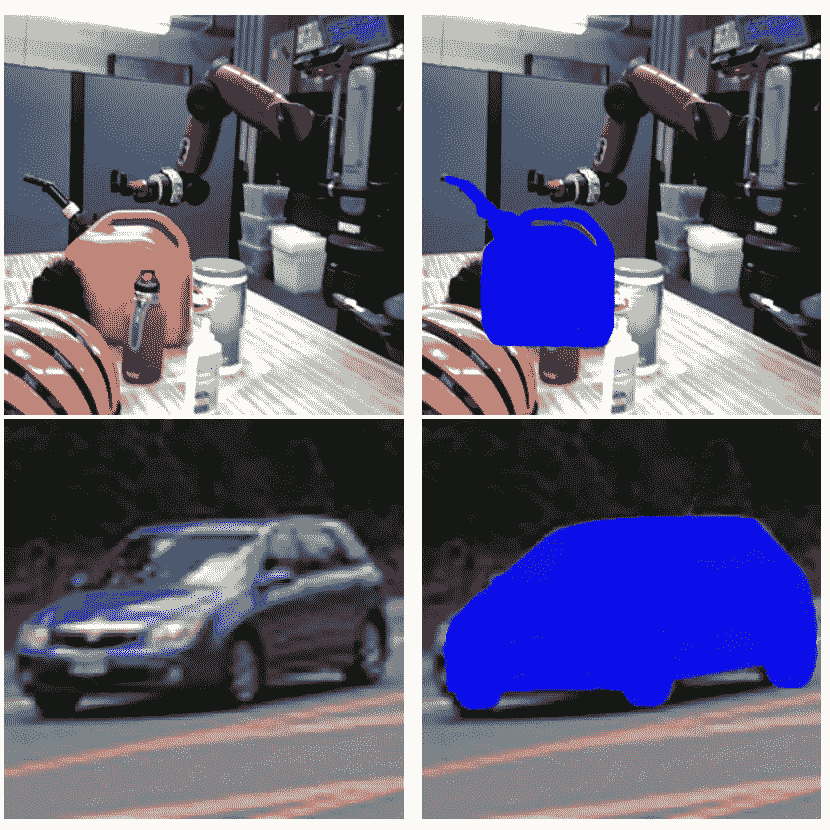
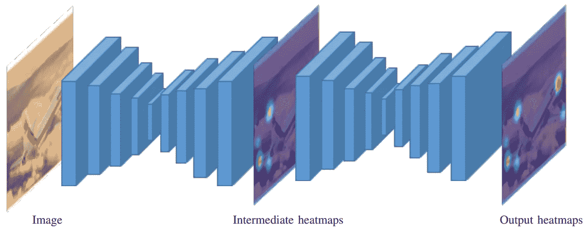
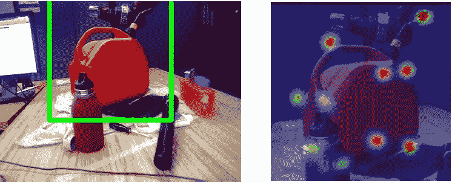
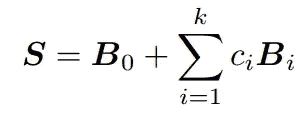
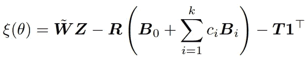
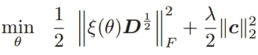
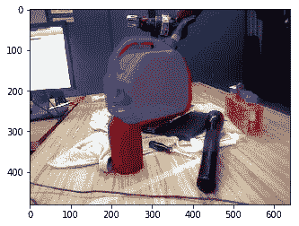
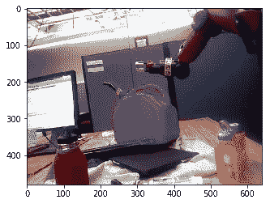
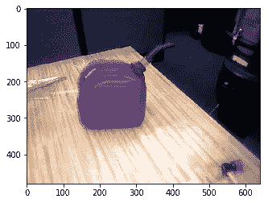

# 用于姿态估计的几何深度学习

> 原文：<https://towardsdatascience.com/geometric-deep-learning-for-pose-estimation-6af45da05922?source=collection_archive---------3----------------------->

## 从单目图像中寻找物体姿态的理论和 Pytorch 实现教程

计算机视觉和机器人学的中心问题之一是理解物体相对于机器人或环境是如何定位的。在这篇文章中，我将解释背后的理论，并给出 Pavlakos 等人的论文[“基于语义关键点的 6 自由度物体姿态”的 pytorch 实现教程。](https://arxiv.org/pdf/1703.04670.pdf)

在这种方法中，有两个步骤。第一步是预测 2D 图像上的“语义关键点”。在第二步中，我们通过使用透视相机模型最大化预测的语义关键点集合和对象的 3D 模型之间的几何一致性来估计对象的姿态。



Overlay of the projected 3D model on the monocular image

# 关键点定位

首先，我们使用标准的现成对象检测算法，如 fast-RCNN，在感兴趣的对象上放置一个边界框。然后，我们只考虑关键点定位的对象区域。为此，本文使用了“堆叠沙漏”网络架构。该网络接收一幅 RGB 图像并输出一组热图——每个关键点一个热图。热图允许网络表达其对一个区域的信心，而不是回归关键点的单个 x，y 位置。



从上图可以看出，网络有两个沙漏。此外，每个沙漏具有下采样部分和上采样部分。第二个沙漏的目的是优化第一个沙漏的输出。缩减像素采样部分由交替的卷积层和最大池层组成。当输出达到 4 X 4 的分辨率时，上采样开始。上采样部分由卷积和上采样(去卷积)层组成。使用第一和第二沙漏的输出的 L2 损耗来训练网络。



Left — Raw image with bounding box detection, Right — Cropped Image with keypoint heatmaps overlayed

# 姿态优化

现在我们有了关键点，我们可以用它们来找到姿势。我们所需要的只是我们感兴趣的物体的模型。本文作者定义了一个可变形模型 S，它由一个平均形状 B_0 加上一些用主成分分析计算的变量 B_i 组成。形状被定义为 3xP 矩阵，其中 P 是关键点的数量。



主要的优化问题是减少下面的残差。这里 W 是齐次坐标中的归一化 2D 关键点的集合。z 是表示关键点深度的对角矩阵。r 和 T 分别是旋转矩阵和平移向量。我们优化的未知数是 Z，R，T 和 c。



下面是我们希望最小化的实际损失。这里，D 是关键点的置信度——我们这样做是为了惩罚网络更确定的关键点上的错误。损失的第二项是正则化项，意在惩罚与感兴趣模型的平均形状的大偏差。



就是这样！得到的 R 和 T 定义了对象的姿态。现在让我们看看 pytorch 的实现。

# Pytorch 实现

对于实现，我们将严格遵循宾夕法尼亚大学 CIS 580 中提供的代码。我通过合并一些文件和删除一些数据扩充步骤简化了代码。

让我们直接进入代码。首先，我们需要克隆一个存储库:

```
git clone [https://github.com/vaishak2future/posefromkeypoints.git](https://github.com/vaishak2future/posefromkeypoints.git)
```

我们需要解压缩 data.zip，以便顶层目录包含三个文件夹:data、output 和 utils。现在，让我们运行朱庇特笔记本。我们将检查的第一个代码块是 Trainer 类。这个类加载训练和测试数据集，并对其进行一些转换，使其成为我们想要的格式。数据被裁剪和填充，因此我们只查看感兴趣对象周围的边界框。然后，地面真实关键点的位置被表示为热图。然后，数据被转换成适当格式的张量并归一化。最后，培训师还会加载沙漏模型。一旦我们调用了 train 方法，我们就完成了关键点定位。

```
**class** **Trainer**(object):

    **def** __init__(self):
        self.device = torch.device('cuda' **if** torch.cuda.is_available() **else** 'cpu')

        train_transform_list = [CropAndPad(out_size=(256, 256)),LocsToHeatmaps(out_size=(64, 64)),ToTensor(),Normalize()]
        test_transform_list = [CropAndPad(out_size=(256, 256)),LocsToHeatmaps(out_size=(64, 64)),ToTensor(),Normalize()]
        self.train_ds = Dataset(is_train=**True**, transform=transforms.Compose(train_transform_list))
        self.test_ds = Dataset(is_train=**False**, transform=transforms.Compose(test_transform_list))

        self.model = hg(num_stacks=1, num_blocks=1, num_classes=10).to(self.device)
        *# define loss function and optimizer*
        self.heatmap_loss = torch.nn.MSELoss().to(self.device) *# for Global loss*
        self.optimizer = torch.optim.RMSprop(self.model.parameters(),
                                             lr = 2.5e-4)
        self.train_data_loader = DataLoader(self.train_ds, batch_size=8,
                                            num_workers=8,
                                            pin_memory=**True**,
                                            shuffle=**True**)
        self.test_data_loader = DataLoader(self.test_ds, batch_size=32,
                                           num_workers=8,
                                           pin_memory=**True**,
                                           shuffle=**True**)

        self.summary_iters = []
        self.losses = []
        self.pcks = []

    **def** train(self):
        self.total_step_count = 0
        start_time = time()
        **for** epoch **in** range(1,400+1):

            print("Epoch **%d**/**%d**"%
                    (epoch,400))

            **for** step, batch **in** enumerate(self.train_data_loader):
                self.model.train()
                batch = {k: v.to(self.device) **if** isinstance(v, torch.Tensor) **else** v **for** k,v **in** batch.items()}
                self.optimizer.zero_grad()
                pred_heatmap_list = self.model(batch['image'])
                loss = self.heatmap_loss(pred_heatmap_list[-1], batch['keypoint_heatmaps'])
                loss.backward()
                self.optimizer.step()                                          

                self.total_step_count += 1

        checkpoint = {'model': self.model.state_dict()}
        torch.save(checkpoint, './output/model_checkpoint.pt')
```

在我们开始姿势优化之前，我们需要定义一个我们会经常用到的自定义函数。Rodrigues 函数将帮助我们将轴角表示向量转换为 3×3 旋转矩阵。我们这样定义它，以便我们可以使用 pytorch 的亲笔签名的功能。

```
**class** **Rodrigues**(torch.autograd.Function):
    @staticmethod
    **def** forward(self, inp):
        pose = inp.detach().cpu().numpy()
        rotm, part_jacob = cv2.Rodrigues(pose)
        self.jacob = torch.Tensor(np.transpose(part_jacob)).contiguous()
        rotation_matrix = torch.Tensor(rotm.ravel())
        **return** rotation_matrix.view(3,3)

    @staticmethod
    **def** backward(self, grad_output):
        grad_output = grad_output.view(1,-1)
        grad_input = torch.mm(grad_output, self.jacob)
        grad_input = grad_input.view(-1)
        **return** grad_input

rodrigues = Rodrigues.apply
```

最后，我们编写姿态优化函数，其中我们使用相机模型将 2D 关键点转换成归一化的齐次坐标，然后将它们与旋转和平移后的地面真实 3D 关键点进行比较。当损失低于我们的阈值时，我们停止优化。

```
**def** pose_optimization(img, vertices, faces, keypoints_2d, conf, keypoints_3d, K):
    *# Send variables to GPU*
    device = keypoints_2d.device
    keypoints_3d = keypoints_3d.to(device)
    K = K.to(device)
    r = torch.rand(3, requires_grad=**True**, device=device) *# rotation in axis-angle representation*
    t = torch.rand(3 ,requires_grad=**True**, device=device)
    d = conf.sqrt()[:, **None**]
    *# 2D keypoints in normalized coordinates*
    norm_keypoints_2d = torch.matmul(K.inverse(), torch.cat((keypoints_2d, torch.ones(keypoints_2d.shape[0],1, device=device)), dim=-1).t()).t()[:,:-1]
    *# set up optimizer*
    optimizer = torch.optim.Adam([r,t], lr=1e-2)
    *# converge check*
    converged = **False**
    rel_tol = 1e-7
    loss_old = 100
    **while** **not** converged:
      optimizer.zero_grad()
      *# convert axis-angle to rotation matrix*
      R = rodrigues(r)
      *# 1) Compute projected keypoints based on current estimate of R and t*
      k3d = torch.matmul(R, keypoints_3d.transpose(1, 0)) + t[:, **None**]
      proj_keypoints = (k3d / k3d[2])[0:2,:].transpose(1,0) 
      *# 2) Compute error (based on distance between projected keypoints and detected keypoints)*
      err = torch.norm(((norm_keypoints_2d - proj_keypoints)*d)**2, 'fro')
      *# 3) Update based on error*
      err.backward()
      optimizer.step()
      *# 4) Check for convergence*
      **if** abs(err.detach() - loss_old)/loss_old < rel_tol:
        **break**
      **else**:
        loss_old = err.detach()    

*#       print(err.detach().cpu().numpy())*

    R = rodrigues(r)
    plt.figure()
    plot_mesh(img, vertices, faces, R.detach().cpu().numpy(), t.detach().cpu().numpy()[:,**None**], K.detach().cpu().numpy())
    plt.show()
    **return** rodrigues(r)[0].detach(), t.detach()
```

当您运行上述函数时，您应该会得到如下令人惊叹的结果:



重要的实现细节到此为止！确保您运行它，并试验不同的超参数和转换，以了解它们如何影响结果。我希望这有所帮助。请给我任何意见或更正！

# 参考

[[1] G .帕夫拉科斯等 2017。来自语义关键点的 6 自由度物体姿态](https://arxiv.org/pdf/1703.04670.pdf)