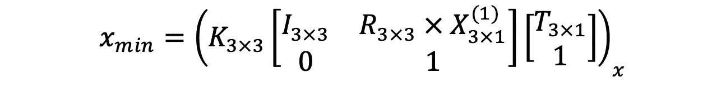

# 将自动驾驶中的 2D 物体检测提升到 3D

> 原文：<https://towardsdatascience.com/geometric-reasoning-based-cuboid-generation-in-monocular-3d-object-detection-5ee2996270d1?source=collection_archive---------5----------------------->

单目 3D 对象检测使用单目图像(通常是 RGB 图像)预测 3D 边界框。这项任务基本上是不适定的，因为在 RGB 图像中缺少关键的深度信息。幸运的是，在自动驾驶中，汽车是(很大程度上)已知形状和大小的刚体。那么，一个关键的问题是如何有效地利用汽车的强先验来推断传统 2D 对象检测之上的 3D 边界框。

与产生具有中心(x，y)和 2D 尺寸(w，h)的 4 自由度(DoF)轴对准边界框的传统 2D 对象检测相比，自动驾驶环境中的 3D 边界框通常具有 7 个 DoF: 3D 物理尺寸(w，h，l)、3D 中心位置(x，y，z)和偏航。注意，滚转和俯仰通常假定为零。现在的问题是，我们如何从一个四自由度的物体恢复一个七自由度的物体？

Tight constraint between 2D and 3D bounding boxes ([source](https://arxiv.org/pdf/1811.10247.pdf))

Deep3DBox ( [**使用深度学习和几何**](https://arxiv.org/abs/1612.00496) ，CVPR 2017)的开创性工作提出的一种流行的方法是从 2D 边界框包围的图像片中回归观察角度(或局部偏航，或偏心偏航，如[我以前的帖子](https://medium.com/@patrickllgc/orientation-estimation-in-monocular-3d-object-detection-f850ace91411)中所解释的)和 3D 对象大小(w，h，l)。局部偏航和 3D 对象大小(通常假设在子类型平均值周围具有小方差的单峰分布)都与对象外观紧密相关，因此可以从裁剪的图像碎片中推断出来。为了完全恢复 7 DoF，我们只需要用三个未知数(x，y，z)来推断 3D 位置。

幸运的是，我们可以利用 3D 边界框的透视投影应该与其 2D 检测窗口紧密配合的事实。这种约束迫使至少一个长方体顶点投影到 2D 盒的四个边上。

The pipeline to infer 3D position from 2D bounding box

跟随 Deep3DBox 的脚步，后面的论文也明确遵循同样的提法。他们的贡献是添加不同形式的第二阶段，以微调生成的 3D 长方体，在本文稍后详细讨论。

*   **FQNet** : [用于单目 3D 物体检测的深度拟合度评分网络](https://arxiv.org/abs/1904.12681) (CVPR 2019)
*   **Shift R-CNN**:[Shift R-CNN:具有封闭形式几何约束的深度单目 3D 物体检测](https://arxiv.org/abs/1905.09970) (TCIP 2019)
*   **级联几何约束** : [通过级联几何约束和使用 3D 结果的净化 2D 检测对自主车辆进行 3D 包围盒估计](https://arxiv.org/abs/1909.01867) (ArXiv，2019 年 9 月)

# 2D/3D 紧密约束

由严格约束构成的四个方程可以写成如下。对于由左上角和右下角的坐标(x_min，y_min，x_max，y_max)参数化的每个 2D 边界框，我们有:

在上面的等式中，我已经标注了每个矩阵变量的大小。X(1)到 X(4)代表投影位于 2D 边界框边界上的 4 个选定顶点。我们将推迟 4 个顶点的选择。()_x 函数取 [**齐次坐标**](https://en.wikipedia.org/wiki/Homogeneous_coordinates) 的 x 分量，因此它是第一和第三分量之间的比值。同样的逻辑也适用于()_y 函数。**有 3 个未知数，4 个方程，所以是超定问题**。

请注意，在上面的等式中，我们想要求解 T。为了使求解 T 更容易，稍微重写一下上面的等式是有用的。很容易证明这两种形式的公式是等价的。为了简单起见，我在这里只展示第一个等式。

## 逐步求解方程

让我们重写上面的等式，并用 3x4 形状的矩阵 M 表示一大块已知参数。

用 Python numpy 约定的矩阵公式写出来，它是

上面的等式可以重新排列为

有了四个等式，我们可以将左侧重写为 4x3 矩阵 A，将右侧重写为 4x1 矩阵 b。通过对 A 进行 Moore-Penrose 伪求逆([numpy . linalg . pinv](https://docs.scipy.org/doc/numpy/reference/generated/numpy.linalg.pinv.html)Python 中的),可以通过最小二乘法拟合来解决这个超定线性等式。

## 顶点和最佳解决方案的选择

我们没有谈到的一件事是，如何从 8 个长方体顶点中选择 4 个落在 2D bbox 的四个边上。在 Deep3DBox 的原论文中有一段很长的论述，在合理的假设下，似是而非的配置数量可以从 8⁴减少到 64 个。 [Shift R-CNN](https://arxiv.org/abs/1905.09970) 有类似的结论，但得出这个数字的推理略有不同。

4 example viewpoints for the projection of 3D cuboid ([source](https://arxiv.org/pdf/1909.01867.pdf))

个人觉得[级联几何约束](https://arxiv.org/abs/1909.01867)的解释最容易理解。

1.  从汽车长方体的四个**侧面中选择一个作为面向观察者的侧面(例如，上图中汽车的 5-4-0-1 正面作为面向观察者的侧面)。注意，这仅取决于[局部偏航或观察角度](https://medium.com/@patrickllgc/orientation-estimation-in-monocular-3d-object-detection-f850ace91411)。**
2.  如上图所示，选择四个视点中的一个**(例如，左边的例子与四个视点中的左上视点相匹配)。**
3.  对于上面的两个场景，接触 2D bbox 的顶边和底边的顶点是固定的，但是我们仍然有**四个**选择来选择长方体的两个垂直边上的哪两个顶点来符合 2D bbox 的左侧和右侧。对于底部的两个场景，情况正好相反——接触 2D bbox 左侧和右侧的顶点是固定的，但是我们有四个关于顶部和底部的选择。

因此，总的来说，我们有 4x4x4=64 种可能的配置。

一旦 64 个构型通过上述 4 个方程，这 64 个解就按照拟合长方体的 8 个投影顶点的最紧密 bbox 与 2D bbox 之间的**拟合误差**(如 Deep3DBox，FQNet)或 **IoU 得分**进行排序(如 Shift R-CNN)。

到目前为止，我在 Github 上找到了这个几何约束的两个实现，但是它们在选择使用哪个顶点方面有很大的不同。

## 缺点和第二阶段

上述严格约束方法通过将 3D 建议紧凑地放置在 2D 检测框中来推断 3D 姿态和位置。这种方法在理论上听起来很完美，但是它有两个缺点:1)它**依赖于 2D bbox** 的精确检测——如果在 2D bbox 检测中有适度的误差，在估计的 3D 边界框中可能有大的误差。2) **优化纯粹基于包围盒的大小和位置，不使用图像外观提示**。因此，它不能从训练集中的大量标记数据中受益。为了解决这个问题，有几篇论文跟进了 Deep3DBox 提出的上述工作流，并用第二个细化阶段对其进行了扩展。

FQ-Net classifies an image patch with 3D bbox wireframe overlay ([source](https://arxiv.org/abs/1904.12681))

FQ 网络提出使用求解的最佳拟合作为 3D 中的种子位置，以密集地采样 3D 提议。然后，训练神经网络，通过查看具有 3D 提议的 2D 投影的图像补片(绿色线框)，来辨别 3D 提议和地面实况之间的 3D IoU。这个想法听起来很疯狂，但实际上行得通。

ShiftNet postprocessing after 2D/3D optimization

Shift R-CNN 通过“主动”回归建议的偏移来避免密集建议采样。他们将所有已知的 2D 和 3D bbox 信息输入到一个名为 ShiftNet 的快速简单的全连接网络中，并精确定位 3D 位置。

## 我对最优化的看法

上面的优化步骤，包括具有第二阶段的步骤，都假设 3D 尺寸和局部偏转的估计是绝对正确的，没有任何误差，并且最小二乘法最小化的误差来自 2D 边界框预测中的噪声。这有点不切实际，最理想的方法是允许 3D 尺寸和局部偏航的估计有一些变化，并且共同优化 7 DoF 的误差。这将使约束方程变得非线性，并使上述具有漂亮的封闭形式解的优化步骤无效。

# 快速而肮脏的选择

除了上述严格的约束，实际上有一种更快的方法来估计车辆的 3D 位置，简单地基于 2D 检测框或相关联的关键点的大小。

The geometric similarity in 2D/3D projection

如果我们可以知道三维长方体上三个关键点在图像平面上的投影位置，我们就可以通过简单的几何相似性原理来估计距离。假设我们有了顶面、底面和 3D 长方体中心的投影(如上图所示)，就可以得到通过主点的光线和通过 3D 长方体中心的光线之间的**光线角**。这个射线角度也叫方位角，是[连接局部偏航和全局偏航](https://medium.com/@patrickllgc/orientation-estimation-in-monocular-3d-object-detection-f850ace91411)的关键。确切地说，应该有两个光线角度分量，一个在 u 或 x 方向，一个在 v 或 y 方向。

然后根据几何相似性，我们得到 f/z = H_p/H，其中 H_p 是上下表面中心投影在图像平面上的 v 差(以像素为单位)，H 是 3D 物体的高度(以米为单位)，f 是焦距(以像素为单位)，z 是纵向距离(以米为单位)。利用射线角度和 z，我们可以执行坐标变换，并恢复对象的 3D 位置。

这正是 [**级联几何约束**](https://arxiv.org/abs/1909.01867) 在推断初始 3D 位置时所做的(在将其馈送给高斯-牛顿算法以求解约束方程之前)。诚然，上面的方程是凸的，应该有一个全局最优值，因此对初始条件不敏感，但这是另一回事)。

此外，其他几篇论文也使用汽车尺寸和关键点的强大先验知识来估计深度。

*   [**monosr**:单目 3D 物体检测利用精确提议和形状重建](https://arxiv.org/abs/1904.01690)，CVPR 2019
*   [**GS3D** :一种高效的自动驾驶 3D 物体检测框架](https://arxiv.org/abs/1903.10955)，CVPR 2019
*   **MonoGR2**

特别是，**monosr**用 2D bbox 高度近似距离，然后从 RoIAligned 特征回归残差。这实际上等于上图中的 H_p 和 H，可能会导致一些误差。 **GS3D** 用乘法因子 0.93 近似 2D bbox 高度。这个因子是从分析训练数据集获得的，以反映上图中 H_p 和 H 之间的差异。 **MonoGR2** (原谅我给这个来自俄罗斯的伟大作品指定了一个快速处理，因为他们没有给出一个吸引人的名字)用图像中投影的挡风玻璃高度回归汽车上的各个关键点和近似距离。挡风玻璃的 3D 高度来自本研究中使用的匹配 3D CAD 模型。

我个人比较喜欢上面详细介绍的 [**级联几何约束**](https://arxiv.org/abs/1909.01867) 的方法，这是最实用可靠的方案。但是，如果你真的想要一个“快速和肮脏”的估计，而不进入优化业务，其他方法也工作。

## 几何推理的强力替代:直接回归？

除了上面的紧约束，几何推理，我还见过有人直接回归深度 d 或者视差 1/d，比如**CenterNet**([Objects as point](https://arxiv.org/pdf/1904.07850.pdf)——顺便问一下为什么还没有在任何顶级会议上被接受？)和 **SS3D** : [单目 3D 对象检测和使用交集-并集损失训练的盒拟合端到端](https://arxiv.org/abs/1906.08070)。显然这是可行的，但是也许用上面的快速粗略估计给出一个更好的初始化会使它收敛得更快？

# 外卖食品

*   深度在单目图像中很难预测，但它在用单目图像估计精确的 7 自由度 3D 长方体中是至关重要的。我们可以使用强烈的视觉线索和先前的信息，如汽车的平均尺寸，来进行有根据的猜测。这是我们人类的方式。
*   假设 2D 边界框是精确的，我们可以求解四个 2D/3D 严格约束方程。
*   通过利用 2D 包围盒的大小或已知关键点之间的距离，我们可以得到快速和粗略的估计。
*   我们也可以直接回归距离或差异(虽然没有广泛流行)

# 参考

[1] A Mousavian 等人， **Deep3DBox** : [利用深度学习和几何的 3D 包围盒估计](https://arxiv.org/abs/1612.00496) (2017)，CVPR 2017

[2] L 刘等， **FQNet** : [单目三维物体检测的深度拟合度评分网络](https://arxiv.org/abs/1904.12681) (2019)，2019

[3] A Naiden 等，**Shift R-CNN**:[Shift R-CNN:具有闭合形式几何约束的深度单目 3D 物体检测](https://arxiv.org/abs/1905.09970) (2019)，TCIP 2019

[4] J Fang 等，**级联几何约束** : [通过级联几何约束和使用 3D 结果的净化 2D 检测进行自动驾驶车辆的 3D 包围盒估计](https://arxiv.org/abs/1909.01867) (2019)，ArXiv，2019 年 9 月

[5]J·Ku 等，[**monosr**:单目 3D 物体检测利用精确提议和形状重建](https://arxiv.org/abs/1904.01690) (2019)，CVPR 2019

[6] B 李等， [**GS3D** :一种面向自动驾驶的高效三维物体检测框架](https://arxiv.org/abs/1903.10955) (2019)，2019

[7] I Barabanau， **MonoGR2:** [通过关键点上的几何推理进行单目 3D 物体检测](https://arxiv.org/abs/1905.05618) (2019)，2019 年 5 月

[8] Y 周等， **CenterNet:** [物为点](https://arxiv.org/abs/1904.07850) (2019)，ArXiv，2019 年 4 月

[9]E jrgensen 等人， **SS3D** : [单目 3D 对象检测和使用交集-并集损失训练的盒拟合端到端](https://arxiv.org/abs/1906.08070) (2019)，ArXiv，2019 年 6 月